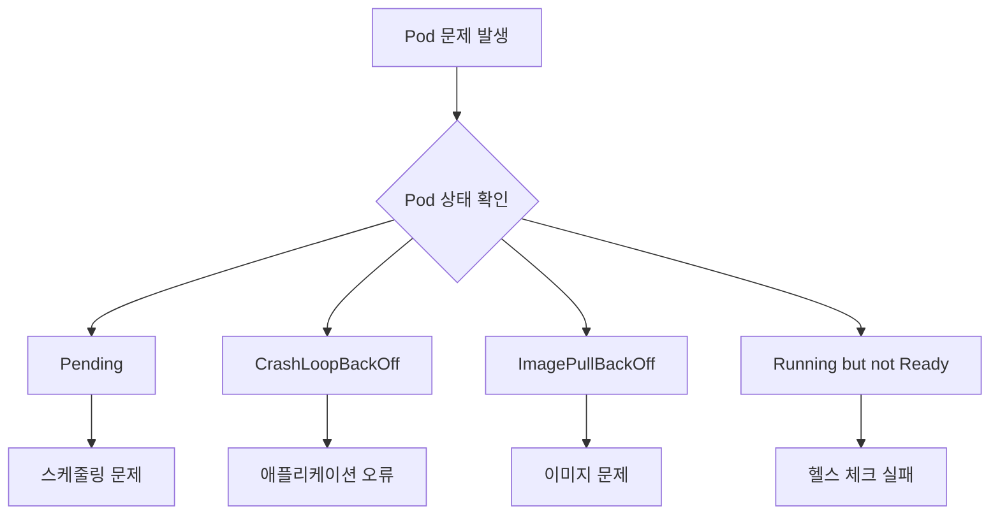

> **목표**: Pod가 정상적으로 시작되지 않거나 비정상 종료될 때 원인을 파악하고 해결합니다
> **선수 지식**: Pod, Deployment 기본 개념
> **예상 시간**: 30분


- `kubectl describe pod`로 이벤트 확인
- `kubectl logs`로 애플리케이션 로그 확인
- Pod 상태(Pending, CrashLoopBackOff 등)별 원인 파악


## 진단 순서

Pod 문제가 발생했을 때 다음 순서로 진단합니다.



## 기본 진단 명령어

### Pod 상태 확인

```bash
# Pod 목록 및 상태
kubectl get pods

# 상세 정보 (이벤트 포함)
kubectl describe pod <pod-name>

# 모든 네임스페이스
kubectl get pods --all-namespaces
```

### 로그 확인

```bash
# 현재 로그
kubectl logs <pod-name>

# 이전 컨테이너 로그 (재시작된 경우)
kubectl logs <pod-name> --previous

# 실시간 로그
kubectl logs <pod-name> -f

# 특정 컨테이너 로그 (멀티 컨테이너 Pod)
kubectl logs <pod-name> -c <container-name>

# 최근 N줄
kubectl logs <pod-name> --tail=100
```

### 이벤트 확인

```bash
# 최근 이벤트 (시간순)
kubectl get events --sort-by='.lastTimestamp'

# 특정 Pod 이벤트
kubectl get events --field-selector involvedObject.name=<pod-name>
```

## 상태별 트러블슈팅

### Pending 상태

Pod가 Pending 상태로 멈춰 있는 경우입니다.

**진단:**
```bash
kubectl describe pod <pod-name>
# Events 섹션 확인
```

**일반적인 원인과 해결:**

| 원인 | 이벤트 메시지 | 해결 |
|------|--------------|------|
| 리소스 부족 | `Insufficient cpu/memory` | 노드 추가 또는 requests 감소 |
| 노드 셀렉터 불일치 | `MatchNodeSelector` | 레이블 확인 |
| Taint/Toleration | `Taints not tolerated` | Toleration 추가 |
| PVC 바인딩 대기 | `persistentvolumeclaim not found` | PV/PVC 확인 |

**리소스 부족 확인:**
```bash
# 노드 리소스 확인
kubectl describe nodes | grep -A 5 "Allocated resources"

# 또는
kubectl top nodes
```

### ImagePullBackOff / ErrImagePull

이미지를 가져올 수 없는 경우입니다.

**진단:**
```bash
kubectl describe pod <pod-name>
# Events에서 이미지 관련 오류 확인
```

**일반적인 원인과 해결:**

| 원인 | 해결 |
|------|------|
| 이미지 이름/태그 오타 | 이미지 이름과 태그 확인 |
| 프라이빗 레지스트리 인증 | imagePullSecrets 설정 |
| 네트워크 문제 | 레지스트리 접근 가능 확인 |
| 이미지 없음 | 레지스트리에 이미지 존재 확인 |

**이미지 이름 확인:**
```bash
# Deployment에서 이미지 확인
kubectl get deployment <name> -o jsonpath='{.spec.template.spec.containers[0].image}'

# 이미지 존재 확인 (로컬)
docker pull <image-name>
```

**프라이빗 레지스트리 Secret 생성:**
```bash
kubectl create secret docker-registry my-registry-secret \
  --docker-server=registry.example.com \
  --docker-username=myuser \
  --docker-password=mypassword
```

### CrashLoopBackOff

컨테이너가 시작 후 즉시 종료되어 계속 재시작되는 경우입니다.

**진단:**
```bash
# 로그 확인 (가장 중요)
kubectl logs <pod-name> --previous

# 종료 코드 확인
kubectl describe pod <pod-name>
# Last State: Terminated, Exit Code 확인
```

**일반적인 원인과 해결:**

| Exit Code | 의미 | 해결 |
|-----------|------|------|
| 0 | 정상 종료 | 명령어가 즉시 종료됨, ENTRYPOINT 확인 |
| 1 | 애플리케이션 오류 | 로그 확인, 환경 변수 확인 |
| 137 | OOM Killed | 메모리 limits 증가 |
| 143 | SIGTERM | 정상 종료 신호 |

**메모리 부족 확인:**
```bash
kubectl describe pod <pod-name> | grep -A 3 "Last State"
# Reason: OOMKilled
```

### Running but not Ready

Pod가 Running이지만 Ready가 아닌 경우입니다.

**진단:**
```bash
kubectl describe pod <pod-name>
# Conditions 섹션에서 Ready: False 확인
# Events에서 Readiness probe 실패 메시지 확인
```

**일반적인 원인과 해결:**

| 원인 | 해결 |
|------|------|
| Readiness Probe 실패 | 엔드포인트 확인, 경로/포트 확인 |
| 애플리케이션 준비 중 | initialDelaySeconds 증가 |
| 외부 의존성 문제 | DB/캐시 연결 확인 |

**Probe 테스트:**
```bash
# Pod 내부에서 직접 테스트
kubectl exec <pod-name> -- curl localhost:8080/health

# 또는 wget
kubectl exec <pod-name> -- wget -qO- localhost:8080/health
```

## 고급 진단

### 컨테이너 셸 접속

```bash
# 기본 셸
kubectl exec -it <pod-name> -- /bin/sh

# bash (있는 경우)
kubectl exec -it <pod-name> -- /bin/bash

# 특정 컨테이너
kubectl exec -it <pod-name> -c <container-name> -- /bin/sh
```

### 네트워크 진단

```bash
# DNS 확인
kubectl exec <pod-name> -- nslookup kubernetes.default

# 서비스 연결 확인
kubectl exec <pod-name> -- curl -v http://<service-name>:<port>

# 외부 연결 확인
kubectl exec <pod-name> -- curl -v https://google.com
```

### 임시 디버그 컨테이너

```bash
# 디버그 컨테이너 실행 (Kubernetes 1.25+)
kubectl debug <pod-name> -it --image=busybox

# Node에서 직접 디버깅
kubectl debug node/<node-name> -it --image=busybox
```

## 체크리스트

Pod 문제 해결을 위한 체크리스트입니다.

### 시작 실패
- [ ] `kubectl describe pod`로 이벤트 확인
- [ ] 이미지 이름과 태그 정확한지 확인
- [ ] imagePullSecrets 설정 확인 (프라이빗 레지스트리)
- [ ] 리소스 requests가 노드 용량 이내인지 확인

### 크래시 반복
- [ ] `kubectl logs --previous`로 로그 확인
- [ ] Exit Code 확인 (137 = OOM)
- [ ] 환경 변수가 올바르게 설정되었는지 확인
- [ ] ConfigMap/Secret이 존재하는지 확인

### Ready 안 됨
- [ ] Readiness Probe 엔드포인트 확인
- [ ] 포트 번호 확인
- [ ] initialDelaySeconds가 충분한지 확인
- [ ] 외부 의존성(DB 등) 연결 확인

---

## 다음 단계

| 목표 | 추천 문서 |
|------|----------|
| 리소스 최적화 | [리소스 최적화](resource-optimization/) |
| 헬스 체크 설정 | [헬스 체크](../concepts/health-checks/) |
| 배포 실습 | [Spring Boot 배포](../examples/spring-boot/) |
