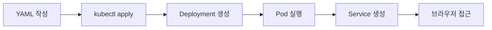
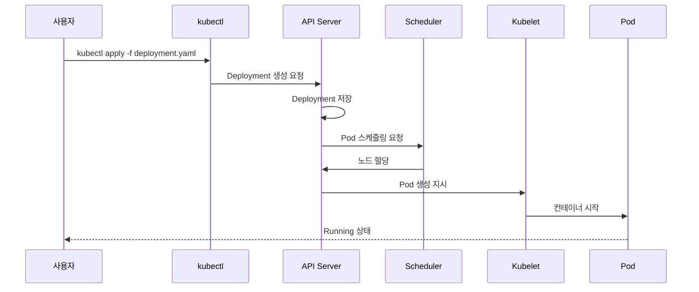

> **대상 독자**: Kubernetes를 처음 접하는 백엔드 개발자
> **선수 지식**: Docker 기본 개념, 터미널 사용법
> **이 문서를 읽으면**: 로컬 Kubernetes 클러스터에 애플리케이션을 배포하고 접근하는 전체 과정을 직접 실행할 수 있습니다


- Minikube로 로컬 Kubernetes 클러스터를 실행합니다
- `kubectl apply`로 Deployment와 Service를 배포합니다
- 전체 과정은 약 5분 소요됩니다


5분 만에 Kubernetes에 애플리케이션을 배포해보세요.

## 전체 흐름

Quick Start에서는 Nginx 웹 서버를 Kubernetes에 배포하고 브라우저로 접근하는 과정을 실습합니다.



## 시작 전 확인

시작하기 전에 다음 도구들이 설치되어 있는지 확인하세요.

| 항목 | 확인 명령어 | 예상 결과 |
|------|-------------|-----------|
| Docker | `docker --version` | `Docker version 24.x.x` 이상 |
| Minikube | `minikube version` | `minikube version: v1.32.x` 이상 |
| kubectl | `kubectl version --client` | `Client Version: v1.29.x` 이상 |



```bash
# Homebrew로 설치
brew install --cask docker
brew install minikube
brew install kubectl
```


```bash
# Docker 설치
curl -fsSL https://get.docker.com -o get-docker.sh
sudo sh get-docker.sh

# Minikube 설치
curl -LO https://storage.googleapis.com/minikube/releases/latest/minikube-linux-amd64
sudo install minikube-linux-amd64 /usr/local/bin/minikube

# kubectl 설치
curl -LO "https://dl.k8s.io/release/$(curl -L -s https://dl.k8s.io/release/stable.txt)/bin/linux/amd64/kubectl"
sudo install kubectl /usr/local/bin/kubectl
```


```powershell
# Chocolatey로 설치 (관리자 권한 PowerShell)
choco install docker-desktop
choco install minikube
choco install kubernetes-cli

# 또는 수동 설치
# - Docker Desktop: https://www.docker.com/products/docker-desktop
# - Minikube: https://minikube.sigs.k8s.io/docs/start/
# - kubectl: https://kubernetes.io/docs/tasks/tools/install-kubectl-windows/
```

**Windows 추가 설정:**
- Docker Desktop 설치 후 WSL 2 백엔드를 활성화하세요
- Hyper-V가 활성화되어 있어야 합니다



---

## Step 1/4: Minikube 클러스터 시작하기 (~1분)

로컬에서 Kubernetes 클러스터를 시작합니다.



```bash
minikube start
```


```powershell
minikube start
```



### 실행 확인

클러스터가 정상적으로 시작되었는지 확인하세요:

```bash
kubectl cluster-info
```

**예상 출력:**
```
Kubernetes control plane is running at https://127.0.0.1:xxxxx
CoreDNS is running at https://127.0.0.1:xxxxx/api/v1/namespaces/kube-system/services/kube-dns:dns/proxy
```


첫 실행 시 이미지 다운로드로 인해 2-3분 정도 걸릴 수 있습니다. `minikube status` 명령으로 상태를 확인하세요.


---

## Step 2/4: Deployment 생성하기 (~1분)

Nginx 웹 서버를 배포합니다. 먼저 작업 디렉토리를 만들고 Deployment YAML 파일을 생성합니다.

```bash
mkdir -p ~/k8s-quickstart && cd ~/k8s-quickstart
```

아래 내용을 `nginx-deployment.yaml` 파일로 저장합니다. 터미널에서 직접 생성하거나 편집기를 사용하세요:



```bash
cat > nginx-deployment.yaml << 'EOF'
apiVersion: apps/v1
kind: Deployment
metadata:
  name: nginx-deployment
spec:
  replicas: 2
  selector:
    matchLabels:
      app: nginx
  template:
    metadata:
      labels:
        app: nginx
    spec:
      containers:
      - name: nginx
        image: nginx:1.25
        ports:
        - containerPort: 80
EOF
```


`nginx-deployment.yaml` 파일을 생성하고 아래 내용을 복사-붙여넣기 하세요:

```yaml
apiVersion: apps/v1
kind: Deployment
metadata:
  name: nginx-deployment
spec:
  replicas: 2
  selector:
    matchLabels:
      app: nginx
  template:
    metadata:
      labels:
        app: nginx
    spec:
      containers:
      - name: nginx
        image: nginx:1.25
        ports:
        - containerPort: 80
```



Deployment를 적용합니다:

```bash
kubectl apply -f nginx-deployment.yaml
```

**예상 출력:**
```
deployment.apps/nginx-deployment created
```

Pod가 실행 중인지 확인합니다:

```bash
kubectl get pods
```

**예상 출력:**
```
NAME                                READY   STATUS    RESTARTS   AGE
nginx-deployment-xxx-yyy            1/1     Running   0          30s
nginx-deployment-xxx-zzz            1/1     Running   0          30s
```


이미지 다운로드 중입니다. 30초 정도 기다린 후 다시 확인하세요.


---

## Step 3/4: Service 생성하기 (~1분)

Pod에 접근하기 위한 Service를 생성합니다.

`nginx-service.yaml` 파일을 생성합니다:



```bash
cat > nginx-service.yaml << 'EOF'
apiVersion: v1
kind: Service
metadata:
  name: nginx-service
spec:
  type: NodePort
  selector:
    app: nginx
  ports:
  - port: 80
    targetPort: 80
    nodePort: 30080
EOF
```


```yaml
apiVersion: v1
kind: Service
metadata:
  name: nginx-service
spec:
  type: NodePort
  selector:
    app: nginx
  ports:
  - port: 80
    targetPort: 80
    nodePort: 30080
```



Service를 적용합니다:

```bash
kubectl apply -f nginx-service.yaml
```

**예상 출력:**
```
service/nginx-service created
```

Service 상태를 확인합니다:

```bash
kubectl get services
```

**예상 출력:**
```
NAME            TYPE        CLUSTER-IP       EXTERNAL-IP   PORT(S)        AGE
kubernetes      ClusterIP   10.96.0.1        <none>        443/TCP        5m
nginx-service   NodePort    10.104.xxx.xxx   <none>        80:30080/TCP   10s
```

---

## Step 4/4: 애플리케이션 접근하기 (~1분)

Minikube에서 Service에 접근합니다:

```bash
minikube service nginx-service
```

이 명령은 브라우저를 자동으로 열어 Nginx 웹 페이지를 표시합니다.

브라우저가 열리지 않으면 URL을 직접 확인합니다:

```bash
minikube service nginx-service --url
```

**예상 출력:**
```
http://192.168.49.2:30080
```

해당 URL로 접근하면 "Welcome to nginx!" 페이지가 표시됩니다.

---

## 축하합니다!

Kubernetes에 애플리케이션 배포에 성공했습니다.


- [ ] Minikube 클러스터가 실행 중입니다 (`minikube status`로 확인)
- [ ] Pod 2개가 Running 상태입니다 (`kubectl get pods`로 확인)
- [ ] Service가 생성되었습니다 (`kubectl get services`로 확인)
- [ ] 브라우저에서 Nginx 페이지가 표시됩니다


### 방금 배운 핵심 개념

| 개념 | 배운 것 | 다음에 배울 것 |
|------|---------|---------------|
| **Deployment** | Pod 2개를 자동으로 유지 | 롤링 업데이트, 롤백 |
| **Service** | Pod에 고정 접근점 제공 | ClusterIP, LoadBalancer 차이 |
| **kubectl** | apply, get 명령어 | describe, logs, exec |
| **YAML** | 리소스 선언적 정의 | 더 많은 필드 (resources, probes) |

---

## 종료

실행 중인 리소스와 클러스터를 종료합니다:

```bash
# 배포한 리소스 삭제
kubectl delete -f nginx-deployment.yaml
kubectl delete -f nginx-service.yaml

# Minikube 클러스터 중지
minikube stop

# (선택) 클러스터 완전 삭제
minikube delete
```

---

## 무엇이 일어났나요?

방금 실행한 과정을 단계별로 살펴봅니다.



| 순서 | 컴포넌트 | 동작 |
|------|----------|------|
| 1 | kubectl | YAML 파일을 읽어 API Server에 요청합니다 |
| 2 | API Server | Deployment 리소스를 etcd에 저장합니다 |
| 3 | Controller Manager | Deployment를 보고 ReplicaSet과 Pod를 생성합니다 |
| 4 | Scheduler | Pod를 실행할 노드를 결정합니다 |
| 5 | Kubelet | 해당 노드에서 컨테이너를 실행합니다 |
| 6 | Service | Pod들에 대한 네트워크 엔드포인트를 제공합니다 |


Pod를 직접 생성하지 않고 Deployment를 통해 생성하는 이유는 Pod가 죽었을 때 자동으로 복구하기 위해서입니다. Deployment의 Controller가 원하는 Pod 수(`replicas: 2`)를 지속적으로 유지합니다.


---

## YAML 살펴보기

Quick Start 예제의 YAML을 상세히 분석합니다.

### Deployment YAML

```yaml
apiVersion: apps/v1          # API 버전
kind: Deployment             # 리소스 종류
metadata:
  name: nginx-deployment     # Deployment 이름
spec:
  replicas: 2                # 유지할 Pod 수
  selector:
    matchLabels:
      app: nginx             # 관리할 Pod 선택 기준
  template:                  # Pod 템플릿
    metadata:
      labels:
        app: nginx           # Pod 레이블 (selector와 일치해야 함)
    spec:
      containers:
      - name: nginx          # 컨테이너 이름
        image: nginx:1.25    # 사용할 이미지
        ports:
        - containerPort: 80  # 컨테이너 포트
```

| 필드 | 설명 |
|------|------|
| `replicas` | 실행할 Pod 복제본 수. 이 수를 항상 유지합니다 |
| `selector.matchLabels` | 이 Deployment가 관리할 Pod를 선택하는 기준 |
| `template` | 생성할 Pod의 명세 |
| `containers` | Pod 내에서 실행할 컨테이너 목록 |

### Service YAML

```yaml
apiVersion: v1
kind: Service
metadata:
  name: nginx-service
spec:
  type: NodePort             # 서비스 타입
  selector:
    app: nginx               # 트래픽을 전달할 Pod 선택
  ports:
  - port: 80                 # Service 포트
    targetPort: 80           # Pod 포트
    nodePort: 30080          # 노드에서 노출할 포트
```

| 필드 | 설명 |
|------|------|
| `type: NodePort` | 노드의 특정 포트로 외부 접근 허용 |
| `selector` | 트래픽을 전달할 Pod를 선택하는 기준 |
| `port` | Service가 노출하는 포트 |
| `targetPort` | Pod에서 실제로 수신하는 포트 |
| `nodePort` | 노드에서 외부로 노출하는 포트 (30000-32767) |

---

## 트러블슈팅

### Minikube 시작 실패

`Exiting due to PROVIDER_DOCKER_NOT_RUNNING` 오류가 발생하면:

1. Docker가 실행 중인지 확인하세요:
   ```bash
   docker ps
   ```

2. Docker가 실행 중이 아니라면 Docker Desktop을 시작하세요

3. 문제가 지속되면 Minikube 드라이버를 변경해보세요:
   ```bash
   minikube start --driver=virtualbox
   ```

### Pod가 Pending 상태

Pod가 `Pending` 상태에서 멈춰 있다면:

1. 이벤트를 확인하세요:
   ```bash
   kubectl describe pod <pod-name>
   ```

2. 일반적인 원인:
   - 이미지 다운로드 중: 잠시 기다리세요
   - 리소스 부족: `minikube stop && minikube start --memory=4096`

### ImagePullBackOff 오류

이미지를 가져올 수 없는 경우:

1. 이미지 이름과 태그가 올바른지 확인하세요
2. 인터넷 연결을 확인하세요
3. 프라이빗 레지스트리의 경우 인증 설정을 확인하세요

### Service 접근 불가

`minikube service` 명령이 동작하지 않으면:

1. Service 상태를 확인하세요:
   ```bash
   kubectl get svc nginx-service
   ```

2. Pod의 레이블과 Service의 selector가 일치하는지 확인하세요:
   ```bash
   kubectl get pods --show-labels
   ```

3. Minikube 터널을 사용해보세요:
   ```bash
   minikube tunnel
   ```

---

## 다음 단계

Quick Start를 완료했다면 다음 단계로 진행하세요:

| 목표 | 추천 문서 |
|------|----------|
| Kubernetes 구조 이해하기 | [아키텍처](../concepts/architecture/) |
| Pod 개념 깊이 이해하기 | [Pod](../concepts/pod/) |
| 더 복잡한 예제 실습하기 | [기본 예제](../examples/basic/) |
| 실제 앱 배포해보기 | [Spring Boot 배포](../examples/spring-boot/) |
