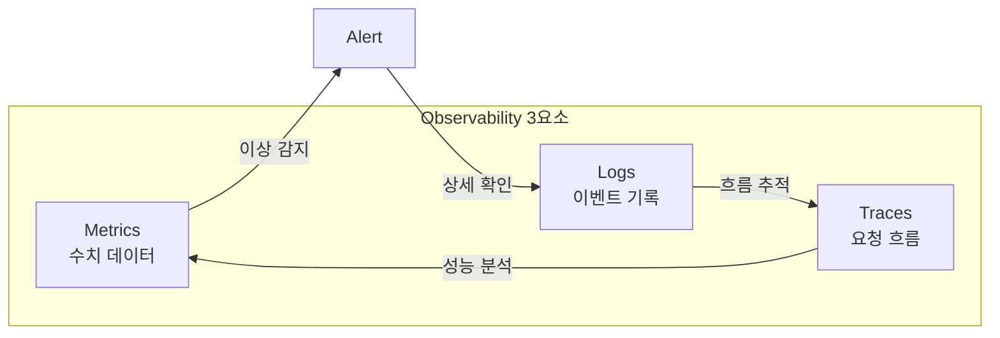
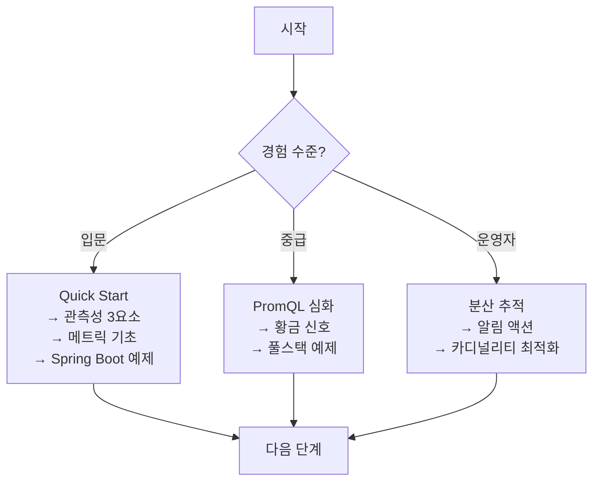

## Observability란?

Observability(관측성)는 **시스템 외부에서 내부 상태를 파악할 수 있는 능력**입니다. 단순히 모니터링 도구를 설치하는 것이 아니라, "왜 이 문제가 발생했는가?"라는 질문에 답할 수 있는 체계를 구축하는 것입니다.

### 왜 Observability가 필요한가?

마이크로서비스와 분산 시스템이 보편화되면서, 기존 모니터링만으로는 한계가 명확해졌습니다.

| 기존 모니터링의 한계 | Observability 도입 후 |
|---------------------|----------------------|
| "서버 CPU가 높다"만 알 수 있음 | 어떤 요청이 CPU를 높이는지 추적 가능 |
| 사전에 정의한 메트릭만 확인 | 예상치 못한 문제도 데이터로 분석 |
| 서비스 간 연결 관계 파악 어려움 | 분산 트레이싱으로 전체 흐름 시각화 |
| 장애 발생 후 원인 추적에 수 시간 | 트레이스 ID로 즉시 근본 원인 파악 |
| 로그-메트릭-트레이스 분리 | 3요소 연결로 통합 분석 |

### Observability의 3요소 (Three Pillars)



| 요소 | 역할 | 대표 도구 | 예시 |
|------|------|----------|------|
| **Metrics** | 수치 기반 상태 측정 | Prometheus, Micrometer | CPU 80%, 응답시간 200ms |
| **Logs** | 이벤트 상세 기록 | Loki, Elasticsearch | "주문 생성 실패: 재고 부족" |
| **Traces** | 요청의 전체 경로 추적 | Jaeger, Tempo | 주문→결제→배송 서비스 흐름 |

### 언제 Observability를 도입해야 할까?

**적합한 경우:**
- 마이크로서비스 아키텍처를 운영할 때
- 장애 원인 파악에 시간이 오래 걸릴 때
- SLA/SLO 기반 운영이 필요할 때
- 성능 병목을 체계적으로 분석하고 싶을 때

**과할 수 있는 경우:**
- 단일 모놀리식 애플리케이션
- 트래픽이 매우 적은 내부 도구
- 운영 인력이 부족한 소규모 팀

## 이 가이드에서 다루는 것

### [Quick Start]()
10분 만에 Prometheus + Grafana 환경을 구축하고 첫 번째 메트릭을 확인합니다.

### [개념 이해]()
"어떻게 쓰는가"를 넘어 **"왜 이렇게 설계되었는가"**를 설명합니다.

| 주제 | 배우는 것 |
|------|----------|
| [관측성 3요소]() | Metrics, Logs, Traces의 역할과 상호 연결 |
| [메트릭 기초]() | Counter, Gauge, Histogram, Summary 타입 이해 |
| [Prometheus 아키텍처]() | Pull 모델, 시계열 DB, 서비스 디스커버리 |
| [PromQL]() | 쿼리 언어 기초부터 고급 활용까지 (7개 문서) |
| [SRE 황금 신호]() | Latency, Traffic, Errors, Saturation 심화 (6개 문서) |
| [로그 수집]() | Loki vs ELK 비교, 로그 설계 패턴 |
| [분산 추적]() | Span, Trace ID, Context Propagation |
| [OpenTelemetry]() | 관측성 표준과 통합 방법 |
| [대시보드 설계]() | 효과적인 시각화 원칙 |

### [실습 예제]()
실행 가능한 코드로 직접 경험합니다.

- [환경 구성]() - Docker Compose로 전체 스택 구성
- [Spring Boot 메트릭]() - Actuator + Micrometer 설정
- [Kafka 모니터링]() - Kafka 클러스터 관측성 구축
- [풀스택 Observability]() - 메트릭 + 로그 + 트레이스 통합

### [문제 해결]()
실무에서 자주 마주치는 문제 상황과 해결법입니다.

- [높은 지연시간 진단]() - P99 지연 원인 추적
- [메트릭 카디널리티 최적화]() - 비용 절감 전략
- [알림 피로도 관리]() - 노이즈 알림 줄이기

### [부록]()
- [용어 사전]() - Observability 용어 빠른 참조
- [FAQ]() - 자주 묻는 질문
- [알림 후 액션 가이드]() - PromQL 감지 후 대응 방안
- [참고 자료]() - 공식 문서 및 추가 학습 자료

## 선수 지식

- **필수**: Docker 기본 사용법, HTTP/REST API 이해
- **도움됨**: Spring Boot 경험, Kubernetes 기초, 시계열 데이터 개념

## 기술 스택

이 가이드에서 사용하는 도구입니다.

| 구성요소 | 도구 | 버전 |
|---------|------|------|
| 메트릭 수집 | Prometheus | 2.50+ |
| 메트릭 노출 | Micrometer | 1.12+ |
| 시각화 | Grafana | 10.x |
| 로그 수집 | Loki | 2.9+ |
| 분산 추적 | Tempo | 2.x |
| 표준화 | OpenTelemetry | 1.x |

## 학습 경로 제안



**처음이라면:**
```
Quick Start → 관측성 3요소 → 메트릭 기초 → Prometheus 아키텍처 → Spring Boot 예제
```

**PromQL을 깊이 배우고 싶다면:**
```
PromQL 기초 → 집계 연산자 → rate vs increase → histogram_quantile → Recording Rules → Alerting Rules
```

**SRE/운영 관점이라면:**
```
황금 신호 개요 → Latency/Errors/Saturation → 서비스 유형별 적용 → 알림 후 액션 가이드
```

각 문서는 독립적으로 읽을 수 있지만, 처음이라면 위 순서를 권장합니다.
