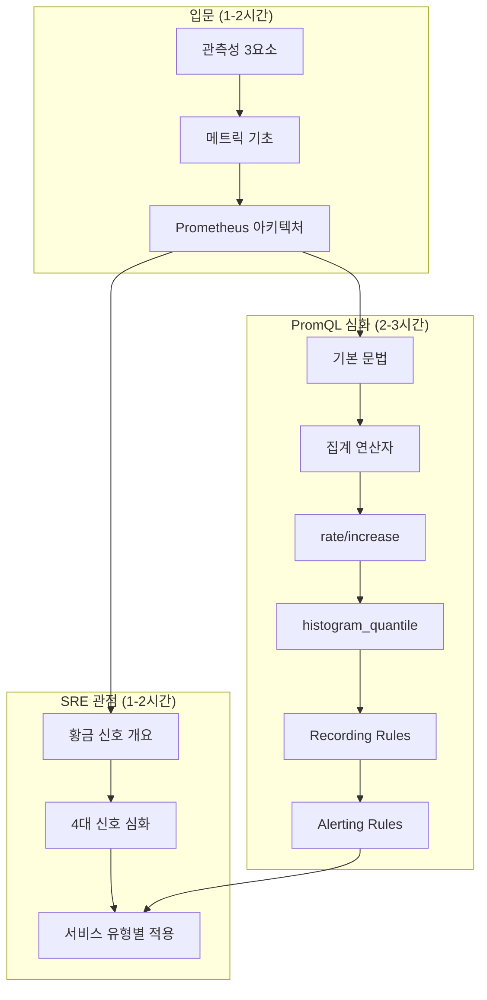

## 전체 비유: 병원 모니터링 시스템

Observability를 **병원의 환자 모니터링 시스템**에 비유하면 이해하기 쉽습니다:

| 병원 모니터링 비유 | Observability | 역할 |
|------------------|---------------|------|
| 환자 모니터 (맥박, 혈압) | Metrics | 수치로 상태 파악 |
| 의무 기록 (진료 기록) | Logs | 상세 이벤트 기록 |
| CT/MRI 영상 | Traces | 문제 위치 시각화 |
| 중환자실 모니터링 대시보드 | Dashboard | 전체 상태 한눈에 파악 |
| 이상 징후 시 알림 | Alerting | 문제 발생 시 즉시 알림 |
| 국제 의료 기록 표준 | OpenTelemetry | 표준화된 데이터 형식 |

이처럼 병원이 환자 상태를 다각도로 모니터링하듯, Observability는 시스템을 다양한 관점에서 관측합니다.

---

단순히 "이렇게 쓰세요"가 아닌, **왜 이렇게 설계되었는가**를 설명합니다.

## 학습 순서

### 기초 개념

Observability를 처음 접한다면 이 순서로 학습하세요.

1. [관측성 3요소]() - Metrics, Logs, Traces의 역할과 상호 연결
2. [메트릭 기초]() - Counter, Gauge, Histogram, Summary 타입 이해
3. [Prometheus 아키텍처]() - Pull 모델, 시계열 DB, 서비스 디스커버리

### PromQL 심화

Prometheus 쿼리 언어를 깊이 있게 다룹니다.

4. [PromQL 개요]() - PromQL 학습 로드맵
5. [기본 문법]() - 셀렉터, 레이블 매칭, 시간 범위
6. [집계 연산자]() - sum, avg, count, topk, by/without
7. [rate와 increase]() - Counter 메트릭 처리의 핵심
8. [histogram_quantile]() - 백분위(P50/P95/P99) 계산
9. [Recording Rules]() - 복잡한 쿼리 사전 계산
10. [Alerting Rules]() - 알림 규칙 작성법

### SRE 황금 신호

Google SRE가 제시한 4대 핵심 지표를 서비스 유형별로 적용합니다.

11. [황금 신호 개요]() - 4대 신호 소개와 USE/RED 메서드
12. [Latency]() - 지연시간 측정 전략
13. [Traffic]() - 트래픽/처리량 모니터링
14. [Errors]() - 에러율 정의와 분류
15. [Saturation]() - 포화도(리소스 사용률)
16. [서비스 유형별 적용]() - 웹 API, Kafka, DB별 가이드

### 로깅과 트레이싱

메트릭을 넘어 로그와 분산 추적을 통합합니다.

17. [로그 수집]() - Loki vs ELK 비교, 로그 설계 패턴
18. [분산 추적]() - Span, Trace ID, Context Propagation
19. [OpenTelemetry]() - 관측성 표준과 통합 방법

### 운영

효과적인 운영을 위한 실무 지식입니다.

20. [대시보드 설계]() - 효과적인 시각화 원칙

## 문서 구성 패턴

각 개념 문서는 다음 구조를 따릅니다:

```
1. TL;DR - 핵심 요약 (5줄 이내)
2. 왜 필요한가? - 문제 상황과 해결책
3. 핵심 개념 - 상세 설명 + 다이어그램
4. 실전 예제 - 바로 적용할 수 있는 코드
5. 트레이드오프 - 장단점과 선택 기준
6. 다음 단계 - 관련 문서 링크
```

## 추천 학습 경로


