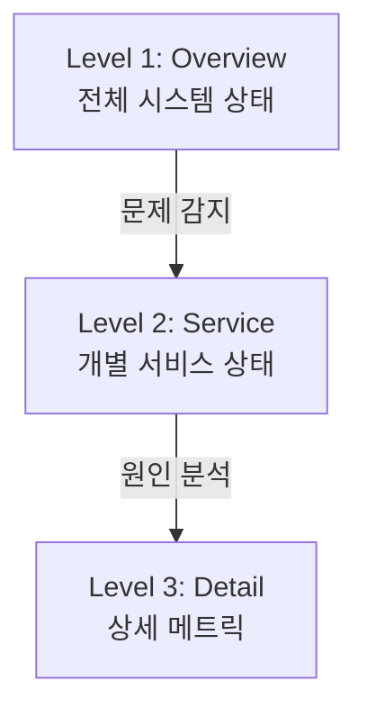

## 전체 비유: 중환자실 모니터링 대시보드

대시보드 설계를 **중환자실(ICU) 모니터링 시스템**에 비유하면 이해하기 쉽습니다:

| 중환자실 모니터 비유 | 대시보드 설계 | 역할 |
|-------------------|-------------|------|
| 병실 전체 현황판 | Overview 대시보드 | 전체 상태 한눈에 파악 |
| 개별 환자 모니터 | Service 대시보드 | 서비스별 상세 상태 |
| 상세 검사 결과지 | Detail 대시보드 | 문제 원인 심층 분석 |
| 정상 범위 녹색등 | 색상 규칙 | 시각적 상태 표시 |
| 5초 내 이상 감지 | 5초 규칙 | 빠른 문제 파악 |
| 활력징후 (맥박, 혈압) | 핵심 지표 (황금 신호) | 우선 모니터링 항목 |
| 알람 임계값 설정 | Threshold 설정 | 경고/위험 수준 정의 |
| 병실 간호사 호출 | 알림 연결 | 문제 시 담당자 호출 |

이처럼 중환자실에서 환자 상태를 한눈에 파악하듯, 대시보드는 시스템 상태를 즉시 이해할 수 있게 합니다.

---

> **대상 독자**: Grafana 대시보드를 설계하려는 개발자, SRE
> **선수 지식**: [SRE 황금 신호]()
> **소요 시간**: 약 20분
> **이 문서를 읽으면**: 효과적인 대시보드를 설계하고 문제를 빠르게 파악할 수 있습니다

## TL;DR


**핵심 요약:**
- **계층적 구성**: Overview → Service → Detail 순서
- **5초 규칙**: 5초 안에 문제 유무 파악 가능해야 함
- **황금 신호 우선**: Latency, Traffic, Errors, Saturation
- **불필요한 정보 제거**: 액션으로 이어지지 않는 메트릭 제외


## 대시보드 설계 원칙

### 1. 5초 규칙

대시보드를 보고 **5초 안에** 다음을 알 수 있어야 합니다:
- 문제가 있는가?
- 어디서 문제인가?
- 얼마나 심각한가?

### 2. 계층적 구조



### 3. 색상 규칙

| 색상 | 의미 | 사용 |
|------|------|------|
| 🟢 녹색 | 정상 | 임계값 이하 |
| 🟡 노란색 | 주의 | 경고 임계값 |
| 🔴 빨간색 | 위험 | 심각 임계값 |
| ⚪ 회색 | 데이터 없음 | N/A |

---

## Level 1: Overview 대시보드

### 목적

전체 시스템 상태를 한눈에 파악

### 구성

```
┌─────────────────────────────────────────────────────────────┐
│ Row 1: 핵심 지표 (Stat Panels)                               │
│ ┌────────┐ ┌────────┐ ┌────────┐ ┌────────┐ ┌────────┐      │
│ │ P99    │ │ RPS    │ │ Error  │ │ CPU    │ │ Memory │      │
│ │ 120ms  │ │ 5,234  │ │ 0.1%   │ │ 45%    │ │ 62%    │      │
│ └────────┘ └────────┘ └────────┘ └────────┘ └────────┘      │
├─────────────────────────────────────────────────────────────┤
│ Row 2: 서비스별 상태 (Table/Heatmap)                         │
│ ┌───────────────────────────────────────────────────────┐   │
│ │ Service    │ RPS   │ P99    │ Errors │ Status        │   │
│ │ order      │ 1,234 │ 100ms  │ 0.05%  │ 🟢            │   │
│ │ payment    │ 890   │ 250ms  │ 0.5%   │ 🟡            │   │
│ │ inventory  │ 2,100 │ 50ms   │ 0.01%  │ 🟢            │   │
│ └───────────────────────────────────────────────────────┘   │
├─────────────────────────────────────────────────────────────┤
│ Row 3: 트렌드 (Time Series)                                  │
│ ┌───────────────────────────────────────────────────────┐   │
│ │ 📈 RPS / Error Rate 추이 (24시간)                      │   │
│ └───────────────────────────────────────────────────────┘   │
└─────────────────────────────────────────────────────────────┘
```

### Grafana 쿼리 예시

```promql
# Stat: P99 응답시간
histogram_quantile(0.99, sum by (le) (rate(http_request_duration_seconds_bucket[5m])))

# Stat: 전체 RPS
sum(rate(http_requests_total[5m]))

# Stat: 에러율
sum(rate(http_requests_total{status=~"5.."}[5m]))
/ sum(rate(http_requests_total[5m])) * 100

# Table: 서비스별 상태
# 여러 쿼리를 Transformation으로 합침
```

---

## Level 2: Service 대시보드

### 목적

개별 서비스의 상세 상태 확인

### 구성 (RED 패턴)

```
┌─────────────────────────────────────────────────────────────┐
│ Variable: $service = order-service                          │
├─────────────────────────────────────────────────────────────┤
│ Row 1: Rate (Traffic)                                        │
│ ┌──────────────────────┐ ┌──────────────────────┐           │
│ │ RPS 추이             │ │ 엔드포인트별 RPS      │           │
│ └──────────────────────┘ └──────────────────────┘           │
├─────────────────────────────────────────────────────────────┤
│ Row 2: Errors                                                │
│ ┌──────────────────────┐ ┌──────────────────────┐           │
│ │ 에러율 추이          │ │ 상태 코드 분포        │           │
│ └──────────────────────┘ └──────────────────────┘           │
├─────────────────────────────────────────────────────────────┤
│ Row 3: Duration (Latency)                                    │
│ ┌──────────────────────┐ ┌──────────────────────┐           │
│ │ P50/P95/P99 추이     │ │ 응답시간 Heatmap     │           │
│ └──────────────────────┘ └──────────────────────┘           │
├─────────────────────────────────────────────────────────────┤
│ Row 4: Resources                                             │
│ ┌──────────────────────┐ ┌──────────────────────┐           │
│ │ CPU 사용률           │ │ 메모리 사용량         │           │
│ └──────────────────────┘ └──────────────────────┘           │
└─────────────────────────────────────────────────────────────┘
```

### 변수 설정

```yaml
# Grafana Variables
- name: service
  type: query
  query: label_values(http_requests_total, service)
  refresh: on_time_range_change

- name: instance
  type: query
  query: label_values(http_requests_total{service="$service"}, instance)
```

---

## Level 3: Detail 대시보드

### 목적

문제 원인 심층 분석

### 구성 예시 (Database)

```
┌─────────────────────────────────────────────────────────────┐
│ Row 1: Connection Pool                                       │
│ ┌──────────────────────┐ ┌──────────────────────┐           │
│ │ 활성 연결 수         │ │ 대기 연결 수          │           │
│ └──────────────────────┘ └──────────────────────┘           │
├─────────────────────────────────────────────────────────────┤
│ Row 2: Query Performance                                     │
│ ┌──────────────────────┐ ┌──────────────────────┐           │
│ │ 슬로우 쿼리 수       │ │ 쿼리별 실행 시간      │           │
│ └──────────────────────┘ └──────────────────────┘           │
├─────────────────────────────────────────────────────────────┤
│ Row 3: Resource Usage                                        │
│ ┌──────────────────────┐ ┌──────────────────────┐           │
│ │ Buffer Hit Rate      │ │ 디스크 I/O            │           │
│ └──────────────────────┘ └──────────────────────┘           │
└─────────────────────────────────────────────────────────────┘
```

---

## 패널 유형 선택

| 패널 유형 | 적합한 데이터 | 예시 |
|----------|-------------|------|
| **Stat** | 단일 값, 현재 상태 | RPS, 에러율 |
| **Gauge** | 백분율, 임계값 | CPU 사용률 |
| **Time Series** | 시간별 추이 | 요청 수 추이 |
| **Bar Chart** | 비교, 순위 | 엔드포인트별 트래픽 |
| **Heatmap** | 분포, 밀도 | 응답시간 분포 |
| **Table** | 상세 목록 | 서비스 목록 |
| **Pie Chart** | 비율 | 상태 코드 분포 |

---

## 임계값 설정

### Stat 패널

```json
{
  "thresholds": {
    "mode": "absolute",
    "steps": [
      { "color": "green", "value": null },
      { "color": "yellow", "value": 80 },
      { "color": "red", "value": 90 }
    ]
  }
}
```

### Time Series 임계값 표시

```json
{
  "fieldConfig": {
    "defaults": {
      "custom": {
        "thresholdsStyle": {
          "mode": "line"
        }
      },
      "thresholds": {
        "steps": [
          { "color": "green", "value": null },
          { "color": "red", "value": 500 }
        ]
      }
    }
  }
}
```

---

## 모범 사례

### DO (권장)

```
✅ 목적이 명확한 대시보드
✅ 계층적 드릴다운 구조
✅ 일관된 색상 규칙
✅ 변수를 활용한 필터링
✅ 패널에 설명 추가
✅ 알림과 연결된 시각화
```

### DON'T (비권장)

```
❌ 한 대시보드에 모든 것
❌ 액션 없는 메트릭 나열
❌ 의미 없는 색상
❌ 하드코딩된 값
❌ 설명 없는 복잡한 쿼리
```

---

## 대시보드 공유 설정

### JSON 저장

```bash
# 대시보드 내보내기
curl -H "Authorization: Bearer $TOKEN" \
  "http://grafana:3000/api/dashboards/uid/abc123" \
  | jq '.dashboard' > dashboard.json

# 대시보드 가져오기
curl -X POST -H "Authorization: Bearer $TOKEN" \
  -H "Content-Type: application/json" \
  -d @dashboard.json \
  "http://grafana:3000/api/dashboards/db"
```

### Provisioning

```yaml
# grafana/provisioning/dashboards/default.yaml
apiVersion: 1
providers:
  - name: 'default'
    orgId: 1
    folder: 'Observability'
    type: file
    options:
      path: /var/lib/grafana/dashboards
```

---

## 핵심 정리

| 원칙 | 설명 |
|------|------|
| **5초 규칙** | 빠른 문제 파악 |
| **계층 구조** | Overview → Service → Detail |
| **황금 신호** | Latency, Traffic, Errors, Saturation |
| **색상 일관성** | 녹색/노란색/빨간색 |
| **액션 연결** | 알림, 런북 링크 |

---

## 다음 단계

| 추천 순서 | 문서 | 배우는 것 |
|----------|------|----------|
| 1 | [환경 구성]() | Grafana 실습 |
| 2 | [Spring Boot 예제]() | 대시보드 적용 |
