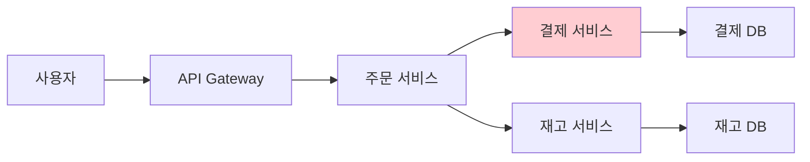
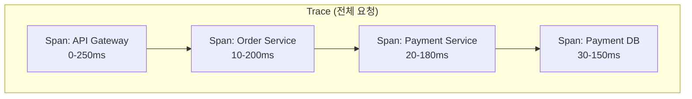
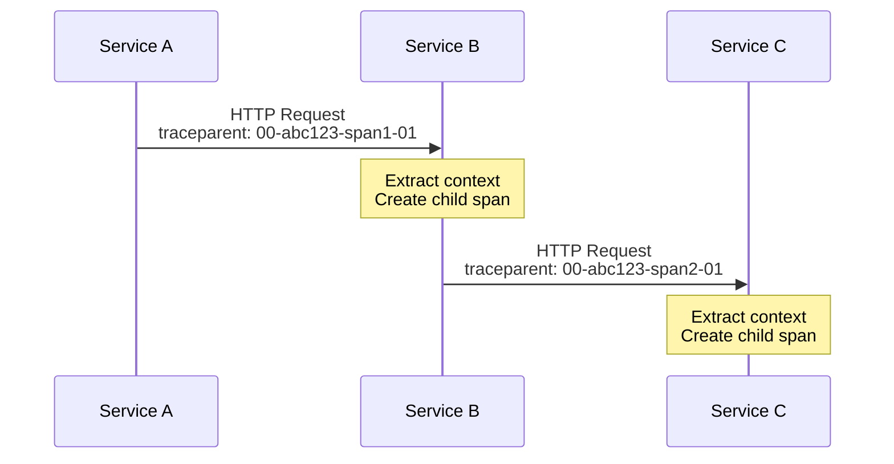
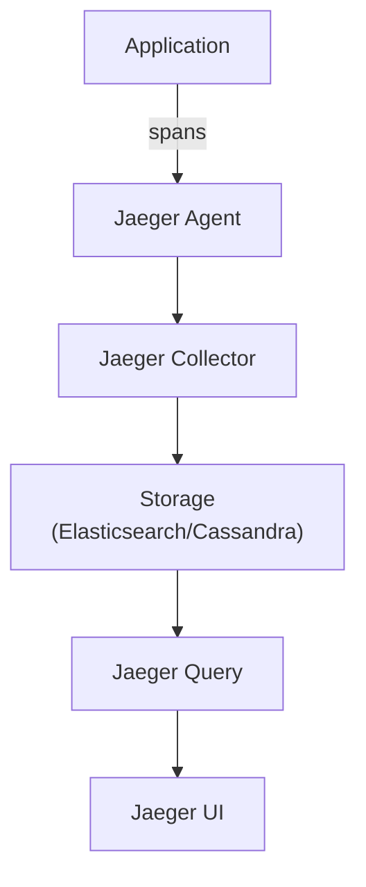
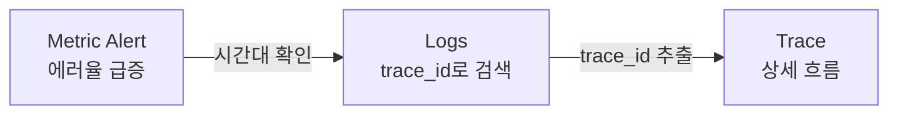
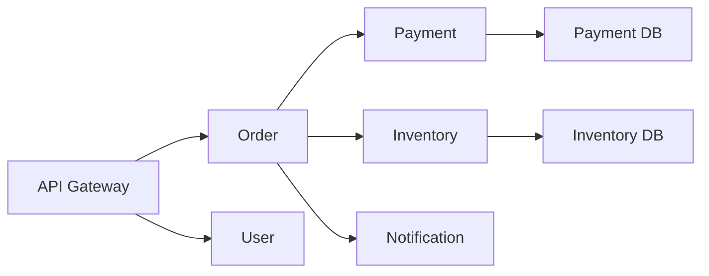

> **대상 독자**: 마이크로서비스를 운영하는 개발자, SRE
> **선수 지식**: [관측성 3요소]()
> **이 문서를 읽으면**: 분산 추적을 이해하고 서비스 간 요청 흐름을 분석할 수 있습니다

## TL;DR


**핵심 요약:**
- **Trace**: 하나의 요청 전체 경로 (여러 Span으로 구성)
- **Span**: 단일 작업 단위 (시작/종료 시간, 메타데이터)
- **Context Propagation**: 서비스 간 Trace ID 전달
- **샘플링**: 전체 트레이스 중 일부만 저장 (비용 최적화)


## 왜 분산 추적이 필요한가?

마이크로서비스에서는 하나의 요청이 여러 서비스를 거칩니다. 어디서 지연이 발생했는지 파악하기 어렵습니다.



**문제**: 응답이 느린데 어디가 문제인지 모름

**해결**: 분산 추적으로 각 구간 소요 시간 확인

---

## 핵심 개념

### Trace와 Span



| 용어 | 설명 |
|------|------|
| **Trace** | 전체 요청 경로 (고유 Trace ID) |
| **Span** | 개별 작업 단위 (고유 Span ID) |
| **Parent Span** | 현재 Span을 호출한 상위 Span |
| **Root Span** | 첫 번째 Span (Parent 없음) |

### Span 구조

```json
{
  "traceId": "abc123def456",
  "spanId": "span001",
  "parentSpanId": null,
  "operationName": "HTTP GET /orders",
  "serviceName": "order-service",
  "startTime": 1704700800000,
  "duration": 245,
  "tags": {
    "http.method": "GET",
    "http.status_code": 200,
    "http.url": "/orders/123"
  },
  "logs": [
    {
      "timestamp": 1704700800100,
      "message": "Fetching order from database"
    }
  ]
}
```

### Context Propagation

서비스 간 Trace ID를 전달하는 방법입니다.



**W3C Trace Context 형식:**
```
traceparent: 00-{trace-id}-{span-id}-{flags}
traceparent: 00-abc123def456789-fedcba987654321-01
```

---

## 도구 비교

| 도구 | 특징 | 적합한 경우 |
|------|------|------------|
| **Jaeger** | CNCF 프로젝트, UI 우수 | Kubernetes 환경 |
| **Zipkin** | 가벼움, 쉬운 설치 | 빠른 시작 |
| **Tempo** | Grafana 통합, 저비용 | Grafana 사용 시 |
| **AWS X-Ray** | AWS 통합 | AWS 환경 |

### 아키텍처 (Jaeger)



---

## Spring Boot 설정

### 의존성 추가

```kotlin
// build.gradle.kts
dependencies {
    implementation("io.micrometer:micrometer-tracing-bridge-otel")
    implementation("io.opentelemetry:opentelemetry-exporter-otlp")
}
```

### application.yml

```yaml
management:
  tracing:
    sampling:
      probability: 1.0  # 개발: 100%, 운영: 0.1 (10%)
  otlp:
    tracing:
      endpoint: http://jaeger:4318/v1/traces

logging:
  pattern:
    level: "%5p [${spring.application.name:},%X{traceId:-},%X{spanId:-}]"
```

### 수동 Span 생성

```java
@Service
@RequiredArgsConstructor
public class OrderService {
    private final Tracer tracer;

    public Order processOrder(OrderRequest request) {
        Span span = tracer.nextSpan().name("processOrder").start();
        try (Tracer.SpanInScope ws = tracer.withSpan(span)) {
            span.tag("order.type", request.getType());
            span.event("Processing started");

            Order order = createOrder(request);

            span.event("Order created");
            return order;
        } finally {
            span.end();
        }
    }
}
```

---

## 샘플링 전략

모든 트레이스를 저장하면 비용이 급증합니다. 샘플링으로 비용을 최적화합니다.

### 샘플링 방식

| 방식 | 설명 | 적합한 경우 |
|------|------|------------|
| **확률 샘플링** | 일정 비율만 수집 | 일반적 |
| **Rate Limiting** | 초당 N개만 수집 | 트래픽 급증 시 |
| **Tail-based** | 에러/느린 요청 우선 | 문제 분석 중심 |

### 권장 샘플링률

| 환경 | 샘플링률 | 이유 |
|------|---------|------|
| 개발 | 100% | 모든 요청 추적 |
| 스테이징 | 50% | 충분한 데이터 |
| 운영 | 1-10% | 비용 최적화 |

### 에러 시 100% 수집

```yaml
# OpenTelemetry Collector 설정
processors:
  tail_sampling:
    policies:
      - name: errors
        type: status_code
        status_code:
          status_codes: [ERROR]
      - name: slow
        type: latency
        latency:
          threshold_ms: 1000
      - name: probabilistic
        type: probabilistic
        probabilistic:
          sampling_percentage: 10
```

---

## 로그/메트릭 연결

### Trace ID로 연결



### 로그에 Trace ID 포함

```java
// Spring Boot 자동 포함
// 로그 패턴: %X{traceId:-}

// 로그 출력 예시
2026-01-12 10:30:00 INFO [order-service,abc123def456,span001] Order created: 12345
```

### Grafana에서 연결

```
1. 대시보드에서 에러율 급증 확인
2. Explore → Loki로 이동
3. {service="order-service"} |= "ERROR" 검색
4. 로그에서 trace_id 클릭
5. Tempo/Jaeger로 전체 트레이스 확인
```

---

## 분석 패턴

### 병목 구간 찾기

```
Trace 분석:
├─ API Gateway (10ms) ✓
├─ Order Service (50ms) ✓
│   ├─ Validation (5ms) ✓
│   └─ Payment Call (2000ms) ← 병목!
│       └─ Payment DB (1800ms) ← 근본 원인
└─ Response (5ms) ✓
```

### 에러 추적

```
Trace 분석:
├─ API Gateway (10ms) ✓
├─ Order Service (50ms) ✗ Error
│   ├─ Inventory Check (200ms)
│   └─ Error: "Insufficient stock"
```

### 서비스 의존성 맵

Jaeger/Tempo에서 서비스 간 연결 시각화:



---

## 알림 규칙

### 트레이스 기반 알림

```yaml
# Prometheus alerting rule (Tempo 연동)
groups:
  - name: tracing
    rules:
      - alert: HighTraceErrorRate
        expr: |
          sum(rate(traces_spanmetrics_calls_total{status_code="STATUS_CODE_ERROR"}[5m]))
          / sum(rate(traces_spanmetrics_calls_total[5m]))
          > 0.05
        for: 5m
        labels:
          severity: warning
        annotations:
          summary: "High trace error rate"

      - alert: SlowSpans
        expr: |
          histogram_quantile(0.99, sum(rate(traces_spanmetrics_latency_bucket[5m])) by (le, service))
          > 2
        for: 5m
        labels:
          severity: warning
        annotations:
          summary: "P99 span latency > 2s"
```

---

## 핵심 정리

| 개념 | 설명 |
|------|------|
| **Trace** | 전체 요청 경로 |
| **Span** | 개별 작업 단위 |
| **Context** | 서비스 간 전달되는 추적 정보 |
| **Sampling** | 비용 최적화를 위한 선별 수집 |

**구현 체크리스트:**
- [ ] OpenTelemetry SDK 추가
- [ ] 샘플링률 설정
- [ ] 로그에 trace_id 포함
- [ ] Jaeger/Tempo 배포
- [ ] Grafana 연동

---

## 다음 단계

| 추천 순서 | 문서 | 배우는 것 |
|----------|------|----------|
| 1 | [OpenTelemetry]() | 표준화된 계측 |
| 2 | [풀스택 예제]() | 통합 실습 |
