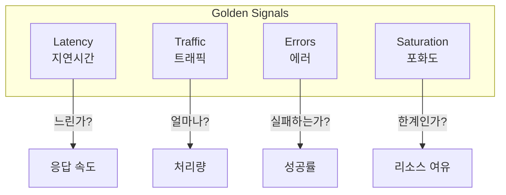
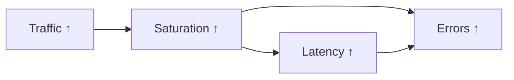
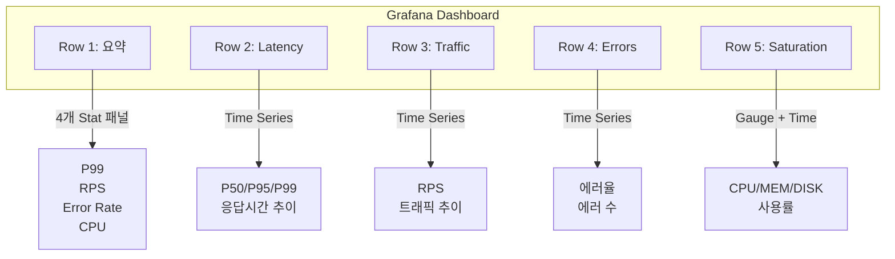

## 전체 비유: 건강검진 핵심 수치

SRE 황금 신호를 **건강검진의 핵심 지표**에 비유하면 이해하기 쉽습니다:

| 건강검진 비유 | 황금 신호 | 핵심 질문 |
|-------------|----------|----------|
| 혈압 (높으면 문제) | Latency | 응답이 얼마나 빠른가? |
| 심박수 (활동량) | Traffic | 얼마나 많이 처리하는가? |
| 혈당 (비정상 수치) | Errors | 얼마나 실패하는가? |
| 체중/BMI (한계 근접) | Saturation | 리소스 여유가 있는가? |
| 종합 건강 점수 | SLI/SLO | 전체적으로 건강한가? |
| 정밀 검사 의뢰 | 알림 | 이상 징후 시 조치 |
| 전문의 상담 | 런북 | 문제 발생 시 대응 가이드 |

이처럼 건강검진에서 핵심 수치 4가지로 건강 상태를 판단하듯, 황금 신호로 시스템 상태를 파악합니다.

---

## 황금 신호란 무엇인가?

Google SRE 책에서 소개한 **4가지 황금 신호(Four Golden Signals)**는 서비스 상태를 파악하는 핵심 지표입니다.

수백 개의 메트릭 중에서 **"진짜 중요한 것"**만 골라낸 것이 황금 신호입니다. 마치 자동차 계기판에서 속도, 연료, 엔진 온도, 경고등만 보여주는 것처럼, 시스템의 건강 상태를 한눈에 파악할 수 있는 최소한의 지표입니다.

**비유: 건강검진 핵심 수치**

건강검진에서 수십 가지 항목을 측정하지만, 의사가 가장 먼저 보는 것은 몇 가지 핵심 수치입니다:
- **혈압** (Latency에 해당): 너무 높으면 문제
- **심박수** (Traffic에 해당): 얼마나 활발한가
- **혈당** (Errors에 해당): 비정상 수치
- **체중** (Saturation에 해당): 한계에 가까운가

이 4가지만 정상이면 대체로 건강하다고 판단할 수 있습니다. 시스템도 마찬가지입니다.

## 4대 황금 신호



| 신호 | 측정 대상 | 핵심 질문 |
|------|----------|----------|
| **Latency** | 응답시간 | "얼마나 빠른가?" |
| **Traffic** | 처리량 | "얼마나 많이 처리하는가?" |
| **Errors** | 실패율 | "얼마나 실패하는가?" |
| **Saturation** | 리소스 사용률 | "얼마나 여유가 있는가?" |

## 왜 이 4가지인가?

Google SRE 팀은 수년간의 운영 경험을 통해 **"이 4가지만 모니터링해도 대부분의 문제를 감지할 수 있다"**는 결론에 도달했습니다.

### 완전성(Completeness)

4가지 신호는 시스템 상태의 **모든 측면**을 커버합니다:

1. **Latency**: 응답 **속도** 문제 감지
2. **Traffic**: **부하** 수준 파악
3. **Errors**: **정확성** 문제 감지
4. **Saturation**: **용량** 한계 예측

다른 메트릭(예: 힙 메모리, GC 시간)은 대부분 이 4가지 중 하나의 **근본 원인**이거나 **세부 지표**입니다. 예를 들어 GC 시간이 길면 Latency가 높아지고, 디스크 가득 차면 Errors가 발생합니다.

### 사용자 경험과 직결

| 신호 | 사용자 영향 |
|------|------------|
| Latency ↑ | 페이지 로딩 느림, 이탈률 증가 |
| Traffic ↑ | 시스템 부하 증가 |
| Errors ↑ | 기능 동작 안 함, 신뢰도 하락 |
| Saturation ↑ | 곧 장애 발생 예측 |

### 상호 연관성



트래픽이 증가하면 포화도가 높아지고, 이는 지연시간 증가와 에러율 증가로 이어집니다.

---

## USE 메서드와 RED 메서드

Golden Signals 외에 자주 사용되는 방법론입니다.

### USE (리소스 중심)

**Utilization, Saturation, Errors** - 인프라/리소스 모니터링에 적합

| 지표 | 대상 | 예시 |
|------|------|------|
| **U**tilization | 사용률 | CPU 70% 사용 |
| **S**aturation | 대기열 | 10개 요청 대기 중 |
| **E**rrors | 오류 | 디스크 I/O 오류 |

### RED (서비스 중심)

**Rate, Errors, Duration** - 마이크로서비스 모니터링에 적합

| 지표 | 대상 | 예시 |
|------|------|------|
| **R**ate | 요청 수 | 100 RPS |
| **E**rrors | 에러율 | 1% 실패 |
| **D**uration | 응답시간 | P99 200ms |

### 비교

| 방법론 | 초점 | 적합한 대상 |
|--------|------|------------|
| Golden Signals | 서비스 + 리소스 | 범용 |
| USE | 리소스 | 서버, 네트워크, 스토리지 |
| RED | 서비스 | API, 마이크로서비스 |

---

## 학습 순서

### 신호별 심화

1. [Latency]() - 지연시간 측정 전략 (P50, P95, P99)
2. [Traffic]() - 트래픽/처리량 모니터링
3. [Errors]() - 에러율 정의와 분류
4. [Saturation]() - 포화도(리소스 사용률)

### 서비스 유형별 적용

5. [서비스 유형별 적용]() - 웹 API, Kafka, DB별 가이드

---

## 빠른 참조: PromQL 쿼리

### Latency (지연시간)

```promql
# P99 응답시간
histogram_quantile(0.99,
  sum by (service, le) (rate(http_request_duration_seconds_bucket[5m]))
)

# 평균 응답시간
rate(http_request_duration_seconds_sum[5m])
/ rate(http_request_duration_seconds_count[5m])
```

### Traffic (트래픽)

```promql
# 초당 요청 수 (RPS)
sum by (service) (rate(http_requests_total[5m]))

# 초당 처리 바이트
sum by (service) (rate(http_request_size_bytes_sum[5m]))
```

### Errors (에러)

```promql
# 에러율 (%)
sum by (service) (rate(http_requests_total{status=~"5.."}[5m]))
/ sum by (service) (rate(http_requests_total[5m]))
* 100

# 에러 수
sum by (service) (rate(http_requests_total{status=~"5.."}[5m]))
```

### Saturation (포화도)

```promql
# CPU 사용률
100 - avg by (instance) (rate(node_cpu_seconds_total{mode="idle"}[5m])) * 100

# 메모리 사용률
(1 - node_memory_MemAvailable_bytes / node_memory_MemTotal_bytes) * 100

# 디스크 사용률
(1 - node_filesystem_avail_bytes / node_filesystem_size_bytes) * 100
```

---

## Recording Rules 템플릿

```yaml
groups:
  - name: golden_signals
    rules:
      # Latency
      - record: service:http_request_duration_seconds:p99
        expr: |
          histogram_quantile(0.99,
            sum by (service, le) (rate(http_request_duration_seconds_bucket[5m]))
          )

      # Traffic
      - record: service:http_requests:rate5m
        expr: sum by (service) (rate(http_requests_total[5m]))

      # Errors
      - record: service:http_requests_errors:ratio_rate5m
        expr: |
          sum by (service) (rate(http_requests_total{status=~"5.."}[5m]))
          / sum by (service) (rate(http_requests_total[5m]))

      # Saturation
      - record: instance:node_cpu_utilization:ratio
        expr: 1 - avg by (instance) (rate(node_cpu_seconds_total{mode="idle"}[5m]))
```

---

## 대시보드 구성



---

## 다음 단계

| 문서 | 내용 |
|------|------|
| [Latency](latency/) | P50/P95/P99 측정, SLA 설정 |
| [Traffic](traffic/) | RPS, 처리량 모니터링 |
| [Errors](errors/) | 에러 분류, 에러 버짓 |
| [Saturation](saturation/) | 리소스 병목 감지 |
| [서비스 유형별 적용](by-service-type/) | API, Kafka, DB 맞춤 지표 |
