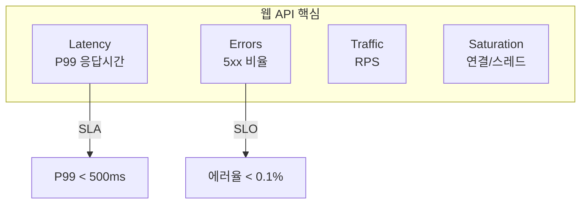
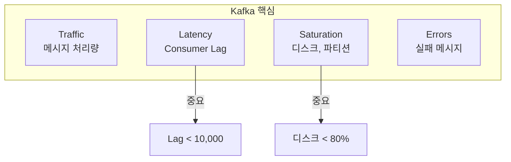
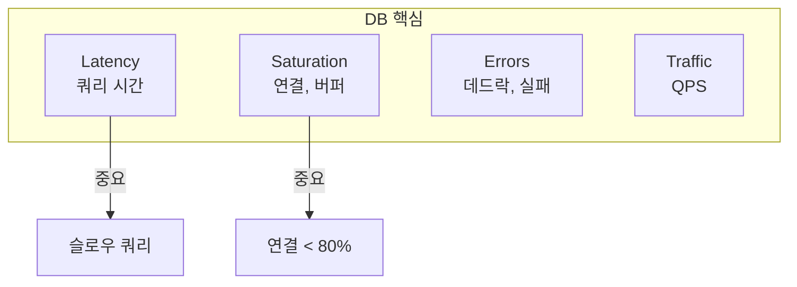
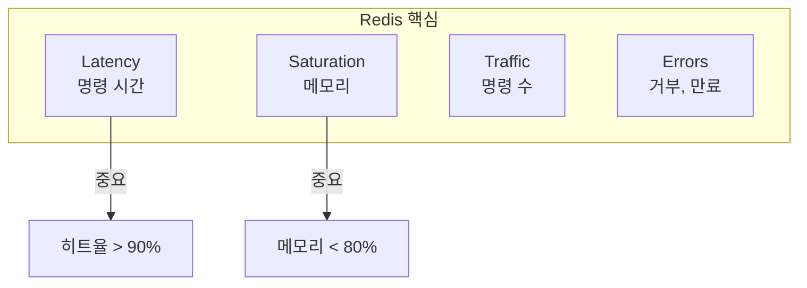
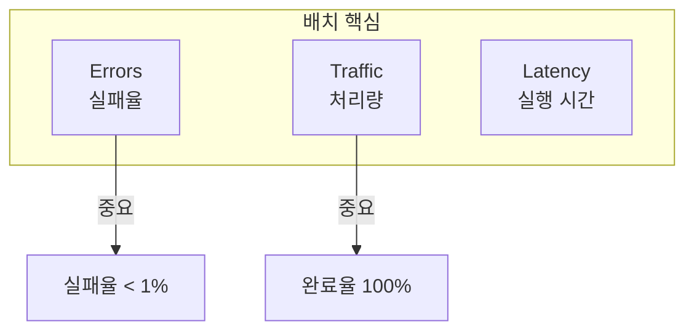

## 전체 비유: 병원 부서별 핵심 지표

서비스 유형별 황금 신호를 **병원 부서별 핵심 지표**에 비유하면 이해하기 쉽습니다:

| 병원 부서 | 서비스 유형 | 핵심 지표 |
|---------|-----------|----------|
| 외래 진료실 | 웹 API | 진료 대기시간 (Latency), 진료 오류율 (Errors) |
| 검사실 (혈액검사) | Kafka | 검체 처리량 (Traffic), 대기 검체 수 (Lag) |
| 데이터베이스 (EMR) | 데이터베이스 | 조회 속도 (Latency), 연결 포화도 (Saturation) |
| 약국 | 캐시 (Redis) | 조제 시간 (Latency), 재고 현황 (Saturation) |
| 야간 정산 | 배치 작업 | 정산 오류율 (Errors), 처리 완료율 (Traffic) |
| 로비 안내 데스크 | 로드 밸런서 | 안내 건수 (Traffic), 연결 오류 (Errors) |

이처럼 병원의 각 부서가 서로 다른 핵심 지표를 모니터링하듯, 서비스 유형에 따라 우선 모니터링할 황금 신호가 다릅니다.

---

> **대상 독자**: 다양한 서비스 유형을 운영하는 SRE
> **선수 지식**: [SRE 황금 신호]()
> **소요 시간**: 약 25-30분
> **이 문서를 읽으면**: 서비스 특성에 맞게 4대 신호를 적용할 수 있습니다

## TL;DR


**핵심 요약:**
- 서비스 유형마다 **핵심 신호**가 다름
- **웹 API**: Latency, Errors 중심
- **Kafka**: Traffic (Lag), Saturation 중심
- **데이터베이스**: Latency, Saturation 중심
- **배치 작업**: Errors, Traffic (완료율) 중심


## 서비스 유형별 핵심 신호

| 서비스 유형 | 핵심 신호 | 이유 |
|------------|----------|------|
| 웹 API | Latency, Errors | 사용자 경험 직결 |
| Kafka | Traffic (Lag), Saturation | 처리량이 핵심 |
| 데이터베이스 | Latency, Saturation | 쿼리 성능, 연결 |
| 캐시 (Redis) | Latency, Saturation | 응답속도, 메모리 |
| 배치 작업 | Errors, Traffic | 완료율, 처리량 |
| 로드 밸런서 | Traffic, Errors | 연결 분배 |

---

## 웹 API / 마이크로서비스

### 핵심 지표



### PromQL 쿼리

```promql
# Latency: P99 응답시간
histogram_quantile(0.99,
  sum by (service, le) (rate(http_request_duration_seconds_bucket[5m]))
)

# Traffic: 초당 요청 수
sum by (service) (rate(http_requests_total[5m]))

# Errors: 에러율
sum by (service) (rate(http_requests_total{status=~"5.."}[5m]))
/ sum by (service) (rate(http_requests_total[5m]))

# Saturation: 동시 요청
sum by (service) (http_server_requests_active)
```

### Recording Rules

```yaml
groups:
  - name: web_api_golden_signals
    rules:
      - record: service:http_request_duration_seconds:p99
        expr: histogram_quantile(0.99, sum by (service, le) (rate(http_request_duration_seconds_bucket[5m])))

      - record: service:http_requests:rate5m
        expr: sum by (service) (rate(http_requests_total[5m]))

      - record: service:http_errors:ratio
        expr: sum by (service) (rate(http_requests_total{status=~"5.."}[5m])) / sum by (service) (rate(http_requests_total[5m]))
```

---

## Kafka

### 핵심 지표



### PromQL 쿼리

```promql
# Traffic: 초당 메시지 수
sum by (topic) (rate(kafka_server_brokertopicmetrics_messagesin_total[5m]))

# Latency: Consumer Lag
sum by (consumer_group, topic) (kafka_consumer_group_lag)

# Saturation: 디스크 사용률
kafka_log_log_size / kafka_log_log_max_size * 100

# Saturation: Under-replicated 파티션
kafka_server_replicamanager_underreplicatedpartitions

# Errors: 실패율
rate(kafka_producer_record_error_total[5m])
```

### 알림 규칙

```yaml
groups:
  - name: kafka_alerts
    rules:
      - alert: KafkaConsumerLagHigh
        expr: sum by (consumer_group, topic) (kafka_consumer_group_lag) > 10000
        for: 10m
        labels:
          severity: warning
        annotations:
          summary: "Kafka consumer lag high"

      - alert: KafkaUnderReplicated
        expr: kafka_server_replicamanager_underreplicatedpartitions > 0
        for: 5m
        labels:
          severity: critical
        annotations:
          summary: "Kafka under-replicated partitions"

      - alert: KafkaDiskHigh
        expr: kafka_log_log_size / kafka_log_log_max_size > 0.8
        for: 10m
        labels:
          severity: warning
        annotations:
          summary: "Kafka disk usage high"
```

---

## 데이터베이스 (PostgreSQL/MySQL)

### 핵심 지표



### PromQL 쿼리 (PostgreSQL)

```promql
# Latency: 쿼리 시간
rate(pg_stat_statements_total_time_seconds_sum[5m])
/ rate(pg_stat_statements_calls_total[5m])

# Traffic: 초당 쿼리 수 (QPS)
sum(rate(pg_stat_statements_calls_total[5m]))

# Saturation: 연결 사용률
sum(pg_stat_activity_count) / pg_settings_max_connections * 100

# Saturation: 버퍼 히트율
pg_stat_bgwriter_buffers_alloc
/ (pg_stat_bgwriter_buffers_alloc + pg_stat_bgwriter_buffers_backend) * 100

# Errors: 데드락
rate(pg_stat_database_deadlocks_total[5m])
```

### PromQL 쿼리 (MySQL)

```promql
# Traffic: QPS
rate(mysql_global_status_queries[5m])

# Latency: 슬로우 쿼리
rate(mysql_global_status_slow_queries[5m])

# Saturation: 연결 사용률
mysql_global_status_threads_connected / mysql_global_variables_max_connections * 100

# Saturation: 버퍼 풀 사용률
mysql_global_status_innodb_buffer_pool_pages_data
/ mysql_global_status_innodb_buffer_pool_pages_total * 100
```

---

## 캐시 (Redis)

### 핵심 지표



### PromQL 쿼리

```promql
# Traffic: 초당 명령 수
rate(redis_commands_total[5m])

# Latency: 평균 명령 시간
rate(redis_commands_duration_seconds_total[5m])
/ rate(redis_commands_total[5m])

# Saturation: 메모리 사용률
redis_memory_used_bytes / redis_memory_max_bytes * 100

# Errors: 히트율
rate(redis_keyspace_hits_total[5m])
/ (rate(redis_keyspace_hits_total[5m]) + rate(redis_keyspace_misses_total[5m]))
* 100

# Saturation: 연결 수
redis_connected_clients
```

---

## 배치 작업

### 핵심 지표



### PromQL 쿼리

```promql
# Traffic: 완료된 작업 수
increase(batch_jobs_completed_total[1h])

# Errors: 실패율
increase(batch_jobs_failed_total[1h])
/ (increase(batch_jobs_completed_total[1h]) + increase(batch_jobs_failed_total[1h]))

# Latency: 평균 실행 시간
rate(batch_job_duration_seconds_sum[1h])
/ rate(batch_job_duration_seconds_count[1h])

# Traffic: 처리된 항목 수
increase(batch_items_processed_total[1h])
```

### 알림 규칙

```yaml
      - alert: BatchJobFailed
        expr: increase(batch_jobs_failed_total[1h]) > 0
        labels:
          severity: warning
        annotations:
          summary: "Batch job failed"

      - alert: BatchJobNotRunning
        expr: time() - batch_job_last_success_timestamp > 86400
        labels:
          severity: critical
        annotations:
          summary: "Batch job hasn't run in 24 hours"
```

---

## 로드 밸런서 (Nginx/HAProxy)

### PromQL 쿼리 (Nginx)

```promql
# Traffic: 초당 요청
sum(rate(nginx_http_requests_total[5m]))

# Errors: 5xx 비율
sum(rate(nginx_http_requests_total{status=~"5.."}[5m]))
/ sum(rate(nginx_http_requests_total[5m]))

# Saturation: 활성 연결
nginx_connections_active

# Latency: 업스트림 응답시간
histogram_quantile(0.99, rate(nginx_upstream_response_time_seconds_bucket[5m]))
```

---

## 대시보드 템플릿

### 서비스 유형별 패널 구성

| 서비스 | Row 1 (요약) | Row 2 (상세) | Row 3 (트렌드) |
|--------|-------------|-------------|---------------|
| 웹 API | P99, RPS, 에러율 | 상태코드 분포, 엔드포인트별 | 시계열 추이 |
| Kafka | Lag, 처리량, 파티션 | Consumer별, Topic별 | 시계열 추이 |
| DB | QPS, 연결, 슬로우쿼리 | 쿼리별, 테이블별 | 시계열 추이 |
| Redis | 명령수, 히트율, 메모리 | 명령어별, 키스페이스별 | 시계열 추이 |

---

## 핵심 정리

| 서비스 | 최우선 | 2순위 | 3순위 |
|--------|--------|-------|-------|
| 웹 API | Latency | Errors | Traffic |
| Kafka | Traffic (Lag) | Saturation | Errors |
| DB | Saturation | Latency | Traffic |
| Redis | Saturation | Latency | Traffic |
| 배치 | Errors | Traffic | Latency |

---

## 다음 단계

| 추천 순서 | 문서 | 배우는 것 |
|----------|------|----------|
| 1 | [환경 구성](../../examples/setup/) | 실습 환경 |
| 2 | [Kafka 모니터링](../../examples/kafka-monitoring/) | Kafka 상세 |
