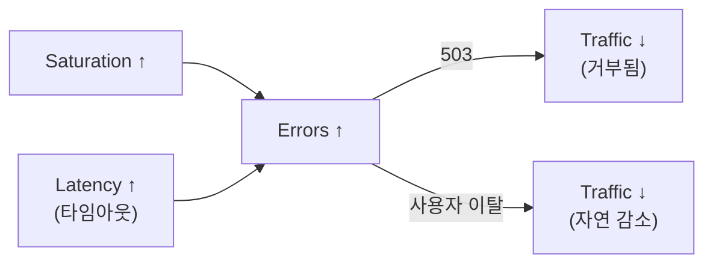
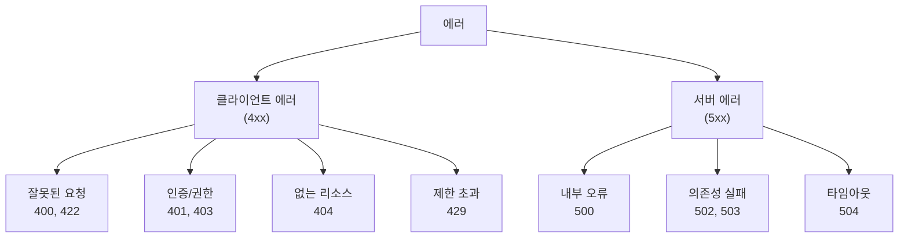

## 전체 비유: 응급실 분류 체계

Errors를 **응급실 환자 분류(Triage) 시스템**에 비유하면 이해하기 쉽습니다:

| 응급실 분류 비유 | Errors 개념 | 의미 |
|---------------|------------|------|
| 진료 실패율 | 에러율 | 전체 중 실패 비율 |
| 환자 분류 (중증/경증) | 에러 분류 | 5xx vs 4xx, 심각도 구분 |
| 감기 환자 (경미) | 404 Not Found | 흔하고 대부분 정상 |
| 예방 조치 (거부) | 429 Rate Limit | 의도적 보호 기제 |
| 응급 환자 (심각) | 500 에러 | 즉각 조치 필요 |
| 중환자실 만석 | 503 에러 | 용량 문제 |
| 월간 응급 예산 | 에러 버짓 | 허용 가능한 에러량 |
| 진료 성공률 목표 | SLO | 목표 가용성 |

이처럼 응급실에서 환자를 분류하듯, 에러도 유형별로 분류하여 적절한 대응 우선순위를 정합니다.

---

> **대상 독자**: 서비스 신뢰성을 개선하려는 개발자, SRE
> **선수 지식**: [집계 연산자](../promql/aggregation-operators/)
> **소요 시간**: 약 25-30분
> **이 문서를 읽으면**: 에러를 체계적으로 분류하고 SLO 기반 모니터링을 설정할 수 있습니다

## TL;DR


**핵심 요약:**
- **에러율**: 실패 요청 / 전체 요청
- HTTP 5xx만 에러가 아님: 비즈니스 로직 실패도 포함
- **에러 버짓**: 허용 가능한 에러 양 (SLO 기반)
- 에러 **분류**가 중요: 클라이언트 vs 서버, 일시적 vs 영구적


## 왜 에러 모니터링이 중요한가?

에러는 **시스템 건강의 가장 직접적인 지표**입니다. Latency가 높아도 서비스는 동작하지만, 에러율이 높으면 사용자에게 실질적인 피해가 발생합니다. Google SRE 팀의 연구에 따르면, **사용자가 에러를 경험하면 72시간 내 이탈 확률이 3배** 증가합니다.

### 비유: 병원의 응급실

응급실에서는 환자의 다양한 증상을 분류(Triage)합니다. 두통(경미)과 심장마비(치명)는 같은 "증상"이지만 긴급도와 대응이 완전히 다릅니다. 마찬가지로 에러도 분류가 핵심입니다:

- **404 Not Found**: 감기 - 흔하고 대부분 정상적인 탐색 과정
- **429 Too Many Requests**: 예방 접종 - 의도적으로 발생시킨 보호 기제
- **500 Internal Error**: 응급 상황 - 즉각적인 조치 필요
- **503 Service Unavailable**: 중환자실 만석 - 용량 문제, 확장 필요

모든 에러를 동일하게 취급하면, 진짜 위험한 상황에서 **경고 피로(Alert Fatigue)**로 인해 대응이 늦어집니다.

### 에러와 다른 신호의 관계

에러는 단독으로 발생하지 않습니다. 다른 Golden Signal과 연쇄적으로 연결됩니다.



| 원인 | 에러 유형 | 연쇄 효과 |
|------|----------|----------|
| 트래픽 급증 | 503, 429 | 더 많은 재시도 → 트래픽 추가 증가 |
| 의존성 장애 | 502, 504 | 지연시간 증가 → 타임아웃 증가 |
| 메모리 부족 | 500, OOM | 서비스 재시작 → 연결 끊김 |
| 잘못된 배포 | 500, 400 | 롤백 필요 |

에러 모니터링의 핵심은 **에러가 발생했다**는 사실이 아니라, **어떤 에러가 왜 발생하고 얼마나 발생하는가**를 이해하는 것입니다. 이를 통해 진짜 문제와 예상된 상황을 구분할 수 있습니다.

---

## 에러 정의

에러를 정의할 때 가장 흔한 실수는 "HTTP 5xx만 에러"라고 생각하는 것입니다. 하지만 실제로는 비즈니스 관점에서 에러를 정의해야 합니다. 예를 들어, 결제 서비스에서 "잔액 부족"은 기술적으로 200 OK를 반환하지만, 비즈니스 관점에서는 실패입니다.

### 무엇이 에러인가?

| 유형 | 예시 | 에러 여부 |
|------|------|----------|
| HTTP 5xx | 500, 502, 503 | ✅ 서버 에러 |
| HTTP 4xx | 400, 404, 429 | ⚠️ 상황에 따라 |
| 타임아웃 | 요청 시간 초과 | ✅ 에러 |
| 비즈니스 실패 | 결제 실패, 재고 부족 | ⚠️ 정의 필요 |
| 느린 응답 | SLA 초과 응답 | ⚠️ 정의 필요 |


**4xx는 상황에 따라 다릅니다:**
- `400 Bad Request`: 클라이언트 버그 → 에러로 집계 가능
- `404 Not Found`: 정상적인 탐색 → 제외할 수 있음
- `429 Too Many Requests`: 의도적 제한 → 제외


### 에러 분류 체계



---

## 측정 방법

### 기본 에러율

```promql
# 5xx 에러율 (%)
sum(rate(http_requests_total{status=~"5.."}[5m]))
/ sum(rate(http_requests_total[5m]))
* 100

# 서비스별 에러율
sum by (service) (rate(http_requests_total{status=~"5.."}[5m]))
/ sum by (service) (rate(http_requests_total[5m]))
* 100
```

### 확장된 에러율 (4xx 포함)

```promql
# 4xx + 5xx (특정 코드 제외)
sum(rate(http_requests_total{status=~"[45]..", status!~"404|429"}[5m]))
/ sum(rate(http_requests_total[5m]))
* 100
```

### 에러 수

```promql
# 초당 에러 수
sum(rate(http_requests_total{status=~"5.."}[5m]))

# 1시간 에러 총 수
sum(increase(http_requests_total{status=~"5.."}[1h]))

# 상태 코드별 에러 수
sum by (status) (rate(http_requests_total{status=~"[45].."}[5m]))
```

### 가용성 (반대 지표)

```promql
# 가용성 = 1 - 에러율
(1 - (
  sum(rate(http_requests_total{status=~"5.."}[5m]))
  / sum(rate(http_requests_total[5m]))
)) * 100

# 99.9% 가용성 = 0.1% 에러율
```

---

## SLO와 에러 버짓

### 왜 에러 버짓이 필요한가?

전통적인 모니터링은 "에러가 발생하면 알림"이라는 단순한 방식이었습니다. 하지만 이 방식은 두 가지 문제가 있습니다:

1. **완벽한 가용성은 비현실적**: 100% 가용성을 목표로 하면, 아무리 사소한 에러에도 긴급 대응해야 합니다
2. **혁신과 안정성의 충돌**: 새 기능 배포는 항상 리스크를 동반합니다. 에러 0%를 목표로 하면 아무것도 배포할 수 없습니다

**비유: 자동차 연비와 예산**

월급을 받으면 "이번 달 연료비로 30만원까지 쓸 수 있다"고 예산을 정합니다. 에러 버짓도 같은 개념입니다. "이번 달 에러로 43분까지 허용한다(99.9% SLO)"고 정하면:

- 버짓이 남아있으면 → 새 기능 배포, 실험 가능
- 버짓이 부족하면 → 배포 중단, 안정성 개선에 집중
- 버짓을 다 쓰면 → 롤백, 긴급 대응

이렇게 하면 비즈니스 결정(배포 여부)이 **객관적인 데이터**에 기반하게 됩니다.

### SLO 정의

| SLO | 허용 에러율 | 월간 허용 다운타임 |
|-----|-----------|------------------|
| 99% | 1% | 7.2시간 |
| 99.9% | 0.1% | 43.2분 |
| 99.99% | 0.01% | 4.3분 |

### 에러 버짓 계산

```promql
# 월간 에러 버짓 (99.9% SLO)
# 허용 에러율: 0.1% = 0.001

# 현재 에러율
sum(rate(http_requests_total{status=~"5.."}[30d]))
/ sum(rate(http_requests_total[30d]))

# 남은 에러 버짓 (%)
(0.001 - (
  sum(rate(http_requests_total{status=~"5.."}[30d]))
  / sum(rate(http_requests_total[30d]))
)) / 0.001 * 100
```

### 에러 버짓 소진 속도

```promql
# 현재 속도로 에러 버짓 소진까지 남은 시간
# burn rate = 현재 에러율 / 허용 에러율
# 남은 시간 = 남은 버짓 / burn rate

# 예: burn rate 2 = 2배 속도로 에러 발생
# 30일 버짓을 15일 만에 소진
```

---

## 알림 규칙

### 기본 에러율 알림

```yaml
groups:
  - name: error_alerts
    rules:
      # 에러율 1% 초과 (warning)
      - alert: HighErrorRate
        expr: |
          sum by (service) (rate(http_requests_total{status=~"5.."}[5m]))
          / sum by (service) (rate(http_requests_total[5m]))
          > 0.01
        for: 5m
        labels:
          severity: warning
        annotations:
          summary: "{{ $labels.service }} error rate is {{ $value | humanizePercentage }}"

      # 에러율 5% 초과 (critical)
      - alert: CriticalErrorRate
        expr: |
          sum by (service) (rate(http_requests_total{status=~"5.."}[5m]))
          / sum by (service) (rate(http_requests_total[5m]))
          > 0.05
        for: 2m
        labels:
          severity: critical
        annotations:
          summary: "{{ $labels.service }} error rate critical: {{ $value | humanizePercentage }}"
```

### 에러 버짓 기반 알림

```yaml
      # 에러 버짓 50% 소진
      - alert: ErrorBudget50PercentConsumed
        expr: |
          (
            sum(rate(http_requests_total{status=~"5.."}[7d]))
            / sum(rate(http_requests_total[7d]))
          ) > (0.001 * 0.5 * 30 / 7)  # 주간으로 환산
        for: 1h
        labels:
          severity: warning
        annotations:
          summary: "Error budget 50% consumed this month"

      # 에러 버짓 급속 소진 (burn rate > 10)
      - alert: HighErrorBudgetBurnRate
        expr: |
          (
            sum(rate(http_requests_total{status=~"5.."}[1h]))
            / sum(rate(http_requests_total[1h]))
          ) / 0.001 > 10
        for: 5m
        labels:
          severity: critical
        annotations:
          summary: "Error budget burning 10x faster than allowed"
```

### 새로운 에러 유형 감지

```yaml
      # 갑자기 등장한 에러 패턴
      - alert: NewErrorPattern
        expr: |
          sum by (service, status, path) (rate(http_requests_total{status=~"5.."}[5m])) > 0
          unless
          sum by (service, status, path) (rate(http_requests_total{status=~"5.."}[5m] offset 1h)) > 0
        for: 5m
        labels:
          severity: info
        annotations:
          summary: "New error pattern detected: {{ $labels.service }} {{ $labels.path }} {{ $labels.status }}"
```

---

## 에러 분석

### 에러 분포

```promql
# 상태 코드별 비율
sum by (status) (rate(http_requests_total{status=~"[45].."}[5m]))
/ ignoring(status) sum(rate(http_requests_total{status=~"[45].."}[5m]))
* 100

# 엔드포인트별 에러 집중도
topk(10,
  sum by (path) (rate(http_requests_total{status=~"5.."}[5m]))
)
```

### 에러 급증 탐지

```promql
# 1시간 전 대비 에러율 변화
sum(rate(http_requests_total{status=~"5.."}[5m]))
/ sum(rate(http_requests_total[5m]))
-
sum(rate(http_requests_total{status=~"5.."}[5m] offset 1h))
/ sum(rate(http_requests_total[5m] offset 1h))
```

---

## 대시보드 설계

### 권장 패널 구성

```
┌─────────────────────────────────────────────────────┐
│ Stat: Error Rate │ Stat: Error Count │ Stat: Budget │
├─────────────────────────────────────────────────────┤
│ Time Series: 에러율 추이 (5xx, 4xx 분리)             │
├─────────────────────────────────────────────────────┤
│ Pie Chart: 상태 코드별 분포                          │
├─────────────────────────────────────────────────────┤
│ Table: 에러 많은 엔드포인트 Top 10                   │
└─────────────────────────────────────────────────────┘
```

---

## Recording Rules

```yaml
groups:
  - name: error_rules
    rules:
      # 서비스별 에러율
      - record: service:http_requests_errors:ratio_rate5m
        expr: |
          sum by (service) (rate(http_requests_total{status=~"5.."}[5m]))
          / sum by (service) (rate(http_requests_total[5m]))

      # 전체 에러율
      - record: :http_requests_errors:ratio_rate5m
        expr: |
          sum(rate(http_requests_total{status=~"5.."}[5m]))
          / sum(rate(http_requests_total[5m]))

      # 가용성
      - record: service:http_requests_availability:ratio_rate5m
        expr: |
          1 - (
            sum by (service) (rate(http_requests_total{status=~"5.."}[5m]))
            / sum by (service) (rate(http_requests_total[5m]))
          )
```

---

## 핵심 정리

| 지표 | 계산 | 용도 |
|------|------|------|
| 에러율 | 5xx / 전체 | SLO 모니터링 |
| 에러 수 | `increase()` | 이벤트 집계 |
| 가용성 | 1 - 에러율 | SLA 보고 |
| 에러 버짓 | 허용량 - 사용량 | 릴리스 결정 |

---

## 다음 단계

| 추천 순서 | 문서 | 배우는 것 |
|----------|------|----------|
| 1 | [Saturation](saturation/) | 리소스 포화도 |
| 2 | [알림 후 액션 가이드](../../appendix/alerting-actions/) | 에러 대응 방법 |
