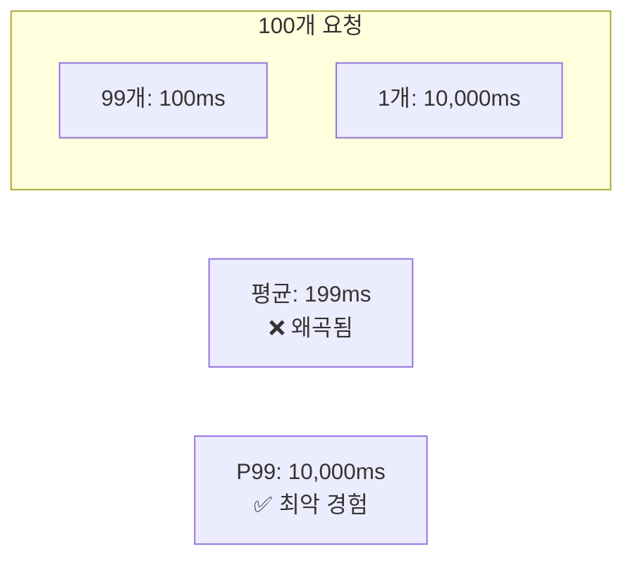
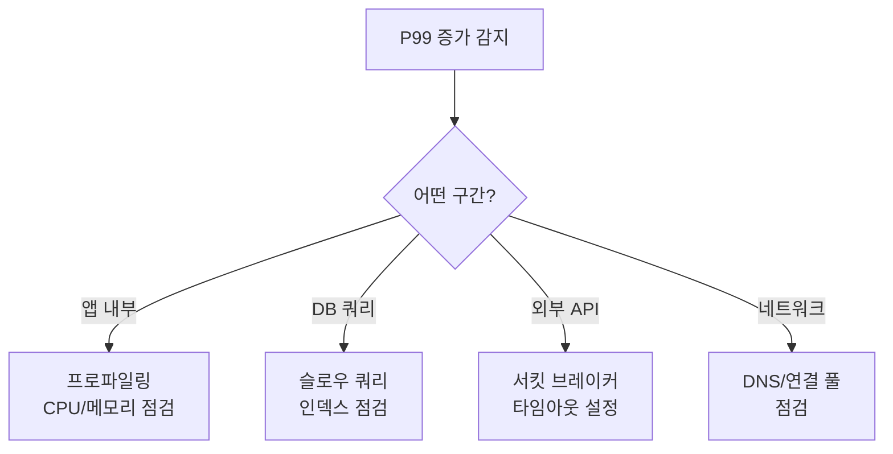

## 전체 비유: 응급실 대기 시간

Latency를 **응급실 대기 시간**에 비유하면 이해하기 쉽습니다:

| 응급실 비유 | Latency 개념 | 의미 |
|-----------|-------------|------|
| 평균 대기 시간 | 평균 응답시간 | 전체 환자 평균 (왜곡 가능) |
| 절반 환자 대기 시간 | P50 (중앙값) | 일반적인 경험 |
| 대부분 환자 대기 시간 | P95 | 거의 모든 환자 경험 |
| 최악 대기 시간 | P99 | SLA 기준, 1%의 경험 |
| 응급 vs 일반 환자 | 성공/실패 분리 | 요청 유형별 분석 |
| 대기 시간 목표 | SLA/SLO | 허용 가능한 한계 |
| 대기 시간 급증 알림 | 알림 규칙 | 지연 발생 시 감지 |

이처럼 응급실 대기 시간에서 평균보다 "최악의 대기 시간"이 중요하듯, 서비스에서도 P99가 사용자 경험을 좌우합니다.

---

> **대상 독자**: 서비스 응답시간을 개선하려는 개발자, SRE
> **선수 지식**: [histogram_quantile]()
> **이 문서를 읽으면**: 지연시간을 정확히 측정하고 SLA 기반 알림을 설정할 수 있습니다

## TL;DR


**핵심 요약:**
- **P50 (중앙값)**: 일반 사용자 경험
- **P95**: 대부분의 사용자 경험
- **P99**: 최악의 사용자 경험 (SLA 기준)
- 평균보다 **백분위**가 실제 경험을 더 잘 반영
- 성공/실패 요청의 지연시간을 **분리 측정**


## 왜 백분위가 중요한가?

Latency(지연시간)는 **사용자가 직접 체감하는 품질**입니다. 아무리 기능이 훌륭해도 5초를 기다려야 한다면 사용자는 떠납니다. Amazon의 연구에 따르면 **100ms의 지연 증가가 매출 1% 감소**로 이어집니다.

### 평균은 거짓말쟁이

**비유: 평균 연봉의 함정**

10명의 연봉이 각각 5,000만원인 회사에 연봉 100억인 CEO가 입사했습니다. 평균 연봉은 갑자기 9.5억이 됩니다. 하지만 10명 중 누구도 9.5억을 받지 않습니다.

마찬가지로 "평균 응답시간 200ms"는 **대부분의 사용자 경험을 반영하지 못합니다**. 99명이 100ms를 경험하고 1명이 10초를 경험해도 평균은 199ms입니다. 그 1명의 사용자는 끔찍한 경험을 하지만, 평균에는 거의 반영되지 않습니다.

백분위(Percentile)는 이 문제를 해결합니다. P99가 10초라면 "100명 중 1명은 10초를 기다린다"는 것을 명확히 알 수 있습니다.

### 평균의 함정



| 지표 | 값 | 의미 |
|------|-----|------|
| 평균 | 199ms | 1%의 느린 요청에 왜곡됨 |
| P50 | 100ms | 절반은 100ms 이하 |
| P99 | 10,000ms | 1%는 10초 이상 대기 |

### 각 백분위의 의미

| 백분위 | 커버리지 | 용도 |
|--------|----------|------|
| **P50** | 50% | 일반적인 사용자 경험 |
| **P90** | 90% | 대부분 사용자 경험 |
| **P95** | 95% | 거의 모든 사용자 경험 |
| **P99** | 99% | SLA 기준, 최악 경험 |
| **P99.9** | 99.9% | 매우 엄격한 SLA |

---

## 측정 방법

### 기본 PromQL

```promql
# P50 (중앙값)
histogram_quantile(0.5,
  sum by (service, le) (rate(http_request_duration_seconds_bucket[5m]))
)

# P95
histogram_quantile(0.95,
  sum by (service, le) (rate(http_request_duration_seconds_bucket[5m]))
)

# P99
histogram_quantile(0.99,
  sum by (service, le) (rate(http_request_duration_seconds_bucket[5m]))
)

# 평균 (비교용)
rate(http_request_duration_seconds_sum[5m])
/ rate(http_request_duration_seconds_count[5m])
```

### 성공/실패 분리 측정


**실패 요청은 빠를 수 있습니다.** 타임아웃으로 실패하면 느리고, 즉시 거부되면 빠릅니다. 분리 측정이 중요합니다.


```promql
# 성공 요청의 P99
histogram_quantile(0.99,
  sum by (service, le) (
    rate(http_request_duration_seconds_bucket{status!~"5.."}[5m])
  )
)

# 실패 요청의 P99
histogram_quantile(0.99,
  sum by (service, le) (
    rate(http_request_duration_seconds_bucket{status=~"5.."}[5m])
  )
)
```

### 엔드포인트별 측정

```promql
# 엔드포인트별 P99
histogram_quantile(0.99,
  sum by (path, le) (rate(http_request_duration_seconds_bucket[5m]))
)

# 느린 엔드포인트 상위 5개
topk(5,
  histogram_quantile(0.99,
    sum by (path, le) (rate(http_request_duration_seconds_bucket[5m]))
  )
)
```

---

## SLA/SLO 설정

### SLA 정의 예시

| 서비스 | P99 목표 | P99.9 목표 |
|--------|----------|------------|
| API Gateway | 100ms | 500ms |
| 주문 서비스 | 500ms | 2s |
| 검색 서비스 | 200ms | 1s |
| 배치 작업 | 30s | 2m |

### SLA 준수율 계산

```promql
# P99가 500ms 이하인 비율 (SLA 준수율)
avg_over_time(
  (
    histogram_quantile(0.99,
      sum by (le) (rate(http_request_duration_seconds_bucket[5m]))
    ) < 0.5
  )[24h:5m]
)
```

### 에러 버짓 계산

```promql
# 목표: P99 < 500ms
# 허용 위반 시간: 월 43.2분 (99.9% SLA)

# 현재 SLA 위반 시간 (시간/일)
count_over_time(
  (
    histogram_quantile(0.99,
      sum by (le) (rate(http_request_duration_seconds_bucket[5m]))
    ) > 0.5
  )[24h:5m]
) * 5 / 60  # 5분 단위 → 시간 변환
```

---

## 알림 규칙

### 기본 알림

```yaml
groups:
  - name: latency_alerts
    rules:
      # P99가 목표 초과
      - alert: HighP99Latency
        expr: |
          histogram_quantile(0.99,
            sum by (service, le) (rate(http_request_duration_seconds_bucket[5m]))
          ) > 0.5
        for: 5m
        labels:
          severity: warning
        annotations:
          summary: "{{ $labels.service }} P99 latency is {{ $value | humanizeDuration }}"
          runbook_url: "https://wiki/runbook/high-latency"

      # P99가 심각 수준
      - alert: CriticalP99Latency
        expr: |
          histogram_quantile(0.99,
            sum by (service, le) (rate(http_request_duration_seconds_bucket[5m]))
          ) > 2
        for: 2m
        labels:
          severity: critical
        annotations:
          summary: "{{ $labels.service }} P99 latency critical: {{ $value | humanizeDuration }}"
```

### 급격한 변화 감지

```yaml
# P99가 평소 대비 2배 이상 증가
- alert: LatencySpike
  expr: |
    histogram_quantile(0.99, sum by (service, le) (rate(http_request_duration_seconds_bucket[5m])))
    >
    histogram_quantile(0.99, sum by (service, le) (rate(http_request_duration_seconds_bucket[5m] offset 1h)))
    * 2
  for: 5m
  labels:
    severity: warning
  annotations:
    summary: "{{ $labels.service }} latency doubled compared to 1 hour ago"
```

---

## 대시보드 설계

### 권장 패널 구성

```
┌─────────────────────────────────────────────────────┐
│ Stat: Current P99 │ Stat: P99 Change (vs 1h ago)    │
├─────────────────────────────────────────────────────┤
│ Time Series: P50 / P95 / P99 추이                   │
├─────────────────────────────────────────────────────┤
│ Heatmap: 응답시간 분포                               │
├─────────────────────────────────────────────────────┤
│ Table: 엔드포인트별 P99 (상위 10개)                  │
└─────────────────────────────────────────────────────┘
```

### Grafana 쿼리 예시

```promql
# Stat: 현재 P99
histogram_quantile(0.99, sum by (le) (rate(http_request_duration_seconds_bucket[5m])))

# Time Series: 백분위 비교
# P50
histogram_quantile(0.50, sum by (le) (rate(http_request_duration_seconds_bucket[$__rate_interval])))
# P95
histogram_quantile(0.95, sum by (le) (rate(http_request_duration_seconds_bucket[$__rate_interval])))
# P99
histogram_quantile(0.99, sum by (le) (rate(http_request_duration_seconds_bucket[$__rate_interval])))
```

---

## 개선 전략

### 지연시간이 높을 때



### 일반적인 원인

| 원인 | 증상 | 해결책 |
|------|------|--------|
| DB 쿼리 | 특정 엔드포인트만 느림 | 인덱스, 쿼리 최적화 |
| 외부 API | 특정 의존성 호출 시 느림 | 캐싱, 서킷 브레이커 |
| GC | 주기적 스파이크 | 힙 튜닝, GC 알고리즘 |
| 연결 풀 고갈 | 동시성 높을 때 느림 | 풀 사이즈 증가 |
| CPU 포화 | 전반적으로 느림 | 스케일 아웃 |

---

## 핵심 정리

| 지표 | 용도 | 임계값 예시 |
|------|------|------------|
| P50 | 일반 경험 모니터링 | - |
| P95 | 대시보드 주요 지표 | 200ms |
| P99 | SLA 기준, 알림 | 500ms |
| P99.9 | 엄격한 SLA | 2s |

**Recording Rules 템플릿:**
```yaml
- record: service:http_request_duration_seconds:p99
  expr: |
    histogram_quantile(0.99,
      sum by (service, le) (rate(http_request_duration_seconds_bucket[5m]))
    )
```

---

## 다음 단계

| 추천 순서 | 문서 | 배우는 것 |
|----------|------|----------|
| 1 | [Traffic]() | 처리량 모니터링 |
| 2 | [높은 지연시간 진단]() | 문제 해결 가이드 |
