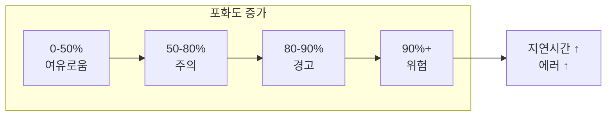

> **대상 독자**: 시스템 용량을 관리하는 SRE, 인프라 엔지니어
> **선수 지식**: [Prometheus 아키텍처]()
> **이 문서를 읽으면**: 리소스 병목을 조기에 감지하고 용량 계획을 수립할 수 있습니다

## TL;DR


**핵심 요약:**
- **포화도**: 리소스가 얼마나 "가득 찼는가" (0-100%)
- **주요 리소스**: CPU, 메모리, 디스크, 네트워크, 연결 풀
- 100%에 가까워지면 **지연시간 급증, 에러 발생**
- USE 메서드: Utilization, Saturation, Errors


## 포화도란?

포화도는 **리소스가 한계에 얼마나 가까운가**를 측정합니다.



| 포화도 | 상태 | 대응 |
|--------|------|------|
| 0-50% | 여유 | 모니터링만 |
| 50-80% | 주의 | 트렌드 관찰 |
| 80-90% | 경고 | 용량 계획 |
| 90%+ | 위험 | 즉시 조치 |

---

## CPU 포화도

### 사용률 측정

```promql
# CPU 사용률 (%)
100 - (avg by (instance) (rate(node_cpu_seconds_total{mode="idle"}[5m])) * 100)

# 모드별 CPU 사용
sum by (mode) (rate(node_cpu_seconds_total[5m])) * 100
# user, system, iowait, idle 등

# iowait (디스크 I/O 대기)
avg by (instance) (rate(node_cpu_seconds_total{mode="iowait"}[5m])) * 100
```

### CPU 포화 지표

```promql
# Load Average (실행 대기 프로세스 수)
node_load1   # 1분 평균
node_load5   # 5분 평균
node_load15  # 15분 평균

# CPU 코어 대비 Load
node_load1 / count without (cpu) (node_cpu_seconds_total{mode="idle"})

# 1 이상이면 CPU 대기 발생
```

### 알림 규칙

```yaml
groups:
  - name: cpu_saturation
    rules:
      - alert: HighCPUUsage
        expr: |
          100 - (avg by (instance) (rate(node_cpu_seconds_total{mode="idle"}[5m])) * 100) > 80
        for: 10m
        labels:
          severity: warning
        annotations:
          summary: "High CPU usage on {{ $labels.instance }}"
          description: "CPU usage is {{ $value | humanize }}%"

      - alert: HighLoadAverage
        expr: |
          node_load5 / count without (cpu) (node_cpu_seconds_total{mode="idle"}) > 1.5
        for: 10m
        labels:
          severity: warning
        annotations:
          summary: "High load average on {{ $labels.instance }}"
```

---

## 메모리 포화도

### 사용률 측정

```promql
# 메모리 사용률 (%)
(1 - node_memory_MemAvailable_bytes / node_memory_MemTotal_bytes) * 100

# 사용 중인 메모리
node_memory_MemTotal_bytes - node_memory_MemAvailable_bytes

# 캐시 제외 실제 사용량
node_memory_MemTotal_bytes - node_memory_MemFree_bytes - node_memory_Buffers_bytes - node_memory_Cached_bytes
```

### 메모리 포화 지표

```promql
# Swap 사용량 (swap 사용 = 메모리 부족)
node_memory_SwapTotal_bytes - node_memory_SwapFree_bytes

# Swap 사용률
(node_memory_SwapTotal_bytes - node_memory_SwapFree_bytes)
/ node_memory_SwapTotal_bytes * 100

# OOM 킬 횟수
increase(node_vmstat_oom_kill[1h])
```

### 알림 규칙

```yaml
      - alert: HighMemoryUsage
        expr: |
          (1 - node_memory_MemAvailable_bytes / node_memory_MemTotal_bytes) > 0.85
        for: 5m
        labels:
          severity: warning
        annotations:
          summary: "High memory usage on {{ $labels.instance }}"
          description: "Memory usage is {{ $value | humanizePercentage }}"

      - alert: SwapUsage
        expr: |
          (node_memory_SwapTotal_bytes - node_memory_SwapFree_bytes) > 0
        for: 5m
        labels:
          severity: warning
        annotations:
          summary: "Swap is being used on {{ $labels.instance }}"
```

---

## 디스크 포화도

### 사용률 측정

```promql
# 디스크 사용률 (%)
(1 - node_filesystem_avail_bytes{mountpoint="/"} / node_filesystem_size_bytes{mountpoint="/"}) * 100

# 사용 가능한 공간 (GB)
node_filesystem_avail_bytes{mountpoint="/"} / 1024 / 1024 / 1024

# inode 사용률
(1 - node_filesystem_files_free / node_filesystem_files) * 100
```

### 디스크 I/O 포화

```promql
# I/O 사용률 (%)
rate(node_disk_io_time_seconds_total[5m]) * 100

# I/O 대기 시간
rate(node_disk_io_time_weighted_seconds_total[5m])
/ rate(node_disk_io_time_seconds_total[5m])

# 읽기/쓰기 처리량
rate(node_disk_read_bytes_total[5m])
rate(node_disk_written_bytes_total[5m])
```

### 알림 규칙

```yaml
      - alert: DiskSpaceLow
        expr: |
          (1 - node_filesystem_avail_bytes{mountpoint="/"} / node_filesystem_size_bytes{mountpoint="/"}) > 0.85
        for: 10m
        labels:
          severity: warning
        annotations:
          summary: "Low disk space on {{ $labels.instance }}"
          description: "Disk usage is {{ $value | humanizePercentage }}"

      - alert: DiskWillFillIn24Hours
        expr: |
          predict_linear(node_filesystem_avail_bytes{mountpoint="/"}[6h], 24*3600) < 0
        for: 1h
        labels:
          severity: warning
        annotations:
          summary: "Disk will be full within 24 hours on {{ $labels.instance }}"
```

---

## 네트워크 포화도

### 대역폭 사용률

```promql
# 수신 대역폭 (bytes/s)
rate(node_network_receive_bytes_total{device!="lo"}[5m])

# 송신 대역폭 (bytes/s)
rate(node_network_transmit_bytes_total{device!="lo"}[5m])

# 대역폭 사용률 (1Gbps = 125MB/s 기준)
rate(node_network_receive_bytes_total{device="eth0"}[5m]) / 125000000 * 100
```

### 네트워크 에러/드롭

```promql
# 수신 에러
rate(node_network_receive_errs_total[5m])

# 송신 에러
rate(node_network_transmit_errs_total[5m])

# 드롭된 패킷
rate(node_network_receive_drop_total[5m])
rate(node_network_transmit_drop_total[5m])
```

### TCP 연결

```promql
# 현재 연결 수
node_netstat_Tcp_CurrEstab

# TIME_WAIT 연결
node_sockstat_TCP_tw

# 연결 거부 (포트 부족)
rate(node_netstat_TcpExt_ListenOverflows[5m])
```

---

## 애플리케이션 포화도

### 연결 풀

```promql
# HikariCP 활성 연결
hikaricp_connections_active

# 연결 풀 사용률
hikaricp_connections_active / hikaricp_connections_max * 100

# 대기 중인 요청
hikaricp_connections_pending
```

### JVM 힙

```promql
# 힙 사용률
jvm_memory_used_bytes{area="heap"}
/ jvm_memory_max_bytes{area="heap"} * 100

# Old Gen 사용률
jvm_memory_used_bytes{area="heap", id="G1 Old Gen"}
/ jvm_memory_max_bytes{area="heap", id="G1 Old Gen"} * 100

# GC 시간 비율 (높으면 힙 부족)
rate(jvm_gc_pause_seconds_sum[5m])
```

### 스레드 풀

```promql
# Tomcat 스레드
tomcat_threads_busy_threads / tomcat_threads_config_max_threads * 100

# 현재 처리 중인 요청
http_server_requests_active
```

---

## Kafka 포화도

```promql
# Consumer Lag (처리 지연)
sum by (consumer_group) (kafka_consumer_group_lag)

# 브로커 디스크 사용률
kafka_log_log_size / kafka_log_log_max_size * 100

# 파티션 리더 불균형
kafka_server_replicamanager_leadercount
```

---

## 대시보드 설계

### USE 대시보드 구성

```
┌─────────────────────────────────────────────────────┐
│                    CPU                               │
│ Gauge: 사용률 │ Graph: 사용률 추이 │ Graph: Load Avg │
├─────────────────────────────────────────────────────┤
│                  Memory                              │
│ Gauge: 사용률 │ Graph: 사용량 추이 │ Graph: Swap     │
├─────────────────────────────────────────────────────┤
│                   Disk                               │
│ Gauge: 사용률 │ Graph: I/O │ Table: 마운트포인트별   │
├─────────────────────────────────────────────────────┤
│                  Network                             │
│ Graph: 대역폭 │ Graph: 에러/드롭 │ Stat: 연결 수     │
└─────────────────────────────────────────────────────┘
```

---

## Recording Rules

```yaml
groups:
  - name: saturation_rules
    rules:
      # CPU 사용률
      - record: instance:node_cpu_utilization:ratio
        expr: |
          1 - avg by (instance) (rate(node_cpu_seconds_total{mode="idle"}[5m]))

      # 메모리 사용률
      - record: instance:node_memory_utilization:ratio
        expr: |
          1 - node_memory_MemAvailable_bytes / node_memory_MemTotal_bytes

      # 디스크 사용률
      - record: instance:node_filesystem_utilization:ratio
        expr: |
          1 - node_filesystem_avail_bytes{mountpoint="/"} / node_filesystem_size_bytes{mountpoint="/"}

      # 연결 풀 사용률
      - record: instance:hikaricp_pool_utilization:ratio
        expr: |
          hikaricp_connections_active / hikaricp_connections_max
```

---

## 핵심 정리

| 리소스 | 핵심 지표 | 임계값 |
|--------|----------|--------|
| CPU | 사용률, Load Average | 80% |
| 메모리 | 사용률, Swap | 85% |
| 디스크 | 사용률, I/O | 85% |
| 네트워크 | 대역폭, 에러 | 70% |
| 연결 풀 | 활성/최대 | 80% |
| JVM 힙 | 사용률, GC | 80% |

---

## 다음 단계

| 추천 순서 | 문서 | 배우는 것 |
|----------|------|----------|
| 1 | [서비스 유형별 적용]() | 맞춤형 지표 |
| 2 | [카디널리티 최적화]() | 비용 절감 |
