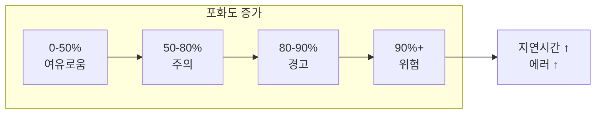

## 전체 비유: 병원 수용 능력

Saturation을 **병원의 수용 능력(병상/장비/인력)**에 비유하면 이해하기 쉽습니다:

| 병원 수용력 비유 | Saturation 개념 | 역할 |
|---------------|----------------|------|
| 병상 점유율 | 리소스 사용률 | 현재 자원 사용 상태 |
| 의사 업무 포화 | CPU 포화도 | 처리 능력 한계 |
| 수술실 대기열 | 요청 대기열 | 처리 대기 중인 작업 |
| 의약품 재고 | 메모리 사용량 | 가용 자원 현황 |
| 창고 공간 | 디스크 사용률 | 저장 공간 여유 |
| 응급실 만석 경고 | 임계값 알림 | 한계 도달 전 경고 |
| 병원 확장 계획 | 용량 계획 | 자원 증설 계획 |
| 여유 병상 확보 | 헤드룸 (20%) | 버퍼 공간 유지 |

이처럼 병원이 병상 점유율을 모니터링하여 응급 상황에 대비하듯, 시스템도 리소스 포화도를 감시합니다.

---

> **대상 독자**: 시스템 용량을 관리하는 SRE, 인프라 엔지니어
> **선수 지식**: [Prometheus 아키텍처]()
> **이 문서를 읽으면**: 리소스 병목을 조기에 감지하고 용량 계획을 수립할 수 있습니다

## TL;DR


**핵심 요약:**
- **포화도**: 리소스가 얼마나 "가득 찼는가" (0-100%)
- **주요 리소스**: CPU, 메모리, 디스크, 네트워크, 연결 풀
- 100%에 가까워지면 **지연시간 급증, 에러 발생**
- USE 메서드: Utilization, Saturation, Errors


## 왜 포화도를 모니터링해야 하는가?

Saturation(포화도)은 **장애를 예측할 수 있는 유일한 지표**입니다. Latency, Traffic, Errors는 문제가 **발생한 후**에야 반응하지만, Saturation은 문제가 **발생하기 전**에 경고합니다.

Google SRE 원칙에서 Saturation을 Golden Signals에 포함시킨 이유가 여기에 있습니다. 시스템이 100%에 도달하면 모든 것이 동시에 무너집니다. 응답 시간은 급등하고, 에러는 폭발하며, 트래픽 처리는 멈춥니다. 하지만 90%에서 발견하면 여유 있게 대응할 수 있습니다.

### 비유: 고속도로 정체의 법칙

고속도로 용량의 70%까지는 차량이 원활하게 흐릅니다. 80%를 넘으면 간헐적인 정체가 시작됩니다. 90%를 넘으면 **작은 브레이크 하나가 연쇄 정체를 유발**합니다. 100%에서는 완전히 멈춥니다.

컴퓨터 시스템도 동일합니다. CPU가 90%를 넘으면 프로세스들이 실행 순서를 기다리며 줄을 섭니다. 메모리가 부족해지면 Swap이 발생하고 속도가 10배 느려집니다. 디스크가 가득 차면 로그조차 쓸 수 없어 장애 원인 파악이 불가능해집니다.

**핵심은 "한계점 도달 전에 알아채는 것"입니다.** 사후 대응(reactive)이 아닌 사전 예방(proactive) 모니터링이 가능한 유일한 지표가 Saturation입니다.

---

## 포화도란?

포화도는 **리소스가 한계에 얼마나 가까운가**를 측정합니다. 0%는 완전히 유휴 상태, 100%는 더 이상 처리할 여유가 없는 상태입니다.



### 왜 80%부터 경고인가?

시스템은 **피크 트래픽에 대비한 여유(headroom)**가 필요합니다. 평상시 80%라면 갑작스러운 트래픽 증가 시 100%를 초과할 위험이 있습니다. 일반적으로 **20% 여유**를 권장합니다.

| 포화도 | 상태 | 대응 | 이유 |
|--------|------|------|------|
| 0-50% | 여유 | 모니터링만 | 피크에도 안전한 수준 |
| 50-80% | 주의 | 트렌드 관찰 | 증가 추세 확인 필요 |
| 80-90% | 경고 | 용량 계획 | 피크 대응 여유 부족 |
| 90%+ | 위험 | 즉시 조치 | 장애 임박 |

---

## CPU 포화도

CPU는 모든 연산의 핵심이므로 **가장 먼저 모니터링해야 할 리소스**입니다. CPU가 포화되면 모든 프로세스가 느려지고, 특히 응답 시간이 급격히 증가합니다.

**비유: 요리사의 한계**

주방에 요리사가 1명일 때, 주문이 5개까지는 순조롭게 처리됩니다. 10개가 되면 대기 시간이 늘어납니다. 20개가 되면 요리사가 아무리 빨리 움직여도 주문이 밀립니다. CPU 코어가 요리사, 프로세스가 주문입니다.

### 사용률 측정

```promql
# CPU 사용률 (%)
100 - (avg by (instance) (rate(node_cpu_seconds_total{mode="idle"}[5m])) * 100)

# 모드별 CPU 사용
sum by (mode) (rate(node_cpu_seconds_total[5m])) * 100
# user, system, iowait, idle 등

# iowait (디스크 I/O 대기)
avg by (instance) (rate(node_cpu_seconds_total{mode="iowait"}[5m])) * 100
```

### CPU 포화 지표

CPU 사용률과 별도로 **Load Average**를 함께 확인해야 합니다. CPU 사용률이 80%여도 대기열이 없으면 괜찮습니다. 하지만 사용률이 60%인데 Load가 높다면 I/O 대기나 다른 병목이 있다는 신호입니다.

```promql
# Load Average (실행 대기 프로세스 수)
node_load1   # 1분 평균
node_load5   # 5분 평균
node_load15  # 15분 평균

# CPU 코어 대비 Load
node_load1 / count without (cpu) (node_cpu_seconds_total{mode="idle"})

# 1 이상이면 CPU 대기 발생 (프로세스가 줄을 서고 있음)
```


**Load Average 해석**: 4코어 서버에서 Load가 4.0이면 "모든 코어가 100% 가동 중이고 대기 없음"입니다. 8.0이면 "4개 프로세스가 추가로 대기 중"입니다.


### 알림 규칙

```yaml
groups:
  - name: cpu_saturation
    rules:
      - alert: HighCPUUsage
        expr: |
          100 - (avg by (instance) (rate(node_cpu_seconds_total{mode="idle"}[5m])) * 100) > 80
        for: 10m
        labels:
          severity: warning
        annotations:
          summary: "High CPU usage on {{ $labels.instance }}"
          description: "CPU usage is {{ $value | humanize }}%"

      - alert: HighLoadAverage
        expr: |
          node_load5 / count without (cpu) (node_cpu_seconds_total{mode="idle"}) > 1.5
        for: 10m
        labels:
          severity: warning
        annotations:
          summary: "High load average on {{ $labels.instance }}"
```

---

## 메모리 포화도

메모리는 **유일하게 부족 시 시스템을 직접 죽이는 리소스**입니다. CPU가 100%여도 느릴 뿐이지만, 메모리가 부족하면 OOM Killer가 프로세스를 강제 종료합니다. 이때 어떤 프로세스가 죽을지 예측하기 어렵습니다.

**비유: 책상 공간**

책상 위에 펼쳐놓은 문서가 메모리입니다. 공간이 부족해지면 일부 문서를 서랍(Swap/디스크)에 넣어야 합니다. 서랍에서 꺼내오는 시간이 10-100배 오래 걸립니다. 결국 책상이 너무 좁으면 일하다가 문서를 바닥에 버려야(OOM Kill) 합니다.

### 사용률 측정

```promql
# 메모리 사용률 (%)
(1 - node_memory_MemAvailable_bytes / node_memory_MemTotal_bytes) * 100

# 사용 중인 메모리
node_memory_MemTotal_bytes - node_memory_MemAvailable_bytes

# 캐시 제외 실제 사용량
node_memory_MemTotal_bytes - node_memory_MemFree_bytes - node_memory_Buffers_bytes - node_memory_Cached_bytes
```

### 메모리 포화 지표

**Swap 사용은 이미 문제가 시작되었다는 신호**입니다. Swap은 메모리가 부족할 때 디스크를 임시 메모리로 사용하는데, 디스크는 메모리보다 1000배 느립니다. Swap이 발생하면 애플리케이션 응답 시간이 급격히 느려집니다.

```promql
# Swap 사용량 (swap 사용 = 메모리 부족)
node_memory_SwapTotal_bytes - node_memory_SwapFree_bytes

# Swap 사용률
(node_memory_SwapTotal_bytes - node_memory_SwapFree_bytes)
/ node_memory_SwapTotal_bytes * 100

# OOM 킬 횟수 (1시간 내 강제 종료된 프로세스)
increase(node_vmstat_oom_kill[1h])
```


**OOM Kill은 사후 지표입니다.** OOM Kill이 발생했다면 이미 프로세스가 죽은 후입니다. Swap 사용량이나 MemAvailable을 먼저 모니터링하세요.


### 알림 규칙

```yaml
      - alert: HighMemoryUsage
        expr: |
          (1 - node_memory_MemAvailable_bytes / node_memory_MemTotal_bytes) > 0.85
        for: 5m
        labels:
          severity: warning
        annotations:
          summary: "High memory usage on {{ $labels.instance }}"
          description: "Memory usage is {{ $value | humanizePercentage }}"

      - alert: SwapUsage
        expr: |
          (node_memory_SwapTotal_bytes - node_memory_SwapFree_bytes) > 0
        for: 5m
        labels:
          severity: warning
        annotations:
          summary: "Swap is being used on {{ $labels.instance }}"
```

---

## 디스크 포화도

디스크는 **가장 느린 리소스**입니다. SSD도 메모리보다 100배 느리고, HDD는 1000배 느립니다. 디스크가 포화되면 모든 읽기/쓰기 작업이 병목이 됩니다. 특히 디스크 공간이 부족하면 로그 기록, 데이터베이스 쓰기, 심지어 시스템 동작까지 멈출 수 있습니다.

**비유: 창고의 두 가지 한계**

창고에는 두 가지 한계가 있습니다. 첫째는 **공간**(저장 용량), 둘째는 **출입구 대역폭**(I/O 속도)입니다. 창고가 가득 차면 새 물건을 넣을 수 없고, 출입구가 혼잡하면 물건을 꺼내는 데 시간이 오래 걸립니다. 디스크도 마찬가지로 "용량"과 "I/O"를 둘 다 모니터링해야 합니다.

### 사용률 측정

```promql
# 디스크 사용률 (%)
(1 - node_filesystem_avail_bytes{mountpoint="/"} / node_filesystem_size_bytes{mountpoint="/"}) * 100

# 사용 가능한 공간 (GB)
node_filesystem_avail_bytes{mountpoint="/"} / 1024 / 1024 / 1024

# inode 사용률
(1 - node_filesystem_files_free / node_filesystem_files) * 100
```

### 디스크 I/O 포화

```promql
# I/O 사용률 (%)
rate(node_disk_io_time_seconds_total[5m]) * 100

# I/O 대기 시간
rate(node_disk_io_time_weighted_seconds_total[5m])
/ rate(node_disk_io_time_seconds_total[5m])

# 읽기/쓰기 처리량
rate(node_disk_read_bytes_total[5m])
rate(node_disk_written_bytes_total[5m])
```

### 알림 규칙

```yaml
      - alert: DiskSpaceLow
        expr: |
          (1 - node_filesystem_avail_bytes{mountpoint="/"} / node_filesystem_size_bytes{mountpoint="/"}) > 0.85
        for: 10m
        labels:
          severity: warning
        annotations:
          summary: "Low disk space on {{ $labels.instance }}"
          description: "Disk usage is {{ $value | humanizePercentage }}"

      - alert: DiskWillFillIn24Hours
        expr: |
          predict_linear(node_filesystem_avail_bytes{mountpoint="/"}[6h], 24*3600) < 0
        for: 1h
        labels:
          severity: warning
        annotations:
          summary: "Disk will be full within 24 hours on {{ $labels.instance }}"
```

---

## 네트워크 포화도

네트워크는 **분산 시스템의 생명선**입니다. 마이크로서비스, 데이터베이스 연결, 외부 API 호출 모두 네트워크를 통합니다. 네트워크가 포화되면 패킷이 드롭되고 재전송이 발생하여 지연 시간이 급증합니다.

**비유: 도시의 도로망**

네트워크는 도시의 도로망과 같습니다. 대역폭은 도로의 차선 수이고, 패킷은 차량입니다. 도로가 혼잡하면 차량이 느려지고(지연 증가), 너무 혼잡하면 일부 차량이 목적지에 도달하지 못합니다(패킷 드롭). TCP 연결 수는 주차 공간과 같아서, 공간이 부족하면 새 차량이 진입할 수 없습니다.

### 대역폭 사용률

```promql
# 수신 대역폭 (bytes/s)
rate(node_network_receive_bytes_total{device!="lo"}[5m])

# 송신 대역폭 (bytes/s)
rate(node_network_transmit_bytes_total{device!="lo"}[5m])

# 대역폭 사용률 (1Gbps = 125MB/s 기준)
rate(node_network_receive_bytes_total{device="eth0"}[5m]) / 125000000 * 100
```

### 네트워크 에러/드롭

```promql
# 수신 에러
rate(node_network_receive_errs_total[5m])

# 송신 에러
rate(node_network_transmit_errs_total[5m])

# 드롭된 패킷
rate(node_network_receive_drop_total[5m])
rate(node_network_transmit_drop_total[5m])
```

### TCP 연결

```promql
# 현재 연결 수
node_netstat_Tcp_CurrEstab

# TIME_WAIT 연결
node_sockstat_TCP_tw

# 연결 거부 (포트 부족)
rate(node_netstat_TcpExt_ListenOverflows[5m])
```

---

## 애플리케이션 포화도

인프라 리소스가 충분해도 **애플리케이션 레벨의 병목**이 발생할 수 있습니다. 연결 풀이 고갈되면 새 요청이 대기하고, 스레드 풀이 꽉 차면 요청이 거부됩니다. JVM 힙이 부족하면 GC가 과도하게 발생하여 애플리케이션이 멈춘 것처럼 보입니다.

**비유: 레스토랑 운영**

레스토랑(애플리케이션)이 잘 돌아가려면 여러 자원이 필요합니다:
- **테이블(연결 풀)**: 테이블이 가득 차면 새 손님은 대기해야 합니다
- **웨이터(스레드 풀)**: 웨이터가 부족하면 주문 접수가 지연됩니다
- **주방 공간(힙 메모리)**: 공간이 부족하면 청소(GC)를 자주 해야 하고, 요리 속도가 느려집니다

### 연결 풀

```promql
# HikariCP 활성 연결
hikaricp_connections_active

# 연결 풀 사용률
hikaricp_connections_active / hikaricp_connections_max * 100

# 대기 중인 요청
hikaricp_connections_pending
```

### JVM 힙

```promql
# 힙 사용률
jvm_memory_used_bytes{area="heap"}
/ jvm_memory_max_bytes{area="heap"} * 100

# Old Gen 사용률
jvm_memory_used_bytes{area="heap", id="G1 Old Gen"}
/ jvm_memory_max_bytes{area="heap", id="G1 Old Gen"} * 100

# GC 시간 비율 (높으면 힙 부족)
rate(jvm_gc_pause_seconds_sum[5m])
```

### 스레드 풀

```promql
# Tomcat 스레드
tomcat_threads_busy_threads / tomcat_threads_config_max_threads * 100

# 현재 처리 중인 요청
http_server_requests_active
```

---

## Kafka 포화도

Kafka에서 포화도는 주로 **Consumer Lag**로 나타납니다. Producer가 메시지를 생성하는 속도를 Consumer가 따라가지 못하면 Lag이 쌓입니다. Lag이 계속 증가하면 결국 메시지 처리가 지연되고, 브로커 디스크가 가득 차서 새 메시지를 받지 못하게 됩니다.

**왜 Consumer Lag이 중요한가?**

실시간 처리 시스템에서 Lag은 "현재와 처리 시점의 시간 차이"를 의미합니다. 주문 시스템에서 Lag이 10분이면, 10분 전 주문을 처리하고 있다는 뜻입니다. 결제 승인, 재고 차감 등이 10분 지연되면 비즈니스에 심각한 영향을 미칩니다.

```promql
# Consumer Lag (처리 지연 - 메시지 수)
sum by (consumer_group) (kafka_consumer_group_lag)

# 브로커 디스크 사용률
kafka_log_log_size / kafka_log_log_max_size * 100

# 파티션 리더 불균형
kafka_server_replicamanager_leadercount
```

---

## 대시보드 설계

### USE 메서드란?

Brendan Gregg가 제안한 **USE(Utilization, Saturation, Errors)** 메서드는 시스템 성능 문제를 체계적으로 진단하는 방법론입니다. 모든 리소스에 대해 세 가지 질문을 던집니다:

1. **Utilization(사용률)**: 리소스가 얼마나 사용되고 있는가?
2. **Saturation(포화도)**: 대기열이 있는가? 작업이 밀리고 있는가?
3. **Errors(에러)**: 에러가 발생하고 있는가?

대시보드를 이 세 가지 축으로 구성하면 문제의 원인을 빠르게 좁힐 수 있습니다.

### USE 대시보드 구성

```
┌─────────────────────────────────────────────────────┐
│                    CPU                               │
│ Gauge: 사용률 │ Graph: 사용률 추이 │ Graph: Load Avg │
├─────────────────────────────────────────────────────┤
│                  Memory                              │
│ Gauge: 사용률 │ Graph: 사용량 추이 │ Graph: Swap     │
├─────────────────────────────────────────────────────┤
│                   Disk                               │
│ Gauge: 사용률 │ Graph: I/O │ Table: 마운트포인트별   │
├─────────────────────────────────────────────────────┤
│                  Network                             │
│ Graph: 대역폭 │ Graph: 에러/드롭 │ Stat: 연결 수     │
└─────────────────────────────────────────────────────┘
```

---

## Recording Rules

```yaml
groups:
  - name: saturation_rules
    rules:
      # CPU 사용률
      - record: instance:node_cpu_utilization:ratio
        expr: |
          1 - avg by (instance) (rate(node_cpu_seconds_total{mode="idle"}[5m]))

      # 메모리 사용률
      - record: instance:node_memory_utilization:ratio
        expr: |
          1 - node_memory_MemAvailable_bytes / node_memory_MemTotal_bytes

      # 디스크 사용률
      - record: instance:node_filesystem_utilization:ratio
        expr: |
          1 - node_filesystem_avail_bytes{mountpoint="/"} / node_filesystem_size_bytes{mountpoint="/"}

      # 연결 풀 사용률
      - record: instance:hikaricp_pool_utilization:ratio
        expr: |
          hikaricp_connections_active / hikaricp_connections_max
```

---

## 핵심 정리

### 왜 이러한 임계값인가?

임계값은 **"평상시 + 피크 여유"**를 고려한 값입니다. 예를 들어 CPU 80%는 "평상시 트래픽의 1.25배까지 수용 가능"을 의미합니다. 네트워크가 70%로 더 낮은 이유는 TCP 재전송 등으로 인해 실제 가용 대역폭이 급격히 감소하기 때문입니다.

| 리소스 | 핵심 지표 | 임계값 | 이유 |
|--------|----------|--------|------|
| CPU | 사용률, Load Average | 80% | 피크 대비 20% 여유 |
| 메모리 | 사용률, Swap | 85% | 캐시 공간 확보 필요 |
| 디스크 | 사용률, I/O | 85% | 로그/임시 파일 공간 |
| 네트워크 | 대역폭, 에러 | 70% | TCP 혼잡 제어 고려 |
| 연결 풀 | 활성/최대 | 80% | 버스트 요청 대응 |
| JVM 힙 | 사용률, GC | 80% | GC 오버헤드 방지 |


**임계값은 시작점입니다.** 실제 환경에서 데이터를 축적하고, 장애 발생 패턴을 분석하여 조직에 맞게 조정하세요.


---

## 다음 단계

| 추천 순서 | 문서 | 배우는 것 |
|----------|------|----------|
| 1 | [서비스 유형별 적용]() | 맞춤형 지표 |
| 2 | [카디널리티 최적화]() | 비용 절감 |
