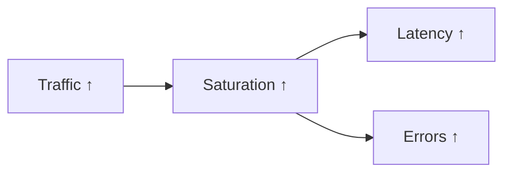

## 전체 비유: 병원 외래 환자 수

Traffic을 **병원 외래 환자 방문량**에 비유하면 이해하기 쉽습니다:

| 병원 외래 비유 | Traffic 개념 | 의미 |
|--------------|-------------|------|
| 시간당 방문 환자 수 | RPS (초당 요청) | 현재 서비스 부하 |
| 일일 진료 건수 | 일일 처리량 | 기간별 총 처리량 |
| 동시 진료 환자 수 | 동시 연결 | 현재 처리 중인 요청 |
| 평소 대비 방문 증가 | 트래픽 스파이크 | 비정상적 부하 감지 |
| 방문 환자 급감 | 트래픽 급락 | 장애 또는 문제 신호 |
| 진료과별 환자 수 | 엔드포인트별 트래픽 | 세부 분석 |
| 병원 수용 능력 | 용량 계획 | 최대 처리 가능량 |

이처럼 병원이 환자 방문 패턴을 분석하여 의료진을 배치하듯, 트래픽 분석으로 시스템 용량을 계획합니다.

---

> **대상 독자**: 서비스 용량 계획을 수립하려는 개발자, SRE
> **선수 지식**: [rate와 increase](../promql/rate-and-increase/)
> **소요 시간**: 약 25-30분
> **이 문서를 읽으면**: 트래픽 패턴을 분석하고 용량 계획에 활용할 수 있습니다

## TL;DR


**핵심 요약:**
- **RPS (Requests Per Second)**: 초당 요청 수
- **Throughput**: 초당 처리량 (바이트, 메시지 등)
- **Concurrent Connections**: 동시 연결 수
- 트래픽 변화는 **다른 신호의 선행 지표**


## 왜 트래픽을 모니터링하는가?

Traffic(트래픽)은 시스템에 들어오는 **수요(Demand)**를 측정합니다. Latency가 "얼마나 빠른가"를 나타낸다면, Traffic은 "얼마나 많은가"를 나타냅니다. 시스템의 건강 상태를 판단하려면 두 가지를 함께 봐야 합니다. 아무리 응답이 빨라도 요청이 들어오지 않는다면 문제가 있는 것이고, 요청이 폭증하는데 리소스가 부족하면 곧 장애가 발생합니다.

### 비유: 고속도로 교통량

고속도로 관제센터를 생각해보세요. 관제센터는 **현재 차량 수(Traffic)**를 실시간으로 모니터링합니다. 왜일까요?

- **교통량 급증**: 명절 귀성길처럼 차량이 몰리면 곧 정체(Latency 증가)가 시작됩니다. 미리 감지하면 우회로 안내나 차선 확대로 대응할 수 있습니다.
- **교통량 급감**: 평소 혼잡한 구간이 갑자기 한산하다면? 사고나 도로 폐쇄(장애)가 발생했을 가능성이 높습니다.
- **비정상 패턴**: 새벽 3시에 갑자기 차량이 몰린다면 특별한 이벤트가 있거나 비정상 상황입니다.

마찬가지로 서비스도 트래픽 패턴을 모니터링해야 **문제가 발생하기 전에** 대응할 수 있습니다. 트래픽은 다른 모든 문제의 **선행 지표**입니다.

### 트래픽과 다른 신호의 관계



트래픽이 증가하면 시스템 리소스가 포화(Saturation)되고, 이는 지연시간(Latency) 증가와 에러(Errors) 증가로 이어집니다. 따라서 트래픽 변화를 먼저 감지하면 **다른 문제가 발생하기 전에** 선제적으로 대응할 수 있습니다.

### 트래픽 변화의 의미

| 트래픽 변화 | 의미 | 대응 |
|------------|------|------|
| 급격한 증가 | 트래픽 스파이크, 공격 가능성 | 스케일 아웃, 방어 |
| 점진적 증가 | 서비스 성장 | 용량 계획 |
| 급격한 감소 | 장애, 라우팅 문제 | 원인 조사 |
| 비정상 패턴 | 봇 트래픽, 크롤러 | 차단 검토 |


**핵심 원칙**: 트래픽은 "문제"가 아니라 "신호"입니다. 트래픽 자체는 좋거나 나쁜 것이 아니며, 중요한 것은 **예상 범위 내인가, 그리고 시스템이 감당할 수 있는가**입니다.


---

## 측정 항목

트래픽을 측정하는 방법은 서비스 특성에 따라 다릅니다. 웹 서비스라면 HTTP 요청 수가 중요하고, 메시지 큐라면 처리된 메시지 수가 중요합니다. 어떤 지표를 선택하든, 핵심은 **"시스템에 들어오는 수요를 얼마나 정확히 반영하는가"**입니다.

### 1. RPS (Requests Per Second)

**왜 RPS를 측정하는가?**

RPS는 가장 직관적인 트래픽 지표입니다. 초당 몇 개의 요청이 들어오는지를 나타내며, 시스템의 현재 부하 수준을 즉시 파악할 수 있습니다. 용량 계획의 기본 단위이기도 합니다. "우리 서비스는 최대 10,000 RPS까지 처리할 수 있다"처럼 시스템 용량을 RPS로 표현하는 것이 일반적입니다.

```promql
# 전체 RPS
sum(rate(http_requests_total[5m]))

# 서비스별 RPS
sum by (service) (rate(http_requests_total[5m]))

# 엔드포인트별 RPS
sum by (path) (rate(http_requests_total[5m]))

# 상태 코드별 RPS
sum by (status) (rate(http_requests_total[5m]))
```

### 2. Throughput (처리량)

**왜 Throughput을 측정하는가?**

RPS는 "요청 수"를 세지만, 모든 요청이 같은 크기가 아닙니다. 1KB짜리 텍스트 요청과 100MB짜리 파일 업로드는 시스템에 미치는 영향이 완전히 다릅니다. Throughput(처리량)은 **실제로 주고받는 데이터 양**을 측정합니다.

**비유: 택배 물류센터**

물류센터에서 "오늘 택배 1,000건 처리"(RPS)와 "오늘 총 5톤 처리"(Throughput)는 다른 의미입니다. 작은 택배 1,000건과 대형 가구 100건은 건수는 다르지만 물류 부하는 비슷할 수 있습니다. 네트워크 대역폭이나 스토리지 IO가 병목인 시스템에서는 Throughput이 RPS보다 더 중요한 지표입니다.

```promql
# 초당 수신 바이트
sum(rate(http_request_size_bytes_sum[5m]))

# 초당 송신 바이트
sum(rate(http_response_size_bytes_sum[5m]))

# 초당 처리 메시지 (Kafka)
sum(rate(kafka_consumer_records_consumed_total[5m]))
```

### 3. 동시 연결/요청

**왜 동시성을 측정하는가?**

RPS가 "1초 동안 몇 개가 들어왔는가"라면, 동시 연결은 "지금 이 순간 몇 개가 처리 중인가"입니다. 이 차이가 중요한 이유는 **리소스 점유 시간** 때문입니다.

**비유: 식당 좌석**

식당에 "오늘 손님 100명 방문"(RPS)과 "현재 좌석 점유 30석"(동시 연결)은 다릅니다. 손님이 빨리 먹고 나가면(응답이 빠르면) 같은 좌석으로 더 많은 손님을 받을 수 있습니다. 하지만 손님이 오래 머무르면(응답이 느리면) 새 손님을 받을 수 없습니다. 동시 연결 수가 급증하면 곧 응답 지연이나 연결 거부가 발생합니다.

```promql
# 현재 처리 중인 요청
sum(http_requests_in_progress)

# 활성 연결 수
sum(node_netstat_Tcp_CurrEstab)

# 서비스별 동시 요청
sum by (service) (http_requests_in_progress)
```

---

## 패턴 분석

트래픽의 **절대값**보다 중요한 것은 **패턴**입니다. 현재 RPS가 5,000이라는 것만으로는 정상인지 비정상인지 알 수 없습니다. 어제 같은 시간에 5,000이었다면 정상이고, 어제는 1,000이었다면 5배 증가한 것이므로 조사가 필요합니다.

**비유: 체온 측정**

체온 37.5도가 정상인지 아닌지는 평소 체온에 따라 다릅니다. 평소 36.5도인 사람에게 37.5도는 미열이지만, 평소 37.2도인 사람에게는 정상 범위입니다. 트래픽도 마찬가지로 **기준선(Baseline)**과 비교해야 의미 있는 분석이 가능합니다.

### 일일 패턴 비교

```promql
# 현재 vs 어제 같은 시간
sum(rate(http_requests_total[5m]))
- sum(rate(http_requests_total[5m] offset 1d))

# 현재 vs 지난주 같은 시간
sum(rate(http_requests_total[5m]))
- sum(rate(http_requests_total[5m] offset 7d))

# 변화율 (%)
(sum(rate(http_requests_total[5m]))
 - sum(rate(http_requests_total[5m] offset 1d)))
/ sum(rate(http_requests_total[5m] offset 1d))
* 100
```

### 시간대별 분석

```promql
# 최근 24시간 평균 RPS
avg_over_time(sum(rate(http_requests_total[5m]))[24h:5m])

# 최근 24시간 최대 RPS
max_over_time(sum(rate(http_requests_total[5m]))[24h:5m])

# 피크 대비 현재 비율
sum(rate(http_requests_total[5m]))
/ max_over_time(sum(rate(http_requests_total[5m]))[24h:5m])
```

### 이상 탐지

```promql
# 평균 대비 표준편차 2배 이상 벗어남
abs(
  sum(rate(http_requests_total[5m]))
  - avg_over_time(sum(rate(http_requests_total[5m]))[24h:5m])
)
> 2 * stddev_over_time(sum(rate(http_requests_total[5m]))[24h:5m])
```

---

## 알림 규칙

### 트래픽 급증

```yaml
groups:
  - name: traffic_alerts
    rules:
      # 평소 대비 2배 이상 급증
      - alert: TrafficSpike
        expr: |
          sum(rate(http_requests_total[5m]))
          > 2 * avg_over_time(sum(rate(http_requests_total[5m]))[1h:5m] offset 5m)
        for: 5m
        labels:
          severity: warning
        annotations:
          summary: "Traffic spike detected"
          description: "Current RPS: {{ $value | humanize }}"
```

### 트래픽 급감

```yaml
      # 평소 대비 50% 이하로 감소
      - alert: TrafficDrop
        expr: |
          sum(rate(http_requests_total[5m]))
          < 0.5 * avg_over_time(sum(rate(http_requests_total[5m]))[1h:5m] offset 5m)
        for: 5m
        labels:
          severity: warning
        annotations:
          summary: "Traffic drop detected"
          description: "Current RPS: {{ $value | humanize }}, expected: {{ printf `avg_over_time(sum(rate(http_requests_total[5m]))[1h:5m] offset 5m)` | query | first | value | humanize }}"
```

### 용량 임계 접근

```yaml
      # 최대 용량의 80% 도달
      - alert: TrafficNearCapacity
        expr: |
          sum(rate(http_requests_total[5m])) > 8000  # 최대 10,000 RPS 가정
        for: 10m
        labels:
          severity: warning
        annotations:
          summary: "Traffic approaching capacity limit"
          description: "Current: {{ $value | humanize }} RPS, Limit: 10,000 RPS"
```

---

## 용량 계획

트래픽 모니터링의 궁극적인 목적은 **용량 계획(Capacity Planning)**입니다. "현재 트래픽이 얼마인가"를 아는 것만으로는 충분하지 않습니다. "언제 용량이 부족해질 것인가"를 예측해야 사전에 리소스를 확보할 수 있습니다.

**왜 용량 계획이 필요한가?**

클라우드 환경에서도 무한한 리소스는 없습니다. Auto Scaling에도 시간이 걸리고, 비용 제약도 있습니다. 블랙 프라이데이 세일 트래픽이 평소의 10배라면, 당일에 대응하기에는 너무 늦습니다. 미리 예측하고 준비해야 합니다.

### 피크 분석

```promql
# 일간 피크 RPS
max_over_time(sum(rate(http_requests_total[5m]))[1d:5m])

# 주간 피크 RPS
max_over_time(sum(rate(http_requests_total[5m]))[7d:5m])

# 피크 시간대 식별 (Grafana에서)
# Time series 그래프로 패턴 확인
```

### 성장률 계산

```promql
# 주간 성장률 (%)
(max_over_time(sum(rate(http_requests_total[5m]))[7d:5m])
 - max_over_time(sum(rate(http_requests_total[5m]))[7d:5m] offset 7d))
/ max_over_time(sum(rate(http_requests_total[5m]))[7d:5m] offset 7d)
* 100

# 월간 성장률
(max_over_time(sum(rate(http_requests_total[5m]))[30d:1h])
 - max_over_time(sum(rate(http_requests_total[5m]))[30d:1h] offset 30d))
/ max_over_time(sum(rate(http_requests_total[5m]))[30d:1h] offset 30d)
* 100
```

### 용량 계획 공식

```
필요 용량 = 현재 피크 × (1 + 성장률)^기간 × 안전 마진(1.5~2)
```

---

## 대시보드 설계

### 권장 패널 구성

```
┌─────────────────────────────────────────────────────┐
│ Stat: Current RPS │ Stat: vs Yesterday │ Stat: Peak │
├─────────────────────────────────────────────────────┤
│ Time Series: RPS 추이 (현재 vs 어제 vs 지난주)        │
├─────────────────────────────────────────────────────┤
│ Bar Chart: 엔드포인트별 트래픽 비율                   │
├─────────────────────────────────────────────────────┤
│ Table: 상위 10개 엔드포인트 RPS                       │
└─────────────────────────────────────────────────────┘
```

### Grafana 쿼리 예시

```promql
# 현재 RPS
sum(rate(http_requests_total[5m]))

# 어제 같은 시간 (비교용)
sum(rate(http_requests_total[5m] offset 1d))

# 엔드포인트별 비율
sum by (path) (rate(http_requests_total[5m]))
/ ignoring(path) sum(rate(http_requests_total[5m]))
* 100
```

---

## Recording Rules

```yaml
groups:
  - name: traffic_rules
    rules:
      # 서비스별 RPS
      - record: service:http_requests:rate5m
        expr: sum by (service) (rate(http_requests_total[5m]))

      # 전체 RPS
      - record: :http_requests:rate5m
        expr: sum(rate(http_requests_total[5m]))

      # 엔드포인트별 RPS
      - record: path:http_requests:rate5m
        expr: sum by (path) (rate(http_requests_total[5m]))

      # 일간 평균 RPS (Recording Rule로 저장하면 장기 분석 용이)
      - record: :http_requests:rate5m:avg24h
        expr: avg_over_time(sum(rate(http_requests_total[5m]))[24h:5m])
```

---

## 핵심 정리

| 지표 | PromQL | 용도 |
|------|--------|------|
| RPS | `sum(rate(http_requests_total[5m]))` | 서비스 부하 |
| Throughput | `sum(rate(http_request_size_bytes_sum[5m]))` | 대역폭 사용 |
| 동시 요청 | `sum(http_requests_in_progress)` | 동시성 |
| 변화율 | 현재 vs offset 비교 | 이상 탐지 |

---

## 다음 단계

| 추천 순서 | 문서 | 배우는 것 |
|----------|------|----------|
| 1 | [Errors](errors/) | 에러율 모니터링 |
| 2 | [Saturation](saturation/) | 리소스 한계 |
