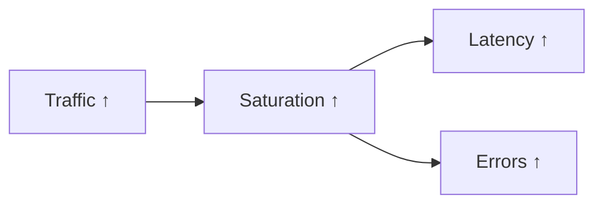

> **대상 독자**: 서비스 용량 계획을 수립하려는 개발자, SRE
> **선수 지식**: [rate와 increase]()
> **이 문서를 읽으면**: 트래픽 패턴을 분석하고 용량 계획에 활용할 수 있습니다

## TL;DR


**핵심 요약:**
- **RPS (Requests Per Second)**: 초당 요청 수
- **Throughput**: 초당 처리량 (바이트, 메시지 등)
- **Concurrent Connections**: 동시 연결 수
- 트래픽 변화는 **다른 신호의 선행 지표**


## 왜 트래픽을 모니터링하는가?



트래픽 증가는 **다른 문제의 선행 지표**입니다.

| 트래픽 변화 | 의미 | 대응 |
|------------|------|------|
| 급격한 증가 | 트래픽 스파이크, 공격 가능성 | 스케일 아웃, 방어 |
| 점진적 증가 | 서비스 성장 | 용량 계획 |
| 급격한 감소 | 장애, 라우팅 문제 | 원인 조사 |
| 비정상 패턴 | 봇 트래픽, 크롤러 | 차단 검토 |

---

## 측정 항목

### 1. RPS (Requests Per Second)

```promql
# 전체 RPS
sum(rate(http_requests_total[5m]))

# 서비스별 RPS
sum by (service) (rate(http_requests_total[5m]))

# 엔드포인트별 RPS
sum by (path) (rate(http_requests_total[5m]))

# 상태 코드별 RPS
sum by (status) (rate(http_requests_total[5m]))
```

### 2. Throughput (처리량)

```promql
# 초당 수신 바이트
sum(rate(http_request_size_bytes_sum[5m]))

# 초당 송신 바이트
sum(rate(http_response_size_bytes_sum[5m]))

# 초당 처리 메시지 (Kafka)
sum(rate(kafka_consumer_records_consumed_total[5m]))
```

### 3. 동시 연결/요청

```promql
# 현재 처리 중인 요청
sum(http_requests_in_progress)

# 활성 연결 수
sum(node_netstat_Tcp_CurrEstab)

# 서비스별 동시 요청
sum by (service) (http_requests_in_progress)
```

---

## 패턴 분석

### 일일 패턴 비교

```promql
# 현재 vs 어제 같은 시간
sum(rate(http_requests_total[5m]))
- sum(rate(http_requests_total[5m] offset 1d))

# 현재 vs 지난주 같은 시간
sum(rate(http_requests_total[5m]))
- sum(rate(http_requests_total[5m] offset 7d))

# 변화율 (%)
(sum(rate(http_requests_total[5m]))
 - sum(rate(http_requests_total[5m] offset 1d)))
/ sum(rate(http_requests_total[5m] offset 1d))
* 100
```

### 시간대별 분석

```promql
# 최근 24시간 평균 RPS
avg_over_time(sum(rate(http_requests_total[5m]))[24h:5m])

# 최근 24시간 최대 RPS
max_over_time(sum(rate(http_requests_total[5m]))[24h:5m])

# 피크 대비 현재 비율
sum(rate(http_requests_total[5m]))
/ max_over_time(sum(rate(http_requests_total[5m]))[24h:5m])
```

### 이상 탐지

```promql
# 평균 대비 표준편차 2배 이상 벗어남
abs(
  sum(rate(http_requests_total[5m]))
  - avg_over_time(sum(rate(http_requests_total[5m]))[24h:5m])
)
> 2 * stddev_over_time(sum(rate(http_requests_total[5m]))[24h:5m])
```

---

## 알림 규칙

### 트래픽 급증

```yaml
groups:
  - name: traffic_alerts
    rules:
      # 평소 대비 2배 이상 급증
      - alert: TrafficSpike
        expr: |
          sum(rate(http_requests_total[5m]))
          > 2 * avg_over_time(sum(rate(http_requests_total[5m]))[1h:5m] offset 5m)
        for: 5m
        labels:
          severity: warning
        annotations:
          summary: "Traffic spike detected"
          description: "Current RPS: {{ $value | humanize }}"
```

### 트래픽 급감

```yaml
      # 평소 대비 50% 이하로 감소
      - alert: TrafficDrop
        expr: |
          sum(rate(http_requests_total[5m]))
          < 0.5 * avg_over_time(sum(rate(http_requests_total[5m]))[1h:5m] offset 5m)
        for: 5m
        labels:
          severity: warning
        annotations:
          summary: "Traffic drop detected"
          description: "Current RPS: {{ $value | humanize }}, expected: {{ printf `avg_over_time(sum(rate(http_requests_total[5m]))[1h:5m] offset 5m)` | query | first | value | humanize }}"
```

### 용량 임계 접근

```yaml
      # 최대 용량의 80% 도달
      - alert: TrafficNearCapacity
        expr: |
          sum(rate(http_requests_total[5m])) > 8000  # 최대 10,000 RPS 가정
        for: 10m
        labels:
          severity: warning
        annotations:
          summary: "Traffic approaching capacity limit"
          description: "Current: {{ $value | humanize }} RPS, Limit: 10,000 RPS"
```

---

## 용량 계획

### 피크 분석

```promql
# 일간 피크 RPS
max_over_time(sum(rate(http_requests_total[5m]))[1d:5m])

# 주간 피크 RPS
max_over_time(sum(rate(http_requests_total[5m]))[7d:5m])

# 피크 시간대 식별 (Grafana에서)
# Time series 그래프로 패턴 확인
```

### 성장률 계산

```promql
# 주간 성장률 (%)
(max_over_time(sum(rate(http_requests_total[5m]))[7d:5m])
 - max_over_time(sum(rate(http_requests_total[5m]))[7d:5m] offset 7d))
/ max_over_time(sum(rate(http_requests_total[5m]))[7d:5m] offset 7d)
* 100

# 월간 성장률
(max_over_time(sum(rate(http_requests_total[5m]))[30d:1h])
 - max_over_time(sum(rate(http_requests_total[5m]))[30d:1h] offset 30d))
/ max_over_time(sum(rate(http_requests_total[5m]))[30d:1h] offset 30d)
* 100
```

### 용량 계획 공식

```
필요 용량 = 현재 피크 × (1 + 성장률)^기간 × 안전 마진(1.5~2)
```

---

## 대시보드 설계

### 권장 패널 구성

```
┌─────────────────────────────────────────────────────┐
│ Stat: Current RPS │ Stat: vs Yesterday │ Stat: Peak │
├─────────────────────────────────────────────────────┤
│ Time Series: RPS 추이 (현재 vs 어제 vs 지난주)        │
├─────────────────────────────────────────────────────┤
│ Bar Chart: 엔드포인트별 트래픽 비율                   │
├─────────────────────────────────────────────────────┤
│ Table: 상위 10개 엔드포인트 RPS                       │
└─────────────────────────────────────────────────────┘
```

### Grafana 쿼리 예시

```promql
# 현재 RPS
sum(rate(http_requests_total[5m]))

# 어제 같은 시간 (비교용)
sum(rate(http_requests_total[5m] offset 1d))

# 엔드포인트별 비율
sum by (path) (rate(http_requests_total[5m]))
/ ignoring(path) sum(rate(http_requests_total[5m]))
* 100
```

---

## Recording Rules

```yaml
groups:
  - name: traffic_rules
    rules:
      # 서비스별 RPS
      - record: service:http_requests:rate5m
        expr: sum by (service) (rate(http_requests_total[5m]))

      # 전체 RPS
      - record: :http_requests:rate5m
        expr: sum(rate(http_requests_total[5m]))

      # 엔드포인트별 RPS
      - record: path:http_requests:rate5m
        expr: sum by (path) (rate(http_requests_total[5m]))

      # 일간 평균 RPS (Recording Rule로 저장하면 장기 분석 용이)
      - record: :http_requests:rate5m:avg24h
        expr: avg_over_time(sum(rate(http_requests_total[5m]))[24h:5m])
```

---

## 핵심 정리

| 지표 | PromQL | 용도 |
|------|--------|------|
| RPS | `sum(rate(http_requests_total[5m]))` | 서비스 부하 |
| Throughput | `sum(rate(http_request_size_bytes_sum[5m]))` | 대역폭 사용 |
| 동시 요청 | `sum(http_requests_in_progress)` | 동시성 |
| 변화율 | 현재 vs offset 비교 | 이상 탐지 |

---

## 다음 단계

| 추천 순서 | 문서 | 배우는 것 |
|----------|------|----------|
| 1 | [Errors]() | 에러율 모니터링 |
| 2 | [Saturation]() | 리소스 한계 |
