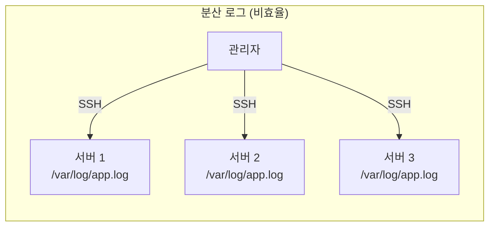
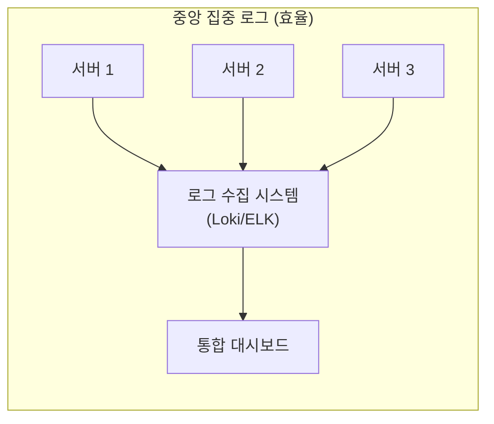
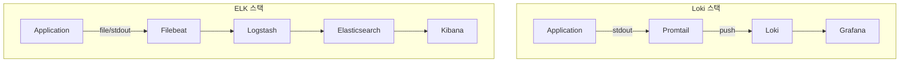
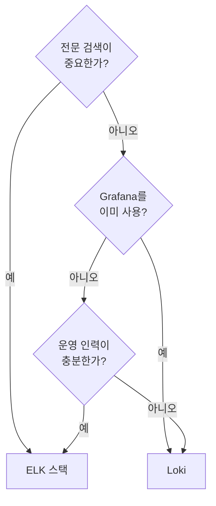
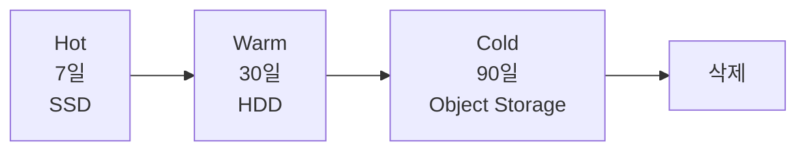

## 전체 비유: 병원 의무 기록 관리

로그 수집을 **병원의 의무 기록 관리 시스템**에 비유하면 이해하기 쉽습니다:

| 병원 의무 기록 비유 | 로그 수집 | 역할 |
|------------------|----------|------|
| 각 병동의 진료 기록 | 분산된 서버 로그 | 개별 위치의 기록 |
| 중앙 의무 기록실 | 로그 수집 시스템 (Loki/ELK) | 통합 저장소 |
| 환자명으로 검색 | 키워드 검색 | 특정 이벤트 찾기 |
| 진료 기록 양식 | 구조화 로그 (JSON) | 표준화된 형식 |
| 진료일지, 처방전, 검사결과 | 로그 레벨 (INFO, ERROR) | 기록 유형 분류 |
| 오래된 기록 창고 이관 | 로그 보관 정책 | Hot → Warm → Cold |
| 환자 차트 번호 | trace_id | 관련 기록 연결 |
| 카드 검색 시스템 (색인) | Elasticsearch 인덱싱 | 빠른 전문 검색 |
| 라벨 기반 분류 | Loki 라벨 인덱싱 | 경량 검색 |

이처럼 병원이 환자 기록을 중앙에서 관리하듯, 로그 수집 시스템은 분산된 로그를 한 곳에서 검색할 수 있게 합니다.

---

> **대상 독자**: 로그 시스템을 설계하려는 개발자, SRE
> **선수 지식**: [관측성 3요소]()
> **소요 시간**: 약 25-30분
> **이 문서를 읽으면**: 로그 수집 시스템을 선택하고 효과적인 로그를 설계할 수 있습니다

## TL;DR


**핵심 요약:**
- **Loki**: 라벨 기반, 경량, Grafana 통합 우수
- **ELK**: 전문 검색 강력, 대규모 분석에 적합
- **구조화 로그**: JSON 형식으로 필드별 검색 용이
- **로그 레벨**: ERROR 이상만 장기 보관 권장


## 왜 로그 수집이 필요한가?

마이크로서비스 환경에서는 애플리케이션이 수십, 수백 개의 컨테이너에서 실행됩니다. 각 컨테이너가 자체 로그 파일을 생성한다면, 장애 발생 시 어떤 서버의 어떤 로그를 봐야 할까요?

**비유: 대형 도서관의 도서 관리**

수백만 권의 책이 있는 도서관을 상상해보세요. 각 책이 제각각 다른 위치에 무질서하게 놓여 있다면, 원하는 책을 찾는 것은 거의 불가능합니다. 하지만 **중앙 데이터베이스**에 모든 책의 위치가 기록되어 있다면, 제목이나 저자만 검색하면 바로 찾을 수 있습니다.

로그 수집도 마찬가지입니다. 분산된 서버의 로그를 **한 곳으로 모아** 검색 가능하게 만들면, "어제 오후 3시에 발생한 결제 오류"를 몇 초 만에 찾을 수 있습니다.

### 중앙 집중식 로그 관리의 장점

| 문제 상황 | 분산 로그 | 중앙 집중 로그 |
|----------|----------|--------------|
| 장애 발생 | 20개 서버를 일일이 SSH 접속 | 한 화면에서 검색 |
| 로그 보관 | 서버 재시작 시 유실 가능 | 영구 저장소에 보관 |
| 상관관계 분석 | 시간 동기화 어려움 | trace_id로 연결 |
| 접근 제어 | 서버별 권한 관리 | 통합 권한 관리 |






**핵심 원칙**: 로그는 **한 곳에서 검색**할 수 있어야 합니다. 장애 대응 시간은 "로그를 찾는 시간"에 비례합니다.


---

## Loki vs ELK 비교

### 아키텍처 비교



### 상세 비교

| 항목 | Loki | ELK |
|------|------|-----|
| **인덱싱** | 라벨만 인덱싱 | 전체 텍스트 인덱싱 |
| **검색** | 라벨 필터 + grep | 전문 검색 (Lucene) |
| **저장 비용** | 낮음 (원본 압축) | 높음 (인덱스 용량) |
| **쿼리 언어** | LogQL | KQL, Lucene |
| **설치 복잡도** | 낮음 | 높음 |
| **Grafana 통합** | 네이티브 | 플러그인 필요 |
| **알림 연동** | Grafana 알림 | Kibana 알림 |

### 선택 가이드



| 상황 | 권장 |
|------|------|
| Grafana 이미 사용 | Loki |
| 전문 검색 필수 | Elasticsearch |
| 저비용 필요 | Loki |
| 대규모 분석 | Elasticsearch |
| 빠른 구축 | Loki |

---

## 구조화 로그 설계

### 비구조화 vs 구조화

```
# ❌ 비구조화 (파싱 어려움)
2026-01-12 10:30:00 ERROR OrderService - Failed to create order for user 123: insufficient stock

# ✅ 구조화 JSON
{
  "timestamp": "2026-01-12T10:30:00Z",
  "level": "ERROR",
  "service": "order-service",
  "message": "Failed to create order",
  "user_id": "123",
  "error": "insufficient stock",
  "trace_id": "abc123def456"
}
```

### 필수 필드

| 필드 | 설명 | 예시 |
|------|------|------|
| `timestamp` | ISO 8601 형식 | `2026-01-12T10:30:00Z` |
| `level` | 로그 레벨 | `INFO`, `ERROR` |
| `service` | 서비스명 | `order-service` |
| `message` | 로그 메시지 | `Order created` |
| `trace_id` | 분산 추적 ID | `abc123def456` |

### 권장 필드

| 필드 | 용도 |
|------|------|
| `user_id` | 사용자별 필터링 |
| `request_id` | 요청별 추적 |
| `duration_ms` | 성능 분석 |
| `error_code` | 에러 분류 |
| `stack_trace` | 디버깅 |

### Spring Boot 설정

```yaml
# application.yml
logging:
  pattern:
    console: '{"timestamp":"%d{ISO8601}","level":"%level","service":"${spring.application.name}","message":"%message","logger":"%logger","thread":"%thread"}%n'

# Logback (logback-spring.xml)
```

```xml
<!-- logback-spring.xml -->
<configuration>
  <appender name="STDOUT" class="ch.qos.logback.core.ConsoleAppender">
    <encoder class="net.logstash.logback.encoder.LogstashEncoder">
      <customFields>{"service":"order-service"}</customFields>
    </encoder>
  </appender>
</configuration>
```

---

## 로그 레벨 전략

### 레벨 정의

| 레벨 | 용도 | 보관 기간 |
|------|------|----------|
| `TRACE` | 상세 디버깅 | 수집 안 함 |
| `DEBUG` | 개발 디버깅 | 1-3일 |
| `INFO` | 정상 동작 | 7-14일 |
| `WARN` | 잠재적 문제 | 30일 |
| `ERROR` | 오류 발생 | 90일+ |

### 환경별 설정

```yaml
# application.yml
spring:
  profiles:
    active: production

---
spring:
  config:
    activate:
      on-profile: development
logging:
  level:
    root: DEBUG
    com.example: TRACE

---
spring:
  config:
    activate:
      on-profile: production
logging:
  level:
    root: INFO
    com.example: INFO
```

---

## Loki 설정

### Promtail 설정

```yaml
# promtail.yml
server:
  http_listen_port: 9080

positions:
  filename: /tmp/positions.yaml

clients:
  - url: http://loki:3100/loki/api/v1/push

scrape_configs:
  - job_name: containers
    static_configs:
      - targets:
          - localhost
        labels:
          job: containerlogs
          __path__: /var/log/containers/*.log

    pipeline_stages:
      - json:
          expressions:
            output: log
            stream: stream
            timestamp: time
      - labels:
          stream:
      - timestamp:
          source: timestamp
          format: RFC3339Nano
      - output:
          source: output
```

### LogQL 쿼리

```logql
# 서비스별 필터
{service="order-service"}

# 레벨 필터
{service="order-service"} |= "ERROR"

# JSON 파싱
{service="order-service"} | json | level="ERROR"

# 정규식
{service="order-service"} |~ "user_id=123"

# 에러 수 집계
sum(count_over_time({service="order-service"} |= "ERROR" [5m]))
```

---

## ELK 설정

### Filebeat 설정

```yaml
# filebeat.yml
filebeat.inputs:
  - type: container
    paths:
      - '/var/lib/docker/containers/*/*.log'
    processors:
      - add_kubernetes_metadata:
          host: ${NODE_NAME}
          matchers:
            - logs_path:
                logs_path: "/var/lib/docker/containers/"

output.logstash:
  hosts: ["logstash:5044"]
```

### Logstash 파이프라인

```ruby
# logstash.conf
input {
  beats {
    port => 5044
  }
}

filter {
  json {
    source => "message"
  }
  date {
    match => ["timestamp", "ISO8601"]
    target => "@timestamp"
  }
  mutate {
    remove_field => ["message"]
  }
}

output {
  elasticsearch {
    hosts => ["elasticsearch:9200"]
    index => "logs-%{[service]}-%{+YYYY.MM.dd}"
  }
}
```

---

## 로그 보관 정책

### 비용 최적화



### Loki 보관 설정

```yaml
# loki.yml
schema_config:
  configs:
    - from: 2026-01-01
      store: boltdb-shipper
      object_store: s3
      schema: v11
      index:
        prefix: loki_index_
        period: 24h

limits_config:
  retention_period: 720h  # 30일

compactor:
  retention_enabled: true
  retention_delete_delay: 2h
```

### Elasticsearch ILM

```json
{
  "policy": {
    "phases": {
      "hot": {
        "actions": {
          "rollover": {
            "max_size": "50GB",
            "max_age": "7d"
          }
        }
      },
      "warm": {
        "min_age": "7d",
        "actions": {
          "shrink": {
            "number_of_shards": 1
          }
        }
      },
      "delete": {
        "min_age": "30d",
        "actions": {
          "delete": {}
        }
      }
    }
  }
}
```

---

## 모범 사례

### DO (권장)

```java
// ✅ 구조화된 컨텍스트 포함
log.info("Order created",
    kv("order_id", orderId),
    kv("user_id", userId),
    kv("amount", amount));

// ✅ 적절한 레벨 사용
log.debug("Processing step completed");
log.error("Failed to process order", exception);
```

### DON'T (비권장)

```java
// ❌ 민감 정보 로깅
log.info("User login: password={}", password);

// ❌ 과도한 로깅
for (item : items) {
    log.info("Processing item: {}", item);  // 10만 건이면?
}

// ❌ 로그에서 예외 삼키기
try { ... } catch (Exception e) {
    log.error("Error");  // 스택 트레이스 없음
}
```

---

## 핵심 정리

| 항목 | Loki | ELK |
|------|------|-----|
| **적합** | 경량, Grafana 통합 | 전문 검색, 대규모 |
| **쿼리** | LogQL | KQL |
| **비용** | 낮음 | 높음 |

**로그 설계 원칙:**
1. JSON 구조화 필수
2. trace_id 포함 (분산 추적 연결)
3. 적절한 레벨 사용
4. 민감 정보 제외

---

## 관련 문서

- [Elasticsearch 데이터 모델링]() - ELK 스택에서 로그 인덱스를 설계할 때 참고할 데이터 모델링 원칙

## 다음 단계

| 추천 순서 | 문서 | 배우는 것 |
|----------|------|----------|
| 1 | [분산 추적](distributed-tracing/) | 로그와 트레이스 연결 |
| 2 | [환경 구성](../examples/setup/) | Loki 실습 |
