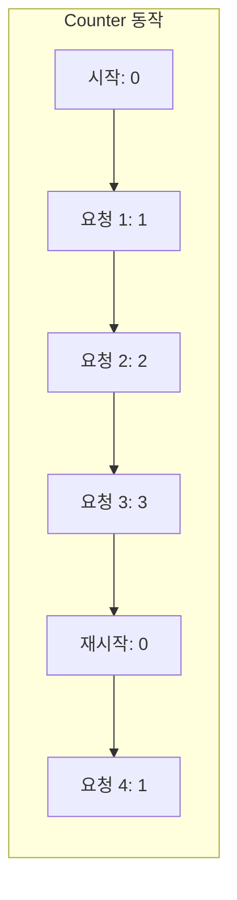
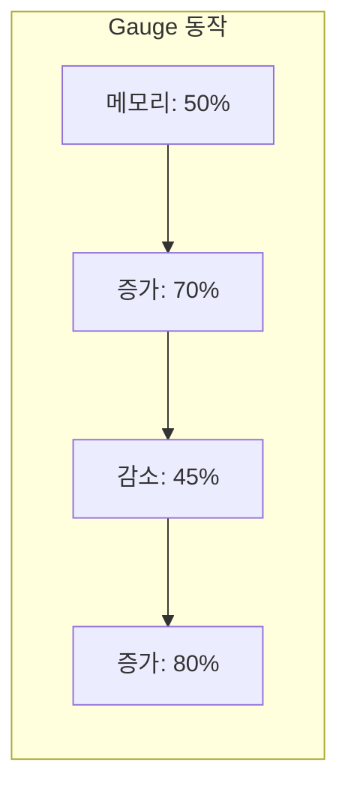
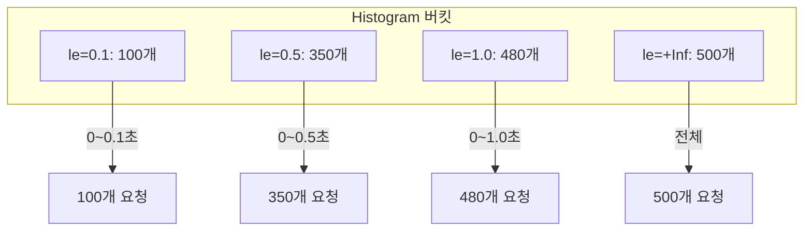
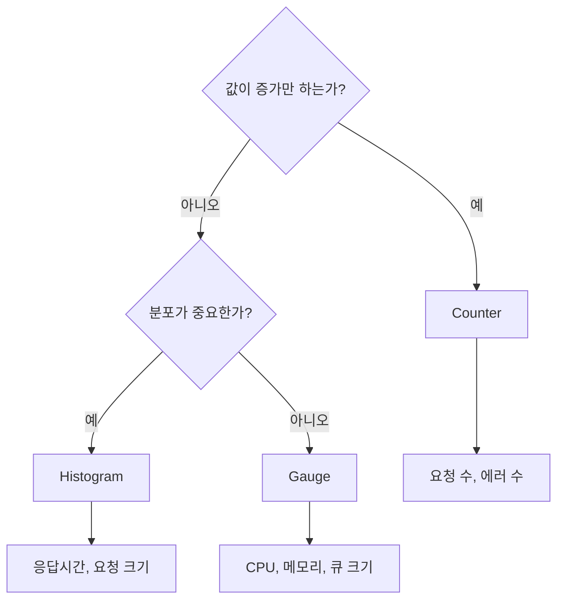

## 전체 비유: 병원 의료 장비

메트릭 타입을 **병원의 의료 장비**에 비유하면 이해하기 쉽습니다:

| 병원 장비 비유 | 메트릭 타입 | 역할 |
|--------------|-----------|------|
| 체온계 | Gauge | 현재 값 측정 (오르내림 가능) |
| 만보기 | Counter | 누적 카운트 (증가만 가능) |
| 혈압 분포 차트 | Histogram | 값의 분포 측정 |
| 체온 37.2도 | Gauge 값 | 현재 상태 |
| 오늘 총 5000보 | Counter 값 | 누적 합계 |
| 환자 80%가 혈압 120 이하 | Percentile | 분포의 백분위 |
| 일일 환자 수 변화 | rate() | 시간당 변화율 |
| 환자 평균 대기시간 | avg() | 집계 연산 |

이처럼 체온계는 "현재 온도"를, 만보기는 "누적 걸음수"를 측정하듯, 메트릭 타입은 데이터의 본질에 맞게 선택해야 합니다.

---

> **대상 독자**: Prometheus 메트릭을 처음 설계하는 개발자
> **선수 지식**: [관측성 3요소](three-pillars/)
> **소요 시간**: 약 25-30분
> **이 문서를 읽으면**: 상황에 맞는 메트릭 타입을 선택하고 올바르게 구현할 수 있습니다

## TL;DR


**핵심 요약:**
- **Counter**: 누적 증가만 (요청 수, 에러 수) → `rate()`로 초당 변화율 계산
- **Gauge**: 현재 값 (온도, 메모리) → 그대로 사용하거나 `avg()`로 평균
- **Histogram**: 분포 측정 (응답시간) → `histogram_quantile()`로 백분위 계산
- **Summary**: 클라이언트에서 백분위 계산 (거의 사용 안 함)


## 왜 메트릭 타입이 중요한가?

메트릭 타입은 단순한 기술적 선택이 아닙니다. **데이터의 본질을 반영**하는 것입니다.

**비유: 온도계 vs 만보기**

- **온도계**는 현재 온도를 보여줍니다. 어제 25도였다가 오늘 30도가 될 수 있습니다 → 이것이 **Gauge**입니다
- **만보기**는 걸음 수를 누적합니다. 어제 5000보, 오늘 3000보를 걸으면 총 8000보입니다 → 이것이 **Counter**입니다

만약 온도를 만보기처럼 "누적"한다면 어떻게 될까요? 아침 20도, 점심 25도, 저녁 18도면 "63도"라는 무의미한 숫자가 됩니다. 반대로 걸음 수를 온도계처럼 "현재 값"으로만 보면 "방금 3보 걸었다"만 알 수 있고, 오늘 총 몇 보 걸었는지 알 수 없습니다.

### 잘못된 선택의 결과

| 잘못된 선택 | 결과 |
|------------|------|
| 요청 수를 Gauge로 | 서버 재시작 시 0으로 리셋, 누적 추적 불가 |
| CPU 사용률을 Counter로 | rate() 적용 시 의미 없는 값 |
| 응답시간을 Counter로 | 평균/백분위 계산 불가 |

---

## Counter (카운터)

### 정의

**단조 증가하는 누적 값**입니다. 오직 증가하거나 0으로 리셋만 가능합니다.

### 왜 Counter가 필요한가?

"오늘 주문이 몇 건 들어왔는가?", "이번 달 에러가 몇 번 발생했는가?" 같은 질문에 답하려면 **누적 데이터**가 필요합니다.

**비유: 자동차 주행거리계**

자동차 주행거리계는 절대 감소하지 않습니다. 10만 km에서 9만 km로 돌아가지 않죠. 대신 "이번 주에 얼마나 달렸는가?"를 알고 싶다면 월요일 주행거리와 일요일 주행거리의 **차이**를 계산합니다.

Counter도 마찬가지입니다. 원시 값(100만 요청)은 큰 의미가 없고, `rate()`나 `increase()`로 **시간당 변화량**을 계산해야 유용합니다.

### 특징



| 특성 | 설명 |
|------|------|
| **단조 증가** | 값이 감소하지 않음 |
| **리셋 가능** | 프로세스 재시작 시 0으로 |
| **rate() 필수** | 원시 값보다 변화율이 의미 있음 |

### 사용 예시

```java
// Spring Boot + Micrometer
@RestController
public class OrderController {
    private final Counter orderCounter;

    public OrderController(MeterRegistry registry) {
        this.orderCounter = Counter.builder("orders_total")
            .description("Total number of orders")
            .tag("status", "created")
            .register(registry);
    }

    @PostMapping("/orders")
    public Order createOrder(@RequestBody OrderRequest request) {
        Order order = orderService.create(request);
        orderCounter.increment();  // 1씩 증가
        return order;
    }
}
```

**메트릭 출력:**
```
orders_total{status="created"} 1523
```

### PromQL 활용

```promql
# 원시 값 (의미 없음 - 누적값일 뿐)
orders_total

# 초당 요청 수 (5분 평균)
rate(orders_total[5m])

# 5분간 총 요청 수
increase(orders_total[5m])

# 시간당 요청 수
increase(orders_total[1h])
```

### 네이밍 규칙

```
# 권장: _total 접미사
http_requests_total
orders_created_total
errors_total

# 비권장
http_requests_count  # _count는 Histogram/Summary 내부용
```

### 언제 사용하는가?

- 요청/이벤트 수
- 에러 발생 횟수
- 처리된 바이트 수
- 완료된 작업 수

---

## Gauge (게이지)

### 정의

**현재 상태 값**입니다. 증가하거나 감소할 수 있습니다.

### 특징



| 특성 | 설명 |
|------|------|
| **양방향** | 증가/감소 모두 가능 |
| **스냅샷** | 특정 시점의 상태 |
| **직접 사용** | rate() 없이 그대로 의미 있음 |

### 사용 예시

```java
// 현재 처리 중인 요청 수
@Component
public class RequestGauge {
    private final AtomicInteger inProgress = new AtomicInteger(0);

    public RequestGauge(MeterRegistry registry) {
        Gauge.builder("http_requests_in_progress", inProgress, AtomicInteger::get)
            .description("Requests currently being processed")
            .register(registry);
    }

    public void requestStarted() {
        inProgress.incrementAndGet();
    }

    public void requestFinished() {
        inProgress.decrementAndGet();
    }
}
```

**메트릭 출력:**
```
http_requests_in_progress 42
```

### PromQL 활용

```promql
# 현재 값
http_requests_in_progress

# 평균 (여러 인스턴스)
avg(http_requests_in_progress)

# 최대값
max(http_requests_in_progress)

# 시간에 따른 변화 (디버깅용)
deriv(http_requests_in_progress[5m])
```

### 언제 사용하는가?

- CPU/메모리 사용률
- 현재 연결 수
- 큐 크기
- 온도, 속도 등 물리적 측정값
- 설정 값 (버전 정보 등)

---

## Histogram (히스토그램)

### 정의

**값의 분포를 버킷(구간)으로 측정**합니다. 응답시간, 요청 크기 등 분포가 중요한 경우 사용합니다.

### 왜 Histogram이 필요한가?

"평균 응답시간 200ms"라는 수치가 좋아 보이지만, 실제로는 99%가 50ms이고 1%가 15초일 수도 있습니다. **평균은 이상치(outlier)에 왜곡**되기 쉽습니다.

**비유: 시험 성적 분포**

학급 평균이 70점이라고 할 때, 두 가지 상황이 가능합니다:
1. 대부분 학생이 65~75점 사이 → 균등한 분포
2. 절반이 40점, 절반이 100점 → 양극화

평균만 보면 두 상황이 같아 보이지만, **분포를 보면 전혀 다릅니다**. Histogram은 "100ms 이하가 80%", "500ms 이하가 95%", "1초 이하가 99%"처럼 분포를 보여줍니다.

이것이 **P50, P95, P99 같은 백분위**가 중요한 이유입니다. P99가 2초라면 "100명 중 1명은 2초 이상 기다린다"는 것을 의미합니다.

### 특징



| 구성 요소 | 설명 |
|----------|------|
| `_bucket` | 각 구간별 누적 카운트 |
| `_count` | 전체 관측 횟수 |
| `_sum` | 모든 값의 합계 |
| `le` (label) | Less than or Equal (이하) |

### 사용 예시

```java
@Component
public class RequestTimer {
    private final Timer requestTimer;

    public RequestTimer(MeterRegistry registry) {
        this.requestTimer = Timer.builder("http_request_duration_seconds")
            .description("HTTP request duration")
            .publishPercentileHistogram()  // Histogram 버킷 생성
            .sla(Duration.ofMillis(100), Duration.ofMillis(500), Duration.ofSeconds(1))
            .register(registry);
    }

    public void recordRequest(Runnable action) {
        requestTimer.record(action);
    }
}
```

**메트릭 출력:**
```
http_request_duration_seconds_bucket{le="0.1"} 100
http_request_duration_seconds_bucket{le="0.5"} 350
http_request_duration_seconds_bucket{le="1.0"} 480
http_request_duration_seconds_bucket{le="+Inf"} 500
http_request_duration_seconds_count 500
http_request_duration_seconds_sum 245.5
```

### PromQL 활용

```promql
# P50 (중앙값)
histogram_quantile(0.50, rate(http_request_duration_seconds_bucket[5m]))

# P95
histogram_quantile(0.95, rate(http_request_duration_seconds_bucket[5m]))

# P99
histogram_quantile(0.99, rate(http_request_duration_seconds_bucket[5m]))

# 평균 응답시간
rate(http_request_duration_seconds_sum[5m])
/ rate(http_request_duration_seconds_count[5m])
```

### 버킷 설계


**버킷 수는 카디널리티에 직접 영향**을 미칩니다. 너무 많은 버킷은 저장 비용을 증가시킵니다.


```java
// 권장: SLA 기준으로 설계
.sla(
    Duration.ofMillis(50),   // 빠른 응답
    Duration.ofMillis(100),  // 목표 SLA
    Duration.ofMillis(250),
    Duration.ofMillis(500),
    Duration.ofSeconds(1),   // 느린 응답 임계
    Duration.ofSeconds(5)    // 타임아웃 근처
)
```

### 언제 사용하는가?

- 응답시간/지연시간
- 요청/응답 크기
- 배치 작업 처리 시간
- 백분위(P50, P95, P99) 계산이 필요한 경우

---

## Summary (서머리)

### 정의

**클라이언트에서 백분위를 미리 계산**합니다. Histogram과 유사하지만 서버 측 집계가 어렵습니다.

### Histogram vs Summary

| 항목 | Histogram | Summary |
|------|-----------|---------|
| **백분위 계산** | 서버(PromQL) | 클라이언트 |
| **집계 가능** | 여러 인스턴스 집계 가능 | 집계 불가 |
| **정확도** | 버킷 경계에 의존 | 정확함 |
| **CPU 사용** | 서버 부담 | 클라이언트 부담 |


**Summary는 거의 사용하지 않습니다.** 여러 인스턴스의 백분위를 합칠 수 없어 분산 환경에 부적합합니다. **Histogram을 권장**합니다.


---

## 타입 선택 가이드



### 빠른 참조표

| 측정 대상 | 타입 | 이유 |
|----------|------|------|
| HTTP 요청 수 | Counter | 누적 증가 |
| HTTP 에러 수 | Counter | 누적 증가 |
| 응답 시간 | Histogram | 분포/백분위 필요 |
| CPU 사용률 | Gauge | 현재 상태 |
| 메모리 사용량 | Gauge | 현재 상태 |
| 활성 연결 수 | Gauge | 증감 가능 |
| 요청 크기 | Histogram | 분포 필요 |
| 큐 대기 항목 | Gauge | 현재 상태 |
| 처리된 바이트 | Counter | 누적 증가 |

---

## 네이밍 컨벤션

### 기본 규칙

```
# 형식
{namespace}_{name}_{unit}_{suffix}

# 예시
http_request_duration_seconds_bucket
process_cpu_seconds_total
node_memory_bytes
```

### 권장 사항

| 항목 | 규칙 | 예시 |
|------|------|------|
| **단위** | 기본 단위 사용 | seconds (not milliseconds) |
| **접미사** | Counter는 `_total` | `http_requests_total` |
| **소문자** | snake_case | `order_created_total` |
| **명확성** | 측정 대상 명시 | `http_request_duration_seconds` |

---

## 실전 예제: Spring Boot 메트릭

```java
@RestController
@RequiredArgsConstructor
public class OrderController {
    private final MeterRegistry registry;

    // Counter: 주문 생성 횟수
    private Counter orderCounter(String status) {
        return Counter.builder("orders_total")
            .tag("status", status)
            .register(registry);
    }

    // Gauge: 현재 처리 중인 주문
    private final AtomicInteger ordersInProgress = new AtomicInteger(0);

    @PostConstruct
    void registerGauge() {
        Gauge.builder("orders_in_progress", ordersInProgress, AtomicInteger::get)
            .register(registry);
    }

    // Histogram: 주문 처리 시간
    private Timer orderTimer() {
        return Timer.builder("order_processing_duration_seconds")
            .publishPercentileHistogram()
            .register(registry);
    }

    @PostMapping("/orders")
    public Order createOrder(@RequestBody OrderRequest request) {
        ordersInProgress.incrementAndGet();
        try {
            return orderTimer().record(() -> {
                Order order = orderService.create(request);
                orderCounter("success").increment();
                return order;
            });
        } catch (Exception e) {
            orderCounter("failed").increment();
            throw e;
        } finally {
            ordersInProgress.decrementAndGet();
        }
    }
}
```

---

## 핵심 정리

| 타입 | 용도 | PromQL | 예시 |
|------|------|--------|------|
| **Counter** | 누적 카운트 | `rate()`, `increase()` | 요청 수 |
| **Gauge** | 현재 상태 | 그대로 사용 | CPU % |
| **Histogram** | 분포 측정 | `histogram_quantile()` | 응답시간 |

---

## 다음 단계

| 추천 순서 | 문서 | 배우는 것 |
|----------|------|----------|
| 1 | [Prometheus 아키텍처](prometheus-architecture/) | Pull 모델, 시계열 DB |
| 2 | [PromQL 기본 문법](promql/syntax-basics/) | 셀렉터, 레이블 매칭 |
| 3 | [rate와 increase](promql/rate-and-increase/) | Counter 활용법 |
