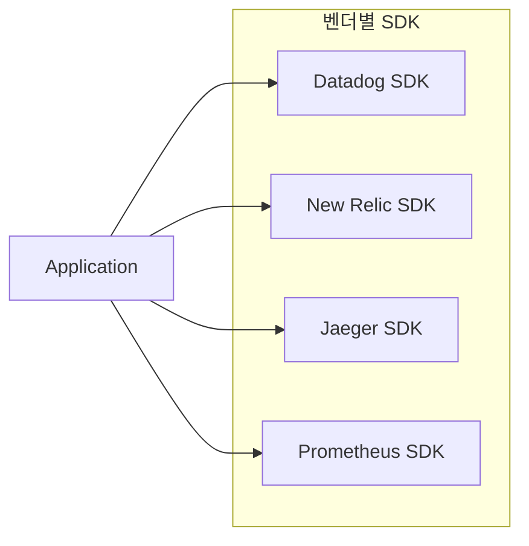
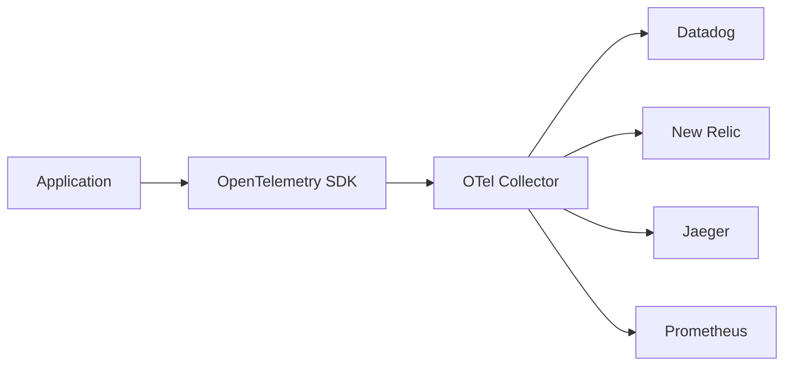
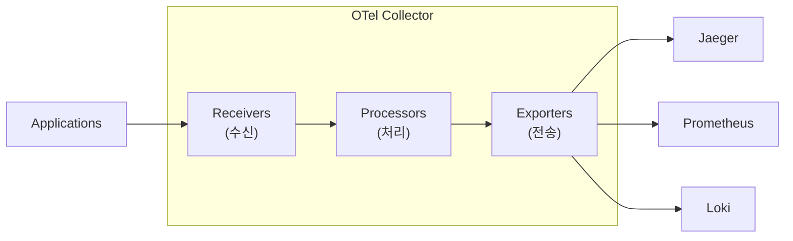
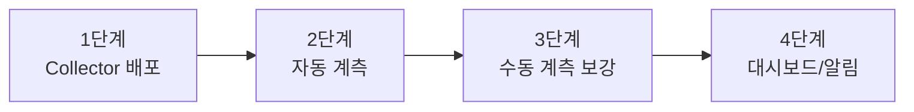

## 전체 비유: 국제 의료 기록 표준

OpenTelemetry를 **국제 의료 기록 표준(HL7/FHIR)**에 비유하면 이해하기 쉽습니다:

| 의료 표준 비유 | OpenTelemetry | 역할 |
|---------------|---------------|------|
| 병원마다 다른 차트 양식 | 벤더별 SDK | 호환 안 되는 형식들 |
| 국제 의료 기록 표준 | OpenTelemetry 표준 | 통일된 데이터 형식 |
| 표준 진료 기록 양식 | Semantic Conventions | 공통 속성 이름 규약 |
| 병원 내 기록 시스템 | OTel SDK | 데이터 수집 |
| 기록 전송 센터 | OTel Collector | 수집/변환/전송 |
| 다양한 EMR 시스템 | 다양한 백엔드 | Jaeger, Prometheus 등 |
| 병원 이전해도 기록 호환 | 벤더 중립성 | 백엔드 변경 용이 |
| 자동 기록 시스템 | Auto-instrumentation | 코드 변경 없이 계측 |

이처럼 국제 표준이 있으면 어느 병원에서도 환자 기록을 읽을 수 있듯, OpenTelemetry는 어떤 백엔드로도 데이터를 보낼 수 있습니다.

---

> **대상 독자**: 관측성 시스템을 표준화하려는 개발자, SRE
> **선수 지식**: [관측성 3요소](three-pillars/), [분산 추적](distributed-tracing/)
> **소요 시간**: 약 25-30분
> **이 문서를 읽으면**: OpenTelemetry를 이해하고 프로젝트에 적용할 수 있습니다

## TL;DR


**핵심 요약:**
- **OpenTelemetry (OTel)**: Metrics, Logs, Traces를 위한 **벤더 중립 표준**
- **구성 요소**: SDK (계측) + Collector (수집/변환/전송)
- **장점**: 벤더 종속성 없음, 한 번 계측으로 여러 백엔드 지원
- **CNCF 프로젝트**: Kubernetes 다음으로 활발한 프로젝트


## OpenTelemetry란?

OpenTelemetry는 **관측성 데이터를 생성, 수집, 전송하기 위한 표준 프레임워크**입니다.

### 이전 상황 (OTel 이전)



**문제점:**
- 벤더마다 다른 SDK
- 벤더 변경 시 코드 수정 필요
- 여러 SDK로 오버헤드 증가

### OTel 도입 후



**장점:**
- 한 번 계측, 여러 백엔드
- 벤더 변경 시 Collector 설정만 수정
- 표준화된 의미론(Semantic Conventions)

---

## 구성 요소

### 1. API & SDK

애플리케이션 코드에서 관측성 데이터를 생성합니다.

```java
// Tracer 생성
Tracer tracer = openTelemetry.getTracer("order-service");

// Span 생성
Span span = tracer.spanBuilder("processOrder").startSpan();
try (Scope scope = span.makeCurrent()) {
    span.setAttribute("order.id", orderId);
    // 비즈니스 로직
} finally {
    span.end();
}
```

### 2. Collector

데이터를 수신, 처리, 전송하는 에이전트입니다.



### 3. Instrumentation

자동/수동 계측 라이브러리입니다.

| 유형 | 설명 | 예시 |
|------|------|------|
| **자동 계측** | 코드 변경 없이 적용 | Java Agent, Python auto-instrumentation |
| **수동 계측** | 코드에서 직접 SDK 호출 | 커스텀 Span 생성 |

---

## Collector 설정

### 기본 구조

```yaml
# otel-collector.yaml
receivers:
  otlp:
    protocols:
      grpc:
        endpoint: 0.0.0.0:4317
      http:
        endpoint: 0.0.0.0:4318

processors:
  batch:
    timeout: 1s
    send_batch_size: 1024
  memory_limiter:
    limit_mib: 512

exporters:
  otlp:
    endpoint: "tempo:4317"
    tls:
      insecure: true
  prometheus:
    endpoint: "0.0.0.0:8889"
  loki:
    endpoint: "http://loki:3100/loki/api/v1/push"

service:
  pipelines:
    traces:
      receivers: [otlp]
      processors: [batch, memory_limiter]
      exporters: [otlp]
    metrics:
      receivers: [otlp]
      processors: [batch]
      exporters: [prometheus]
    logs:
      receivers: [otlp]
      processors: [batch]
      exporters: [loki]
```

### Receivers (수신기)

| Receiver | 용도 |
|----------|------|
| `otlp` | OpenTelemetry Protocol (권장) |
| `jaeger` | Jaeger 형식 |
| `zipkin` | Zipkin 형식 |
| `prometheus` | Prometheus scrape |

### Processors (처리기)

| Processor | 용도 |
|-----------|------|
| `batch` | 배치 전송으로 효율화 |
| `memory_limiter` | 메모리 제한 |
| `filter` | 불필요한 데이터 제거 |
| `attributes` | 속성 추가/수정/삭제 |
| `tail_sampling` | 조건부 샘플링 |

### Exporters (전송기)

| Exporter | 대상 |
|----------|------|
| `otlp` | OTLP 지원 백엔드 (Tempo, Jaeger) |
| `prometheus` | Prometheus |
| `loki` | Grafana Loki |
| `datadog` | Datadog |

---

## Spring Boot 통합

### 의존성

```kotlin
// build.gradle.kts
dependencies {
    // Tracing
    implementation("io.micrometer:micrometer-tracing-bridge-otel")
    implementation("io.opentelemetry:opentelemetry-exporter-otlp")

    // Metrics
    implementation("io.micrometer:micrometer-registry-otlp")

    // 자동 계측 (옵션)
    runtimeOnly("io.opentelemetry.instrumentation:opentelemetry-spring-boot-starter")
}
```

### application.yml

```yaml
spring:
  application:
    name: order-service

management:
  otlp:
    tracing:
      endpoint: http://otel-collector:4318/v1/traces
    metrics:
      export:
        endpoint: http://otel-collector:4318/v1/metrics
        step: 30s
  tracing:
    sampling:
      probability: 0.1  # 10% 샘플링

logging:
  pattern:
    level: "%5p [${spring.application.name},%X{traceId:-},%X{spanId:-}]"
```

### 수동 계측 예시

```java
@Service
@RequiredArgsConstructor
public class OrderService {
    private final Tracer tracer;
    private final MeterRegistry meterRegistry;

    public Order createOrder(OrderRequest request) {
        // Span 생성
        Span span = tracer.nextSpan()
            .name("createOrder")
            .tag("order.type", request.getType())
            .start();

        try (Tracer.SpanInScope ws = tracer.withSpan(span)) {
            // 메트릭 기록
            Timer.Sample sample = Timer.start(meterRegistry);

            Order order = processOrder(request);

            sample.stop(Timer.builder("order.creation.time")
                .tag("type", request.getType())
                .register(meterRegistry));

            span.event("Order created successfully");
            return order;

        } catch (Exception e) {
            span.error(e);
            throw e;
        } finally {
            span.end();
        }
    }
}
```

---

## Java Agent (자동 계측)

코드 변경 없이 자동으로 계측합니다.

### 실행

```bash
java -javaagent:opentelemetry-javaagent.jar \
     -Dotel.service.name=order-service \
     -Dotel.exporter.otlp.endpoint=http://otel-collector:4317 \
     -Dotel.traces.sampler=parentbased_traceidratio \
     -Dotel.traces.sampler.arg=0.1 \
     -jar app.jar
```

### Docker 설정

```dockerfile
FROM eclipse-temurin:17-jre

ADD https://github.com/open-telemetry/opentelemetry-java-instrumentation/releases/latest/download/opentelemetry-javaagent.jar /app/opentelemetry-javaagent.jar

ENV JAVA_TOOL_OPTIONS="-javaagent:/app/opentelemetry-javaagent.jar"
ENV OTEL_SERVICE_NAME="order-service"
ENV OTEL_EXPORTER_OTLP_ENDPOINT="http://otel-collector:4317"

COPY app.jar /app/app.jar
CMD ["java", "-jar", "/app/app.jar"]
```

### 자동 계측 범위

| 카테고리 | 라이브러리 |
|----------|----------|
| HTTP | Spring MVC, JAX-RS, Servlet |
| 데이터베이스 | JDBC, Hibernate, MyBatis |
| 메시징 | Kafka, RabbitMQ |
| 캐시 | Redis, Memcached |
| HTTP 클라이언트 | RestTemplate, WebClient, OkHttp |

---

## Semantic Conventions

표준화된 속성 이름으로 일관성을 보장합니다.

### HTTP

| 속성 | 설명 |
|------|------|
| `http.method` | GET, POST 등 |
| `http.status_code` | 200, 500 등 |
| `http.url` | 요청 URL |
| `http.route` | `/users/{id}` |

### 데이터베이스

| 속성 | 설명 |
|------|------|
| `db.system` | postgresql, mysql |
| `db.name` | 데이터베이스명 |
| `db.operation` | SELECT, INSERT |
| `db.statement` | SQL 쿼리 |

### 메시징

| 속성 | 설명 |
|------|------|
| `messaging.system` | kafka, rabbitmq |
| `messaging.destination` | 토픽/큐 이름 |
| `messaging.operation` | send, receive |

---

## 도입 전략

### 단계별 접근



1. **Collector 배포**: 데이터 수집 인프라 구축
2. **자동 계측**: Java Agent로 빠르게 시작
3. **수동 계측 보강**: 비즈니스 로직 커스텀 Span
4. **대시보드/알림**: Grafana 연동

### 마이그레이션 경로

| 현재 상황 | 마이그레이션 |
|----------|-------------|
| Jaeger SDK | OTel SDK + Jaeger Exporter |
| Prometheus 직접 노출 | OTel + Prometheus Exporter |
| 벤더 SDK | OTel SDK + 벤더 Exporter |

---

## 핵심 정리

| 구성요소 | 역할 |
|----------|------|
| **SDK** | 애플리케이션 계측 |
| **Collector** | 수집/변환/전송 |
| **OTLP** | 표준 프로토콜 |
| **Auto-instrumentation** | 코드 변경 없는 계측 |

**도입 장점:**
- 벤더 종속성 제거
- 표준화된 의미론
- 유연한 백엔드 선택
- 활발한 커뮤니티

---

## 다음 단계

| 추천 순서 | 문서 | 배우는 것 |
|----------|------|----------|
| 1 | [대시보드 설계](dashboard-design/) | 시각화 |
| 2 | [풀스택 예제](../examples/full-stack/) | 통합 실습 |
