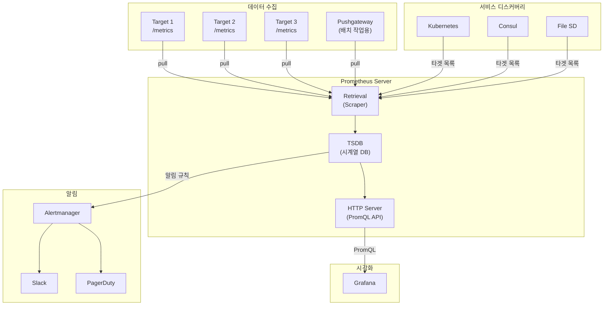
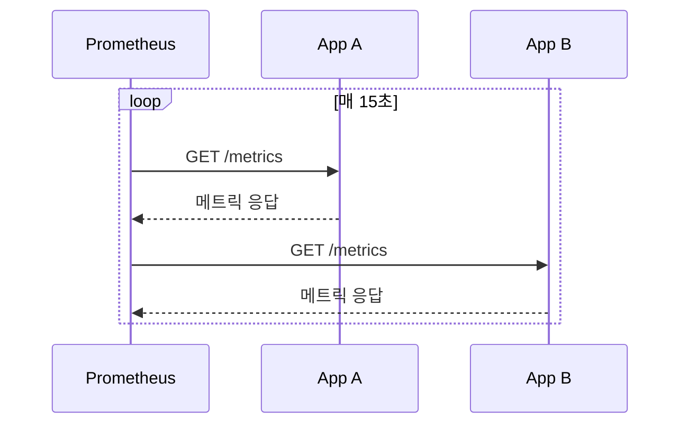
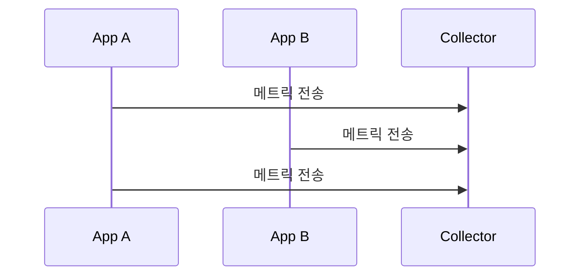
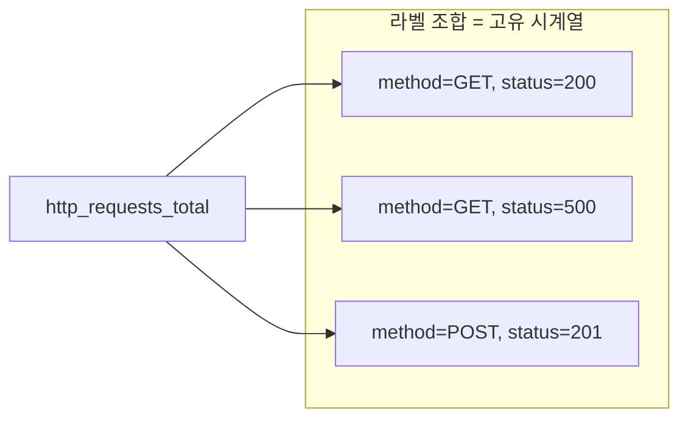
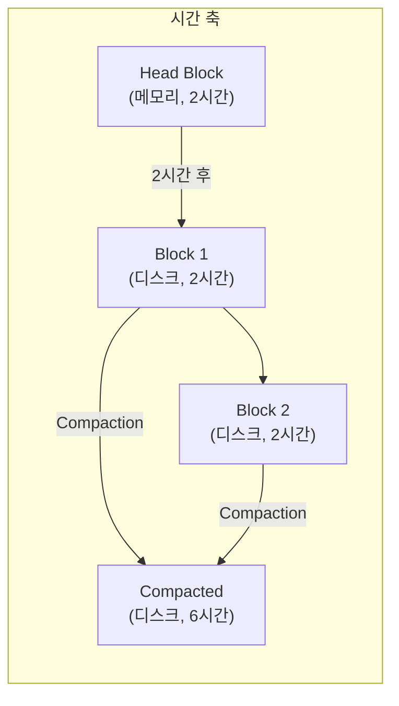
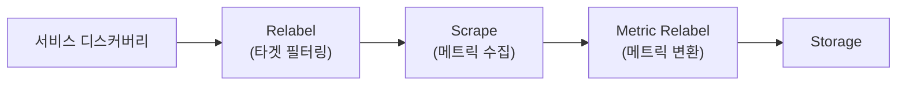
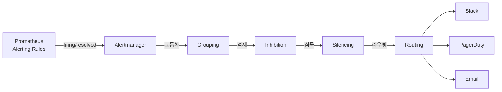
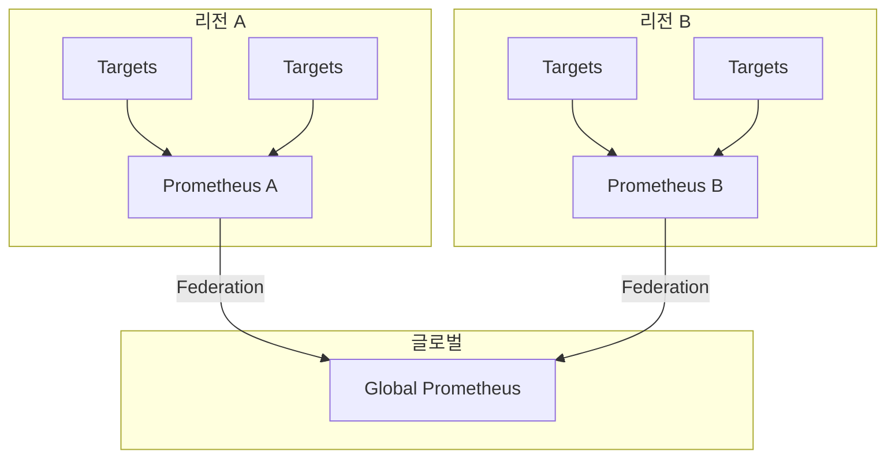

## 전체 비유: 정기 건강검진 시스템

Prometheus 아키텍처를 **병원의 정기 건강검진 시스템**에 비유하면 이해하기 쉽습니다:

| 건강검진 비유 | Prometheus 구성요소 | 역할 |
|--------------|-------------------|------|
| 정기 건강검진 일정 | Pull 모델 | 정해진 주기로 상태 확인 |
| 건강검진 센터 | Prometheus Server | 데이터 수집/저장 |
| 환자 명부 (자동 갱신) | 서비스 디스커버리 | 모니터링 대상 자동 발견 |
| 검진 결과 DB | TSDB (시계열 DB) | 시간별 데이터 저장 |
| 직원 건강검진 (회사 방문) | Scrape | 타겟에서 메트릭 수집 |
| 외래 환자 접수 | Pushgateway | 짧은 작업의 메트릭 저장 |
| 이상 수치 알림 | Alertmanager | 문제 발생 시 알림 |
| 검진 결과 분류/정리 | Relabeling | 라벨 변환 및 필터링 |

이처럼 정기 건강검진에서 의사가 환자를 찾아가듯, Prometheus는 타겟을 주기적으로 방문하여 상태를 확인합니다.

---

> **대상 독자**: Prometheus를 운영하거나 깊이 이해하고 싶은 개발자
> **선수 지식**: [메트릭 기초]()
> **이 문서를 읽으면**: Prometheus의 설계 철학과 구성 요소를 이해하고 운영 전략을 수립할 수 있습니다

## TL;DR


**핵심 요약:**
- **Pull 모델**: Prometheus가 타겟에서 메트릭을 가져옴 (Push가 아님)
- **시계열 DB**: 라벨 기반 다차원 데이터 모델
- **서비스 디스커버리**: Kubernetes, Consul 등과 연동하여 타겟 자동 발견
- **단일 서버 설계**: 수평 확장보다 단일 서버 최적화 (Federation으로 확장)


## Prometheus 전체 구조



---

## 왜 Pull 모델인가?

### 모니터링의 두 가지 철학

메트릭을 수집하는 방식에는 크게 두 가지 철학이 있습니다.

1. **Push 모델**: "애플리케이션이 메트릭을 보낸다" (Datadog, StatsD, CloudWatch)
2. **Pull 모델**: "모니터링 시스템이 메트릭을 가져온다" (Prometheus)

Prometheus는 **Pull 모델**을 선택했습니다. 이 선택에는 깊은 설계 철학이 담겨 있습니다.

### 비유: 건강검진 vs 자가진단

**Push 모델**은 **자가진단**과 같습니다. 아플 때 환자가 직접 병원에 연락합니다. 하지만 무의식 상태라면? 연락할 수 없습니다. 또한 100명의 환자가 동시에 전화하면 병원 전화선이 마비됩니다.

**Pull 모델**은 **정기 건강검진**과 같습니다. 의사가 정해진 시간에 환자를 찾아가서 상태를 확인합니다. 환자가 의식이 없어도 문제를 발견할 수 있고, 의사가 방문 일정을 조율하므로 병원이 과부하되지 않습니다.

Prometheus는 "정기 건강검진"처럼 모든 타겟을 주기적으로 방문(scrape)하여 상태를 확인합니다. 타겟이 응답하지 않으면 그 자체가 **"문제가 발생했다"**는 신호입니다.

### Pull 모델이 해결하는 문제

#### 1. 헬스체크의 자동화

Push 모델에서는 "애플리케이션이 메트릭을 보내지 않는다"와 "애플리케이션이 죽었다"를 구분하기 어렵습니다. 네트워크 문제일 수도, 버그일 수도, 실제 장애일 수도 있습니다.

Pull 모델에서는 **스크래핑 실패 = 타겟 다운**입니다. Prometheus가 `/metrics`에 접근했는데 응답이 없으면, 그것이 곧 장애 신호입니다. 별도의 헬스체크 시스템이 필요 없습니다.

#### 2. 중앙 집중식 제어

Push 모델에서 수집 주기를 변경하려면 **모든 애플리케이션의 설정**을 변경해야 합니다. 100개의 서비스가 있다면 100개를 수정해야 합니다.

Pull 모델에서는 **Prometheus 설정 파일 하나**만 수정하면 됩니다. 어떤 타겟을, 얼마나 자주, 어떤 라벨로 수집할지 모두 중앙에서 관리합니다.

#### 3. 디버깅의 용이성

`/metrics` 엔드포인트는 HTTP GET 요청으로 접근할 수 있습니다. 브라우저에서 `http://your-app:8080/metrics`를 열면 현재 메트릭 상태를 **즉시 확인**할 수 있습니다.

Push 모델에서는 애플리케이션이 어떤 메트릭을 보내는지 확인하려면 네트워크 패킷을 캡처하거나 수집 서버 로그를 확인해야 합니다.

---

## Pull vs Push 트레이드오프

### Pull 모델 (Prometheus 방식)



**Prometheus가 타겟을 찾아가서 메트릭을 수집합니다.**

### Push 모델 (Datadog, StatsD 방식)



**애플리케이션이 수집 서버로 메트릭을 보냅니다.**

### 상세 비교

| 관점 | Pull 모델 | Push 모델 |
|------|-----------|-----------|
| **헬스체크** | 내장 (스크래핑 실패 = 다운) | 별도 구현 필요 |
| **설정 변경** | 중앙에서 일괄 변경 | 각 애플리케이션 수정 필요 |
| **디버깅** | 브라우저로 `/metrics` 확인 | 네트워크 캡처 필요 |
| **방화벽** | 타겟이 인바운드 허용 | 수집 서버가 인바운드 허용 |
| **짧은 수명 작업** | Pushgateway 필요 | 자연스럽게 지원 |
| **동적 환경** | 서비스 디스커버리 필요 | 자동 등록 가능 |
| **대역폭 제어** | Prometheus가 조절 | 애플리케이션별 조절 필요 |

### Pull 모델의 한계와 해결책

| 상황 | 문제점 | 해결책 |
|------|--------|--------|
| **짧은 수명 작업** (배치, 크론잡) | 작업이 끝나면 스크래핑 불가 | Pushgateway로 메트릭 임시 저장 |
| **방화벽 뒤 타겟** | Prometheus가 접근 불가 | Reverse Proxy 또는 VPN |
| **NAT/사설 네트워크** | 타겟 IP 접근 불가 | 서비스 메시(Istio), Agent 모드 |
| **대규모 환경** | 단일 Prometheus 한계 | Federation, Remote Write |


**Push가 더 적합한 경우:**
- 배치 작업이 대부분인 환경
- 애플리케이션이 방화벽 뒤에 있고 변경이 어려운 경우
- 이벤트 기반 메트릭 (발생 즉시 전송 필요)

이런 경우에는 Pushgateway를 사용하거나, Push 기반 솔루션(Datadog, CloudWatch)을 고려하세요.


---

## 시계열 데이터 모델

### 왜 시계열 데이터베이스인가?

일반적인 관계형 데이터베이스(MySQL, PostgreSQL)로 메트릭을 저장할 수 있을까요? 가능은 하지만, **매우 비효율적**입니다.

**비유: 일기장 vs 엑셀 시트**

메트릭 데이터는 **일기장**과 비슷합니다. 매일 같은 형식으로 기록하고, 시간순으로 정렬되며, 과거 데이터는 거의 수정하지 않습니다. 일기장을 데이터베이스 테이블에 저장한다면? 검색은 되지만, "지난 일주일간의 기분 변화 추이"를 분석하기에는 최적화되어 있지 않습니다.

시계열 데이터베이스(TSDB)는 **시간 축 데이터에 최적화**된 저장소입니다:

| 특성 | 관계형 DB | 시계열 DB |
|------|----------|-----------|
| **쓰기 패턴** | 무작위 위치 | 항상 최신 데이터 추가 |
| **읽기 패턴** | 개별 레코드 | 시간 범위 조회 |
| **압축** | 일반적 | 시간 축 특화 (Delta, Gorilla) |
| **인덱스** | B-Tree | 시간 + 라벨 역인덱스 |

Prometheus TSDB는 초당 수십만 개의 샘플을 처리하면서도 디스크 사용량을 최소화합니다. 이것이 별도의 시계열 DB를 사용하는 이유입니다.

### 시계열이란?

```
메트릭명{라벨1="값1", 라벨2="값2"} 값 @타임스탬프
```

**예시:**
```
http_requests_total{method="GET", status="200", path="/api/orders"} 1523 @1704700800
http_requests_total{method="POST", status="201", path="/api/orders"} 342 @1704700800
http_requests_total{method="GET", status="500", path="/api/orders"} 12 @1704700800
```

### 다차원 데이터 모델



각 **라벨 조합**이 별도의 시계열을 생성합니다.

### 카디널리티 주의


**카디널리티(Cardinality)**는 고유한 시계열 수입니다. 라벨 값이 다양할수록 시계열 수가 폭발적으로 증가합니다.

```
# 위험한 라벨
http_requests_total{user_id="..."}  # 사용자 수만큼 시계열
http_requests_total{request_id="..."} # 요청마다 새 시계열

# 안전한 라벨
http_requests_total{method="GET", status="200"} # 조합 수 제한적
```


---

## TSDB (시계열 데이터베이스)

### 왜 블록 구조인가?

Prometheus TSDB는 데이터를 **2시간 단위 블록**으로 저장합니다. 왜 이런 구조를 선택했을까요?

**비유: 도서관 서고 관리**

도서관에서 책을 관리한다고 생각해보세요.

- **방법 1**: 모든 책을 한 곳에 보관하고, 새 책이 들어올 때마다 정렬 (= 단일 파일)
  - 문제: 책이 많아지면 정렬 시간이 기하급수적으로 증가
- **방법 2**: 연도별로 서고를 분리하고, 오래된 서고는 잠금 (= 블록 구조)
  - 장점: 새 책은 "올해 서고"에만 추가, 오래된 서고는 건드리지 않음

Prometheus도 마찬가지입니다:

| 구조적 선택 | 이유 |
|------------|------|
| **2시간 블록** | 메모리와 디스크 효율의 균형점 |
| **불변 블록** | 한번 생성된 블록은 수정하지 않아 동시성 문제 없음 |
| **WAL** | 메모리 데이터 손실 방지 (장애 복구용) |
| **Compaction** | 오래된 블록 병합으로 파일 수 관리 |

### 저장 구조

```
data/
├── 01BKGV7JBM69T2G1BGBGM6KB12/  # 블록 (2시간 단위)
│   ├── meta.json
│   ├── index                      # 라벨 인덱스
│   ├── chunks/                    # 실제 데이터
│   └── tombstones                 # 삭제 마커
├── 01BKGTZQ1SYQJTR4PB43C8PD98/
├── chunks_head/                    # WAL (Write-Ahead Log)
└── wal/
```

### 블록 구조



| 구성 요소 | 역할 |
|----------|------|
| **Head Block** | 최근 2시간 데이터, 메모리 상주 |
| **WAL** | 장애 복구용 로그 |
| **Block** | 2시간 단위 불변 데이터 |
| **Compaction** | 오래된 블록 병합, 용량 최적화 |

### 보존 설정

```yaml
# prometheus.yml
storage:
  tsdb:
    retention.time: 15d      # 시간 기준 보존
    retention.size: 50GB     # 용량 기준 보존 (먼저 도달하면 삭제)
```

---

## 서비스 디스커버리

### 왜 서비스 디스커버리가 필요한가?

전통적인 인프라에서는 서버 IP가 고정되어 있었습니다. `192.168.1.100`에 웹 서버, `192.168.1.101`에 데이터베이스를 설치하고, 그 주소를 설정 파일에 적어두면 끝이었습니다.

하지만 **클라우드와 컨테이너 환경**에서는 상황이 다릅니다:

- Kubernetes Pod는 죽으면 **새로운 IP**로 재생성됩니다
- Auto Scaling으로 서버가 **동적으로 늘어나고 줄어듭니다**
- 배포할 때마다 컨테이너 IP가 **변경**됩니다

**비유: 회사 전화번호부**

예전에는 직원 전화번호를 종이 전화번호부에 적어뒀습니다. 직원이 100명이고 거의 변하지 않으니 가능했습니다. 하지만 직원이 1000명이고 매주 입사/퇴사가 일어난다면? 종이 전화번호부는 항상 outdated 상태가 됩니다.

이럴 때는 **회사 인트라넷 전화번호부**가 필요합니다. HR 시스템과 연동되어 입사하면 자동 등록, 퇴사하면 자동 삭제됩니다. 검색하면 항상 최신 정보가 나옵니다.

서비스 디스커버리는 Prometheus의 **인트라넷 전화번호부**입니다. Kubernetes API, Consul, AWS EC2 API 등과 연동하여 **현재 실행 중인 타겟 목록**을 자동으로 유지합니다.

### 정적 설정

작은 환경이나 테스트용으로는 정적 설정도 가능합니다.

```yaml
scrape_configs:
  - job_name: 'static-targets'
    static_configs:
      - targets:
        - 'server1:9090'
        - 'server2:9090'
        - 'server3:9090'
```

### Kubernetes 연동

```yaml
scrape_configs:
  - job_name: 'kubernetes-pods'
    kubernetes_sd_configs:
      - role: pod
    relabel_configs:
      # prometheus.io/scrape: "true" 어노테이션이 있는 Pod만
      - source_labels: [__meta_kubernetes_pod_annotation_prometheus_io_scrape]
        action: keep
        regex: true
      # prometheus.io/path 어노테이션으로 경로 지정
      - source_labels: [__meta_kubernetes_pod_annotation_prometheus_io_path]
        action: replace
        target_label: __metrics_path__
        regex: (.+)
      # prometheus.io/port 어노테이션으로 포트 지정
      - source_labels: [__address__, __meta_kubernetes_pod_annotation_prometheus_io_port]
        action: replace
        regex: ([^:]+)(?::\d+)?;(\d+)
        replacement: $1:$2
        target_label: __address__
```

**Pod 어노테이션 예시:**
```yaml
apiVersion: v1
kind: Pod
metadata:
  annotations:
    prometheus.io/scrape: "true"
    prometheus.io/port: "8080"
    prometheus.io/path: "/actuator/prometheus"
```

### 지원하는 서비스 디스커버리

| SD 타입 | 용도 |
|---------|------|
| `kubernetes_sd` | Kubernetes Pod, Service, Node |
| `consul_sd` | Consul 서비스 카탈로그 |
| `ec2_sd` | AWS EC2 인스턴스 |
| `azure_sd` | Azure 가상 머신 |
| `file_sd` | JSON/YAML 파일 기반 |
| `dns_sd` | DNS SRV 레코드 |

---

## Relabeling

### 왜 Relabeling이 필요한가?

서비스 디스커버리는 **모든 타겟**을 발견합니다. Kubernetes SD를 사용하면 클러스터의 모든 Pod가 목록에 포함됩니다. 하지만 모든 Pod를 모니터링해야 할까요?

- `kube-system` 네임스페이스의 시스템 Pod는 별도 모니터링 필요
- 메트릭을 노출하지 않는 Pod는 스크래핑 불필요
- 개발 환경과 프로덕션 환경을 구분해야 함

**비유: 우편물 분류 센터**

우편물 분류 센터에서는 모든 우편물을 받지만, 배송 전에 **필터링과 라벨링**을 합니다:
- 주소가 불완전한 우편물은 **반송** (= `drop` 액션)
- 특정 지역만 **배송** (= `keep` 액션)
- 구 주소를 신 주소로 **변환** (= `replace` 액션)

Relabeling은 Prometheus의 **우편물 분류 시스템**입니다. 스크래핑 전에 타겟을 필터링하고, 라벨을 변환하여 **원하는 데이터만 깔끔하게** 저장합니다.

### 동작 시점



### 주요 액션

| 액션 | 설명 | 예시 |
|------|------|------|
| `keep` | 조건에 맞는 타겟만 유지 | 특정 네임스페이스만 |
| `drop` | 조건에 맞는 타겟 제외 | 시스템 Pod 제외 |
| `replace` | 라벨 값 변환 | 경로 추출 |
| `labelmap` | 라벨 이름 변환 | `__meta_*` → 일반 라벨 |
| `labeldrop` | 라벨 삭제 | 불필요한 라벨 제거 |

### 예시: 네임스페이스별 필터링

```yaml
relabel_configs:
  # production 네임스페이스만 수집
  - source_labels: [__meta_kubernetes_namespace]
    action: keep
    regex: production

  # namespace 라벨로 저장
  - source_labels: [__meta_kubernetes_namespace]
    target_label: namespace
```

---

## Alertmanager 연동

### 왜 Alertmanager가 필요한가?

Prometheus 자체에도 알림 규칙(Alerting Rules)이 있습니다. 그런데 왜 별도의 Alertmanager가 필요할까요?

Prometheus의 알림 규칙은 **"언제 알림을 발생시킬지"**만 결정합니다. 하지만 실제 운영에서는 더 복잡한 요구사항이 있습니다:

- 같은 유형의 알림 100개가 동시에 발생하면? **그룹화**가 필요
- DB 서버가 다운됐는데 관련 애플리케이션 알림도 계속 오면? **억제(Inhibition)**가 필요
- 배포 중에 일시적 에러 알림을 무시하고 싶다면? **침묵(Silencing)**이 필요
- 심각도에 따라 Slack/PagerDuty를 구분하려면? **라우팅**이 필요

**비유: 119 신고 접수 센터**

화재 신고가 들어오면 119 상황실에서는 단순히 신고를 전달하지 않습니다:

1. **그룹화**: 같은 건물에서 10통의 신고가 오면 → 1건의 출동 명령
2. **억제**: 해당 지역에 이미 소방차가 출동 중이면 → 추가 출동 보류
3. **침묵**: 훈련 기간에는 특정 구역 신고 무시
4. **라우팅**: 화재는 소방차, 구급은 앰뷸런스, 구조는 특수대 → 담당 부서로 전달

Alertmanager는 **119 상황실**과 같습니다. 원시 알림을 받아서 **현명하게 처리**한 후 적절한 채널로 전달합니다.

### 알림 흐름



### Prometheus 알림 규칙

```yaml
# prometheus/rules/alerts.yml
groups:
  - name: availability
    rules:
      - alert: ServiceDown
        expr: up == 0
        for: 5m
        labels:
          severity: critical
        annotations:
          summary: "{{ $labels.instance }} is down"
          description: "{{ $labels.job }} has been down for more than 5 minutes"
```

### Alertmanager 설정

```yaml
# alertmanager.yml
global:
  resolve_timeout: 5m

route:
  receiver: 'default'
  group_by: ['alertname', 'job']
  group_wait: 30s
  group_interval: 5m
  repeat_interval: 4h
  routes:
    - match:
        severity: critical
      receiver: 'pagerduty'
    - match:
        severity: warning
      receiver: 'slack'

receivers:
  - name: 'default'
    webhook_configs:
      - url: 'http://alertmanager-webhook:5001/'

  - name: 'slack'
    slack_configs:
      - api_url: 'https://hooks.slack.com/services/...'
        channel: '#alerts'

  - name: 'pagerduty'
    pagerduty_configs:
      - service_key: '<key>'
```

---

## 확장 전략

### 왜 확장 전략이 필요한가?

Prometheus는 의도적으로 **단일 서버 설계**를 선택했습니다. 분산 시스템의 복잡성을 피하고, 단일 서버에서 최대 성능을 뽑아내는 것이 목표입니다.

하지만 현실에서는 한계가 있습니다:

| 상황 | 단일 Prometheus 한계 |
|------|---------------------|
| 시계열 수백만 개 | 메모리/CPU 부족 |
| 글로벌 멀티 리전 | 네트워크 지연, 단일 장애점 |
| 장기 보존 (1년+) | 디스크 비용 급증 |
| 팀별 독립 운영 | 설정 충돌, 권한 관리 어려움 |

**비유: 도시의 소방서 배치**

작은 마을에서는 소방서 하나로 충분합니다. 하지만 대도시가 되면?

- **지역별 소방서**: 각 구역에 소방서를 배치하고, 본부에서 전체 현황 파악 (= Federation)
- **전문 소방서**: 산불 전담, 화학 전담 등 역할 분리 (= Sharding)
- **기록 보관소**: 과거 출동 기록을 별도 보관소에 저장 (= Remote Storage)

Prometheus도 규모에 따라 **계층화, 분할, 외부 저장소** 전략을 조합하여 확장합니다.

### Federation (계층 구조)



```yaml
# Global Prometheus 설정
scrape_configs:
  - job_name: 'federation'
    honor_labels: true
    metrics_path: '/federate'
    params:
      'match[]':
        - '{job=~".+"}'
    static_configs:
      - targets:
        - 'prometheus-a:9090'
        - 'prometheus-b:9090'
```

### 원격 저장소

장기 보존이 필요하면 원격 저장소를 사용합니다.

```yaml
remote_write:
  - url: "http://victoriametrics:8428/api/v1/write"

remote_read:
  - url: "http://victoriametrics:8428/api/v1/read"
```

| 원격 저장소 | 특징 |
|------------|------|
| Thanos | 오브젝트 스토리지 기반, 글로벌 뷰 |
| Cortex | 멀티 테넌트, 수평 확장 |
| VictoriaMetrics | 고성능, 단순한 운영 |
| Mimir | Grafana Labs, Cortex 후속 |

---

## 운영 권장사항

### 리소스 가이드라인

| 시계열 수 | RAM | CPU | 디스크 |
|----------|-----|-----|--------|
| 100K | 2GB | 1 core | 10GB |
| 1M | 8GB | 2 cores | 100GB |
| 10M | 32GB | 8 cores | 1TB |

### 성능 최적화

```yaml
# prometheus.yml
global:
  scrape_interval: 30s     # 기본 15s → 30s (부하 감소)
  evaluation_interval: 30s

scrape_configs:
  - job_name: 'high-priority'
    scrape_interval: 15s   # 중요 타겟은 더 자주

  - job_name: 'low-priority'
    scrape_interval: 60s   # 덜 중요한 타겟
```

### 모니터링해야 할 메트릭

```promql
# 스크래핑 성능
rate(prometheus_target_scrape_pool_sync_total[5m])

# TSDB 상태
prometheus_tsdb_head_series  # 활성 시계열 수
prometheus_tsdb_head_chunks  # 청크 수

# 메모리 사용
process_resident_memory_bytes

# 쿼리 성능
prometheus_engine_query_duration_seconds
```

---

## 핵심 정리

| 구성 요소 | 역할 |
|----------|------|
| **Pull 모델** | Prometheus가 타겟을 찾아가서 수집 |
| **TSDB** | 시계열 데이터 저장, 2시간 블록 단위 |
| **서비스 디스커버리** | 타겟 자동 발견 (K8s, Consul 등) |
| **Relabeling** | 라벨 변환 및 필터링 |
| **Alertmanager** | 알림 그룹화, 라우팅, 전송 |
| **Federation** | 계층적 확장 |

---

## 다음 단계

| 추천 순서 | 문서 | 배우는 것 |
|----------|------|----------|
| 1 | [PromQL 기본 문법]() | 셀렉터, 레이블 매칭 |
| 2 | [환경 구성]() | Docker Compose 실습 |
| 3 | [알림 전략]() | Alerting Rules 작성 |
