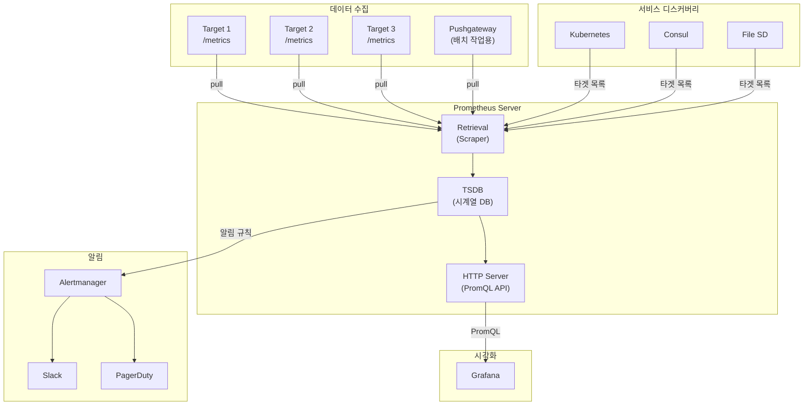
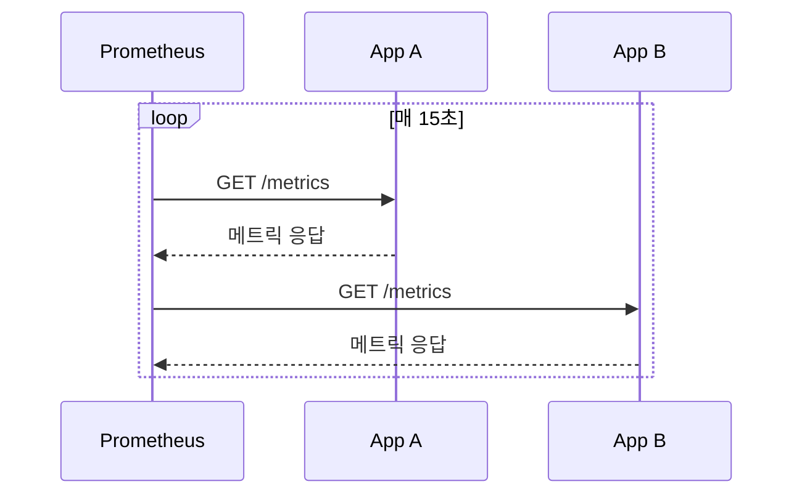
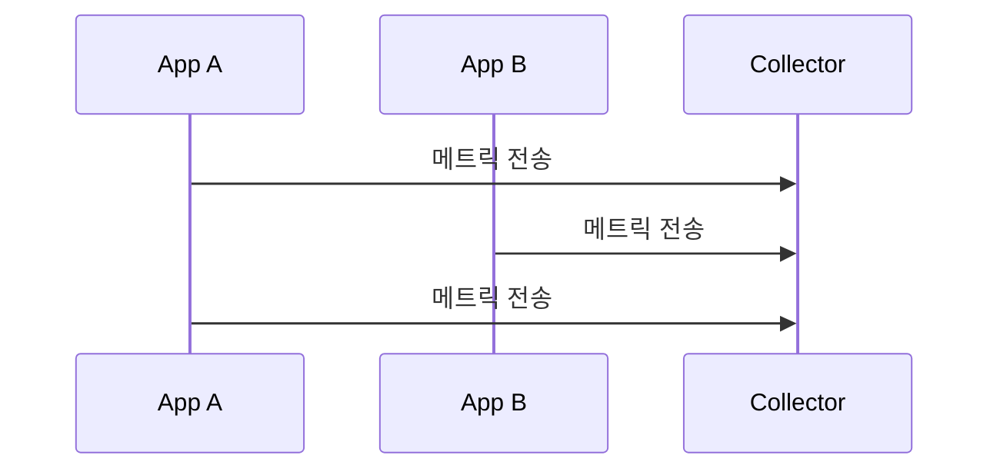
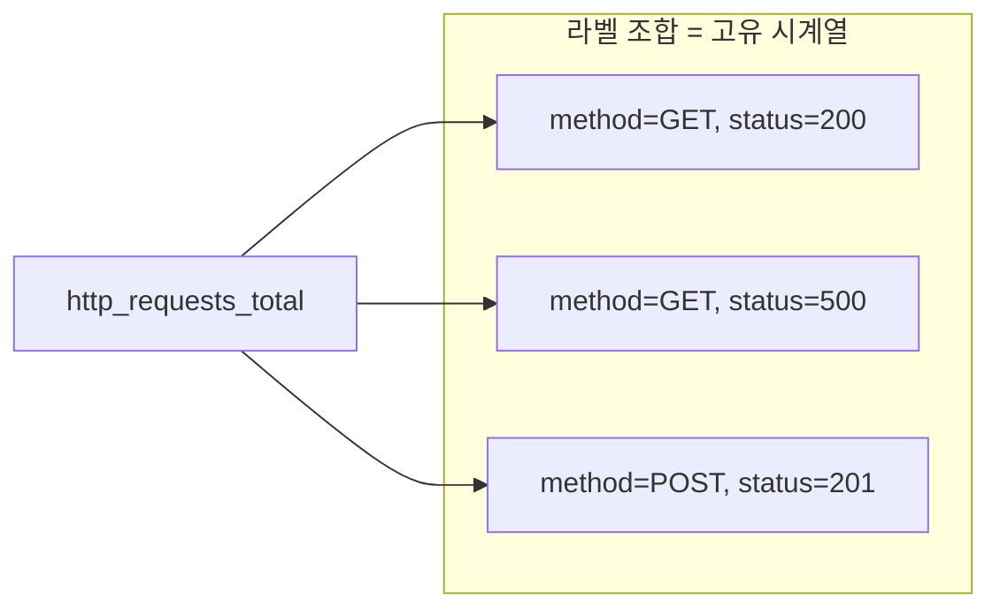
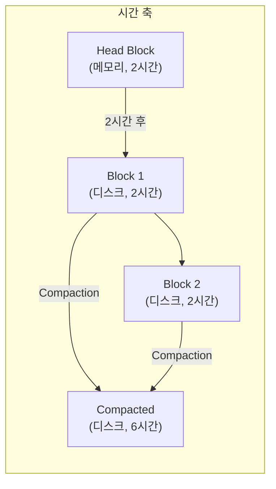
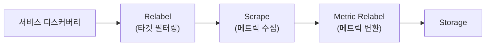
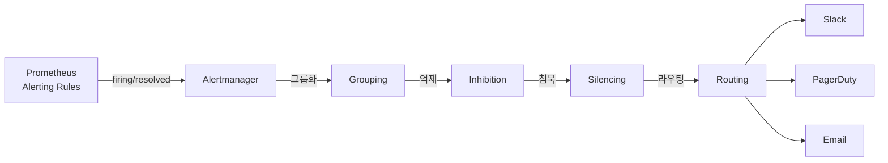
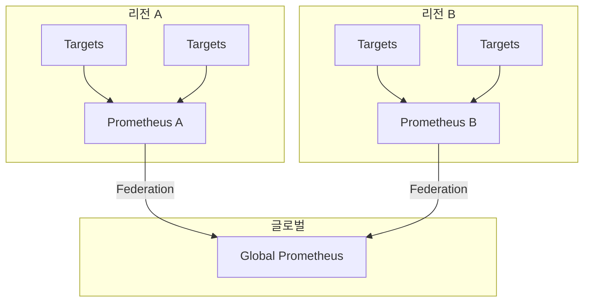

> **대상 독자**: Prometheus를 운영하거나 깊이 이해하고 싶은 개발자
> **선수 지식**: [메트릭 기초]()
> **이 문서를 읽으면**: Prometheus의 설계 철학과 구성 요소를 이해하고 운영 전략을 수립할 수 있습니다

## TL;DR


**핵심 요약:**
- **Pull 모델**: Prometheus가 타겟에서 메트릭을 가져옴 (Push가 아님)
- **시계열 DB**: 라벨 기반 다차원 데이터 모델
- **서비스 디스커버리**: Kubernetes, Consul 등과 연동하여 타겟 자동 발견
- **단일 서버 설계**: 수평 확장보다 단일 서버 최적화 (Federation으로 확장)


## Prometheus 전체 구조



---

## Pull vs Push 모델

### Pull 모델 (Prometheus 방식)



**Prometheus가 타겟을 찾아가서 메트릭을 수집합니다.**

### Push 모델 (Datadog, StatsD 방식)



**애플리케이션이 수집 서버로 메트릭을 보냅니다.**

### 왜 Pull인가?

| 장점 | 설명 |
|------|------|
| **헬스체크 내장** | 스크래핑 실패 = 타겟 다운 |
| **중앙 제어** | 수집 주기, 타겟을 Prometheus에서 관리 |
| **디버깅 용이** | 브라우저로 `/metrics` 직접 확인 가능 |
| **네트워크 단순** | 타겟은 방화벽 인바운드만 열면 됨 |

| 단점 | 해결책 |
|------|--------|
| 짧은 수명 작업 | Pushgateway 사용 |
| 방화벽 뒤 타겟 | Proxy 또는 Push Gateway |
| NAT 환경 | 서비스 메시 활용 |

---

## 시계열 데이터 모델

### 시계열이란?

```
메트릭명{라벨1="값1", 라벨2="값2"} 값 @타임스탬프
```

**예시:**
```
http_requests_total{method="GET", status="200", path="/api/orders"} 1523 @1704700800
http_requests_total{method="POST", status="201", path="/api/orders"} 342 @1704700800
http_requests_total{method="GET", status="500", path="/api/orders"} 12 @1704700800
```

### 다차원 데이터 모델



각 **라벨 조합**이 별도의 시계열을 생성합니다.

### 카디널리티 주의


**카디널리티(Cardinality)**는 고유한 시계열 수입니다. 라벨 값이 다양할수록 시계열 수가 폭발적으로 증가합니다.

```
# 위험한 라벨
http_requests_total{user_id="..."}  # 사용자 수만큼 시계열
http_requests_total{request_id="..."} # 요청마다 새 시계열

# 안전한 라벨
http_requests_total{method="GET", status="200"} # 조합 수 제한적
```


---

## TSDB (시계열 데이터베이스)

### 저장 구조

```
data/
├── 01BKGV7JBM69T2G1BGBGM6KB12/  # 블록 (2시간 단위)
│   ├── meta.json
│   ├── index                      # 라벨 인덱스
│   ├── chunks/                    # 실제 데이터
│   └── tombstones                 # 삭제 마커
├── 01BKGTZQ1SYQJTR4PB43C8PD98/
├── chunks_head/                    # WAL (Write-Ahead Log)
└── wal/
```

### 블록 구조



| 구성 요소 | 역할 |
|----------|------|
| **Head Block** | 최근 2시간 데이터, 메모리 상주 |
| **WAL** | 장애 복구용 로그 |
| **Block** | 2시간 단위 불변 데이터 |
| **Compaction** | 오래된 블록 병합, 용량 최적화 |

### 보존 설정

```yaml
# prometheus.yml
storage:
  tsdb:
    retention.time: 15d      # 시간 기준 보존
    retention.size: 50GB     # 용량 기준 보존 (먼저 도달하면 삭제)
```

---

## 서비스 디스커버리

### 정적 설정

```yaml
scrape_configs:
  - job_name: 'static-targets'
    static_configs:
      - targets:
        - 'server1:9090'
        - 'server2:9090'
        - 'server3:9090'
```

### Kubernetes 연동

```yaml
scrape_configs:
  - job_name: 'kubernetes-pods'
    kubernetes_sd_configs:
      - role: pod
    relabel_configs:
      # prometheus.io/scrape: "true" 어노테이션이 있는 Pod만
      - source_labels: [__meta_kubernetes_pod_annotation_prometheus_io_scrape]
        action: keep
        regex: true
      # prometheus.io/path 어노테이션으로 경로 지정
      - source_labels: [__meta_kubernetes_pod_annotation_prometheus_io_path]
        action: replace
        target_label: __metrics_path__
        regex: (.+)
      # prometheus.io/port 어노테이션으로 포트 지정
      - source_labels: [__address__, __meta_kubernetes_pod_annotation_prometheus_io_port]
        action: replace
        regex: ([^:]+)(?::\d+)?;(\d+)
        replacement: $1:$2
        target_label: __address__
```

**Pod 어노테이션 예시:**
```yaml
apiVersion: v1
kind: Pod
metadata:
  annotations:
    prometheus.io/scrape: "true"
    prometheus.io/port: "8080"
    prometheus.io/path: "/actuator/prometheus"
```

### 지원하는 서비스 디스커버리

| SD 타입 | 용도 |
|---------|------|
| `kubernetes_sd` | Kubernetes Pod, Service, Node |
| `consul_sd` | Consul 서비스 카탈로그 |
| `ec2_sd` | AWS EC2 인스턴스 |
| `azure_sd` | Azure 가상 머신 |
| `file_sd` | JSON/YAML 파일 기반 |
| `dns_sd` | DNS SRV 레코드 |

---

## Relabeling

메트릭을 저장하기 전에 라벨을 조작합니다.

### 동작 시점



### 주요 액션

| 액션 | 설명 | 예시 |
|------|------|------|
| `keep` | 조건에 맞는 타겟만 유지 | 특정 네임스페이스만 |
| `drop` | 조건에 맞는 타겟 제외 | 시스템 Pod 제외 |
| `replace` | 라벨 값 변환 | 경로 추출 |
| `labelmap` | 라벨 이름 변환 | `__meta_*` → 일반 라벨 |
| `labeldrop` | 라벨 삭제 | 불필요한 라벨 제거 |

### 예시: 네임스페이스별 필터링

```yaml
relabel_configs:
  # production 네임스페이스만 수집
  - source_labels: [__meta_kubernetes_namespace]
    action: keep
    regex: production

  # namespace 라벨로 저장
  - source_labels: [__meta_kubernetes_namespace]
    target_label: namespace
```

---

## Alertmanager 연동

### 알림 흐름



### Prometheus 알림 규칙

```yaml
# prometheus/rules/alerts.yml
groups:
  - name: availability
    rules:
      - alert: ServiceDown
        expr: up == 0
        for: 5m
        labels:
          severity: critical
        annotations:
          summary: "{{ $labels.instance }} is down"
          description: "{{ $labels.job }} has been down for more than 5 minutes"
```

### Alertmanager 설정

```yaml
# alertmanager.yml
global:
  resolve_timeout: 5m

route:
  receiver: 'default'
  group_by: ['alertname', 'job']
  group_wait: 30s
  group_interval: 5m
  repeat_interval: 4h
  routes:
    - match:
        severity: critical
      receiver: 'pagerduty'
    - match:
        severity: warning
      receiver: 'slack'

receivers:
  - name: 'default'
    webhook_configs:
      - url: 'http://alertmanager-webhook:5001/'

  - name: 'slack'
    slack_configs:
      - api_url: 'https://hooks.slack.com/services/...'
        channel: '#alerts'

  - name: 'pagerduty'
    pagerduty_configs:
      - service_key: '<key>'
```

---

## 확장 전략

### Federation (계층 구조)



```yaml
# Global Prometheus 설정
scrape_configs:
  - job_name: 'federation'
    honor_labels: true
    metrics_path: '/federate'
    params:
      'match[]':
        - '{job=~".+"}'
    static_configs:
      - targets:
        - 'prometheus-a:9090'
        - 'prometheus-b:9090'
```

### 원격 저장소

장기 보존이 필요하면 원격 저장소를 사용합니다.

```yaml
remote_write:
  - url: "http://victoriametrics:8428/api/v1/write"

remote_read:
  - url: "http://victoriametrics:8428/api/v1/read"
```

| 원격 저장소 | 특징 |
|------------|------|
| Thanos | 오브젝트 스토리지 기반, 글로벌 뷰 |
| Cortex | 멀티 테넌트, 수평 확장 |
| VictoriaMetrics | 고성능, 단순한 운영 |
| Mimir | Grafana Labs, Cortex 후속 |

---

## 운영 권장사항

### 리소스 가이드라인

| 시계열 수 | RAM | CPU | 디스크 |
|----------|-----|-----|--------|
| 100K | 2GB | 1 core | 10GB |
| 1M | 8GB | 2 cores | 100GB |
| 10M | 32GB | 8 cores | 1TB |

### 성능 최적화

```yaml
# prometheus.yml
global:
  scrape_interval: 30s     # 기본 15s → 30s (부하 감소)
  evaluation_interval: 30s

scrape_configs:
  - job_name: 'high-priority'
    scrape_interval: 15s   # 중요 타겟은 더 자주

  - job_name: 'low-priority'
    scrape_interval: 60s   # 덜 중요한 타겟
```

### 모니터링해야 할 메트릭

```promql
# 스크래핑 성능
rate(prometheus_target_scrape_pool_sync_total[5m])

# TSDB 상태
prometheus_tsdb_head_series  # 활성 시계열 수
prometheus_tsdb_head_chunks  # 청크 수

# 메모리 사용
process_resident_memory_bytes

# 쿼리 성능
prometheus_engine_query_duration_seconds
```

---

## 핵심 정리

| 구성 요소 | 역할 |
|----------|------|
| **Pull 모델** | Prometheus가 타겟을 찾아가서 수집 |
| **TSDB** | 시계열 데이터 저장, 2시간 블록 단위 |
| **서비스 디스커버리** | 타겟 자동 발견 (K8s, Consul 등) |
| **Relabeling** | 라벨 변환 및 필터링 |
| **Alertmanager** | 알림 그룹화, 라우팅, 전송 |
| **Federation** | 계층적 확장 |

---

## 다음 단계

| 추천 순서 | 문서 | 배우는 것 |
|----------|------|----------|
| 1 | [PromQL 기본 문법]() | 셀렉터, 레이블 매칭 |
| 2 | [환경 구성]() | Docker Compose 실습 |
| 3 | [알림 전략]() | Alerting Rules 작성 |
