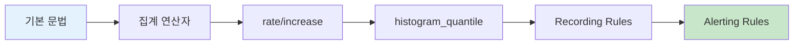

PromQL(Prometheus Query Language)은 Prometheus에서 시계열 데이터를 조회하고 분석하는 쿼리 언어입니다.

## 왜 PromQL을 배워야 하는가?

| 활용 | 설명 |
|------|------|
| **대시보드** | Grafana 패널에서 데이터 시각화 |
| **알림** | 조건 기반 자동 알림 규칙 작성 |
| **분석** | Ad-hoc 쿼리로 문제 원인 분석 |
| **Recording Rules** | 복잡한 쿼리 사전 계산으로 성능 최적화 |

## 학습 순서

### 기초 (1시간)

1. [기본 문법](syntax-basics/) - 셀렉터, 레이블 매칭, 시간 범위
2. [집계 연산자](aggregation-operators/) - sum, avg, count, topk, by/without

### 실전 활용 (2시간)

3. [rate와 increase](rate-and-increase/) - Counter 메트릭 처리의 핵심
4. [histogram_quantile](histogram-quantile/) - P50/P95/P99 백분위 계산

### 고급 (1시간)

5. [Recording Rules](recording-rules/) - 복잡한 쿼리 사전 계산
6. [Alerting Rules](alerting-rules/) - 알림 규칙 작성법

## 빠른 참조

### 자주 쓰는 함수

| 함수 | 용도 | 예시 |
|------|------|------|
| `rate()` | Counter의 초당 증가율 | `rate(http_requests_total[5m])` |
| `increase()` | Counter의 총 증가량 | `increase(http_requests_total[1h])` |
| `sum()` | 합계 | `sum(rate(http_requests_total[5m]))` |
| `avg()` | 평균 | `avg(node_cpu_seconds_total)` |
| `histogram_quantile()` | 백분위 | `histogram_quantile(0.99, rate(...[5m]))` |

### 자주 쓰는 패턴

```promql
# 에러율
sum(rate(http_requests_total{status=~"5.."}[5m]))
/ sum(rate(http_requests_total[5m]))

# P99 응답시간
histogram_quantile(0.99,
  sum(rate(http_request_duration_seconds_bucket[5m])) by (le)
)

# CPU 사용률
100 - (avg(rate(node_cpu_seconds_total{mode="idle"}[5m])) * 100)
```

## 학습 경로


