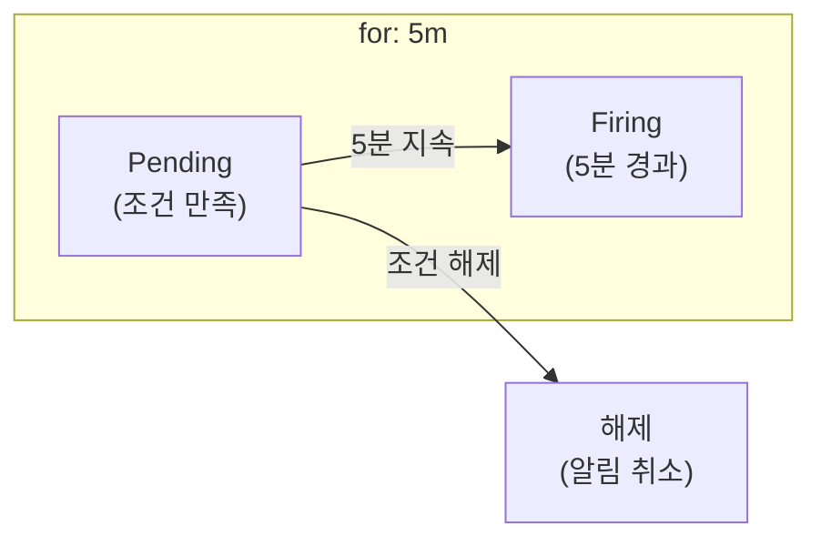
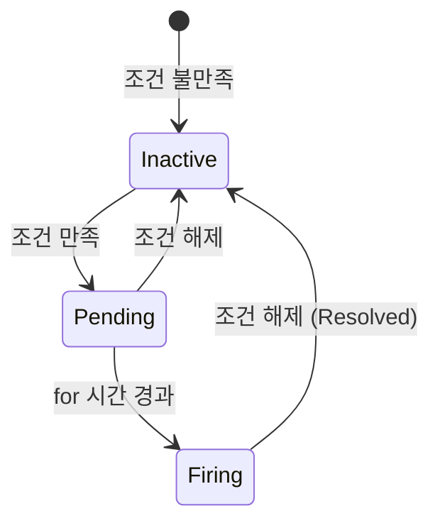

## 전체 비유: 환자 모니터 경보 시스템

Alerting Rules를 **중환자실 환자 모니터 경보 시스템**에 비유하면 이해하기 쉽습니다:

| 환자 모니터 비유 | Alerting Rules | 역할 |
|---------------|---------------|------|
| 맥박 비정상 조건 | expr (조건) | 알림 발동 조건 정의 |
| 5분간 지속 시 알림 | for (지속 시간) | 일시적 변동 무시 |
| 긴급/주의 분류 | severity 라벨 | 심각도 구분 |
| 담당 의료진 호출 | 알림 라우팅 | 적절한 담당자에게 전달 |
| 알림 상세 정보 | annotations | 문제 설명, 조치 가이드 |
| 경보 피로 방지 | 적절한 임계값 | 의미 있는 알림만 |
| 연쇄 경보 억제 | inhibition | 중복 알림 방지 |
| 대응 매뉴얼 링크 | runbook_url | 문제 해결 가이드 |

이처럼 환자 모니터가 이상 징후를 감지하여 의료진에게 알리듯, Alerting Rules로 시스템 문제를 감지합니다.

---

> **대상 독자**: 모니터링 알림을 설정하려는 개발자, SRE
> **선수 지식**: [Recording Rules]()
> **이 문서를 읽으면**: 오탐을 줄이고 실제 문제만 알림받는 규칙을 작성할 수 있습니다

## TL;DR


**핵심 요약:**
- `for`: 지정 시간 동안 조건 만족 시 발동 (오탐 방지)
- `labels`: 심각도, 팀 등 메타데이터 추가
- `annotations`: 알림 메시지, 런북 URL 포함
- Recording Rules 결과를 활용하여 간결하게 작성


## 기본 문법

### Alerting Rule 구조

```yaml
groups:
  - name: <그룹명>
    rules:
      - alert: <알림명>
        expr: <PromQL 조건>
        for: <지속 시간>
        labels:
          <라벨명>: <값>
        annotations:
          <어노테이션명>: <값>
```

### 기본 예제

```yaml
groups:
  - name: availability
    rules:
      - alert: ServiceDown
        expr: up == 0
        for: 5m
        labels:
          severity: critical
        annotations:
          summary: "{{ $labels.instance }} is down"
          description: "{{ $labels.job }} has been down for more than 5 minutes."
          runbook_url: "https://wiki.example.com/runbook/service-down"
```

---

## 핵심 구성요소

### expr (조건)

알림이 발동하는 조건입니다.

```yaml
# 타겟 다운
expr: up == 0

# 에러율 5% 초과
expr: |
  sum by (service) (rate(http_requests_total{status=~"5.."}[5m]))
  / sum by (service) (rate(http_requests_total[5m]))
  > 0.05

# P99 응답시간 500ms 초과
expr: |
  histogram_quantile(0.99,
    sum by (service, le) (rate(http_request_duration_seconds_bucket[5m]))
  ) > 0.5

# Recording Rule 결과 사용 (권장)
expr: service:http_requests_errors:ratio_rate5m > 0.05
```

### for (지속 시간)

조건이 **지속**되어야 알림이 발동합니다. 일시적 스파이크로 인한 오탐을 방지합니다.

```yaml
# 5분간 지속되어야 발동
for: 5m

# 즉시 발동 (for 없음)
# 주의: 오탐 위험
```



**권장 값:**

| 상황 | for 값 | 이유 |
|------|--------|------|
| 서비스 다운 | 1-5m | 빠른 감지 필요 |
| 에러율 증가 | 5-10m | 일시적 스파이크 필터링 |
| 리소스 부족 | 10-15m | 자동 복구 대기 |
| 디스크 부족 | 30m-1h | 천천히 증가 |

### labels (라벨)

알림에 메타데이터를 추가합니다.

```yaml
labels:
  severity: critical          # 심각도
  team: platform              # 담당 팀
  service: "{{ $labels.service }}"  # 동적 라벨
```

**심각도 레벨:**

| 레벨 | 설명 | 대응 |
|------|------|------|
| `critical` | 서비스 중단 | 즉시 대응 (호출) |
| `warning` | 성능 저하 | 업무 시간 내 대응 |
| `info` | 참고 사항 | 기록만 |

### annotations (어노테이션)

알림 내용을 상세히 설명합니다.

```yaml
annotations:
  summary: "High error rate on {{ $labels.service }}"
  description: |
    Error rate is {{ $value | humanizePercentage }}.
    Current threshold: 5%
  runbook_url: "https://wiki.example.com/runbook/high-error-rate"
  dashboard_url: "https://grafana.example.com/d/abc/errors?var-service={{ $labels.service }}"
```

**템플릿 변수:**

| 변수 | 설명 |
|------|------|
| `{{ $labels }}` | 알림의 모든 라벨 |
| `{{ $labels.name }}` | 특정 라벨 값 |
| `{{ $value }}` | 표현식 결과 값 |
| `{{ $value | humanize }}` | 사람이 읽기 쉬운 형식 |
| `{{ $value | humanizePercentage }}` | 퍼센트 형식 |
| `{{ $value | humanizeDuration }}` | 시간 형식 |

---

## 실전 알림 규칙

### 가용성 알림

```yaml
groups:
  - name: availability
    rules:
      # 타겟 다운
      - alert: TargetDown
        expr: up == 0
        for: 5m
        labels:
          severity: critical
        annotations:
          summary: "Target {{ $labels.instance }} is down"
          description: "{{ $labels.job }} target {{ $labels.instance }} has been down for more than 5 minutes."

      # 서비스 가용성 저하
      - alert: ServiceAvailabilityLow
        expr: |
          sum by (service) (rate(http_requests_total{status!~"5.."}[5m]))
          / sum by (service) (rate(http_requests_total[5m]))
          < 0.99
        for: 5m
        labels:
          severity: warning
        annotations:
          summary: "{{ $labels.service }} availability below 99%"
          description: "Current availability: {{ $value | humanizePercentage }}"
```

### 에러율 알림

```yaml
groups:
  - name: errors
    rules:
      # 높은 에러율
      - alert: HighErrorRate
        expr: |
          sum by (service) (rate(http_requests_total{status=~"5.."}[5m]))
          / sum by (service) (rate(http_requests_total[5m]))
          > 0.05
        for: 5m
        labels:
          severity: warning
        annotations:
          summary: "High error rate on {{ $labels.service }}"
          description: "Error rate is {{ $value | humanizePercentage }}"

      # 심각한 에러율
      - alert: CriticalErrorRate
        expr: |
          sum by (service) (rate(http_requests_total{status=~"5.."}[5m]))
          / sum by (service) (rate(http_requests_total[5m]))
          > 0.10
        for: 2m
        labels:
          severity: critical
        annotations:
          summary: "Critical error rate on {{ $labels.service }}"
          description: "Error rate is {{ $value | humanizePercentage }}. Immediate action required."
```

### 지연시간 알림

```yaml
groups:
  - name: latency
    rules:
      # P99 지연시간 높음
      - alert: HighP99Latency
        expr: |
          histogram_quantile(0.99,
            sum by (service, le) (rate(http_request_duration_seconds_bucket[5m]))
          ) > 0.5
        for: 5m
        labels:
          severity: warning
        annotations:
          summary: "High P99 latency on {{ $labels.service }}"
          description: "P99 latency is {{ $value | humanizeDuration }}"

      # Recording Rule 사용
      - alert: HighP99LatencyFromRule
        expr: service:http_request_duration_seconds:p99 > 0.5
        for: 5m
        labels:
          severity: warning
        annotations:
          summary: "High P99 latency on {{ $labels.service }}"
```

### 리소스 알림

```yaml
groups:
  - name: resources
    rules:
      # CPU 높음
      - alert: HighCPUUsage
        expr: |
          100 - (avg by (instance) (rate(node_cpu_seconds_total{mode="idle"}[5m])) * 100) > 80
        for: 10m
        labels:
          severity: warning
        annotations:
          summary: "High CPU usage on {{ $labels.instance }}"
          description: "CPU usage is {{ $value | humanize }}%"

      # 메모리 부족
      - alert: LowMemory
        expr: |
          (node_memory_MemAvailable_bytes / node_memory_MemTotal_bytes) < 0.1
        for: 5m
        labels:
          severity: warning
        annotations:
          summary: "Low memory on {{ $labels.instance }}"
          description: "Available memory is {{ $value | humanizePercentage }}"

      # 디스크 부족
      - alert: DiskSpaceLow
        expr: |
          (node_filesystem_avail_bytes{mountpoint="/"} / node_filesystem_size_bytes{mountpoint="/"}) < 0.1
        for: 30m
        labels:
          severity: warning
        annotations:
          summary: "Low disk space on {{ $labels.instance }}"
          description: "Available disk space is {{ $value | humanizePercentage }}"
```

### Kafka 알림

```yaml
groups:
  - name: kafka
    rules:
      # Consumer Lag 높음
      - alert: KafkaConsumerLagHigh
        expr: |
          sum by (consumer_group, topic) (kafka_consumer_group_lag) > 10000
        for: 10m
        labels:
          severity: warning
        annotations:
          summary: "High consumer lag for {{ $labels.consumer_group }}"
          description: "Lag is {{ $value | humanize }} messages on topic {{ $labels.topic }}"

      # Under-replicated 파티션
      - alert: KafkaUnderReplicatedPartitions
        expr: kafka_server_replicamanager_underreplicatedpartitions > 0
        for: 5m
        labels:
          severity: critical
        annotations:
          summary: "Kafka under-replicated partitions detected"
```

---

## 알림 피로 방지

### 1. 적절한 임계값

```yaml
# ❌ 너무 민감
expr: error_rate > 0.001  # 0.1%

# ✅ 의미 있는 임계값
expr: error_rate > 0.01   # 1%
```

### 2. 충분한 for 시간

```yaml
# ❌ 일시적 스파이크에도 발동
for: 30s

# ✅ 지속적인 문제만 감지
for: 5m
```

### 3. 계층적 알림

```yaml
# Warning: 5% 에러, 5분 지속
- alert: HighErrorRate
  expr: error_rate > 0.05
  for: 5m
  labels:
    severity: warning

# Critical: 10% 에러, 2분 지속 (더 빠르게)
- alert: CriticalErrorRate
  expr: error_rate > 0.10
  for: 2m
  labels:
    severity: critical
```

### 4. Alertmanager에서 그룹화

```yaml
# alertmanager.yml
route:
  group_by: ['alertname', 'service']
  group_wait: 30s
  group_interval: 5m
  repeat_interval: 4h
```

---

## 규칙 검증

### 문법 검사

```bash
promtool check rules alerts/*.yml
```

### 단위 테스트

```yaml
# tests/alert_tests.yml
rule_files:
  - ../alerts/errors.yml

evaluation_interval: 1m

tests:
  - interval: 1m
    input_series:
      - series: 'http_requests_total{service="api", status="500"}'
        values: '0+10x10'
      - series: 'http_requests_total{service="api", status="200"}'
        values: '0+100x10'

    alert_rule_test:
      - eval_time: 10m
        alertname: HighErrorRate
        exp_alerts:
          - exp_labels:
              service: api
              severity: warning
            exp_annotations:
              summary: "High error rate on api"
```

```bash
promtool test rules tests/alert_tests.yml
```

---

## 알림 상태



| 상태 | 설명 |
|------|------|
| **Inactive** | 조건 불만족 |
| **Pending** | 조건 만족, for 대기 중 |
| **Firing** | 알림 발동됨 |

---

## 핵심 정리

| 구성요소 | 역할 | 예시 |
|----------|------|------|
| `expr` | 발동 조건 | `error_rate > 0.05` |
| `for` | 오탐 방지 | `5m` |
| `labels` | 메타데이터 | `severity: critical` |
| `annotations` | 알림 내용 | `summary`, `runbook_url` |

**좋은 알림의 조건:**
1. 즉각적인 조치가 필요한 상황만
2. 명확한 심각도 분류
3. 상세한 컨텍스트 (runbook, dashboard)
4. 적절한 for 시간으로 오탐 방지

---

## 다음 단계

| 추천 순서 | 문서 | 배우는 것 |
|----------|------|----------|
| 1 | [SRE 황금 신호]() | 알림 대상 지표 선정 |
| 2 | [알림 후 액션 가이드]() | 알림 수신 후 대응 |
