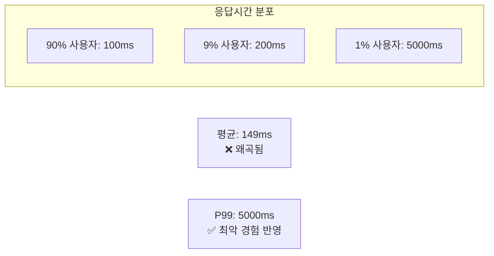
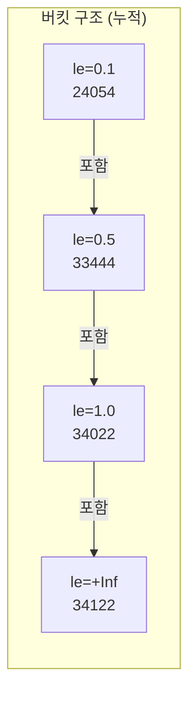
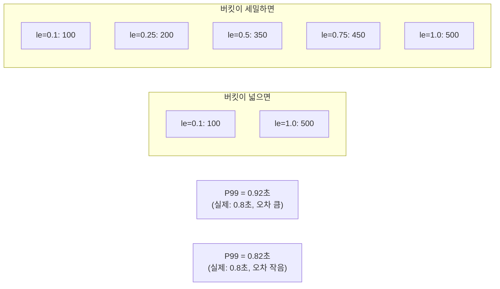

> **대상 독자**: 응답시간 분석이 필요한 개발자, SRE
> **선수 지식**: [메트릭 기초](), [rate와 increase]()
> **이 문서를 읽으면**: Histogram에서 정확한 백분위를 계산하고 SLA를 모니터링할 수 있습니다

## TL;DR


**핵심 요약:**
- `histogram_quantile(φ, bucket)`: φ 백분위 계산 (0 ≤ φ ≤ 1)
- **P50**: `histogram_quantile(0.5, ...)` - 중앙값
- **P95**: `histogram_quantile(0.95, ...)` - 95%가 이 값 이하
- **P99**: `histogram_quantile(0.99, ...)` - 99%가 이 값 이하
- 반드시 `rate()` 또는 `increase()`와 함께 사용


## 왜 백분위가 중요한가?

평균은 **극단값에 왜곡**됩니다. 백분위가 실제 사용자 경험을 더 잘 반영합니다.



| 지표 | 값 | 의미 |
|------|-----|------|
| 평균 | 149ms | 극단값으로 왜곡 |
| P50 | 100ms | 절반의 요청이 이 이하 |
| P95 | 200ms | 95%가 이 이하 |
| P99 | 5000ms | 99%가 이 이하 (1%는 5초 대기) |

---

## Histogram 구조 복습

Histogram은 3가지 시계열을 생성합니다.

```
# _bucket: 버킷별 누적 카운트 (le = less than or equal)
http_request_duration_seconds_bucket{le="0.1"} 24054   # 0.1초 이하
http_request_duration_seconds_bucket{le="0.5"} 33444   # 0.5초 이하
http_request_duration_seconds_bucket{le="1"}   34022   # 1초 이하
http_request_duration_seconds_bucket{le="+Inf"} 34122  # 전체

# _count: 총 관측 횟수
http_request_duration_seconds_count 34122

# _sum: 모든 값의 합
http_request_duration_seconds_sum 2042.53
```



---

## histogram_quantile() 사용법

### 기본 문법

```promql
histogram_quantile(
  φ,           # 백분위 (0-1 사이 값)
  bucket       # _bucket 시계열 (rate 적용)
)
```

### 기본 예제

```promql
# P50 (중앙값)
histogram_quantile(0.5,
  rate(http_request_duration_seconds_bucket[5m])
)

# P90
histogram_quantile(0.9,
  rate(http_request_duration_seconds_bucket[5m])
)

# P95
histogram_quantile(0.95,
  rate(http_request_duration_seconds_bucket[5m])
)

# P99
histogram_quantile(0.99,
  rate(http_request_duration_seconds_bucket[5m])
)
```

### rate()가 필요한 이유

```promql
# ❌ 버킷은 누적값이므로 시간 범위 고려 안 됨
histogram_quantile(0.99, http_request_duration_seconds_bucket)

# ✅ rate()로 해당 시간 동안의 분포 계산
histogram_quantile(0.99, rate(http_request_duration_seconds_bucket[5m]))
```

---

## 그룹별 백분위

### le 라벨 유지 필수

```promql
# 서비스별 P99
histogram_quantile(0.99,
  sum by (service, le) (
    rate(http_request_duration_seconds_bucket[5m])
  )
)
```


**`le` 라벨은 반드시 유지해야 합니다.** `le`가 없으면 버킷 구조가 깨져서 계산 불가능합니다.

```promql
# ❌ le 없이 집계하면 오류
sum by (service) (rate(..._bucket[5m]))

# ✅ le 포함하여 집계
sum by (service, le) (rate(..._bucket[5m]))
```


### 다양한 그룹화 예제

```promql
# 엔드포인트별 P99
histogram_quantile(0.99,
  sum by (path, le) (
    rate(http_request_duration_seconds_bucket[5m])
  )
)

# 서비스 + 엔드포인트별 P95
histogram_quantile(0.95,
  sum by (service, path, le) (
    rate(http_request_duration_seconds_bucket[5m])
  )
)

# 전체 시스템 P99 (모든 라벨 제거, le만 유지)
histogram_quantile(0.99,
  sum by (le) (
    rate(http_request_duration_seconds_bucket[5m])
  )
)
```

---

## 실전 패턴

### SLA 모니터링

```promql
# P99가 500ms 이하인지 확인
histogram_quantile(0.99,
  sum by (le) (rate(http_request_duration_seconds_bucket[5m]))
) < 0.5

# SLA 위반 서비스 찾기
histogram_quantile(0.99,
  sum by (service, le) (rate(http_request_duration_seconds_bucket[5m]))
) > 0.5
```

### 알림 규칙

```yaml
# prometheus/rules/latency.yml
groups:
  - name: latency
    rules:
      - alert: HighP99Latency
        expr: |
          histogram_quantile(0.99,
            sum by (service, le) (rate(http_request_duration_seconds_bucket[5m]))
          ) > 0.5
        for: 5m
        labels:
          severity: warning
        annotations:
          summary: "{{ $labels.service }} P99 latency is {{ $value | humanizeDuration }}"
```

### 평균 응답시간과 비교

```promql
# 평균 응답시간
rate(http_request_duration_seconds_sum[5m])
/ rate(http_request_duration_seconds_count[5m])

# P99 응답시간
histogram_quantile(0.99,
  sum by (le) (rate(http_request_duration_seconds_bucket[5m]))
)

# P99 / 평균 비율 (불균형 정도)
histogram_quantile(0.99, sum by (le) (rate(http_request_duration_seconds_bucket[5m])))
/ (rate(http_request_duration_seconds_sum[5m]) / rate(http_request_duration_seconds_count[5m]))
```

### 백분위 추세 비교

```promql
# P50 vs P99 차이 (롱테일 정도)
histogram_quantile(0.99, sum by (le) (rate(http_request_duration_seconds_bucket[5m])))
- histogram_quantile(0.5, sum by (le) (rate(http_request_duration_seconds_bucket[5m])))
```

---

## 정확도와 버킷 설계

### 선형 보간법

histogram_quantile은 버킷 경계 사이를 **선형 보간**합니다. 버킷 설계가 정확도에 직접 영향을 미칩니다.



### 버킷 설계 권장사항

```java
// Spring Boot + Micrometer
Timer.builder("http_request_duration_seconds")
    .publishPercentileHistogram()
    .sla(
        Duration.ofMillis(10),    // 매우 빠른 응답
        Duration.ofMillis(50),    // 빠른 응답
        Duration.ofMillis(100),   // 일반 목표
        Duration.ofMillis(250),   // 느린 응답 시작
        Duration.ofMillis(500),   // SLA 임계값
        Duration.ofSeconds(1),    // 느린 응답
        Duration.ofSeconds(5)     // 타임아웃 근처
    )
    .register(registry);
```


**버킷 설계 원칙:**
1. SLA 임계값 근처에 버킷 집중
2. 예상 분포의 90% 이상을 커버
3. 카디널리티 고려 (버킷 수 × 라벨 조합)


---

## 자주 하는 실수

### 1. le 라벨 누락

```promql
# ❌ le 없이 집계
histogram_quantile(0.99,
  sum by (service) (rate(http_request_duration_seconds_bucket[5m]))
)
# 결과: NaN

# ✅ le 포함
histogram_quantile(0.99,
  sum by (service, le) (rate(http_request_duration_seconds_bucket[5m]))
)
```

### 2. rate() 누락

```promql
# ❌ rate 없이 사용
histogram_quantile(0.99, http_request_duration_seconds_bucket)
# 결과: 서버 시작 이후 전체 데이터 기준

# ✅ rate 적용
histogram_quantile(0.99, rate(http_request_duration_seconds_bucket[5m]))
# 결과: 최근 5분 기준
```

### 3. 버킷 범위 초과

```promql
# 버킷이 le=1까지만 있을 때
# 실제 P99가 2초라면...
histogram_quantile(0.99, ...)
# 결과: 1 (최대 버킷 값) - 부정확

# 해결: 더 큰 버킷 추가 필요
```

### 4. Grafana에서 +Inf 표시

Grafana 그래프에서 `+Inf` 값이 보이면 대부분의 요청이 최대 버킷을 초과한 것입니다.

```promql
# 버킷 커버리지 확인
http_request_duration_seconds_bucket{le="1"}
/ http_request_duration_seconds_bucket{le="+Inf"}
# 0.95 이상이면 버킷 설계 양호
```

---

## Native Histogram (Prometheus 2.40+)


**Native Histogram**은 버킷을 자동으로 관리합니다. 아직 실험적 기능이지만, 버킷 설계 문제를 해결합니다.

```promql
# Native Histogram에서는 직접 사용
histogram_quantile(0.99, rate(http_request_duration_seconds[5m]))
# _bucket 접미사 불필요
```


---

## 핵심 정리

| 백분위 | 쿼리 | 의미 |
|--------|------|------|
| P50 | `histogram_quantile(0.5, ...)` | 중앙값 |
| P90 | `histogram_quantile(0.9, ...)` | 90%가 이 이하 |
| P95 | `histogram_quantile(0.95, ...)` | 95%가 이 이하 |
| P99 | `histogram_quantile(0.99, ...)` | 99%가 이 이하 |

**완전한 쿼리 템플릿:**
```promql
histogram_quantile(
  0.99,
  sum by (service, le) (
    rate(http_request_duration_seconds_bucket[5m])
  )
)
```

---

## 다음 단계

| 추천 순서 | 문서 | 배우는 것 |
|----------|------|----------|
| 1 | [Recording Rules]() | 복잡한 쿼리 사전 계산 |
| 2 | [SRE 황금 신호 - Latency]() | 지연시간 모니터링 전략 |
