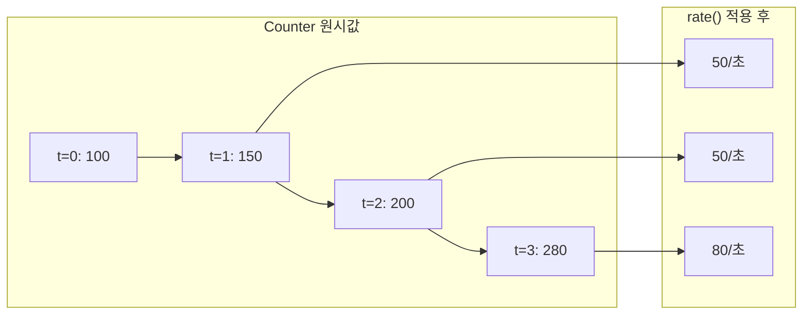
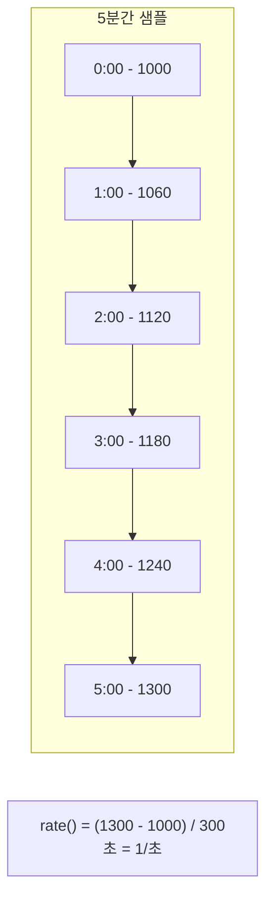
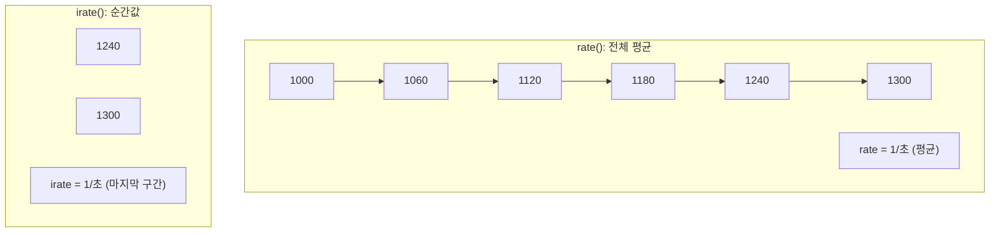
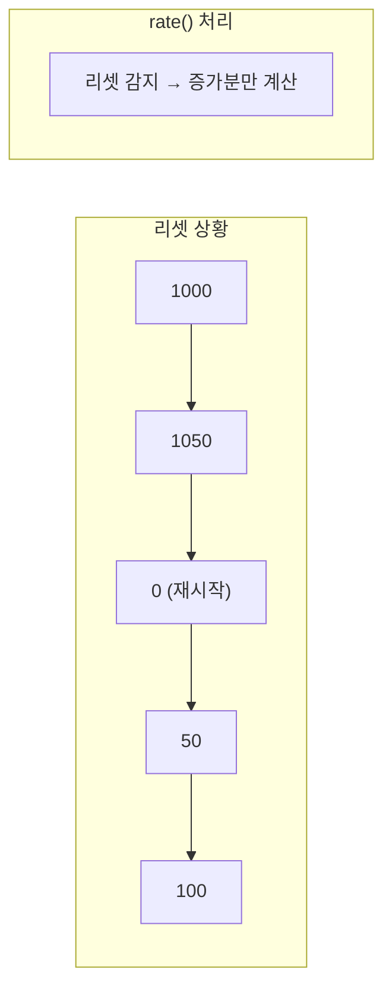

## 전체 비유: 누적 진료 기록 분석

rate와 increase를 **누적 진료 기록 분석**에 비유하면 이해하기 쉽습니다:

| 진료 기록 비유 | PromQL 함수 | 역할 |
|-------------|------------|------|
| 총 누적 진료 건수 | Counter 원시값 | 서버 시작 후 누적 (의미 제한적) |
| 시간당 진료 건수 | rate() | 초당 평균 증가율 (핵심) |
| 오늘 하루 진료 건수 | increase() | 기간 내 총 증가량 |
| 방금 전 진료 속도 | irate() | 마지막 구간 순간 증가율 |
| 야간 진료 재시작 | Counter 리셋 | 자동으로 처리됨 |
| 대시보드 현황판 | rate 활용 | 실시간 모니터링 |
| 월간 리포트 | increase 활용 | 기간별 합계 |

이처럼 누적 진료 기록에서 "시간당 진료 건수"를 계산하듯, rate()로 Counter를 변화율로 변환합니다.

---

> **대상 독자**: Counter 메트릭을 활용하려는 개발자
> **선수 지식**: [메트릭 기초](../metrics-fundamentals/), [집계 연산자](aggregation-operators/)
> **소요 시간**: 약 25-30분
> **이 문서를 읽으면**: Counter 메트릭에서 초당 변화율, 총 증가량을 정확히 계산할 수 있습니다

## TL;DR


**핵심 요약:**
- **rate()**: 초당 평균 증가율 → 대시보드, 알림에 사용
- **increase()**: 시간 범위 내 총 증가량 → 기간별 합계에 사용
- **irate()**: 마지막 두 샘플의 순간 증가율 → 변동이 큰 메트릭에 사용
- Counter에는 반드시 이 함수들을 적용 (원시 값은 의미 없음)


## 왜 rate/increase가 필요한가?

Counter는 **누적값**입니다. 서버가 시작된 후 지금까지 몇 번의 요청이 왔는지를 기록합니다. 하지만 "150,000개 요청"이라는 숫자만으로는 시스템이 잘 작동하는지 알 수 없습니다. 서버가 1시간 전에 시작됐다면 초당 40개 요청이지만, 1년 전에 시작됐다면 초당 0.005개 요청입니다.

우리가 정말 알고 싶은 것은 **"지금 얼마나 바쁜가?"** 또는 **"지난 1시간 동안 몇 건 처리했는가?"**입니다. 이것이 바로 rate()와 increase()가 해결하는 문제입니다.

**비유: 자동차 주행거리계와 속도계**

자동차를 생각해보세요. 주행거리계는 차를 산 이후 총 15만 km를 달렸다고 보여줍니다. 하지만 이 숫자만으로는 지금 얼마나 빠르게 달리고 있는지 알 수 없습니다. 그래서 속도계가 필요합니다. 속도계는 "지금 시속 80km"라고 알려줍니다.

- **주행거리계** = Counter 원시값 (누적)
- **속도계** = rate() (초당 변화율)
- **오늘 달린 거리** = increase() (특정 기간 증가량)

Counter만으로는 주행거리계만 보는 것과 같습니다. rate()와 increase()를 적용해야 "지금 상황"과 "기간별 실적"을 알 수 있습니다.

### 시각적 예시



```promql
# ❌ 의미 없음: 서버 시작 후 누적 요청 수
http_requests_total
# → 150000 (언제 서버가 시작됐는지에 따라 다름)

# ✅ 의미 있음: 초당 요청 수
rate(http_requests_total[5m])
# → 42.5 (초당 42.5개 요청)
```

---

## rate() 상세

### 왜 rate()를 사용하는가?

대시보드에서 "현재 시스템 부하"를 보여주거나, 알림 규칙에서 "비정상적으로 많은 에러"를 감지하려면 **초당 변화율**이 필요합니다.

**비유: 수도 계량기와 수도꼭지**

수도 계량기는 이 집이 총 얼마나 많은 물을 썼는지 보여줍니다. 하지만 수도관이 터졌는지 확인하려면 "지금 1분에 얼마나 많은 물이 흐르고 있는가"를 알아야 합니다. 계량기 숫자가 빠르게 올라가면 문제가 있는 것이죠.

rate()는 이런 "지금의 흐름"을 계산합니다. Counter가 5분 동안 300 증가했다면, `rate() = 300 / 300초 = 1/초`입니다. 이 값을 보고 "초당 1개씩 처리 중"이라고 이해할 수 있습니다.

### 정의

시간 범위 내 **초당 평균 증가율**을 계산합니다.

```
rate(v[time]) = (마지막 값 - 첫 값) / 시간(초)
```

### 동작 방식



### 기본 사용

```promql
# 초당 요청 수 (5분 평균)
rate(http_requests_total[5m])

# 초당 에러 수
rate(http_requests_total{status=~"5.."}[5m])

# 초당 처리 바이트
rate(node_network_receive_bytes_total[5m])
```

### 시간 범위 선택

| 범위 | 용도 | 특징 |
|------|------|------|
| `[1m]` | 빠른 변화 감지 | 노이즈 많음 |
| `[5m]` | 일반적 사용 | 권장 기본값 |
| `[15m]` | 장기 추세 | 부드러운 그래프 |
| `[1h]` | 일일 패턴 분석 | 세부 사항 손실 |


**시간 범위는 scrape_interval의 4배 이상**을 권장합니다.
- scrape_interval: 15s → `[1m]` 이상
- scrape_interval: 30s → `[2m]` 이상


### 그룹별 집계

```promql
# 서비스별 초당 요청 수
sum by (service) (rate(http_requests_total[5m]))

# 상태별 초당 요청 수
sum by (status) (rate(http_requests_total[5m]))

# 전체 초당 요청 수
sum(rate(http_requests_total[5m]))
```

---

## increase() 상세

### 왜 increase()를 사용하는가?

"오늘 주문이 몇 건이었나?", "이번 주 에러가 몇 번 발생했나?"처럼 **기간별 합계**가 필요할 때 increase()를 사용합니다. 비즈니스 리포트나 SLA 계산에서 흔히 쓰입니다.

**비유: 일일 판매량 집계**

카페를 운영한다고 생각해보세요. 금전 등록기에는 오늘까지 총 판매량이 표시됩니다(Counter). 하지만 점주가 알고 싶은 것은 "오늘 커피를 몇 잔 팔았는가?"입니다. 어제 저녁 마감 숫자와 오늘 마감 숫자의 차이를 계산해야 합니다.

increase()가 바로 이 역할을 합니다. `increase(orders_total[24h])`는 "24시간 동안 주문이 몇 건 증가했는가"를 계산합니다. rate()가 "초당 몇 건"이라면, increase()는 "해당 기간 총 몇 건"입니다.

### 정의

시간 범위 내 **총 증가량**을 계산합니다.

```
increase(v[time]) = rate(v[time]) × 시간(초)
```

### 동작 방식

```promql
# 다음 두 쿼리는 동일한 결과
increase(http_requests_total[1h])
rate(http_requests_total[1h]) * 3600
```

### 기본 사용

```promql
# 1시간 동안 총 요청 수
increase(http_requests_total[1h])

# 1일 동안 총 에러 수
increase(http_requests_total{status=~"5.."}[24h])

# 1주일간 총 처리 바이트
increase(node_network_receive_bytes_total[7d])
```

### 언제 사용하는가?

| 상황 | 사용 함수 |
|------|----------|
| 대시보드 그래프 | `rate()` |
| 알림 규칙 | `rate()` |
| 기간별 합계 (일일 요청 수) | `increase()` |
| 비용 계산 (처리량 기반) | `increase()` |

---

## irate() 상세

### 왜 irate()를 사용하는가?

rate()는 5분 평균을 보여주기 때문에 순간적인 스파이크가 "평균화"되어 보이지 않을 수 있습니다. 갑자기 1초간 폭주가 발생했다가 정상으로 돌아오면, rate()[5m]에서는 완만한 증가로만 보입니다.

**비유: 평균 속도 vs 순간 속도**

서울에서 부산까지 4시간 걸렸다면 평균 속도는 시속 100km입니다. 하지만 이 숫자만으로는 중간에 시속 180km로 과속한 순간이 있었는지 알 수 없습니다. 경찰의 과속 단속 카메라는 "평균 속도"가 아니라 "순간 속도"를 측정합니다.

irate()는 이런 순간 속도를 보여줍니다. 마지막 두 샘플만 비교하기 때문에 "방금 일어난 일"에 민감하게 반응합니다. 디버깅할 때 "정확히 언제 스파이크가 발생했는가?"를 확인하려면 irate()가 유용합니다.

### 정의

**마지막 두 샘플**만 사용하여 순간 증가율을 계산합니다.

```
irate(v[time]) = (마지막 값 - 직전 값) / 샘플 간격
```

### rate vs irate



| 함수 | 특징 | 용도 |
|------|------|------|
| `rate()` | 부드러운 그래프 | 일반적 모니터링, 알림 |
| `irate()` | 날카로운 스파이크 감지 | 순간 변화 분석 |

### 기본 사용

```promql
# CPU 순간 사용률 (스파이크 감지)
irate(node_cpu_seconds_total{mode="idle"}[5m])

# 네트워크 순간 트래픽
irate(node_network_receive_bytes_total[1m])
```

### 주의사항


**irate()는 알림에 사용하지 마세요.** 단일 스파이크에도 알림이 발생할 수 있습니다.

```promql
# ❌ 오탐 위험
irate(http_requests_total[5m]) > 100

# ✅ 안정적
rate(http_requests_total[5m]) > 100
```


---

## 리셋 처리

Counter는 프로세스 재시작 시 0으로 리셋됩니다. rate/increase는 이를 자동으로 처리합니다.



```promql
# 리셋이 있어도 정확하게 계산
rate(http_requests_total[5m])
# 1000→1050: +50
# 1050→0: 리셋 감지, 무시
# 0→50: +50
# 50→100: +50
# 총 150 / 300초 = 0.5/초
```

---

## 실전 패턴

### 에러율 계산

```promql
# 5분간 에러율 (%)
sum(rate(http_requests_total{status=~"5.."}[5m]))
/ sum(rate(http_requests_total[5m]))
* 100

# 서비스별 에러율
sum by (service) (rate(http_requests_total{status=~"5.."}[5m]))
/ sum by (service) (rate(http_requests_total[5m]))
* 100
```

### 처리량 (Throughput)

```promql
# 초당 요청 수 (RPS)
sum(rate(http_requests_total[5m]))

# 초당 처리 메시지 (Kafka)
sum(rate(kafka_consumer_records_consumed_total[5m]))

# 초당 처리 바이트
sum(rate(http_request_size_bytes_sum[5m]))
```

### 평균 응답시간

```promql
# rate()를 sum과 count 모두에 적용
rate(http_request_duration_seconds_sum[5m])
/ rate(http_request_duration_seconds_count[5m])
```

### 일일 합계

```promql
# 일일 요청 수
sum(increase(http_requests_total[24h]))

# 일일 에러 수
sum(increase(http_requests_total{status=~"5.."}[24h]))

# 일일 전송 데이터량 (GB)
sum(increase(node_network_transmit_bytes_total[24h])) / 1024 / 1024 / 1024
```

### 전일 대비 비교

```promql
# 현재 RPS vs 24시간 전 RPS
sum(rate(http_requests_total[5m]))
- sum(rate(http_requests_total[5m] offset 24h))

# 변화율 (%)
(sum(rate(http_requests_total[5m]))
 - sum(rate(http_requests_total[5m] offset 24h)))
/ sum(rate(http_requests_total[5m] offset 24h))
* 100
```

---

## 자주 하는 실수

### 1. Counter에 rate 없이 사용

```promql
# ❌ 누적값은 의미 없음
http_requests_total > 10000

# ✅ 초당 값으로 변환
rate(http_requests_total[5m]) > 100
```

### 2. rate()에 짧은 범위 사용

```promql
# ❌ 샘플 부족으로 부정확
rate(http_requests_total[10s])

# ✅ scrape_interval의 4배 이상
rate(http_requests_total[1m])  # scrape: 15s
```

### 3. sum과 rate 순서

```promql
# ❌ 먼저 sum하면 리셋 처리 불가
rate(sum(http_requests_total)[5m])

# ✅ 각 시계열에 rate 적용 후 sum
sum(rate(http_requests_total[5m]))
```

### 4. Gauge에 rate 적용

```promql
# ❌ Gauge는 증가만 하지 않음
rate(node_memory_MemAvailable_bytes[5m])

# ✅ Gauge는 deriv() 사용 (필요시)
deriv(node_memory_MemAvailable_bytes[5m])
```

---

## 핵심 정리

| 함수 | 반환값 | 용도 |
|------|--------|------|
| `rate()` | 초당 증가율 | 대시보드, 알림 |
| `increase()` | 총 증가량 | 기간별 합계 |
| `irate()` | 순간 증가율 | 스파이크 감지 |

| 상황 | 권장 |
|------|------|
| 대시보드 그래프 | `rate(metric[5m])` |
| 알림 규칙 | `rate(metric[5m])` |
| 일일 합계 | `increase(metric[24h])` |
| 스파이크 분석 | `irate(metric[5m])` |

---

## 다음 단계

| 추천 순서 | 문서 | 배우는 것 |
|----------|------|----------|
| 1 | [histogram_quantile](histogram-quantile/) | P99 응답시간 계산 |
| 2 | [Recording Rules](recording-rules/) | 복잡한 쿼리 최적화 |
