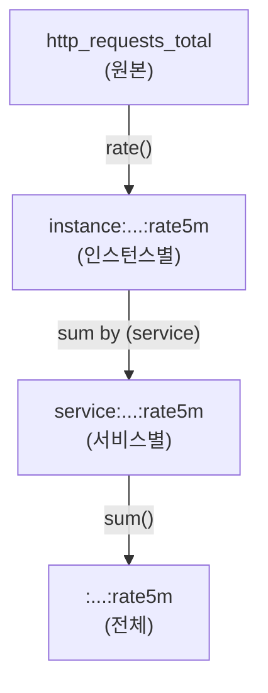

> **대상 독자**: 대시보드 성능 문제를 겪는 운영자, SRE
> **선수 지식**: [histogram_quantile]()
> **이 문서를 읽으면**: Recording Rules로 쿼리 성능을 개선하고 복잡한 메트릭을 관리할 수 있습니다

## TL;DR


**핵심 요약:**
- Recording Rules는 **쿼리 결과를 새로운 메트릭으로 저장**
- 복잡한 쿼리를 미리 계산하여 대시보드/알림 성능 향상
- 네이밍: `level:metric:operations` 패턴 권장
- 자주 사용하는 집계를 Rules로 정의


## 왜 Recording Rules가 필요한가?

### 문제: 복잡한 쿼리 반복 실행

```promql
# 대시보드에서 매 15초마다 실행
histogram_quantile(0.99,
  sum by (service, le) (
    rate(http_request_duration_seconds_bucket[5m])
  )
)
```

**문제점:**
- 대시보드 로딩 느림 (매번 계산)
- 여러 패널에서 동일 쿼리 중복
- Prometheus 부하 증가

### 해결: Recording Rules

```yaml
# 미리 계산하여 저장
groups:
  - name: latency
    rules:
      - record: service:http_request_duration_seconds:p99
        expr: |
          histogram_quantile(0.99,
            sum by (service, le) (
              rate(http_request_duration_seconds_bucket[5m])
            )
          )
```

```promql
# 대시보드에서는 간단히 조회
service:http_request_duration_seconds:p99
```

---

## 기본 문법

### Rules 파일 구조

```yaml
groups:
  - name: <그룹명>
    interval: <평가 주기>  # 선택사항, 기본값은 global.evaluation_interval
    rules:
      - record: <새 메트릭명>
        expr: <PromQL 표현식>
        labels:
          <추가 라벨>: <값>
```

### Prometheus 설정

```yaml
# prometheus.yml
rule_files:
  - "rules/*.yml"
  - "alerts/*.yml"
```

### 기본 예제

```yaml
# rules/latency.yml
groups:
  - name: latency_rules
    interval: 30s
    rules:
      # P99 응답시간
      - record: service:http_request_duration_seconds:p99
        expr: |
          histogram_quantile(0.99,
            sum by (service, le) (
              rate(http_request_duration_seconds_bucket[5m])
            )
          )

      # P50 응답시간
      - record: service:http_request_duration_seconds:p50
        expr: |
          histogram_quantile(0.5,
            sum by (service, le) (
              rate(http_request_duration_seconds_bucket[5m])
            )
          )
```

---

## 네이밍 컨벤션

### 권장 패턴

```
level:metric:operations
```

| 구성요소 | 설명 | 예시 |
|----------|------|------|
| `level` | 집계 수준 (라벨) | `job`, `service`, `instance` |
| `metric` | 원본 메트릭명 | `http_requests_total` |
| `operations` | 적용된 연산 | `rate5m`, `p99`, `sum` |

### 예시

```yaml
# 서비스별 초당 요청 수
job:http_requests_total:rate5m

# 서비스별 P99 응답시간
service:http_request_duration_seconds:p99

# 인스턴스별 에러율
instance:http_requests_errors:ratio_rate5m

# 전체 시스템 CPU 사용률
:node_cpu_utilization:avg
```


**level이 없으면 콜론으로 시작:** 전체 시스템 집계는 `:metric:operation` 형태를 사용합니다.


---

## 실전 패턴

### 1. 에러율 사전 계산

```yaml
groups:
  - name: error_rates
    rules:
      # 서비스별 에러율
      - record: service:http_requests_errors:ratio_rate5m
        expr: |
          sum by (service) (rate(http_requests_total{status=~"5.."}[5m]))
          / sum by (service) (rate(http_requests_total[5m]))

      # 전체 에러율
      - record: :http_requests_errors:ratio_rate5m
        expr: |
          sum(rate(http_requests_total{status=~"5.."}[5m]))
          / sum(rate(http_requests_total[5m]))
```

### 2. 응답시간 백분위

```yaml
groups:
  - name: latency_percentiles
    rules:
      - record: service:http_request_duration_seconds:p50
        expr: |
          histogram_quantile(0.5,
            sum by (service, le) (rate(http_request_duration_seconds_bucket[5m]))
          )

      - record: service:http_request_duration_seconds:p90
        expr: |
          histogram_quantile(0.9,
            sum by (service, le) (rate(http_request_duration_seconds_bucket[5m]))
          )

      - record: service:http_request_duration_seconds:p99
        expr: |
          histogram_quantile(0.99,
            sum by (service, le) (rate(http_request_duration_seconds_bucket[5m]))
          )
```

### 3. 리소스 사용률

```yaml
groups:
  - name: resource_utilization
    rules:
      # CPU 사용률
      - record: instance:node_cpu_utilization:ratio
        expr: |
          1 - avg by (instance) (
            rate(node_cpu_seconds_total{mode="idle"}[5m])
          )

      # 메모리 사용률
      - record: instance:node_memory_utilization:ratio
        expr: |
          1 - (
            node_memory_MemAvailable_bytes
            / node_memory_MemTotal_bytes
          )

      # 디스크 사용률
      - record: instance:node_filesystem_utilization:ratio
        expr: |
          1 - (
            node_filesystem_avail_bytes{mountpoint="/"}
            / node_filesystem_size_bytes{mountpoint="/"}
          )
```

### 4. SLI 계산

```yaml
groups:
  - name: sli
    rules:
      # 가용성 (성공 요청 비율)
      - record: service:http_requests_availability:ratio_rate5m
        expr: |
          sum by (service) (rate(http_requests_total{status!~"5.."}[5m]))
          / sum by (service) (rate(http_requests_total[5m]))

      # 지연시간 SLI (500ms 이하 비율)
      - record: service:http_requests_latency_sli:ratio_rate5m
        expr: |
          sum by (service) (rate(http_request_duration_seconds_bucket{le="0.5"}[5m]))
          / sum by (service) (rate(http_request_duration_seconds_count[5m]))
```

---

## 계층적 집계

### 단계별 집계로 성능 최적화

```yaml
groups:
  - name: hierarchical_aggregation
    rules:
      # 1단계: 인스턴스별 rate
      - record: instance:http_requests_total:rate5m
        expr: rate(http_requests_total[5m])

      # 2단계: 서비스별 합계 (1단계 결과 사용)
      - record: service:http_requests_total:rate5m
        expr: sum by (service) (instance:http_requests_total:rate5m)

      # 3단계: 전체 합계 (2단계 결과 사용)
      - record: :http_requests_total:rate5m
        expr: sum(service:http_requests_total:rate5m)
```



---

## 설정 및 관리

### 파일 구조 예시

```
prometheus/
├── prometheus.yml
└── rules/
    ├── latency.yml
    ├── errors.yml
    ├── resources.yml
    └── sli.yml
```

### 규칙 검증

```bash
# 문법 검사
promtool check rules rules/*.yml

# 예상 결과 확인
promtool test rules tests.yml
```

### 테스트 파일 예시

```yaml
# tests.yml
rule_files:
  - rules/latency.yml

evaluation_interval: 1m

tests:
  - interval: 1m
    input_series:
      - series: 'http_request_duration_seconds_bucket{service="api", le="0.1"}'
        values: '0+10x10'
      - series: 'http_request_duration_seconds_bucket{service="api", le="0.5"}'
        values: '0+50x10'
      - series: 'http_request_duration_seconds_bucket{service="api", le="+Inf"}'
        values: '0+100x10'
    promql_expr_test:
      - expr: service:http_request_duration_seconds:p99{service="api"}
        eval_time: 10m
        exp_samples:
          - labels: 'service:http_request_duration_seconds:p99{service="api"}'
            value: 0.495
```

---

## 모범 사례

### DO (권장)

```yaml
# ✅ 자주 사용하는 복잡한 쿼리
- record: service:http_request_duration_seconds:p99
  expr: histogram_quantile(0.99, sum by (service, le) (...))

# ✅ 계층적 집계
- record: job:http_requests_total:rate5m
  expr: sum by (job) (rate(http_requests_total[5m]))

# ✅ 명확한 네이밍
- record: service:http_requests_errors:ratio_rate5m
  expr: ...
```

### DON'T (비권장)

```yaml
# ❌ 단순한 쿼리 (Rules 불필요)
- record: job:up:sum
  expr: sum by (job) (up)

# ❌ 너무 많은 라벨 유지 (카디널리티 증가)
- record: instance_path_method_status:http_requests_total:rate5m
  expr: rate(http_requests_total[5m])

# ❌ 불명확한 이름
- record: my_custom_metric
  expr: ...
```

---

## Recording Rules vs Alerting Rules

| 항목 | Recording Rules | Alerting Rules |
|------|-----------------|----------------|
| 목적 | 쿼리 사전 계산 | 조건 기반 알림 |
| 키워드 | `record` | `alert` |
| 결과 | 새 메트릭 저장 | Alertmanager로 전송 |
| 용도 | 대시보드 성능 | 장애 감지 |

```yaml
# Recording Rule
- record: service:errors:ratio_rate5m
  expr: sum by (service) (rate(errors_total[5m])) / sum by (service) (rate(requests_total[5m]))

# Alerting Rule (Recording Rule 결과 사용)
- alert: HighErrorRate
  expr: service:errors:ratio_rate5m > 0.05
  for: 5m
```

---

## 핵심 정리

| 항목 | 내용 |
|------|------|
| **용도** | 복잡한 쿼리 사전 계산 |
| **네이밍** | `level:metric:operations` |
| **위치** | `rule_files` 디렉토리 |
| **검증** | `promtool check rules` |
| **적용 대상** | histogram_quantile, 복잡한 집계, 다단계 계산 |

---

## 다음 단계

| 추천 순서 | 문서 | 배우는 것 |
|----------|------|----------|
| 1 | [Alerting Rules]() | 알림 규칙 작성법 |
| 2 | [SRE 황금 신호]() | Recording Rules 활용 |
