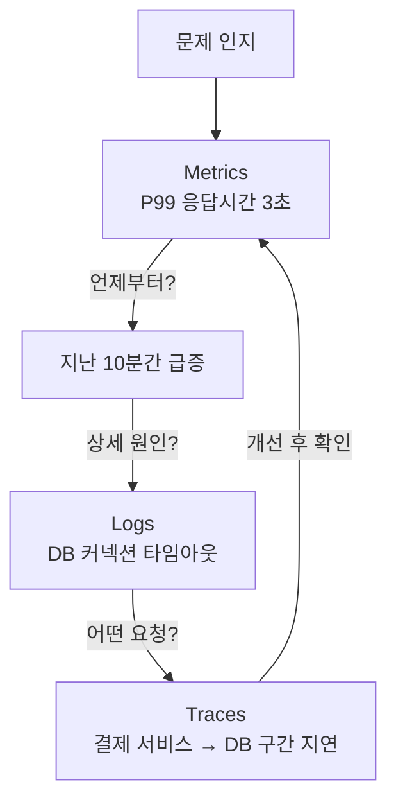
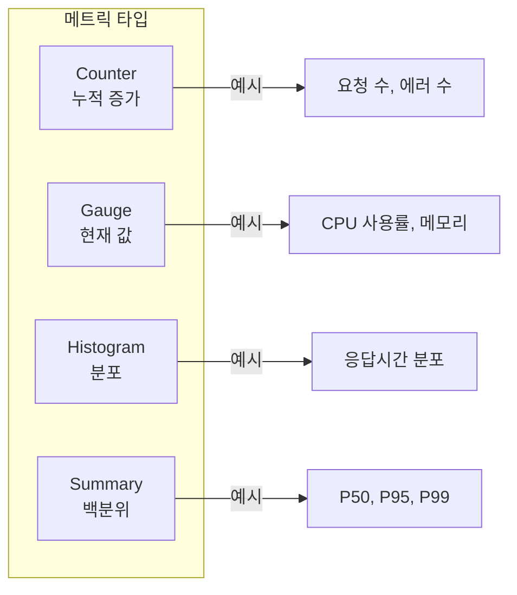
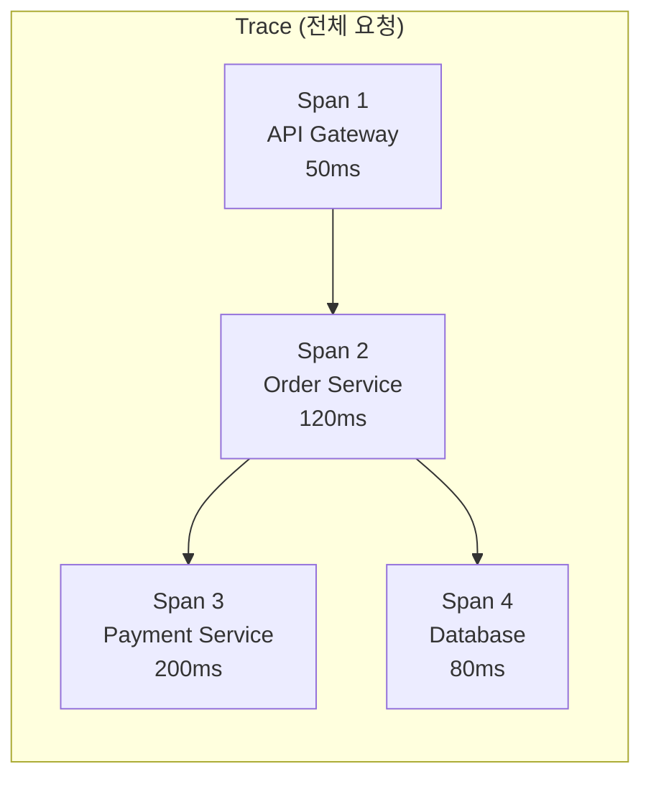
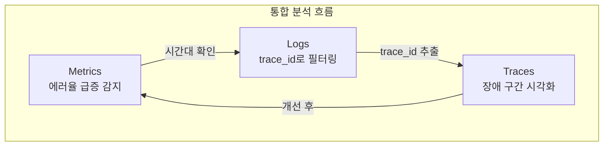

> **대상 독자**: Observability 개념을 처음 접하는 개발자
> **선수 지식**: 기본적인 웹 애플리케이션 구조 이해
> **이 문서를 읽으면**: 3요소의 역할을 이해하고 언제 무엇을 사용할지 판단할 수 있습니다

## TL;DR


**핵심 요약:**
- **Metrics**: "얼마나?" - 수치로 측정 가능한 상태 (CPU 80%, 응답시간 200ms)
- **Logs**: "무슨 일이?" - 개별 이벤트의 상세 기록
- **Traces**: "어디서 어디로?" - 요청의 전체 경로 추적
- 3요소는 **상호 보완적**이며, 함께 사용할 때 가장 효과적입니다


## 왜 3요소가 모두 필요한가?

하나의 장애 상황을 3요소로 분석해봅시다.

**상황**: "주문 API 응답이 느려졌다"



| 단계 | 사용 요소 | 얻는 정보 |
|------|----------|----------|
| 1. 이상 감지 | Metrics | "P99 응답시간이 3초로 급증" |
| 2. 시점 파악 | Metrics | "10분 전부터 시작" |
| 3. 원인 추적 | Logs | "DB 커넥션 풀 고갈, 타임아웃 발생" |
| 4. 경로 분석 | Traces | "결제 서비스 → DB 구간에서 지연" |
| 5. 개선 확인 | Metrics | "커넥션 풀 증설 후 응답시간 정상화" |


**한 요소만으로는 한계가 있습니다:**
- Metrics만: "느리다"는 알지만 "왜"인지 모름
- Logs만: 개별 이벤트는 보이지만 전체 추세 파악 어려움
- Traces만: 요청 흐름은 보이지만 시스템 전체 상태 파악 어려움


---

## Metrics (메트릭)

### 정의

메트릭은 **시간에 따라 측정된 수치 데이터**입니다. 시스템의 상태를 숫자로 표현합니다.

### 특징

| 특성 | 설명 |
|------|------|
| **집계 가능** | sum, avg, percentile 등 통계 연산 가능 |
| **저장 효율적** | 숫자만 저장하므로 용량이 작음 |
| **시계열** | 시간 축을 기준으로 추세 파악 가능 |
| **알림 적합** | 임계값 기반 자동 알림 설정 가능 |

### 메트릭 타입



### 예시

```promql
# CPU 사용률 (Gauge)
node_cpu_seconds_total

# 초당 요청 수 (Counter → rate로 변환)
rate(http_requests_total[5m])

# P99 응답시간 (Histogram)
histogram_quantile(0.99, rate(http_request_duration_seconds_bucket[5m]))
```

### 언제 사용하는가?

- 시스템 상태 모니터링 (CPU, 메모리, 디스크)
- SLA/SLO 측정 (응답시간, 가용성)
- 트렌드 분석 (트래픽 패턴, 성장률)
- 알림 조건 설정

---

## Logs (로그)

### 정의

로그는 **개별 이벤트의 텍스트 기록**입니다. 특정 시점에 무슨 일이 발생했는지 상세히 기록합니다.

### 특징

| 특성 | 설명 |
|------|------|
| **상세함** | 이벤트의 맥락과 세부 정보 포함 |
| **검색 가능** | 키워드, 패턴으로 필터링 |
| **비구조적** | 자유 형식 텍스트 (구조화 로그 권장) |
| **저장 비용** | 텍스트가 많아 용량 큼 |

### 로그 레벨

```
DEBUG   → 개발 중 상세 정보
INFO    → 정상 동작 기록
WARN    → 잠재적 문제 경고
ERROR   → 오류 발생
FATAL   → 시스템 중단 수준 오류
```

### 구조화 로그 예시

```json
{
  "timestamp": "2026-01-12T10:30:00Z",
  "level": "ERROR",
  "service": "order-service",
  "trace_id": "abc123",
  "message": "주문 생성 실패",
  "error": "재고 부족",
  "order_id": "ORD-456",
  "user_id": "USR-789"
}
```


**구조화 로그의 장점:**
- 필드별 검색/필터링 용이
- Trace ID로 분산 추적과 연결
- 자동 파싱 및 대시보드 생성 가능


### 언제 사용하는가?

- 오류 상세 원인 분석
- 디버깅 및 문제 재현
- 감사(Audit) 기록
- 비정상 패턴 탐지

---

## Traces (트레이스)

### 정의

트레이스는 **분산 시스템에서 요청이 지나가는 전체 경로**를 기록합니다. 하나의 요청이 여러 서비스를 거치는 과정을 추적합니다.

### 핵심 개념



| 용어 | 설명 |
|------|------|
| **Trace** | 하나의 요청 전체 경로 (여러 Span으로 구성) |
| **Span** | 단일 작업 단위 (시작/종료 시간, 메타데이터 포함) |
| **Trace ID** | 전체 요청을 식별하는 고유 ID |
| **Span ID** | 개별 작업을 식별하는 ID |
| **Parent Span** | 현재 Span을 호출한 상위 Span |

### Context Propagation

서비스 간 Trace ID를 전달하는 방식입니다.

```
HTTP Header 예시:
traceparent: 00-abc123-def456-01

W3C Trace Context 형식:
version-trace_id-span_id-flags
```

### 언제 사용하는가?

- 마이크로서비스 간 지연 구간 파악
- 특정 요청의 전체 흐름 시각화
- 서비스 간 의존성 분석
- 병목 지점 식별

---

## 3요소 연결하기

### Trace ID를 통한 연결



### 실전 예시: 주문 실패 분석

**1. Metrics에서 이상 감지**

```promql
# 에러율이 5% 초과
sum(rate(http_requests_total{status="500"}[5m]))
/ sum(rate(http_requests_total[5m])) > 0.05
```

**2. 해당 시간대 Logs 검색**

```
level:ERROR AND service:order-service AND timestamp:[2026-01-12T10:00 TO 2026-01-12T10:30]
```

결과에서 `trace_id: abc123` 발견

**3. Trace로 전체 경로 확인**

```
Trace ID: abc123
├─ API Gateway (10ms) ✓
├─ Order Service (50ms) ✓
├─ Payment Service (2000ms) ✗ ← 병목
└─ Inventory Service (30ms) ✓
```

**4. 결론**: Payment Service 외부 API 호출 지연

---

## 도구 선택 가이드

| 요소 | 오픈소스 도구 | 클라우드 서비스 |
|------|-------------|---------------|
| **Metrics** | Prometheus, VictoriaMetrics | CloudWatch, Datadog |
| **Logs** | Loki, Elasticsearch | CloudWatch Logs, Splunk |
| **Traces** | Jaeger, Tempo | X-Ray, Datadog APM |
| **통합** | OpenTelemetry | Datadog, New Relic |


**OpenTelemetry**는 3요소를 하나의 표준으로 통합합니다. 새 프로젝트라면 OpenTelemetry 도입을 권장합니다.


---

## 트레이드오프

| 요소 | 장점 | 단점 |
|------|------|------|
| **Metrics** | 저장 효율적, 알림 적합 | 세부 맥락 부족 |
| **Logs** | 상세한 맥락 제공 | 저장 비용 높음, 분석 어려움 |
| **Traces** | 분산 시스템 흐름 파악 | 구현 복잡, 샘플링 필요 |

### 비용 최적화 전략

1. **Metrics**: 모든 것을 측정 (저렴함)
2. **Logs**: ERROR 이상만 장기 보관, DEBUG는 단기 보관
3. **Traces**: 샘플링 적용 (전체의 1~10%)

---

## 핵심 정리

| 질문 | Metrics | Logs | Traces |
|------|---------|------|--------|
| **무엇?** | 수치 데이터 | 이벤트 기록 | 요청 경로 |
| **언제?** | 상태 모니터링 | 원인 분석 | 흐름 추적 |
| **강점?** | 트렌드, 알림 | 상세 맥락 | 분산 시스템 |

---

## 다음 단계

| 추천 순서 | 문서 | 배우는 것 |
|----------|------|----------|
| 1 | [메트릭 기초]() | Counter, Gauge, Histogram 타입 |
| 2 | [로그 수집]() | Loki vs ELK 비교 |
| 3 | [분산 추적]() | Span, Context Propagation |
