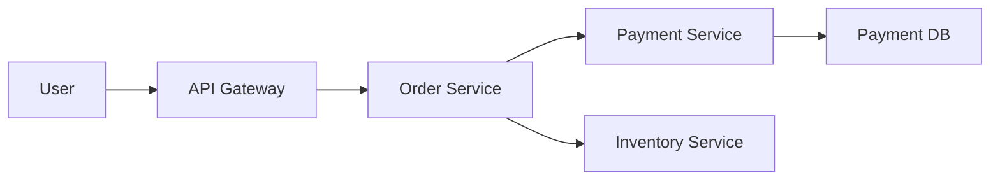

> **소요 시간**: 30분
> **선수 지식**: [Spring Boot 메트릭](spring-boot-metrics/)
> **이 문서를 읽으면**: 3요소(Metrics, Logs, Traces)를 연결하여 문제를 추적할 수 있습니다

## 목표

"에러율 급증" → "로그에서 trace_id 확인" → "트레이스로 근본 원인 파악"


*메트릭에서 에러 감지 → 로그에서 trace_id 확인 → 트레이스에서 병목 발견 → 해결로 이어지는 풀스택 분석 흐름입니다.*

## 시나리오: 주문 서비스 장애 분석

### 시스템 구성



*사용자 요청이 API Gateway → Order → Payment/Inventory 서비스로 분산되는 시스템 구성을 보여줍니다.*

## Step 1: 장애 감지 (Metrics)

### Grafana Alert 발동

```
Alert: HighErrorRate
Service: order-service
Error Rate: 5.2%
Threshold: 1%
```

### 대시보드 확인

```promql
# 에러율 급증 확인
sum(rate(http_server_requests_seconds_count{application="order-service",status=~"5.."}[5m]))
/ sum(rate(http_server_requests_seconds_count{application="order-service"}[5m]))

# 어떤 엔드포인트?
sum by (uri) (rate(http_server_requests_seconds_count{application="order-service",status=~"5.."}[5m]))
```

**결과**: `/orders` POST 엔드포인트에서 에러 발생

## Step 2: 로그 분석 (Logs)

### Loki에서 에러 로그 검색

```logql
{app="order-service"} |= "ERROR" | json

# 최근 10분간 에러
{app="order-service"} | json | level="ERROR"

# 특정 엔드포인트
{app="order-service"} |= "/orders" |= "ERROR"
```

### 로그 결과

```json
{
  "timestamp": "2026-01-12T10:30:00Z",
  "level": "ERROR",
  "service": "order-service",
  "message": "Payment processing failed",
  "traceId": "abc123def456",
  "spanId": "span001",
  "error": "Connection timeout",
  "user_id": "user-789"
}
```

**핵심 정보**: `traceId: abc123def456`

## Step 3: 트레이스 분석 (Traces)

### Tempo에서 Trace ID 검색

1. Grafana → Explore → Tempo
2. TraceID 검색: `abc123def456`

### 트레이스 결과

```
Trace: abc123def456 (Total: 3500ms)
├─ order-service: POST /orders (3500ms)
│   ├─ validateOrder (10ms) ✓
│   ├─ checkInventory (50ms) ✓
│   └─ processPayment (3400ms) ✗
│       ├─ payment-service: /process (3400ms)
│       │   └─ DB Query (3300ms) ← 병목!
```

**발견**: Payment DB 쿼리가 3.3초 소요

## Step 4: 근본 원인 분석

### DB 메트릭 확인

```promql
# DB 연결 사용률
hikaricp_connections_active{application="payment-service"}
/ hikaricp_connections_max{application="payment-service"}

# 슬로우 쿼리
rate(pg_stat_statements_total_time_seconds_sum[5m])
/ rate(pg_stat_statements_calls_total[5m])
```

**결과**: 연결 풀 포화 + 특정 쿼리 느림

### 해결

1. DB 인덱스 추가
2. 연결 풀 사이즈 증가
3. 쿼리 최적화

## 통합 설정

### Grafana 데이터소스 연결

```yaml
# grafana/provisioning/datasources/datasources.yml
apiVersion: 1
datasources:
  - name: Prometheus
    type: prometheus
    url: http://prometheus:9090
    isDefault: true

  - name: Loki
    type: loki
    url: http://loki:3100
    jsonData:
      derivedFields:
        - name: traceId
          matcherRegex: '"traceId":"([^"]+)"'
          url: '$${__value.raw}'
          datasourceUid: tempo

  - name: Tempo
    type: tempo
    url: http://tempo:3200
    jsonData:
      tracesToLogsV2:
        datasourceUid: loki
        filterByTraceID: true
        filterBySpanID: true
      tracesToMetrics:
        datasourceUid: prometheus
```

### 로그 → 트레이스 연결

Loki에서 `traceId` 필드 클릭 시 Tempo로 이동

### 트레이스 → 로그 연결

Tempo에서 Span 클릭 시 해당 시간대 Loki 로그 표시

### 트레이스 → 메트릭 연결

Tempo에서 서비스 클릭 시 Prometheus 메트릭 표시

## 대시보드 템플릿

### Unified Dashboard

```
┌─────────────────────────────────────────────────────────────┐
│ Row 1: 핵심 지표 (Prometheus)                                │
│ [P99 Latency] [RPS] [Error Rate] [Active Traces]            │
├─────────────────────────────────────────────────────────────┤
│ Row 2: 에러 로그 (Loki)                                      │
│ Live tail: {app=~".*"} | json | level="ERROR"               │
├─────────────────────────────────────────────────────────────┤
│ Row 3: 최근 트레이스 (Tempo)                                 │
│ Table: Recent traces with errors                            │
├─────────────────────────────────────────────────────────────┤
│ Row 4: 서비스 맵 (Tempo)                                     │
│ Service dependency graph                                     │
└─────────────────────────────────────────────────────────────┘
```

## 알림 → 분석 워크플로우

### 1. Alert 수신

```yaml
# Alertmanager → Slack
Alert: HighErrorRate
Service: order-service
Dashboard: https://grafana/d/order-service
Runbook: https://wiki/runbook/high-error-rate
```

### 2. 대시보드 확인

- 에러율, P99 확인
- 영향 받는 엔드포인트 식별

### 3. 로그 검색

```logql
{app="order-service"} | json | level="ERROR" | line_format "{{.traceId}}: {{.message}}"
```

### 4. 트레이스 분석

- Trace ID로 전체 경로 확인
- 느린 Span 식별

### 5. 조치

- 근본 원인 해결
- 메트릭으로 개선 확인

---

## 확인 체크리스트

- [ ] 3요소 모두 수집되는지 확인
- [ ] Loki → Tempo 연결 동작
- [ ] Tempo → Loki 연결 동작
- [ ] Tempo → Prometheus 연결 동작
- [ ] 통합 대시보드 구성

---

## 다음 단계

| 추천 순서 | 문서 | 배우는 것 |
|----------|------|----------|
| 1 | [높은 지연시간 진단](../howto/debug-high-latency/) | 문제 해결 |
| 2 | [알림 후 액션 가이드](../appendix/alerting-actions/) | 대응 방법 |
