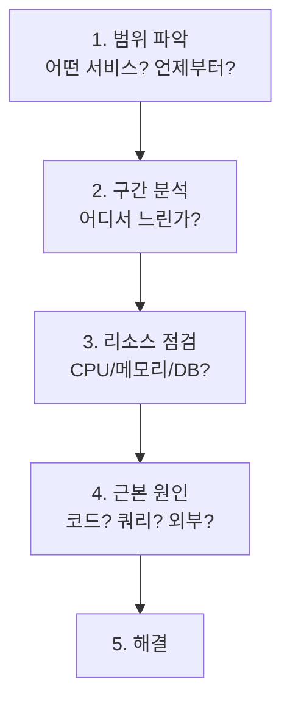

> **대상 상황**: P99 응답시간이 SLA(500ms)를 초과
> **목표**: 병목 구간을 찾아 해결
> **소요 시간**: 15~30분 (문제 복잡도에 따라 상이)
> **성공 기준**: P99 응답시간이 SLA 임계값(500ms) 이하로 복구됨

## 문제 상황

```
Alert: HighP99Latency
Service: order-service
P99: 2.5s (Threshold: 500ms)
Duration: 10 minutes
```

## 진단 워크플로우



*높은 지연시간 진단의 5단계 워크플로우로, 범위 파악부터 해결까지의 순서를 보여줍니다.*

## Step 1: 범위 파악

### 영향 범위 확인

```promql
# 어떤 서비스가 느린가?
topk(5,
  histogram_quantile(0.99,
    sum by (service, le) (rate(http_request_duration_seconds_bucket[5m]))
  )
)

# 언제부터 느려졌나?
histogram_quantile(0.99,
  sum by (le) (rate(http_request_duration_seconds_bucket{service="order-service"}[5m]))
)
# → Time range: Last 1 hour
```

### 특정 엔드포인트 확인

```promql
# 엔드포인트별 P99
histogram_quantile(0.99,
  sum by (uri, le) (rate(http_request_duration_seconds_bucket{service="order-service"}[5m]))
)
```

**결과**: `/orders` POST 엔드포인트가 느림

## Step 2: 구간 분석 (Tracing)

### 느린 트레이스 찾기

1. Grafana → Explore → Tempo
2. Duration > 2s로 필터
3. 트레이스 분석

### 트레이스 분석 결과

```
Trace: abc123 (Total: 2500ms)
├─ order-service: POST /orders (2500ms)
│   ├─ validateRequest (5ms) ✓
│   ├─ checkInventory (30ms) ✓
│   ├─ calculatePrice (10ms) ✓
│   └─ saveOrder (2400ms) ← 병목!
│       └─ DB INSERT (2350ms) ← 근본 원인
```

## Step 3: 리소스 점검

### 서비스 리소스

```promql
# CPU 사용률
100 - avg by (instance) (rate(node_cpu_seconds_total{mode="idle"}[5m])) * 100

# 메모리 사용률
(1 - node_memory_MemAvailable_bytes / node_memory_MemTotal_bytes) * 100

# GC 시간
rate(jvm_gc_pause_seconds_sum[5m])
```

### DB 리소스

```promql
# DB 연결 풀 사용률
hikaricp_connections_active / hikaricp_connections_max * 100

# 대기 중인 연결
hikaricp_connections_pending
```

**결과**: DB 연결 풀 90% 사용, 대기 연결 발생

## Step 4: 근본 원인 분석

### DB 쿼리 확인

```sql
-- PostgreSQL 슬로우 쿼리
SELECT query, calls, mean_time, total_time
FROM pg_stat_statements
ORDER BY mean_time DESC
LIMIT 10;
```

**결과**: `INSERT INTO orders` 쿼리가 느림

### 원인

1. 인덱스 없는 테이블에 대량 데이터
2. DB 연결 풀 포화
3. 트랜잭션 락 경합

## Step 5: 해결

### 즉시 조치

```yaml
# 연결 풀 증가
spring:
  datasource:
    hikari:
      maximum-pool-size: 20  # 기존 10
```

### 근본 해결

```sql
-- 인덱스 추가
CREATE INDEX idx_orders_user_id ON orders(user_id);
CREATE INDEX idx_orders_created_at ON orders(created_at);
```

### 개선 확인

```promql
# P99 변화 확인
histogram_quantile(0.99,
  sum by (le) (rate(http_request_duration_seconds_bucket{service="order-service"}[5m]))
)
```

## 예방 조치

### 알림 규칙 추가

```yaml
- alert: DBConnectionPoolHigh
  expr: hikaricp_connections_active / hikaricp_connections_max > 0.8
  for: 5m
  labels:
    severity: warning

- alert: SlowDBQueries
  expr: |
    rate(spring_data_repository_invocations_seconds_sum[5m])
    / rate(spring_data_repository_invocations_seconds_count[5m])
    > 0.5
  for: 5m
  labels:
    severity: warning
```

### Recording Rules

```yaml
- record: service:db_query_duration:avg
  expr: |
    rate(spring_data_repository_invocations_seconds_sum[5m])
    / rate(spring_data_repository_invocations_seconds_count[5m])
```

---

## 일반적인 원인과 해결

| 원인 | 증상 | 해결책 |
|------|------|--------|
| DB 쿼리 느림 | 특정 엔드포인트만 | 인덱스, 쿼리 최적화 |
| 연결 풀 부족 | 전반적 느림 | 풀 사이즈 증가 |
| GC | 주기적 스파이크 | 힙 튜닝 |
| 외부 API | 특정 호출만 | 서킷 브레이커, 타임아웃 |
| CPU 포화 | 전반적 느림 | 스케일 아웃 |

---

## 체크리스트

- [ ] 영향 범위 파악 (서비스, 엔드포인트)
- [ ] 트레이스로 병목 구간 확인
- [ ] 리소스 사용률 점검
- [ ] 근본 원인 식별
- [ ] 해결 후 메트릭 정상화 확인
- [ ] 예방 알림 추가
