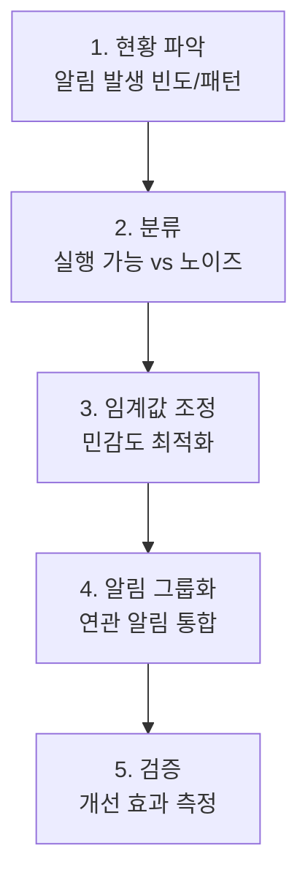

> **대상 상황**: 하루에 수십~수백 건의 알림이 발생하여 중요한 알림을 놓침
> **목표**: 실질적으로 대응이 필요한 알림만 수신
> **소요 시간**: 1~2시간 (알림 규칙 분석 및 수정)
> **성공 기준**: 일일 알림 수가 대응 가능한 수준(예: 10건 이하)으로 감소

## 시작하기 전에

### 필요 환경

| 구성요소 | 버전 | 확인 방법 |
|---------|------|----------|
| Prometheus | 2.40+ | `prometheus --version` |
| Alertmanager | 0.25+ | `alertmanager --version` |
| amtool | 0.25+ | `amtool --version` |

### 필요 권한

- Prometheus 설정 파일(`prometheus.yml`) 수정 권한
- Alertmanager 설정 파일(`alertmanager.yml`) 수정 권한
- Prometheus/Alertmanager 재시작 권한

### 환경 확인

```bash
# Prometheus 상태 확인
curl -s http://localhost:9090/-/healthy && echo "Prometheus OK"

# Alertmanager 상태 확인
curl -s http://localhost:9093/-/healthy && echo "Alertmanager OK"

# amtool 설정 확인
amtool config show --alertmanager.url=http://localhost:9093
```

## 문제 상황

```
# 어제 발생한 알림 요약
Critical: 15건 (HighCPU 8건, HighMemory 7건)
Warning: 87건 (SlowResponse 45건, HighLatency 32건, PodRestart 10건)
총: 102건

# 실제 장애: 1건
# 놓친 알림: 1건 (HighCPU 알림에 묻힘)
```

알림 피로도(Alert Fatigue)가 발생하면:
- 중요한 알림을 무시하게 됨
- 실제 장애 대응 시간이 늘어남
- 운영팀의 번아웃 발생

## 진단 워크플로우



*알림 피로도 해결을 위한 5단계 워크플로우로, 현황 파악부터 검증까지의 순서를 보여줍니다.*

## Step 1: 현황 파악

### 알림 발생 빈도 분석

```promql
# 지난 7일간 알림 발생 횟수
sum(increase(ALERTS{alertstate="firing"}[7d])) by (alertname)

# 가장 많이 발생한 알림 Top 10
topk(10, sum(increase(ALERTS{alertstate="firing"}[7d])) by (alertname))

# 시간대별 알림 패턴
sum(rate(ALERTS{alertstate="firing"}[1h])) by (alertname)
```

### 알림 지속 시간 분석

```promql
# 알림별 평균 지속 시간
avg(
  avg_over_time(ALERTS{alertstate="firing"}[7d])
) by (alertname)
```

### 결과 해석

| 패턴 | 의미 | 조치 |
|------|------|------|
| 같은 알림이 하루 10회 이상 | 임계값 문제 | 임계값 조정 또는 for 기간 증가 |
| 새벽에만 발생 | 배치 작업 관련 | 시간대별 임계값 또는 억제 |
| 5분 이내 자동 해소 | 일시적 스파이크 | for 기간 증가 |
| 여러 알림 동시 발생 | 연쇄 알림 | 그룹화 또는 상관관계 설정 |

## Step 2: 알림 분류

### 실행 가능성 기준

모든 알림을 다음 기준으로 분류하세요.

| 분류 | 정의 | 예시 | 조치 |
|------|------|------|------|
| **즉시 대응** | 지금 당장 사람이 개입해야 함 | 서비스 다운, 데이터 유실 | 유지 |
| **지연 대응** | 근무 시간 내 확인 필요 | 디스크 70% 사용 | Warning으로 변경 |
| **자동 해소** | 시스템이 자동 복구함 | 일시적 CPU 스파이크 | for 기간 증가 |
| **정보성** | 대응 불필요, 참고만 | 배포 완료 | 알림 제거, 대시보드로 |

### 알림 규칙 감사

각 알림에 대해 다음 질문을 하세요:

1. 이 알림을 받으면 무엇을 해야 하는가?
2. 새벽 3시에 이 알림으로 깨워도 괜찮은가?
3. 이 알림 없이 문제를 발견할 수 있는가?

## Step 3: 임계값 조정

### for 기간 증가

```yaml
# Before: 일시적 스파이크에도 알림
- alert: HighCPU
  expr: avg(rate(node_cpu_seconds_total{mode="idle"}[1m])) < 0.1
  for: 1m  # 1분만 지속해도 알림

# After: 지속적인 문제만 알림
- alert: HighCPU
  expr: avg(rate(node_cpu_seconds_total{mode="idle"}[5m])) < 0.1
  for: 10m  # 10분 이상 지속 시에만 알림
```


**for 기간 설정 가이드**
- 일시적 스파이크가 잦은 메트릭: 10~15분
- 안정적인 메트릭: 5분
- 즉시 대응 필요: 1~2분


### 동적 임계값 사용

```yaml
# Before: 고정 임계값
- alert: HighLatency
  expr: http_request_duration_seconds > 1

# After: 과거 대비 상대 임계값
- alert: HighLatency
  expr: |
    http_request_duration_seconds
    >
    avg_over_time(http_request_duration_seconds[7d]) * 1.5
  for: 10m
  annotations:
    description: "현재 응답시간이 지난 7일 평균의 1.5배 초과"
```

### 백분위 기반 임계값

```yaml
# Before: 평균값 기준 (이상치에 민감)
- alert: SlowResponse
  expr: avg(http_request_duration_seconds) > 0.5

# After: P95 기준 (안정적)
- alert: SlowResponse
  expr: |
    histogram_quantile(0.95,
      sum by (le) (rate(http_request_duration_seconds_bucket[5m]))
    ) > 1
  for: 5m
```

## Step 4: 알림 그룹화

### Alertmanager 그룹화 설정

```yaml
# alertmanager.yml
route:
  receiver: 'default'
  group_by: ['alertname', 'service']  # 서비스별로 그룹화
  group_wait: 30s      # 첫 알림 대기
  group_interval: 5m   # 그룹 내 새 알림 추가 간격
  repeat_interval: 4h  # 동일 알림 재발송 간격

  routes:
    # Critical은 즉시 발송
    - match:
        severity: critical
      receiver: 'pagerduty'
      group_wait: 10s
      repeat_interval: 1h

    # Warning은 그룹화하여 발송
    - match:
        severity: warning
      receiver: 'slack-warning'
      group_wait: 5m
      group_interval: 10m
      repeat_interval: 12h
```


**설정 변경 후 반드시 검증하세요**

```bash
# 설정 문법 검사
amtool check-config alertmanager.yml

# 설정 적용 (재시작 없이)
curl -X POST http://localhost:9093/-/reload
```


### 연쇄 알림 억제

```yaml
# alertmanager.yml
inhibit_rules:
  # 서비스 다운 시 관련 하위 알림 억제
  - source_match:
      alertname: 'ServiceDown'
    target_match_re:
      alertname: 'HighLatency|HighErrorRate|SlowResponse'
    equal: ['service']

  # Critical 발생 시 같은 서비스의 Warning 억제
  - source_match:
      severity: 'critical'
    target_match:
      severity: 'warning'
    equal: ['service']
```

### 시간대별 억제 (Silences)

```bash
# 배포 중 알림 억제 (2시간)
amtool silence add alertname=~"High.*" \
  --alertmanager.url=http://localhost:9093 \
  --comment="Deployment in progress" \
  --duration=2h

# 정기 점검 시간대 알림 억제
amtool silence add service="batch-service" \
  --alertmanager.url=http://localhost:9093 \
  --comment="Scheduled maintenance" \
  --start="2026-01-16T02:00:00Z" \
  --end="2026-01-16T04:00:00Z"
```

## Step 5: 검증

### 개선 메트릭 측정

```promql
# 일일 알림 수 (개선 전후 비교)
sum(increase(ALERTS{alertstate="firing"}[24h]))

# 알림 품질 지표: 실제 대응이 필요했던 비율
# (별도 레이블링 필요)
sum(ALERTS{alertstate="firing", actioned="true"})
/
sum(ALERTS{alertstate="firing"})
```

### 성공 기준 체크리스트

- [ ] 일일 알림 수가 50% 이상 감소
- [ ] Critical 알림의 실제 대응 비율 90% 이상
- [ ] 동일 알림 반복 발생 5회 이하
- [ ] 새벽 시간대 불필요한 알림 제거

## 모범 사례

### 알림 설계 원칙

```yaml
# 좋은 알림의 조건
- alert: OrderProcessingFailed
  expr: |
    rate(order_processing_failures_total[5m])
    > 0.1 * rate(order_processing_total[5m])
  for: 5m
  labels:
    severity: critical
    runbook: "https://wiki.example.com/runbook/order-failures"
  annotations:
    summary: "주문 처리 실패율 10% 초과"
    description: "{{ $labels.service }}의 주문 처리 실패율이 {{ $value | humanizePercentage }}입니다."
    action: "1. 로그 확인 2. DB 연결 점검 3. 외부 API 상태 확인"
```

**좋은 알림의 특징:**
1. **실행 가능**: 무엇을 해야 하는지 명확함
2. **Runbook 링크**: 상세 대응 절차 연결
3. **컨텍스트 제공**: 현재 값, 영향 범위 포함
4. **적절한 임계값**: 노이즈 없이 실제 문제만 감지

### 알림 수준 가이드

| 수준 | 기준 | 대응 시간 | 알림 채널 |
|------|------|----------|----------|
| **Critical** | 서비스 장애, 데이터 유실 위험 | 즉시 (24/7) | PagerDuty, 전화 |
| **Warning** | 성능 저하, 용량 임계 접근 | 4시간 이내 | Slack |
| **Info** | 참고 사항 | 다음 근무일 | 이메일, 대시보드 |

## 자주 발생하는 오류

### "No alert rules found"

```
level=warn msg="No alert rules found"
```

**원인**: `prometheus.yml`에 rule_files 설정 누락

**해결**:
```yaml
# prometheus.yml
rule_files:
  - /etc/prometheus/rules/*.yml
```

### "YAML parsing error"

```
level=error msg="Loading configuration file failed" err="yaml: line 15: did not find expected key"
```

**원인**: YAML 들여쓰기 오류

**해결**: YAML 문법 검사 후 수정
```bash
promtool check rules /etc/prometheus/rules/alerts.yml
```

### "Inhibition rule not working"

**원인**: `equal` 라벨이 source와 target 알림 모두에 존재하지 않음

**해결**: 억제 규칙의 `equal` 라벨이 양쪽 알림에 있는지 확인
```bash
# 알림 라벨 확인
amtool alert query --alertmanager.url=http://localhost:9093
```

## 추가 자료

- [Prometheus Alerting 공식 문서](https://prometheus.io/docs/alerting/latest/overview/)
- [Alertmanager Configuration](https://prometheus.io/docs/alerting/latest/configuration/)
- [Google SRE Book - Alerting](https://sre.google/sre-book/monitoring-distributed-systems/)
- [Rob Ewaschuk - My Philosophy on Alerting](https://docs.google.com/document/d/199PqyG3UsyXlwieHaqbGiWVa8eMWi8zzAn0YfcApr8Q/edit)

---

## 체크리스트

- [ ] 지난 7일간 알림 빈도 분석 완료
- [ ] 각 알림의 실행 가능성 분류
- [ ] 노이즈 알림 임계값 조정 또는 제거
- [ ] Alertmanager 그룹화 설정
- [ ] 연쇄 알림 억제 규칙 추가
- [ ] 설정 변경 후 문법 검사 완료
- [ ] 개선 후 알림 수 50% 감소 확인
