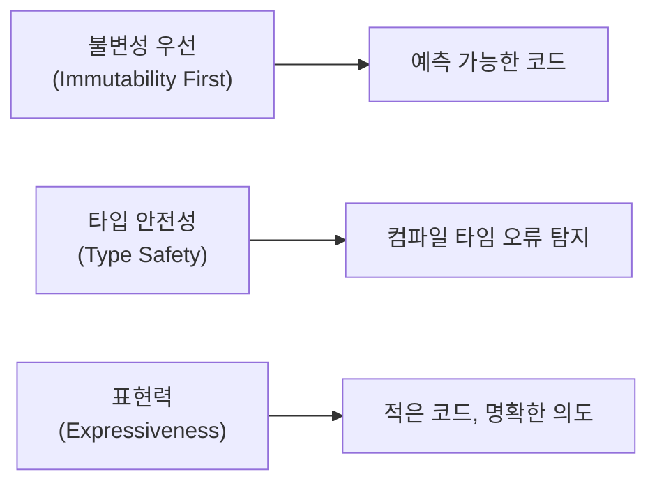
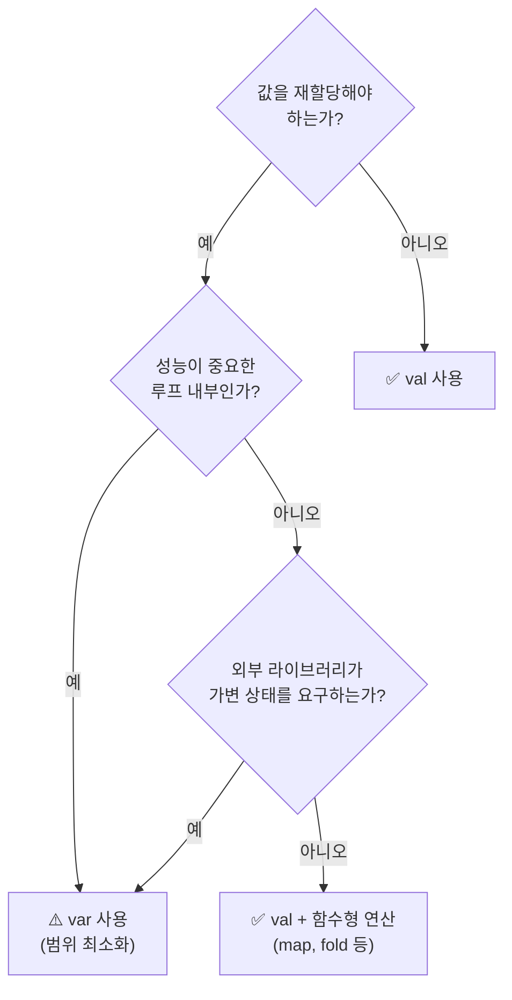
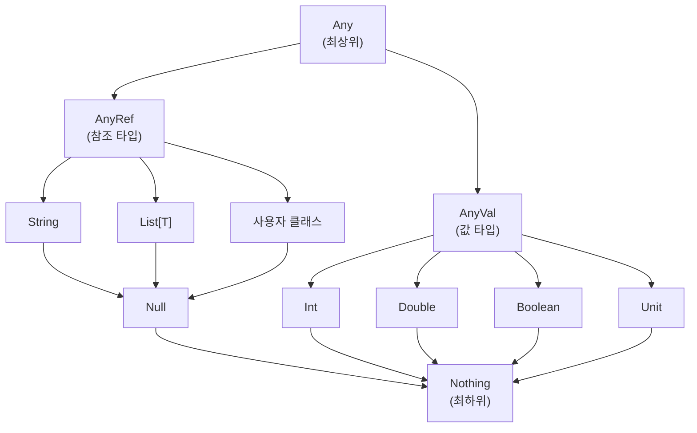

## 전체 비유: 건축 자재 선택

Scala의 기본 문법을 **건축 자재 선택**에 비유하면 이해하기 쉽습니다:

| 건축 비유 | Scala 개념 | 역할 |
|----------|-----------|------|
| 콘크리트 (영구 고정) | val (불변) | 한 번 정하면 변경 불가 |
| 이동식 파티션 | var (가변) | 필요시 재배치 가능 |
| 조립식 자재 | lazy val | 필요할 때 조립 |
| 건물 설계도 | 타입 시스템 | 구조적 안전성 보장 |
| 자동 측량 | 타입 추론 | 컴파일러가 치수 계산 |
| 모듈형 템플릿 | 문자열 보간 | 재사용 가능한 형식 |
| 건축 표준 | 타입 계층 | 일관된 호환성 규칙 |

이처럼 좋은 건물이 적절한 자재 선택에서 시작하듯, 좋은 Scala 코드는 올바른 변수 선언과 타입 활용에서 시작합니다.

---

> **대상 독자**: Java 또는 다른 정적 타입 언어 경험이 있는 개발자
> **선수 지식**: 변수, 함수, 클래스의 기본 개념
> **이 문서를 읽으면**: Scala의 val/var 차이를 이해하고, 타입 시스템을 활용하며, 문자열 보간으로 깔끔한 코드를 작성할 수 있습니다


- **val**(불변)을 기본으로, **var**(가변)는 꼭 필요할 때만 사용하세요
- Scala는 **타입 추론**이 강력해서 대부분 타입 선언을 생략할 수 있습니다
- **문자열 보간**(`s"Hello, $name"`)으로 문자열 조합이 간편합니다
- 모든 값은 객체입니다 — `1.toString`처럼 메서드를 호출할 수 있습니다


#### 왜 Scala의 기본 문법을 알아야 하나?

Scala는 Java와 100% 호환되면서도 더 간결하고 표현력 있는 코드를 작성할 수 있게 해줍니다. 같은 로직을 Java보다 적은 코드로 작성할 수 있고, 컴파일 타임에 더 많은 오류를 잡아냅니다.

**Scala의 설계 철학**

Scala의 기본 문법은 세 가지 핵심 철학을 반영합니다:



*Scala의 설계 철학은 불변성, 타입 안전성, 표현력의 균형을 추구합니다. 이 세 가지가 조화를 이루어 안전하면서도 간결한 코드를 가능하게 합니다.*

| 철학 | 적용 | 결과 |
|------|------|------|
| **불변성 우선** | `val`을 기본으로 사용 | 상태 추적 불필요, 동시성 안전 |
| **타입 안전성** | 정적 타입 + 추론 | 런타임 오류를 컴파일 타임에 발견 |
| **표현력** | 문자열 보간, 케이스 클래스 | 보일러플레이트 제거, 의도 중심 코드 |

```java
// Java: 15줄
public class Person {
    private final String name;
    private final int age;

    public Person(String name, int age) {
        this.name = name;
        this.age = age;
    }

    public String getName() { return name; }
    public int getAge() { return age; }
    // equals, hashCode, toString 생략...
}
```

```scala
// Scala: 1줄
case class Person(name: String, age: Int)
```

이런 간결함의 기반이 되는 것이 바로 Scala의 기본 문법입니다.

---

#### 변수와 상수

Scala에서는 `val`(불변)과 `var`(가변) 두 가지 방식으로 값을 선언합니다.

**비유로 이해하기**: `val`은 **영구 마커로 쓴 이름표**와 같습니다. 한 번 붙이면 바꿀 수 없습니다. `var`는 **화이트보드에 쓴 메모**와 같습니다. 언제든 지우고 다시 쓸 수 있지만, 누가 언제 바꿨는지 추적하기 어렵습니다.

**val - 불변 (권장)**

`val`로 선언한 값은 재할당할 수 없습니다. 함수형 프로그래밍의 핵심 원칙입니다.

```scala
val name = "Scala"
val year = 2024
val pi = 3.14159

// 재할당 불가
// name = "Java"  // 컴파일 에러!
```

**왜 불변이 좋은가?**

| 장점 | 설명 |
|------|------|
| **예측 가능성** | 값이 변하지 않으므로 코드 흐름을 추적하기 쉽습니다 |
| **스레드 안전** | 여러 스레드가 동시에 읽어도 문제가 없습니다 |
| **디버깅 용이** | "이 값이 언제 바뀌었지?"를 고민할 필요가 없습니다 |
| **컴파일러 최적화** | 값이 불변임을 알면 컴파일러가 더 효율적인 코드를 생성합니다 |

**var - 가변**

`var`로 선언한 값은 재할당할 수 있습니다. **정말 필요한 경우에만** 사용하세요.

```scala
var count = 0
count = count + 1  // OK
count += 1         // OK (축약형)

var message = "Hello"
message = "World"  // OK
```

**언제 var를 사용하나?**

- 성능이 중요한 루프 내부에서 누적 계산이 필요할 때
- 외부 라이브러리가 가변 상태를 요구할 때
- 점진적으로 값을 수집해야 할 때 (Builder 패턴)

> ⚠️ **주의**: 가능하면 `var` 대신 `val`과 함수형 연산(`map`, `fold` 등)을 사용하세요.

**val vs var 선택 가이드**



*val과 var 중 어떤 것을 선택할지 결정하는 흐름도입니다. 기본적으로 val을 사용하고, 정말 필요한 경우에만 var를 제한적으로 사용합니다.*

**지연 초기화 (lazy val)**

`lazy val`은 **처음 접근할 때** 초기화됩니다. 비용이 큰 계산이나 리소스 로딩을 필요할 때까지 미룰 수 있습니다.

**비유로 이해하기**: `lazy val`은 **주문 후 조리하는 음식**과 같습니다. 미리 만들어두지 않고, 손님이 주문하면 그때 조리를 시작합니다. 한 번 만들면 같은 주문에는 캐시된 음식을 제공합니다.

```scala
lazy val expensiveValue = {
  println("계산 중...")
  Thread.sleep(1000)
  42
}

println("선언됨")          // 즉시 출력
println(expensiveValue)   // 여기서 "계산 중..." 출력, 1초 대기
println(expensiveValue)   // 캐시된 42 즉시 반환, 재계산 없음
```


- **val**: 불변, 기본으로 사용 → `val name = "Scala"`
- **var**: 가변, 꼭 필요할 때만 → `var count = 0`
- **lazy val**: 지연 초기화, 비용 큰 계산에 → `lazy val config = loadConfig()`


---

#### 타입 시스템

Scala는 정적 타입 언어이지만, 강력한 **타입 추론** 덕분에 Java처럼 매번 타입을 명시하지 않아도 됩니다.

**왜 정적 타입인가?**

| 동적 타입 (Python, JS) | 정적 타입 (Scala, Java) |
|------------------------|-------------------------|
| 런타임에 타입 오류 발견 | 컴파일 타임에 타입 오류 발견 |
| 빠른 프로토타이핑 | 대규모 리팩토링에 안전 |
| IDE 자동완성 제한적 | 강력한 IDE 지원 |

Scala는 정적 타입의 안전성과 동적 타입의 간결함을 모두 제공합니다.

**기본 타입**

Scala의 모든 값은 객체입니다. Java의 원시 타입(primitive)도 Scala에서는 객체로 취급됩니다.

```scala
val n = 42
n.toString      // "42" - Int도 객체이므로 메서드 호출 가능
n.to(50)        // Range(42, 43, 44, ..., 50)
1.+(2)          // 3 - 연산자도 메서드!
```

| 타입 | 설명 | 예시 |
|------|------|------|
| `Int` | 32비트 정수 | `val i = 42` |
| `Long` | 64비트 정수 | `val l = 1234567890L` |
| `Double` | 64비트 부동소수점 | `val d = 3.14159` |
| `Boolean` | 참/거짓 | `val flag = true` |
| `String` | 문자열 | `val s = "Hello"` |
| `Unit` | 값 없음 (Java의 void) | `val u = ()` |

위 표는 Scala에서 가장 자주 사용하는 기본 타입들을 정리한 것입니다. Java와 달리 모든 타입이 객체이므로 메서드를 호출할 수 있습니다.

**타입 계층 구조**

Scala의 타입은 명확한 계층 구조를 가집니다.



*위 다이어그램은 Scala 타입 계층을 보여줍니다. Any가 모든 타입의 최상위이고, Nothing이 모든 타입의 최하위입니다. AnyVal은 값 타입(Int, Double 등)의 부모이고, AnyRef는 참조 타입(String, List, 사용자 클래스)의 부모입니다.*

**비유로 이해하기**: 타입 계층은 **가족 족보**와 같습니다. `Any`는 모든 타입의 조상이고, `Nothing`은 모든 타입의 후손입니다. 조상의 자리에는 후손을 넣을 수 있습니다 (다형성).

| 타입 | 역할 | 언제 만나나? |
|------|------|-------------|
| `Any` | 모든 타입의 조상 | 여러 타입을 하나로 다룰 때 |
| `AnyVal` | 값 타입의 부모 | Int, Double 등의 공통 조상 |
| `AnyRef` | 참조 타입의 부모 | Java의 Object와 동일 |
| `Null` | null의 타입 | (가능하면 사용하지 마세요) |
| `Nothing` | 모든 타입의 후손 | 예외, 빈 컬렉션, Option.None |

**Nothing은 언제 사용될까?**

**비유로 이해하기**: `Nothing`은 **어디에나 들어갈 수 있는 만능 어댑터**와 같습니다. 빈 박스(Nil)는 어떤 물건을 담는 박스 자리에도 놓을 수 있고, "물건 없음"(None)은 어떤 물건이든 있을 수 있는 자리에 놓을 수 있습니다. `Nothing`이 모든 타입의 하위 타입이기 때문에 이런 유연성이 가능합니다.

`Nothing`은 **정상적으로 값을 반환하지 않는 경우**에 사용됩니다.

```scala
// 1. 예외를 던지는 함수
def fail(message: String): Nothing =
  throw new RuntimeException(message)

// Nothing은 모든 타입의 하위 타입이므로 어디서나 사용 가능
val result: Int = if (true) 42 else fail("error")

// 2. 빈 컬렉션의 타입
val empty: List[Nothing] = Nil  // List[Int], List[String] 등에 할당 가능

// 3. Option.None의 타입
val none: Option[Nothing] = None  // Option[Int], Option[String] 등에 할당 가능
```

**왜 유용한가?** `Nothing`이 모든 타입의 하위 타입이기 때문에, `Nil`이나 `None`을 어떤 타입의 리스트나 Option에도 사용할 수 있습니다.


- 모든 값은 객체 — `1.toString`, `true.&&(false)` 가능
- `Any` → `AnyVal`(값) / `AnyRef`(참조) → 구체적 타입 → `Nothing`
- `Nothing`은 빈 컬렉션, None, 예외 등에서 타입 호환성을 제공


---

#### 타입 추론

Scala 컴파일러는 대부분의 경우 타입을 자동으로 추론합니다.

**Java vs Scala 비교**

```java
// Java: 타입 명시 필수
Map<String, List<Integer>> map = new HashMap<String, List<Integer>>();
List<String> names = Arrays.asList("Alice", "Bob");
```

```scala
// Scala: 타입 추론
val map = Map("a" -> List(1, 2), "b" -> List(3, 4))  // Map[String, List[Int]]
val names = List("Alice", "Bob")                      // List[String]
```

**추론되는 경우**

```scala
val name = "Scala"     // String으로 추론
val count = 42         // Int로 추론
val pi = 3.14          // Double로 추론
val flag = true        // Boolean으로 추론
val numbers = List(1, 2, 3)  // List[Int]로 추론
```

**명시적 타입 선언이 필요한 경우**

| 상황 | 예시 | 이유 |
|------|------|------|
| 특정 타입 원할 때 | `val n: Long = 42` | Int 대신 Long 필요 |
| 빈 컬렉션 | `val list: List[Int] = List()` | 요소가 없어 추론 불가 |
| 함수 매개변수 | `def greet(name: String)` | 항상 명시 필요 |
| 재귀 함수 반환 | `def fact(n: Int): Int = ...` | 자기 참조로 추론 불가 |
| API 문서화 | `def process(data: Data): Result` | 가독성 향상 |

```scala
// 1. 특정 타입을 원할 때
val longNum: Long = 42        // Int 대신 Long
val floatNum: Float = 3.14f   // Double 대신 Float

// 2. 빈 컬렉션
val emptyList: List[Int] = List()
val emptyMap: Map[String, Int] = Map()

// 3. 함수 매개변수 (항상 필요)
def greet(name: String): String = s"Hello, $name"

// 4. 재귀 함수의 반환 타입
def factorial(n: Int): Int =
  if (n <= 1) 1 else n * factorial(n - 1)
```


- 대부분의 경우 타입 생략 가능 — 컴파일러가 추론
- 빈 컬렉션, 함수 매개변수, 재귀 함수에서는 명시 필요
- 공개 API에서는 가독성을 위해 명시하는 것이 좋음


---

#### 문자열

Scala는 강력한 **문자열 보간(String Interpolation)** 기능을 제공합니다.

**비유로 이해하기**: 문자열 보간은 **우편물 양식**과 같습니다. "안녕하세요 ___님, 주문번호 ___의 배송이 완료되었습니다"처럼 빈칸만 채우면 완성되는 템플릿입니다. Java의 `+` 연결은 각 조각을 풀로 붙이는 것과 같고, Scala의 보간은 미리 디자인된 양식에 도장을 찍는 것과 같습니다.

**Java vs Scala 비교**

```java
// Java: 문자열 연결
String msg = "Hello, " + name + "! You are " + age + " years old.";
String formatted = String.format("Pi is %.2f", pi);
```

```scala
// Scala: 문자열 보간
val msg = s"Hello, $name! You are $age years old."
val formatted = f"Pi is $pi%.2f"
```

**s-보간: 변수 삽입**

가장 기본적인 형태로, `$` 기호로 변수를 삽입합니다.

```scala
val name = "Scala"
val version = 3

println(s"$name $version")           // Scala 3
println(s"${name.toUpperCase}")      // SCALA (표현식은 ${} 사용)
println(s"1 + 1 = ${1 + 1}")         // 1 + 1 = 2
```

**f-보간: 포맷팅**

printf 스타일의 포맷팅을 지원합니다.

```scala
val pi = 3.14159
val count = 42

println(f"pi = $pi%.2f")          // pi = 3.14 (소수점 2자리)
println(f"count = $count%05d")    // count = 00042 (5자리, 0 채움)
println(f"hex = $count%x")        // hex = 2a (16진수)
```

**raw-보간: 이스케이프 무시**

정규식이나 파일 경로에서 유용합니다.

```scala
println(raw"Hello\nWorld")  // Hello\nWorld (줄바꿈 안 됨)
println(s"Hello\nWorld")    // Hello
                            // World (줄바꿈 됨)

val regex = raw"\d+\.\d+"   // 이스케이프 없이 정규식 작성
```

**여러 줄 문자열**

삼중 따옴표(`"""`)를 사용하면 여러 줄 문자열을 작성할 수 있습니다.

```scala
val sql = """
  SELECT *
  FROM users
  WHERE age > 18
"""

// stripMargin으로 앞쪽 공백 제거
val formatted = """
  |SELECT *
  |FROM users
  |WHERE age > 18
  """.stripMargin
```

`stripMargin` 메서드는 각 줄 앞의 `|` 문자까지를 제거합니다. 이를 통해 코드의 들여쓰기를 유지하면서 깔끔한 문자열을 만들 수 있습니다.


- **s-보간**: 변수 삽입 → `s"Hello, $name"`
- **f-보간**: 포맷팅 → `f"$price%.2f원"`
- **raw-보간**: 이스케이프 무시 → `raw"\d+"`
- **삼중 따옴표**: 여러 줄 → `"""...""".stripMargin`


---

#### Scala 2 vs Scala 3 차이점

대부분의 기본 문법은 동일합니다. 가장 큰 차이점은 들여쓰기 기반 구문과 진입점 정의 방식입니다.

| 기능 | Scala 2 | Scala 3 |
|------|---------|---------|
| 진입점 | `object Main { def main(...) }` | `@main def hello()` |
| 블록 구분 | 중괄호 필수 | 들여쓰기 기반 (선택) |
| 와일드카드 import | `import pkg._` | `import pkg.*` |
| 타입 교차 | `with` | `&` |
| 타입 합집합 | 없음 | `A | B` |

**기본 문법**


{}
```scala
// 들여쓰기 기반 문법 (선택)
@main def hello() =
  val name = "World"
  println(s"Hello, $name!")

// 중괄호도 여전히 사용 가능
@main def hello2(): Unit = {
  val name = "World"
  println(s"Hello, $name!")
}
```
{}
{}
```scala
// 중괄호 필수
object Main {
  def main(args: Array[String]): Unit = {
    val name = "World"
    println(s"Hello, $name!")
  }
}
```
{}


**와일드카드 import**


{}
```scala
import scala.collection.mutable.*
```
{}
{}
```scala
import scala.collection.mutable._
```
{}


---

#### 흔한 실수와 해결책

Scala 초보자들이 자주 하는 실수와 올바른 해결 방법입니다.

| 실수 | 문제점 | 해결책 |
|------|--------|--------|
| `var` 남용 | 상태 추적 어려움 | `val` + 함수형 연산 사용 |
| `null` 사용 | NPE 위험 | `Option` 사용 |
| 타입 추론 과신 | `Any`로 추론됨 | 복잡한 표현식은 타입 명시 |
| `Unit` 무시 | 의도치 않은 버그 | 반환값 확인 |

**피해야 할 것**

```scala
// 1. 무분별한 var 사용
var list = List(1, 2, 3)
list = list :+ 4  // 매번 새 리스트 생성 - 비효율적!

// 2. null 사용
val name: String = null  // NullPointerException 위험!

// 3. 타입 추론에 과도한 의존
val x = if (condition) 1 else "error"  // Any로 추론됨 - 타입 안전성 손실

// 4. Unit을 반환하는 표현식 무시
val result = list.foreach(println)  // result는 Unit - 의도한 것인가?
```

**올바른 방법**

```scala
// 1. val과 불변 연산 사용
val list = List(1, 2, 3)
val newList = list :+ 4  // 새 리스트를 새 val에 할당

// 2. Option 사용
val name: Option[String] = None
name.foreach(n => println(s"Hello, $n"))  // 안전한 접근

// 3. 복잡한 표현식은 타입 명시
val x: Either[String, Int] = if (condition) Right(1) else Left("error")

// 4. Unit 반환 함수는 명확히 표시
def printAll(list: List[Int]): Unit = list.foreach(println)
```


- ❌ `var` → ✅ `val` + 함수형 연산
- ❌ `null` → ✅ `Option[T]`
- ❌ `Any` 추론 → ✅ `Either[L, R]` 또는 타입 명시


---

#### 연습 문제

다음 연습 문제들을 통해 기본 문법을 복습해보세요.

**1. 변수 선언**

다음 코드의 출력 결과를 예측하세요.

```scala
val x = 10
var y = 20
y = y + x
println(s"x = $x, y = $y")
```

<details>
<summary>정답 보기</summary>

```
x = 10, y = 30
```

`x`는 `val`이므로 10으로 고정, `y`는 `var`이므로 20 + 10 = 30으로 변경됩니다.

</details>

**2. 타입 추론**

다음 변수들의 타입을 추론하세요.

```scala
val a = 42
val b = 3.14
val c = "Hello"
val d = List(1, 2, 3)
val e = Map("a" -> 1, "b" -> 2)
```

<details>
<summary>정답 보기</summary>

- `a`: `Int`
- `b`: `Double`
- `c`: `String`
- `d`: `List[Int]`
- `e`: `Map[String, Int]`

</details>

**3. 문자열 보간**

이름과 나이를 받아 "홍길동님은 25세입니다." 형식으로 출력하는 코드를 작성하세요.

<details>
<summary>정답 보기</summary>

```scala
val name = "홍길동"
val age = 25
println(s"${name}님은 ${age}세입니다.")
```

</details>

---

#### 관련 개념

| 개념 | 연관성 | 설명 |
|------|--------|------|
| [제어 구조]() | **다음 학습** | if, for, while도 표현식으로 값을 반환 |
| [함수와 메서드]() | **다음 학습** | 함수 정의와 고급 기능 |
| [케이스 클래스]() | **불변성 적용** | val 철학을 데이터 모델에 적용 |
| [패턴 매칭]() | **타입 활용** | 타입 계층을 활용한 분기 처리 |

---

#### 다음 단계

기본 문법을 익혔다면 다음 주제로 진행하세요.

| 추천 순서 | 문서 | 배우는 것 |
|----------|------|----------|
| 1 | [제어 구조]() | if, for, while, match 표현식 |
| 2 | [함수와 메서드]() | 함수 정의와 고급 기능 |
