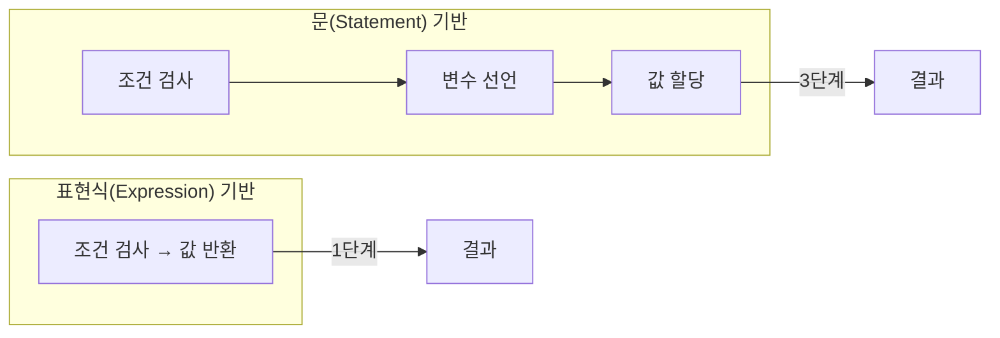
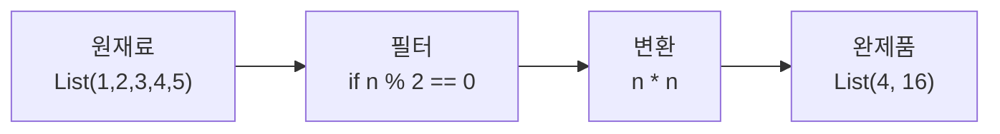
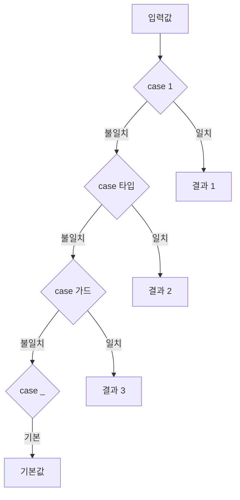

## 전체 비유: 교통 시스템

Scala의 제어 구조를 <strong>교통 시스템</strong>에 비유하면 이해하기 쉽습니다:

| 교통 시스템 비유 | Scala 개념 | 역할 |
|-----------------|-----------|------|
| 교차로 (갈림길 선택) | if 표현식 | 조건에 따라 경로 선택 |
| 순환버스 (정해진 경로 순회) | for 표현식 | 컬렉션 순회 및 변환 |
| 환승 연계 (A→B→C 연결) | for comprehension | 다중 컬렉션 조합 |
| 정류장 안내 (목적지별 분류) | match 표현식 | 값/타입에 따른 분기 |
| 무한 루프선 (조건 만족까지) | while 루프 | 가변 상태 기반 반복 |
| 티켓 발권 (입력→출력) | 표현식 | 모든 것이 값을 반환 |

이처럼 교통 시스템이 승객을 목적지로 안내하듯, 제어 구조는 데이터를 원하는 결과로 흐르게 합니다.

---


- Scala의 if, for, match는 모두 <strong>표현식</strong>으로 값을 반환합니다
- for comprehension은 컬렉션 변환과 모나딕 연산을 간결하게 표현합니다
- match는 Java switch보다 강력하며 타입 매칭, 가드 조건을 지원합니다
- while은 문(statement)이므로 함수형 코드에서는 가급적 피합니다


**소요 시간**: 약 25-30분

**대상 독자:** Java/Python 등 다른 언어 경험이 있는 개발자
**선수 지식:** Scala 기본 문법(변수, 타입)

Scala의 제어 구조는 **표현식(expression)**입니다. 즉, 모든 제어 구조가 값을 반환합니다. 이는 Java나 C와 같은 언어의 문(statement) 기반 제어 구조와 근본적으로 다릅니다. 표현식 기반 접근 방식은 코드를 더 간결하고 함수형으로 만듭니다.

#### 왜 표현식이 중요한가?



*표현식 기반 접근은 중간 단계를 줄여 코드를 간결하게 만듭니다. 변수를 선언하고 나중에 할당하는 대신, 조건 검사 자체가 값을 반환합니다.*

| 문(Statement) 방식 | 표현식(Expression) 방식 | 장점 |
|-------------------|------------------------|------|
| 변수 선언 후 조건부 할당 | 조건 검사가 곧 값 | 불변 변수 사용 가능 |
| 부수 효과 중심 | 값 중심 | 순수 함수와 조합 용이 |
| 상태 추적 필요 | 데이터 흐름 추적 | 디버깅 용이 |

**철학**: Scala는 "모든 것은 값이다"라는 철학을 따릅니다. 제어 구조도 예외가 아닙니다. 이 철학 덕분에 `val`을 기본으로 사용하면서도 조건부 로직을 자연스럽게 표현할 수 있습니다.

---

#### if 표현식

Scala의 `if`는 문(statement)이 아니라 표현식(expression)입니다. 따라서 삼항 연산자가 필요 없으며, if 자체가 값을 반환합니다.

**비유로 이해하기**: if 표현식은 **자판기**와 같습니다. 버튼을 누르면(조건 평가) 해당 음료(값)가 나옵니다. Java의 if-statement는 자판기에서 음료를 받아 별도의 컵에 담는 것이고, Scala의 if-expression은 자판기가 직접 컵에 담아주는 것입니다.

**기본 사용법**

```scala
val x = 10

// if 표현식은 값을 반환
val result = if (x > 5) "크다" else "작거나 같다"
println(result)  // 크다

// 삼항 연산자가 필요 없음 (if 자체가 값을 반환)
val max = if (a > b) a else b
```

**Scala 3 문법**

Scala 3에서는 `then` 키워드를 사용하여 더 자연스러운 문법으로 조건문을 작성할 수 있습니다. 괄호를 생략하고 들여쓰기 기반으로 작성하면 코드가 더 읽기 쉬워집니다.


{}
```scala
val x = 10

// then 키워드 사용 (권장)
val result = if x > 5 then "크다" else "작거나 같다"

// 여러 줄
val message =
  if x > 100 then
    "매우 크다"
  else if x > 50 then
    "크다"
  else
    "작다"
```
{}
{}
```scala
val x = 10

// 괄호 필수
val result = if (x > 5) "크다" else "작거나 같다"

// 여러 줄
val message = {
  if (x > 100) {
    "매우 크다"
  } else if (x > 50) {
    "크다"
  } else {
    "작다"
  }
}
```
{}


**Unit 반환**

`else`가 없으면 `Unit`을 반환할 수 있습니다. 이 경우 if는 부수 효과를 위해 사용됩니다.

```scala
val x = 10

// else가 없으면 타입이 Unit으로 추론될 수 있음
if (x > 5) println("크다")

// 명시적으로 Unit 타입
val result: Unit = if (x > 5) println("크다")
```


- if는 **표현식**이므로 값을 반환하며, 삼항 연산자가 필요 없습니다
- Scala 3에서는 `then` 키워드로 더 자연스럽게 작성할 수 있습니다
- else가 없으면 `Unit`을 반환할 수 있습니다


#### for 표현식

Scala의 `for`는 매우 강력합니다. 단순 반복부터 컬렉션 변환까지 다양하게 사용됩니다. for comprehension이라고도 불리며, 모나딕 연산을 간결하게 표현할 수 있습니다.

**비유로 이해하기**: for comprehension은 **조립 라인**과 같습니다. 원재료(컬렉션)가 들어오면, 여러 공정(생성자, 필터, 변환)을 거쳐 완제품(새 컬렉션)이 나옵니다. `yield`는 "이 결과물을 담아라"라는 지시입니다.



*for comprehension은 데이터를 필터링하고 변환하는 조립 라인입니다. 원재료가 여러 공정을 거쳐 새로운 형태로 출력됩니다.*

**기본 반복**

Range나 컬렉션의 요소를 순회할 수 있습니다. `to`는 끝 값을 포함하고, `until`은 끝 값을 제외합니다.

```scala
// Range를 사용한 반복
for (i <- 1 to 5) {
  println(i)  // 1, 2, 3, 4, 5
}

// until: 끝 값 제외
for (i <- 1 until 5) {
  println(i)  // 1, 2, 3, 4
}

// 컬렉션 반복
val fruits = List("사과", "바나나", "체리")
for (fruit <- fruits) {
  println(fruit)
}
```

**가드 (조건 필터)**

`if` 가드를 사용하면 특정 조건을 만족하는 요소만 처리할 수 있습니다. 여러 조건을 조합할 수도 있습니다.

```scala
// 조건이 true인 경우만 실행
for (i <- 1 to 10 if i % 2 == 0) {
  println(i)  // 2, 4, 6, 8, 10
}

// 여러 조건
for {
  i <- 1 to 100
  if i % 3 == 0
  if i % 5 == 0
} println(i)  // 15, 30, 45, 60, 75, 90
```

**중첩 반복**

여러 생성자(generator)를 사용하면 중첩 반복을 간결하게 표현할 수 있습니다. 구구단이나 좌표 생성 등에 유용합니다.

```scala
// 구구단
for {
  i <- 2 to 9
  j <- 1 to 9
} {
  println(s"$i x $j = ${i * j}")
}

// 좌표 생성
for {
  x <- 0 until 3
  y <- 0 until 3
} println(s"($x, $y)")
```

**yield - 새 컬렉션 생성**

`yield`를 사용하면 for 표현식이 새 컬렉션을 반환합니다. 이는 map, flatMap, filter의 조합과 동일합니다.

```scala
// 각 요소를 변환하여 새 리스트 생성
val numbers = List(1, 2, 3, 4, 5)
val doubled = for (n <- numbers) yield n * 2
// List(2, 4, 6, 8, 10)

// 필터 + 변환
val evenSquares = for {
  n <- 1 to 10
  if n % 2 == 0
} yield n * n
// Vector(4, 16, 36, 64, 100)

// 중첩 + yield
val pairs = for {
  x <- 1 to 3
  y <- 1 to 3
} yield (x, y)
// Vector((1,1), (1,2), (1,3), (2,1), (2,2), (2,3), (3,1), (3,2), (3,3))
```

**패턴 매칭과 함께**

for 표현식에서 패턴 매칭을 사용할 수 있습니다. 튜플이나 케이스 클래스, Option 값을 분해할 때 유용합니다.

```scala
val pairs = List((1, "one"), (2, "two"), (3, "three"))

for ((num, str) <- pairs) {
  println(s"$num = $str")
}

// Option에서 값 추출
val maybeValues = List(Some(1), None, Some(3), None, Some(5))
for (Some(value) <- maybeValues) {
  println(value)  // 1, 3, 5 (None은 건너뜀)
}
```

**Scala 3 문법**

Scala 3에서는 `do` 키워드와 들여쓰기 기반 구문을 사용할 수 있습니다.


{}
```scala
// do 키워드 (선택)
for i <- 1 to 5 do
  println(i)

// 들여쓰기 기반
for
  i <- 1 to 3
  j <- 1 to 3
do
  println(s"$i, $j")

// yield
val result = for
  i <- 1 to 5
  if i % 2 == 0
yield i * i
```
{}
{}
```scala
// 중괄호 사용
for (i <- 1 to 5) {
  println(i)
}

// 여러 생성자
for {
  i <- 1 to 3
  j <- 1 to 3
} {
  println(s"$i, $j")
}

// yield
val result = for {
  i <- 1 to 5
  if i % 2 == 0
} yield i * i
```
{}



- for는 **표현식**이며 `yield`로 새 컬렉션을 생성합니다
- 가드(`if`)로 조건 필터링, 중첩 생성자로 다중 반복이 가능합니다
- 패턴 매칭과 함께 사용하여 튜플이나 Option 값을 분해할 수 있습니다
- for comprehension은 map, flatMap, filter의 문법적 설탕입니다


#### while 루프

`while`은 표현식이 아닌 문(statement)입니다. 값을 반환하지 않으며 `Unit`을 반환합니다. 가변 상태가 필요하므로 함수형 프로그래밍에서는 가급적 피합니다.

```scala
var i = 0
while (i < 5) {
  println(i)
  i += 1
}
```

**do-while (Scala 2 전용)**

`do-while`은 Scala 3에서 제거되었습니다. Scala 3에서는 다른 방식으로 대체해야 합니다.

> ⚠️ **주의:** `do-while`은 **Scala 3에서 제거**되었습니다. Scala 3에서는 `while` 루프로 대체하세요.


{}
```scala
// do-while 대신 while 사용
var j = 0
while {
  println(j)
  j += 1
  j < 5  // 조건을 마지막에 평가
} do ()

// 또는 더 간단하게
var k = 0
while
  println(k)
  k += 1
  k < 5
do ()
```
{}
{}
```scala
// do-while 사용 가능
var j = 0
do {
  println(j)
  j += 1
} while (j < 5)
```
{}


> **함수형 프로그래밍에서는 `while`보다 `for`나 재귀를 선호합니다.**
> `while`은 가변 상태(`var`)가 필요하기 때문입니다.


- while은 **문(statement)**이므로 값을 반환하지 않습니다 (`Unit` 반환)
- 가변 상태(`var`)가 필요하므로 함수형 코드에서는 피합니다
- `do-while`은 Scala 3에서 제거되었습니다


#### match 표현식

Scala의 `match`는 Java의 `switch`보다 훨씬 강력합니다. 값 매칭, 타입 매칭, 패턴 매칭, 가드 조건 등을 지원합니다.

**비유로 이해하기**: match 표현식은 **우편 분류 시스템**과 같습니다. 우편물(값)이 들어오면 우편번호, 크기, 종류(타입)에 따라 다른 배송함(case)으로 분류됩니다. Java의 switch는 우편번호만 볼 수 있지만, Scala의 match는 봉투 안의 내용물까지 확인할 수 있습니다.



*match 표현식은 위에서 아래로 순서대로 패턴을 검사하고, 첫 번째로 일치하는 case의 결과를 반환합니다.*

**기본 매칭**

값에 따라 다른 결과를 반환합니다. `_`는 와일드카드로, 어떤 값과도 매칭됩니다.

```scala
val day = 3

val dayName = day match {
  case 1 => "월요일"
  case 2 => "화요일"
  case 3 => "수요일"
  case 4 => "목요일"
  case 5 => "금요일"
  case 6 => "토요일"
  case 7 => "일요일"
  case _ => "잘못된 값"  // 기본값 (와일드카드)
}
println(dayName)  // 수요일
```

**타입 매칭**

값의 타입에 따라 분기할 수 있습니다. 타입 검사와 캐스팅을 안전하게 수행합니다.

```scala
def describe(x: Any): String = x match {
  case i: Int    => s"정수: $i"
  case s: String => s"문자열: $s"
  case d: Double => s"실수: $d"
  case _         => "알 수 없는 타입"
}

println(describe(42))      // 정수: 42
println(describe("hello")) // 문자열: hello
println(describe(3.14))    // 실수: 3.14
```

**가드 조건**

`if` 가드를 사용하여 추가 조건을 지정할 수 있습니다. 패턴이 매칭된 후 가드 조건이 평가됩니다.

```scala
val x = 15

val result = x match {
  case n if n < 0  => "음수"
  case n if n == 0 => "영"
  case n if n < 10 => "한 자리 양수"
  case n if n < 100 => "두 자리 양수"
  case _ => "세 자리 이상"
}
println(result)  // 두 자리 양수
```

**OR 패턴**

`|`를 사용하여 여러 패턴을 하나의 case로 묶을 수 있습니다.

```scala
val char = 'a'

val result = char match {
  case 'a' | 'e' | 'i' | 'o' | 'u' => "모음"
  case _ => "자음"
}
```

**Scala 3 문법**

Scala 3에서는 들여쓰기 기반 구문으로 match를 작성할 수 있습니다.


{}
```scala
val day = 3

// 들여쓰기 기반
val dayName = day match
  case 1 => "월요일"
  case 2 => "화요일"
  case 3 => "수요일"
  case _ => "기타"
```
{}
{}
```scala
val day = 3

// 중괄호 필수
val dayName = day match {
  case 1 => "월요일"
  case 2 => "화요일"
  case 3 => "수요일"
  case _ => "기타"
}
```
{}



- match는 **표현식**으로 값을 반환합니다
- 값 매칭, 타입 매칭, 가드 조건(`if`), OR 패턴(`|`)을 지원합니다
- `_`는 와일드카드로 모든 값과 매칭됩니다
- Java의 switch보다 강력하며 패턴 매칭의 기초입니다


#### 표현식 vs 문

Scala에서 거의 모든 것은 표현식입니다. 블록, try-catch, 심지어 throw까지 값을 반환합니다.

```scala
// 블록도 표현식 - 마지막 값이 결과
val result = {
  val a = 1
  val b = 2
  a + b  // 블록의 결과값
}
println(result)  // 3

// try-catch도 표현식
val parsed: Int = try {
  "42".toInt
} catch {
  case _: NumberFormatException => 0
}

// throw도 표현식 (Nothing 타입)
def divide(a: Int, b: Int): Int =
  if (b == 0) throw new ArithmeticException("0으로 나눌 수 없음")
  else a / b
```


- Scala에서 거의 모든 것은 **표현식**입니다
- 블록의 마지막 값이 결과값이 됩니다
- try-catch도 표현식으로 값을 반환합니다
- throw는 `Nothing` 타입의 표현식입니다


#### 연습 문제

다음 연습 문제들을 통해 제어 구조를 복습해보세요.

**1. FizzBuzz**

1부터 100까지 숫자에 대해 3의 배수면 "Fizz", 5의 배수면 "Buzz", 3과 5의 배수면 "FizzBuzz", 그 외에는 숫자를 출력하세요.

<details>
<summary>정답 보기</summary>

```scala
for (i <- 1 to 100) {
  val result = (i % 3, i % 5) match {
    case (0, 0) => "FizzBuzz"
    case (0, _) => "Fizz"
    case (_, 0) => "Buzz"
    case _      => i.toString
  }
  println(result)
}
```

</details>

**2. 구구단 표**

2단부터 9단까지 구구단을 `for` + `yield`로 생성하세요.

<details>
<summary>정답 보기</summary>

```scala
val gugudan = for {
  i <- 2 to 9
  j <- 1 to 9
} yield s"$i x $j = ${i * j}"

gugudan.foreach(println)
```

</details>

**3. 학점 계산**

점수(0~100)를 받아 학점을 반환하는 함수를 작성하세요. 90 이상이면 A, 80 이상이면 B, 70 이상이면 C, 60 이상이면 D, 60 미만이면 F를 반환합니다.

<details>
<summary>정답 보기</summary>

```scala
def grade(score: Int): String = score match {
  case s if s >= 90 => "A"
  case s if s >= 80 => "B"
  case s if s >= 70 => "C"
  case s if s >= 60 => "D"
  case _            => "F"
}

println(grade(95))  // A
println(grade(72))  // C
println(grade(55))  // F
```

</details>

#### 관련 개념

| 개념 | 연관성 | 설명 |
|------|--------|------|
| [기본 문법]() | **선수 지식** | val/var, 타입 시스템 |
| [패턴 매칭]() | **match 심화** | 케이스 클래스, 추출자 활용 |
| [For Comprehension]() | **for 심화** | 모나딕 연산, flatMap 변환 |
| [컬렉션]() | **for 활용** | map, filter, fold 연산 |

---

#### 다음 단계

제어 구조를 익혔다면 다음 주제로 진행하세요.

| 추천 순서 | 문서 | 배우는 것 |
|----------|------|----------|
| 1 | [함수와 메서드]() | 함수 정의와 고급 기능 |
| 2 | [패턴 매칭]() | match 표현식 심화, 케이스 클래스 |

