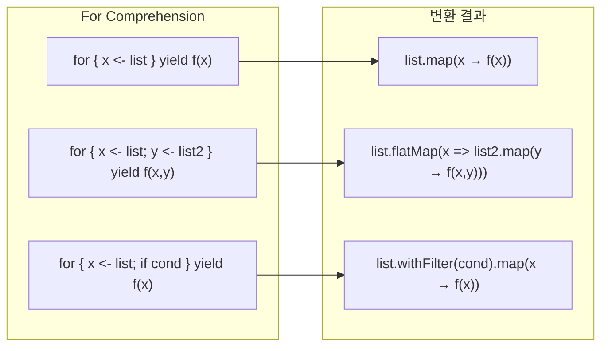

## 전체 비유: 조립 라인

For comprehension을 <strong>공장 조립 라인</strong>에 비유하면 이해하기 쉽습니다:

| 조립 라인 비유 | Scala 개념 | 역할 |
|--------------|-----------|------|
| 부품 공급 컨베이어 | 생성자 (`<-`) | 데이터 소스에서 값 추출 |
| 품질 검사 스테이션 | 가드 (`if`) | 조건에 맞는 값만 통과 |
| 조립 작업대 | 값 정의 (`=`) | 중간 계산 결과 저장 |
| 완제품 출하 | `yield` | 최종 결과 생성 |
| 여러 라인 합류 | 다중 생성자 | 여러 소스의 조합 |
| 불량품 → 라인 정지 | None/Left | 실패 시 즉시 중단 |

조립 라인에서 부품이 순차적으로 가공되듯이, for comprehension에서는 각 단계가 이전 단계의 결과에 의존합니다. **불량품(None/Left)이 발견되면 전체 라인이 멈추는 것**이 핵심입니다.


- For comprehension은 `flatMap`, `map`, `withFilter`의 문법적 설탕입니다
- 중첩된 flatMap을 읽기 쉬운 선언적 형태로 작성할 수 있습니다
- Option, Either, Future, List 등 다양한 모나딕 타입과 함께 사용됩니다
- yield 없이 사용하면 부수 효과만 실행합니다 (foreach로 변환)


**소요 시간**: 약 25-30분

**대상 독자:** 고차 함수를 이해한 개발자
**선수 지식:** map, flatMap, filter 고차 함수

For Comprehension은 `flatMap`, `map`, `withFilter`를 우아하게 표현하는 문법적 설탕(syntactic sugar)입니다. 중첩된 flatMap과 map 호출을 읽기 쉬운 선언적 형태로 작성할 수 있게 해주며, Option, Either, Future, List 등 다양한 모나딕 타입과 함께 사용됩니다.

#### 기본 문법

for comprehension의 기본 구조와 이것이 어떻게 메서드 호출로 변환되는지 이해하는 것이 중요합니다.

**변환 규칙 시각화**

아래 다이어그램은 for comprehension이 어떻게 map, flatMap, withFilter 호출로 변환되는지 보여줍니다.



*다이어그램: for comprehension이 map, flatMap, withFilter 호출로 변환되는 과정을 보여줍니다. 단일 생성자는 map으로, 여러 생성자는 flatMap+map으로, 가드는 withFilter로 변환됩니다.*

기본적인 for comprehension 문법은 다음과 같습니다.

```scala
// 기본 형태
for {
  x <- collection
} yield expression

// 여러 생성자
for {
  x <- collection1
  y <- collection2
} yield (x, y)
```

#### map/flatMap으로 변환

컴파일러는 for comprehension을 map, flatMap, withFilter 호출로 변환합니다. 이 변환 규칙을 이해하면 for comprehension의 동작을 명확히 파악할 수 있습니다.

**단일 생성자 → map**

단일 생성자만 있는 경우 단순히 map으로 변환됩니다.

```scala
// for comprehension
for (x <- List(1, 2, 3)) yield x * 2

// 변환됨
List(1, 2, 3).map(x => x * 2)

// 결과: List(2, 4, 6)
```

**여러 생성자 → flatMap + map**

여러 생성자가 있으면 마지막 생성자를 제외한 나머지는 flatMap으로, 마지막은 map으로 변환됩니다.

```scala
// for comprehension
for {
  x <- List(1, 2, 3)
  y <- List("a", "b")
} yield (x, y)

// 변환됨
List(1, 2, 3).flatMap { x =>
  List("a", "b").map { y =>
    (x, y)
  }
}

// 결과: List((1,a), (1,b), (2,a), (2,b), (3,a), (3,b))
```

**가드 → withFilter**

if 조건(가드)은 withFilter 호출로 변환됩니다. filter가 아닌 withFilter를 사용하는 이유는 중간 컬렉션 생성을 피하기 위함입니다.

```scala
// for comprehension
for {
  x <- List(1, 2, 3, 4, 5)
  if x % 2 == 0
} yield x * 2

// 변환됨
List(1, 2, 3, 4, 5)
  .withFilter(x => x % 2 == 0)
  .map(x => x * 2)

// 결과: List(4, 8)
```

#### 값 정의 (=)

for comprehension 내에서 `=`를 사용하여 중간 값을 정의할 수 있습니다. 이는 계산 결과를 재사용하거나 가독성을 높이는 데 유용합니다.

```scala
for {
  x <- List(1, 2, 3)
  doubled = x * 2       // 중간 값 정의
  squared = doubled * doubled
} yield squared

// 변환됨
List(1, 2, 3).map { x =>
  val doubled = x * 2
  val squared = doubled * doubled
  squared
}

// 결과: List(4, 16, 36)
```

#### Option과 함께

Option은 for comprehension과 가장 자주 사용되는 타입 중 하나입니다. 여러 Option 연산을 연속으로 수행할 때 중첩된 flatMap 대신 깔끔한 for 문법을 사용할 수 있습니다. 중간에 None이 발생하면 전체 결과가 None이 됩니다.

```scala
case class User(name: String)
case class Address(city: String)

def findUser(id: Int): Option[User] =
  if (id > 0) Some(User(s"User$id")) else None

def findAddress(user: User): Option[Address] =
  if (user.name.nonEmpty) Some(Address("서울")) else None

// None이 하나라도 있으면 전체가 None
val result = for {
  user <- findUser(1)
  address <- findAddress(user)
} yield s"${user.name}는 ${address.city}에 산다"

result  // Some("User1는 서울에 산다")

// 실패 케이스
val failed = for {
  user <- findUser(-1)    // None
  address <- findAddress(user)
} yield s"${user.name}는 ${address.city}에 산다"

failed  // None
```

#### Either와 함께

Either도 for comprehension과 함께 사용할 수 있습니다. 모든 연산이 Right면 계속 진행하고, Left가 나오면 즉시 중단하여 해당 Left를 반환합니다.

```scala
def parseInt(s: String): Either[String, Int] =
  s.toIntOption.toRight(s"'$s'는 숫자가 아님")

def divide(a: Int, b: Int): Either[String, Int] =
  if (b == 0) Left("0으로 나눌 수 없음")
  else Right(a / b)

// 모든 연산이 Right면 계속, Left가 나오면 중단
val result = for {
  a <- parseInt("10")
  b <- parseInt("2")
  c <- divide(a, b)
} yield c

result  // Right(5)

val failed = for {
  a <- parseInt("10")
  b <- parseInt("zero")  // Left
  c <- divide(a, b)
} yield c

failed  // Left("'zero'는 숫자가 아님")
```

#### Future와 함께

Future를 for comprehension으로 조합하면 비동기 연산을 순차적으로 실행할 수 있습니다. 각 Future가 완료된 후 다음 단계가 실행됩니다.

```scala
import scala.concurrent.{Future, ExecutionContext}
import scala.concurrent.ExecutionContext.Implicits.global

def fetchUser(id: Int): Future[String] =
  Future(s"User$id")

def fetchOrders(user: String): Future[List[String]] =
  Future(List(s"Order1 for $user", s"Order2 for $user"))

// 순차 실행
val result = for {
  user <- fetchUser(1)
  orders <- fetchOrders(user)
} yield (user, orders)

// result: Future((User1, List(Order1 for User1, Order2 for User1)))
```

#### List 조합

List에서 for comprehension을 사용하면 데카르트 곱(모든 조합)을 쉽게 생성할 수 있습니다. 가드를 추가하여 특정 조합만 선택할 수도 있습니다.

```scala
// 데카르트 곱
val pairs = for {
  x <- List(1, 2, 3)
  y <- List("a", "b")
} yield (x, y)
// List((1,a), (1,b), (2,a), (2,b), (3,a), (3,b))

// 필터링 포함
val evenPairs = for {
  x <- List(1, 2, 3, 4)
  if x % 2 == 0
  y <- List("a", "b")
} yield (x, y)
// List((2,a), (2,b), (4,a), (4,b))

// 구구단
val gugudan = for {
  i <- 2 to 9
  j <- 1 to 9
} yield s"$i x $j = ${i * j}"
```

#### 부수 효과 (yield 없이)

yield를 생략하면 값을 반환하지 않고 부수 효과만 실행합니다. 이 경우 foreach로 변환됩니다.

```scala
// foreach로 변환됨
for (x <- List(1, 2, 3)) {
  println(x)
}

// 등가
List(1, 2, 3).foreach(x => println(x))
```

#### 패턴 매칭

for comprehension의 생성자에서 패턴 매칭을 사용할 수 있습니다. 튜플 분해나 케이스 클래스 추출에 유용합니다. 매칭되지 않는 요소는 자동으로 필터링됩니다.

```scala
val pairs = List((1, "one"), (2, "two"), (3, "three"))

// 튜플 분해
for ((num, str) <- pairs) {
  println(s"$num = $str")
}

// Option 필터링
val maybes = List(Some(1), None, Some(3), None, Some(5))

for (Some(x) <- maybes) {
  println(x)  // 1, 3, 5
}
```

#### Scala 3 문법

Scala 3에서는 for comprehension의 문법이 더 간결해졌습니다. do 키워드와 들여쓰기 기반 문법이 추가되었습니다.


{}
```scala
// do 키워드
for x <- List(1, 2, 3) do
  println(x)

// 들여쓰기 기반
for
  x <- List(1, 2, 3)
  y <- List("a", "b")
yield (x, y)
```
{}
{}
```scala
// 중괄호 필수
for (x <- List(1, 2, 3)) {
  println(x)
}

for {
  x <- List(1, 2, 3)
  y <- List("a", "b")
} yield (x, y)
```
{}


#### 커스텀 타입에서 사용

for comprehension은 map, flatMap, withFilter 메서드를 가진 모든 타입에서 사용할 수 있습니다. 직접 정의한 타입에 이 메서드들을 구현하면 for comprehension을 활용할 수 있습니다.

```scala
case class Box[A](value: A) {
  def map[B](f: A => B): Box[B] = Box(f(value))
  def flatMap[B](f: A => Box[B]): Box[B] = f(value)
}

val result = for {
  x <- Box(1)
  y <- Box(2)
} yield x + y

result  // Box(3)
```

#### 연습 문제

다음 연습 문제들을 통해 for comprehension 개념을 복습해보세요.

**1. 안전한 계산기 ⭐⭐**

for comprehension으로 안전한 사칙연산을 구현하세요.

<details>
<summary>정답 보기</summary>

```scala
def safeAdd(a: Int, b: Int): Option[Int] = Some(a + b)
def safeSub(a: Int, b: Int): Option[Int] = Some(a - b)
def safeMul(a: Int, b: Int): Option[Int] = Some(a * b)
def safeDiv(a: Int, b: Int): Option[Int] =
  if (b == 0) None else Some(a / b)

// (10 + 5) * 2 / 3
val result = for {
  sum <- safeAdd(10, 5)
  product <- safeMul(sum, 2)
  quotient <- safeDiv(product, 3)
} yield quotient

result  // Some(10)
```

</details>

**2. 중첩 Option 평탄화 ⭐**

중첩된 Option을 for comprehension으로 처리하세요.

<details>
<summary>정답 보기</summary>

```scala
case class Company(address: Option[Address])
case class Address(street: Option[String])

val company = Company(Some(Address(Some("강남대로 123"))))

val street = for {
  address <- company.address
  street <- address.street
} yield street

street  // Some("강남대로 123")

// 중간에 None이 있으면
val noStreet = Company(Some(Address(None)))
val result = for {
  address <- noStreet.address
  street <- address.street
} yield street

result  // None
```

</details>

#### 관련 개념

For comprehension은 다음 개념들과 밀접하게 연결됩니다:

| 관련 개념 | 연결 관계 |
|----------|----------|
| [고차 함수](higher-order-functions/) | `map`, `flatMap`, `withFilter`로 변환됨 |
| [패턴 매칭](pattern-matching/) | 생성자에서 구조 분해 패턴 사용 가능 |
| [함수형 패턴](functional-patterns/) | Option, Either, Try와 함께 안전한 연산 |
| [동시성](concurrency/) | Future 조합의 핵심 문법 |
| [컬렉션](collections/) | 데카르트 곱, 필터링 등 컬렉션 조합 |
| [타입 클래스](type-classes/) | Monad 타입 클래스와의 관계 |

#### 다음 단계

| 학습 경로 | 설명 |
|----------|------|
| [함수형 패턴](functional-patterns/) | Monad, Functor 등 추상화 심화 |
| [Implicits](implicits/) | 문맥적 추상화 메커니즘 |
| [동시성](concurrency/) | Future 병렬/순차 실행 패턴 |
