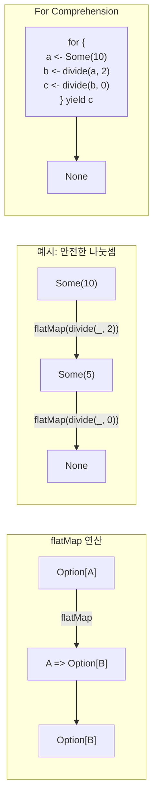

## 전체 비유: 레고 블록 조립

함수형 프로그래밍 패턴을 <strong>레고 블록 조립</strong>에 비유하면 이해하기 쉽습니다:

| 레고 비유 | Scala 개념 | 역할 |
|----------|-----------|------|
| 블록의 표준 연결부 | 타입 시그니처 | 조합 가능성 보장 |
| 같은 블록 → 같은 결과 | 참조 투명성 | 예측 가능한 동작 |
| 원본 블록 보존 | 불변성 | 부수 효과 없음 |
| 블록 색 변환기 | Functor (map) | 내용물만 변환, 구조 유지 |
| 블록 연결기 | Monad (flatMap) | 순차적 조립 연결 |
| "비어 있음" 표시 블록 | Option | 값의 유무 표현 |
| "오류 라벨" 블록 | Either | 성공/실패 정보 포함 |
| 블록 조립 설명서 | for comprehension | 조립 순서 기술 |

레고를 조립할 때 <strong>표준 연결부가 있어야 어떤 블록이든 연결</strong>할 수 있듯이, 함수형 프로그래밍에서는 Functor, Monad 같은 추상화가 다양한 타입을 일관되게 조합할 수 있게 해줍니다.


- **참조 투명성**: 함수 호출을 결과로 대체해도 의미 변화 없음
- **Functor**: `map` 연산, 구조 유지하며 값 변환
- **Monad**: `flatMap` 연산, 순차적 효과 연결
- **Option/Either/Try**: 실패 가능한 연산의 타입 안전한 표현
- Cats, ZIO 등 함수형 라이브러리로 더 강력한 추상화 가능


**소요 시간**: 약 25-30분

**대상 독자:** 고차 함수와 For Comprehension을 이해한 개발자
**선수 지식:** map, flatMap, filter, 제네릭

이 문서에서는 Scala에서 사용되는 핵심 함수형 프로그래밍 패턴을 다룹니다. 함수형 프로그래밍은 부수 효과를 최소화하고 순수 함수와 불변 데이터를 활용하여 예측 가능하고 테스트하기 쉬운 코드를 작성하는 패러다임입니다.

> 📚 **사전 지식**: 이 문서를 이해하려면 다음 개념에 익숙해야 합니다:
> - [고차 함수]() - map, flatMap, filter
> - [For Comprehension]() - 모나딕 연산의 문법적 설탕
> - [제네릭]() - 타입 매개변수
>
> **난이도**: ⭐⭐⭐⭐ (고급)

#### 참조 투명성

함수 호출을 그 결과로 대체해도 프로그램의 의미가 변하지 않는 속성입니다. 참조 투명한 함수는 동일한 입력에 대해 항상 동일한 출력을 반환하며, 외부 상태에 의존하거나 변경하지 않습니다.

```scala
// 참조 투명
def add(a: Int, b: Int): Int = a + b

val x = add(1, 2)  // 3으로 대체 가능
val y = x + x      // add(1, 2) + add(1, 2)와 동일

// 참조 불투명 (부수 효과)
var counter = 0
def increment(): Int = {
  counter += 1
  counter
}

val a = increment()  // 1
val b = increment()  // 2 (결과가 달라짐!)
```


- 참조 투명한 함수는 동일 입력에 동일 출력 보장
- 외부 상태에 의존하거나 변경하지 않음
- 코드 추론과 테스트가 쉬워짐


#### 불변성

불변성(Immutability)은 함수형 프로그래밍의 핵심 원칙입니다. 데이터를 변경하지 않고 새 데이터를 생성하여 부수 효과를 방지합니다. 불변 데이터는 스레드 안전하고 추론하기 쉬우며, 캐싱과 공유가 자유롭습니다.

```scala
// 불변 리스트
val list1 = List(1, 2, 3)
val list2 = 0 :: list1  // list1은 변경되지 않음

// 케이스 클래스 업데이트
case class Person(name: String, age: Int)
val alice = Person("Alice", 30)
val olderAlice = alice.copy(age = 31)  // alice는 변경되지 않음
```


- 불변 데이터는 스레드 안전하고 추론이 쉬움
- `copy` 메서드로 변경된 복사본 생성
- 캐싱과 공유가 자유로움


#### Functor

Functor는 `map` 연산을 가진 타입입니다. 컨테이너 안의 값을 변환하면서 구조를 유지합니다. List, Option, Future 등 대부분의 컬렉션과 컨테이너 타입은 Functor입니다.

**Functor 법칙**

Functor가 되려면 두 가지 법칙을 만족해야 합니다. 항등 법칙은 identity 함수로 map하면 원본과 같아야 함을 의미하고, 합성 법칙은 두 번 map하는 것과 합성된 함수로 한 번 map하는 것이 같아야 함을 의미합니다.

```scala
// 1. 항등 법칙: fa.map(identity) == fa
List(1, 2, 3).map(identity) == List(1, 2, 3)

// 2. 합성 법칙: fa.map(f).map(g) == fa.map(f andThen g)
val f = (x: Int) => x + 1
val g = (x: Int) => x * 2

List(1, 2, 3).map(f).map(g) == List(1, 2, 3).map(f andThen g)
```

**커스텀 Functor**

타입 클래스 패턴을 사용하여 커스텀 Functor를 정의할 수 있습니다. `F[_]`는 고차 타입(higher-kinded type)으로, 타입 매개변수를 받는 타입을 나타냅니다.

```scala
trait Functor[F[_]]:
  def map[A, B](fa: F[A])(f: A => B): F[B]

// Option Functor
given Functor[Option] with
  def map[A, B](fa: Option[A])(f: A => B): Option[B] = fa.map(f)

// List Functor
given Functor[List] with
  def map[A, B](fa: List[A])(f: A => B): List[B] = fa.map(f)
```


- Functor는 `map` 연산을 가진 타입
- 항등 법칙과 합성 법칙을 만족해야 함
- List, Option, Future 등 대부분의 컨테이너가 Functor


#### Applicative

Applicative는 독립적인 효과를 결합합니다. Functor보다 강력하며, 여러 독립적인 컨텍스트의 값들을 결합할 수 있습니다. `pure`는 값을 컨텍스트에 넣고, `ap`는 컨텍스트 안의 함수를 컨텍스트 안의 값에 적용합니다.

```scala
trait Applicative[F[_]] extends Functor[F]:
  def pure[A](a: A): F[A]
  def ap[A, B](ff: F[A => B])(fa: F[A]): F[B]

// Option으로 예시
val some1: Option[Int] = Some(1)
val some2: Option[Int] = Some(2)

// 두 Option을 결합
val sum: Option[Int] = (some1, some2) match
  case (Some(a), Some(b)) => Some(a + b)
  case _ => None
```


- Applicative는 독립적인 효과를 결합
- `pure`로 값을 컨텍스트에 넣음
- `ap`로 컨텍스트 안의 함수를 값에 적용


#### Monad

Monad는 순차적인 효과를 연결합니다. `flatMap`을 통해 이전 연산의 결과에 의존하는 다음 연산을 수행할 수 있습니다. Option, Either, Future 등이 대표적인 Monad입니다.

**Monad 흐름 시각화**

아래 다이어그램은 flatMap 연산이 어떻게 작동하는지 보여줍니다. 첫 번째 연산의 결과가 다음 연산의 입력이 됩니다.



*위 다이어그램은 flatMap 연산과 For Comprehension의 동작 흐름을 보여줍니다.*

**Monad 법칙**

Monad는 세 가지 법칙을 만족해야 합니다. 왼쪽 항등, 오른쪽 항등, 결합 법칙이 그것입니다. 이 법칙들이 for comprehension의 직관적인 동작을 보장합니다.

```scala
trait Monad[F[_]] extends Applicative[F]:
  def flatMap[A, B](fa: F[A])(f: A => F[B]): F[B]

  // pure(a).flatMap(f) == f(a)  // 왼쪽 항등
  // m.flatMap(pure) == m        // 오른쪽 항등
  // m.flatMap(f).flatMap(g) == m.flatMap(a => f(a).flatMap(g))  // 결합
```

**표준 라이브러리 Monad**

Scala 표준 라이브러리의 Option, Either, Future는 모두 Monad입니다. for comprehension을 통해 이들을 편리하게 조합할 수 있습니다.

```scala
// Option
val result = for {
  a <- Some(1)
  b <- Some(2)
} yield a + b  // Some(3)

// Either
val validated: Either[String, Int] = for {
  x <- Right(1)
  y <- Right(2)
} yield x + y  // Right(3)

// Future
import scala.concurrent.Future
import scala.concurrent.ExecutionContext.Implicits.global

def fetchUser(id: Int): Future[String] = Future(s"User$id")
def fetchOrders(user: String): Future[List[String]] = Future(List(s"Order1-$user"))

val asyncResult = for
  user <- fetchUser(1)
  orders <- fetchOrders(user)
yield orders
// Future(List("Order1-User1"))
```


- Monad는 `flatMap`으로 순차적 효과 연결
- 왼쪽/오른쪽 항등, 결합 법칙을 만족해야 함
- Option, Either, Future 등이 대표적인 Monad


#### Option - null 대체

Option은 값이 있거나 없을 수 있는 경우를 타입 안전하게 표현합니다. null을 사용하는 대신 Option을 사용하면 NullPointerException을 컴파일 타임에 방지할 수 있습니다.

```scala
// 안전한 나눗셈
def divide(a: Int, b: Int): Option[Int] =
  if b == 0 then None else Some(a / b)

// 체이닝
val result = for {
  x <- divide(10, 2)  // Some(5)
  y <- divide(x, 0)   // None
} yield y             // None

// getOrElse
divide(10, 0).getOrElse(0)  // 0

// fold
divide(10, 2).fold(0)(_ * 2)  // 10
```


- Option은 값의 유무를 Some/None으로 표현
- null 대신 사용하여 NullPointerException 방지
- `getOrElse`, `fold`, `map`, `flatMap`으로 안전하게 처리


#### Either - 에러 처리

Either는 두 가지 가능한 결과 중 하나를 표현합니다. 관례상 Left는 실패(에러), Right는 성공을 나타냅니다. 에러 정보를 타입으로 명시할 수 있어 예외보다 타입 안전합니다.

```scala
sealed trait ValidationError
case class EmptyName(field: String) extends ValidationError
case class InvalidAge(age: Int) extends ValidationError

def validateName(name: String): Either[ValidationError, String] =
  if name.isEmpty then Left(EmptyName("name"))
  else Right(name)

def validateAge(age: Int): Either[ValidationError, Int] =
  if age < 0 || age > 150 then Left(InvalidAge(age))
  else Right(age)

case class Person(name: String, age: Int)

def createPerson(name: String, age: Int): Either[ValidationError, Person] =
  for {
    validName <- validateName(name)
    validAge <- validateAge(age)
  } yield Person(validName, validAge)

createPerson("Alice", 30)  // Right(Person("Alice", 30))
createPerson("", 30)       // Left(EmptyName("name"))
```


- Either는 Left(실패) 또는 Right(성공)로 결과 표현
- 에러 타입을 명시적으로 정의 가능
- for comprehension으로 검증 체이닝 가능


#### Try - 예외 처리

Try는 예외가 발생할 수 있는 연산을 캡슐화합니다. Success 또는 Failure로 결과를 표현하며, 예외를 값으로 다룰 수 있게 해줍니다.

```scala
import scala.util.{Try, Success, Failure}

def parseInt(s: String): Try[Int] = Try(s.toInt)

parseInt("42") match
  case Success(n) => println(s"숫자: $n")
  case Failure(e) => println(s"에러: ${e.getMessage}")

// 체이닝
val result = for {
  a <- parseInt("10")
  b <- parseInt("20")
} yield a + b  // Success(30)

// 실패 복구
parseInt("abc").getOrElse(0)  // 0
parseInt("abc").recover { case _: NumberFormatException => 0 }
```


- Try는 예외를 Success/Failure로 캡슐화
- 예외를 던지는 대신 값으로 다룸
- `recover`, `recoverWith`로 실패 복구 가능


#### 함수 합성

함수 합성은 작은 함수들을 결합하여 더 큰 함수를 만드는 기법입니다. `andThen`은 왼쪽에서 오른쪽으로, `compose`는 오른쪽에서 왼쪽으로 함수를 연결합니다.

```scala
val addOne = (x: Int) => x + 1
val double = (x: Int) => x * 2
val square = (x: Int) => x * x

// andThen: 왼쪽 -> 오른쪽
val pipeline = addOne andThen double andThen square
pipeline(3)  // ((3 + 1) * 2)^2 = 64

// compose: 오른쪽 -> 왼쪽
val composed = square compose double compose addOne
composed(3)  // (3 + 1) * 2)^2 = 64
```


- `andThen`: 왼쪽에서 오른쪽으로 함수 연결
- `compose`: 오른쪽에서 왼쪽으로 함수 연결
- 작은 함수들을 결합하여 복잡한 변환 구성


#### 커링과 부분 적용

커링(Currying)은 여러 인자를 받는 함수를 인자 하나씩 받는 함수들의 체인으로 변환하는 기법입니다. 부분 적용은 일부 인자만 제공하여 새로운 함수를 만드는 것입니다.

```scala
// 커링
def add(a: Int)(b: Int): Int = a + b

val add5 = add(5)
add5(3)  // 8

// 부분 적용
def log(level: String, message: String): Unit =
  println(s"[$level] $message")

val error = log("ERROR", _)
val info = log("INFO", _)

error("Something went wrong")
info("Application started")
```

#### Cats/ZIO 라이브러리

Scala 생태계에서는 함수형 프로그래밍을 위한 강력한 라이브러리들이 있습니다. Cats와 ZIO가 대표적입니다.

**Cats**

Cats는 함수형 프로그래밍 추상화를 제공하는 라이브러리입니다. Functor, Monad 등의 타입 클래스와 Validated, Either 등의 데이터 타입을 제공합니다.

```scala
import cats.*
import cats.implicits.*

// Validated - 에러 누적
import cats.data.Validated

type ValidationResult[A] = Validated[List[String], A]

val valid1: ValidationResult[Int] = Validated.valid(1)
val valid2: ValidationResult[Int] = Validated.valid(2)
val invalid: ValidationResult[Int] = Validated.invalid(List("에러"))

// 모든 에러 수집
(valid1, invalid, invalid).mapN(_ + _ + _)
// Invalid(List("에러", "에러"))
```

**ZIO**

ZIO는 효과 시스템과 의존성 주입을 결합한 라이브러리입니다. `ZIO[R, E, A]`는 환경 R이 필요하고, E 타입의 에러를 발생시킬 수 있으며, A 타입의 값을 반환하는 효과를 나타냅니다.

```scala
import zio.*
import java.io.IOException

// Console 연산은 IOException을 발생시킬 수 있음
val program: ZIO[Any, IOException, Int] = for
  _ <- Console.printLine("숫자를 입력하세요:")
  input <- Console.readLine
  num <- ZIO.fromOption(input.toIntOption)
           .orElseFail(new IOException("숫자가 아닙니다"))
yield num * 2
```

#### 연습 문제

다음 연습 문제를 통해 함수형 패턴을 복습해보세요.

**1. 커스텀 Monad ⭐⭐**

`Box[A]` 타입에 대한 `flatMap`을 구현하세요.

<details>
<summary>정답 보기</summary>

```scala
case class Box[A](value: A):
  def map[B](f: A => B): Box[B] = Box(f(value))
  def flatMap[B](f: A => Box[B]): Box[B] = f(value)

val result = for {
  x <- Box(1)
  y <- Box(2)
} yield x + y  // Box(3)
```

</details>

**2. 에러 누적 ⭐⭐⭐**

여러 검증을 수행하고 모든 에러를 수집하세요.

<details>
<summary>정답 보기</summary>

```scala
type Errors = List[String]
type Validated[A] = Either[Errors, A]

def validateAll[A](validations: List[Validated[A]]): Validated[List[A]] =
  val (errors, values) = validations.partitionMap(identity)
  if errors.isEmpty then Right(values)
  else Left(errors.flatten)

val results = List(
  Right(1),
  Left(List("에러1")),
  Right(3),
  Left(List("에러2"))
)

validateAll(results)  // Left(List("에러1", "에러2"))
```

</details>

#### 참고 자료

더 깊은 학습을 위한 자료입니다.

- [Cats 공식 문서](https://typelevel.org/cats/)
- [ZIO 공식 문서](https://zio.dev/)
- [Functional Programming in Scala](https://www.manning.com/books/functional-programming-in-scala)

#### 관련 개념

함수형 패턴은 다음 개념들과 밀접하게 연결됩니다:

| 관련 개념 | 연결 관계 |
|----------|----------|
| [고차 함수]() | `map`, `flatMap`, `filter` 등의 기반 |
| [for 표현식]() | Monad 연산의 문법적 설탕 |
| [타입 클래스]() | Functor, Monad 등 추상화 구현 방식 |
| [케이스 클래스]() | 불변 데이터 구조 정의 |
| [동시성]() | Future, IO 등 비동기 효과 타입 |
| [고급 타입]() | 고차 타입 (F[_]) 이해 |
| [도메인 모델 패턴]() | 함수형 패턴을 활용한 도메인 모델 설계 |

#### 다음 단계

| 학습 경로 | 설명 |
|----------|------|
| [타입 클래스]() | 다형성 추상화 패턴 심화 |
| [Cats 라이브러리](https://typelevel.org/cats/) | 함수형 추상화 라이브러리 |
| [ZIO 라이브러리](https://zio.dev/) | 타입 안전한 효과 시스템 |
| [fs2 스트리밍](https://fs2.io/) | 함수형 스트림 처리 |
