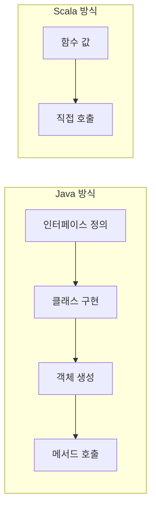
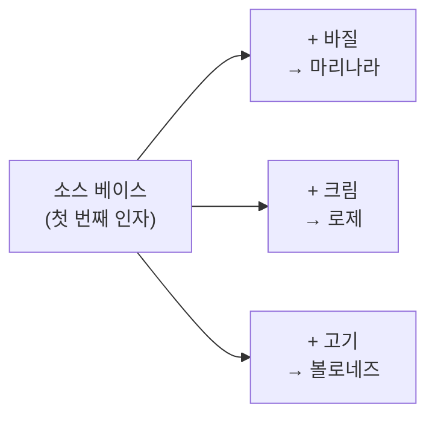

## 전체 비유: 요리사와 레시피

Scala의 함수와 메서드를 <strong>요리사와 레시피</strong>에 비유하면 이해하기 쉽습니다:

| 요리 비유 | Scala 개념 | 역할 |
|----------|-----------|------|
| 레시피 (조리법) | 메서드 (def) | 클래스에 소속된 동작 정의 |
| 레시피 카드 (전달 가능) | 함수 값 (val) | 저장/전달 가능한 동작 |
| 재료 손질법 전달 | 일급 함수 | 함수를 인자로 전달 |
| 소스 베이스 만들기 | 커링 | 기본 설정 후 변형 |
| 부분 조리 (반조리) | 부분 적용 | 일부 재료만 먼저 적용 |
| 재료 → 요리 변환 | 함수 타입 | 입력 → 출력 관계 |
| 같은 과정 반복 | 재귀 | 자기 자신 호출 |

이처럼 요리사가 레시피를 조합하여 새로운 요리를 만들듯, Scala에서는 함수를 조합하여 복잡한 로직을 구성합니다.

---


- Scala에서 함수는 <strong>일급 시민</strong>으로 변수에 저장, 인자로 전달, 반환값으로 사용 가능합니다
- <strong>커링</strong>으로 설정값을 한 번 적용하고 재사용하는 패턴을 구현합니다
- 메서드(`def`)는 클래스에 소속되고, 함수 값(`val`)은 전달/저장에 적합합니다
- `@tailrec`으로 꼬리 재귀 최적화를 보장할 수 있습니다


**소요 시간**: 약 25-30분

**대상 독자:** Java 개발자 또는 OOP 경험이 있는 개발자
**선수 지식:** Scala 기본 문법, 제어 구조

Scala에서 함수는 일급 시민(first-class citizen)입니다. 함수를 변수에 저장하고, 인자로 전달하고, 반환값으로 사용할 수 있습니다. 이러한 특성은 함수형 프로그래밍의 핵심이며, 코드를 더 간결하고 재사용 가능하게 만듭니다.

#### 왜 일급 함수(First-Class Functions)인가?

**비유로 이해하기**: 일급 함수는 <strong>레시피 카드</strong>와 같습니다. Java에서는 요리법을 전달하려면 요리책 전체(인터페이스, 클래스)를 넘겨야 하지만, Scala에서는 레시피 카드 한 장(함수)만 건네면 됩니다. 카드는 주머니에 넣고 다니다가(변수 저장), 다른 요리사에게 전달하거나(인자), 새 카드를 만들어 돌려줄 수도 있습니다(반환값).



*Java에서는 동작을 전달하려면 인터페이스, 클래스, 객체 생성이 필요하지만, Scala에서는 함수 자체를 값으로 바로 전달합니다.*

**Java 개발자가 겪는 문제**

Java에서 "동작"을 전달하려면 인터페이스와 클래스가 필요합니다:

```java
// Java: 전략 패턴으로 가격 계산 방식 변경
public interface PricingStrategy {
    double calculate(double price);
}

public class RegularPricing implements PricingStrategy {
    @Override
    public double calculate(double price) { return price; }
}

public class DiscountPricing implements PricingStrategy {
    private double rate;
    public DiscountPricing(double rate) { this.rate = rate; }
    @Override
    public double calculate(double price) { return price * (1 - rate); }
}

// 사용
public double applyPricing(double price, PricingStrategy strategy) {
    return strategy.calculate(price);
}
applyPricing(10000, new DiscountPricing(0.1));  // 9000.0
```

Java 8의 람다로 개선되었지만, 여전히 함수형 인터페이스(`Function`, `BiFunction`, `Consumer` 등)를 명시해야 합니다:

```java
// Java 8+
Function<Double, Double> discount = price -> price * 0.9;
double result = discount.apply(10000.0);  // apply() 메서드 호출 필요
```

**Scala의 해결책**

Scala에서 함수는 값(value)입니다. 특별한 인터페이스 없이 바로 사용합니다:

```scala
// Scala: 함수를 값으로
val discount = (price: Double) => price * 0.9
val result = discount(10000)  // 9000.0 - 바로 호출

// 함수를 인자로 전달
def applyPricing(price: Double, strategy: Double => Double): Double =
  strategy(price)

applyPricing(10000, discount)           // 9000.0
applyPricing(10000, _ * 1.1)            // 11000.0 (인라인 람다)
applyPricing(10000, Math.floor)         // 기존 메서드도 전달 가능
```

**실무 활용: 전략 패턴 단순화**

함수를 일급 시민으로 다룰 수 있기 때문에 전략 패턴을 인터페이스와 클래스 없이 간단하게 구현할 수 있습니다. 아래 예제는 주문 시스템에서 다양한 할인 전략을 함수로 정의하고 선택하는 방법을 보여줍니다.

```scala
// 주문 처리 시스템
case class Order(items: List[Item], customerId: String)
case class Item(name: String, price: Double, quantity: Int)

// 다양한 할인 전략 - 그냥 함수로 정의
val noDiscount: Order => Double = order =>
  order.items.map(i => i.price * i.quantity).sum

val memberDiscount: Order => Double = order =>
  noDiscount(order) * 0.9

val bulkDiscount: Order => Double = order => {
  val total = noDiscount(order)
  if (total > 100000) total * 0.85 else total
}

// 전략 선택
def calculateTotal(order: Order, strategy: Order => Double): Double =
  strategy(order)

// 전략을 Map으로 관리
val strategies = Map(
  "regular"  -> noDiscount,
  "member"   -> memberDiscount,
  "bulk"     -> bulkDiscount
)

// 고객 유형에 따라 전략 선택
def getStrategy(customerId: String): Order => Double =
  if (customerId.startsWith("VIP")) memberDiscount
  else noDiscount
```


- 함수를 값처럼 변수에 저장, 인자로 전달, 반환값으로 사용할 수 있습니다
- 전략 패턴을 인터페이스/클래스 없이 함수만으로 간단하게 구현합니다
- Java의 함수형 인터페이스와 달리 `.apply()` 호출 없이 직접 호출 가능합니다


#### 왜 커링(Currying)인가?

커링은 여러 매개변수를 받는 함수를 하나의 매개변수를 받는 함수의 연속으로 변환하는 기법입니다. 이를 통해 함수의 일부 인자만 적용하여 새로운 함수를 만들 수 있습니다.

**비유로 이해하기**: 커링은 <strong>소스 베이스 만들기</strong>와 같습니다. 토마토 소스 베이스를 한 번 만들어두면(첫 번째 인자 적용), 거기에 바질을 넣으면 마리나라, 크림을 넣으면 로제, 고기를 넣으면 볼로네즈가 됩니다(두 번째 인자 적용). 매번 토마토부터 시작하지 않아도 됩니다.



*커링은 공통 설정을 한 번 적용하고, 이후 다양한 변형을 쉽게 만들 수 있게 합니다.*

**문제: 반복되는 설정 값**

로깅할 때마다 로거 인스턴스를 전달해야 합니다:

```scala
// 매번 logger를 전달
def logInfo(logger: Logger, message: String): Unit =
  logger.info(message)

def logError(logger: Logger, message: String, cause: Throwable): Unit =
  logger.error(message, cause)

// 사용할 때마다 반복
val logger = LoggerFactory.getLogger("OrderService")
logInfo(logger, "주문 시작")
logInfo(logger, "검증 완료")
logInfo(logger, "결제 처리 중")
logError(logger, "결제 실패", exception)
```

**커링의 해결책**

설정을 한 번만 적용하고 재사용합니다:

```scala
// 커링으로 분리
def logInfo(logger: Logger)(message: String): Unit =
  logger.info(message)

def logError(logger: Logger)(message: String)(cause: Throwable): Unit =
  logger.error(message, cause)

// 로거를 한 번만 적용
val logger = LoggerFactory.getLogger("OrderService")
val info = logInfo(logger)      // String => Unit
val error = logError(logger)    // String => Throwable => Unit

// 이후 간결하게 사용
info("주문 시작")
info("검증 완료")
info("결제 처리 중")
error("결제 실패")(exception)
```

**실무 활용: 의존성 주입 패턴**

커링을 활용하면 DI 프레임워크 없이도 의존성을 우아하게 관리할 수 있습니다. 데이터베이스나 외부 서비스 같은 의존성을 함수의 첫 번째 매개변수 그룹에서 받고, 부분 적용으로 "서비스"를 생성합니다.

```scala
// 데이터베이스 작업 함수들
def findUser(db: Database)(userId: String): Option[User] =
  db.query(s"SELECT * FROM users WHERE id = '$userId'").headOption

def saveOrder(db: Database)(order: Order): Unit =
  db.execute(s"INSERT INTO orders ...")

def sendEmail(mailer: Mailer)(to: String)(subject: String)(body: String): Unit =
  mailer.send(to, subject, body)

// 애플리케이션 시작 시 한 번 설정
val db = Database.connect("jdbc:postgresql://localhost/shop")
val mailer = Mailer.create("smtp.example.com")

// 부분 적용으로 "서비스" 생성
val getUser = findUser(db)           // String => Option[User]
val createOrder = saveOrder(db)      // Order => Unit
val notify = sendEmail(mailer)       // String => String => String => Unit

// 비즈니스 로직에서 간결하게 사용
def processOrder(userId: String, items: List[Item]): Unit = {
  getUser(userId) match {
    case Some(user) =>
      val order = Order(items, userId)
      createOrder(order)
      notify(user.email)("주문 확인")(s"주문이 접수되었습니다: ${order.id}")
    case None =>
      throw new IllegalArgumentException(s"User not found: $userId")
  }
}
```


- 커링은 여러 매개변수 그룹으로 함수를 분리하는 기법입니다
- 설정값을 한 번 적용하고 재사용하여 반복을 줄입니다
- DI 프레임워크 없이 의존성 주입 패턴을 구현할 수 있습니다


#### 메서드 vs 함수: 언제 무엇을 선택할까?

메서드(`def`)와 함수 값(`val`)은 비슷해 보이지만 사용 목적이 다릅니다. 메서드는 클래스나 객체에 소속되어 동작을 정의하고, 함수 값은 다른 함수에 전달하거나 컬렉션에 저장할 때 유용합니다.

아래 표는 상황에 따라 무엇을 선택해야 하는지 정리한 것입니다.

| 상황 | 권장 | 이유 |
|------|------|------|
| 클래스/객체의 동작 정의 | `def` 메서드 | 명확한 소속, `this` 참조 가능 |
| 함수를 저장/전달해야 할 때 | `val` 함수 | 이미 값이므로 변환 불필요 |
| 재귀 | `def` 메서드 | `@tailrec` 꼬리 재귀 최적화 가능 |
| 컬렉션 연산 콜백 | 인라인 람다 | `list.map(x => x * 2)` |
| 오버로딩이 필요할 때 | `def` 메서드 | 함수는 오버로딩 불가 |
| 지연 평가가 필요할 때 | `def` 메서드 | 호출할 때마다 평가 |

**주의사항: 과도한 함수 사용**

모든 메서드를 함수 값으로 선언하는 것은 오히려 코드를 복잡하게 만들 수 있습니다. 함수 값은 전략 패턴, 콜백, 고차 함수 인자 등 실제로 함수를 값으로 다뤄야 하는 경우에만 사용하세요.

```scala
// ❌ 불필요하게 복잡
class Calculator {
  val add: (Int, Int) => Int = (a, b) => a + b
  val multiply: (Int, Int) => Int = (a, b) => a * b
}

// ✅ 단순하고 명확
class Calculator {
  def add(a: Int, b: Int): Int = a + b
  def multiply(a: Int, b: Int): Int = a * b
}

// 함수가 적합한 경우: 전략 패턴, 콜백, 고차 함수 인자
val operations: Map[String, (Int, Int) => Int] = Map(
  "+" -> (_ + _),
  "-" -> (_ - _),
  "*" -> (_ * _)
)
```


- **메서드(`def`)**: 클래스/객체 동작 정의, 재귀, 오버로딩에 적합
- **함수 값(`val`)**: 저장/전달, 전략 패턴, 콜백에 적합
- 모든 것을 함수 값으로 선언하지 말고 필요한 경우에만 사용하세요


#### 메서드 정의

메서드는 클래스나 객체에 정의되는 함수입니다. `def` 키워드로 선언하며, 매개변수 타입과 반환 타입을 지정합니다.

**기본 문법**

`def` 키워드로 메서드를 정의합니다.

```scala
// 기본 형태
def add(a: Int, b: Int): Int = {
  a + b
}

// 한 줄이면 중괄호 생략 가능
def add(a: Int, b: Int): Int = a + b

// 반환 타입 추론 (권장하지 않음 - 명시적이 좋음)
def add(a: Int, b: Int) = a + b
```

**매개변수 타입은 필수**

Scala는 매개변수 타입을 추론하지 않습니다. 반드시 명시해야 합니다.

```scala
// 올바름
def greet(name: String): String = s"Hello, $name!"

// 컴파일 에러
// def greet(name) = s"Hello, $name!"
```

**Unit 반환 (부수 효과)**

아무것도 반환하지 않는 메서드는 `Unit`을 반환합니다. Java의 `void`와 유사하지만 Scala에서 Unit은 실제 값입니다.

```scala
def printGreeting(name: String): Unit = {
  println(s"Hello, $name!")
}

// 축약형 (반환 타입 생략)
def printGreeting(name: String) = println(s"Hello, $name!")
```

**Scala 3 문법**

Scala 3에서는 중괄호 대신 들여쓰기로 블록을 구분할 수 있습니다. 여러 줄 메서드도 들여쓰기만으로 깔끔하게 작성할 수 있습니다.


{}
```scala
// 들여쓰기 기반
def greet(name: String): String =
  val greeting = s"Hello, $name!"
  greeting

// 여러 줄
def calculate(x: Int, y: Int): Int =
  val sum = x + y
  val product = x * y
  sum + product
```
{}
{}
```scala
// 중괄호 필수
def greet(name: String): String = {
  val greeting = s"Hello, $name!"
  greeting
}

// 여러 줄
def calculate(x: Int, y: Int): Int = {
  val sum = x + y
  val product = x * y
  sum + product
}
```
{}



- 매개변수 타입은 반드시 명시해야 합니다 (추론되지 않음)
- `Unit` 반환은 Java의 `void`와 유사하지만 실제 값입니다
- Scala 3에서는 들여쓰기로 블록을 구분할 수 있습니다


#### 기본 매개변수 값

매개변수에 기본값을 지정하면 호출 시 해당 인자를 생략할 수 있습니다. 이를 통해 여러 개의 오버로드된 메서드를 하나로 통합할 수 있습니다.

```scala
def greet(name: String = "World", punctuation: String = "!"): String =
  s"Hello, $name$punctuation"

println(greet())                    // Hello, World!
println(greet("Scala"))             // Hello, Scala!
println(greet("Scala", "?"))        // Hello, Scala?
```

#### 이름 있는 인자

인자를 이름으로 전달하면 순서를 바꿀 수 있습니다. 매개변수가 많거나 같은 타입의 매개변수가 여러 개일 때 가독성을 높여줍니다.

```scala
def createPerson(name: String, age: Int, city: String): String =
  s"$name, $age살, $city 거주"

// 순서 변경 가능
println(createPerson(age = 30, city = "서울", name = "김철수"))

// 일부만 이름 지정
println(createPerson("김영희", city = "부산", age = 25))
```

#### 가변 인자 (Varargs)

`*`를 사용하여 가변 개수의 인자를 받을 수 있습니다. 컬렉션을 가변 인자로 전달할 때는 시퀀스 전개 연산자를 사용합니다.

```scala
def sum(numbers: Int*): Int = numbers.sum

println(sum(1, 2, 3))        // 6
println(sum(1, 2, 3, 4, 5))  // 15

// 시퀀스를 펼쳐서 전달
val nums = Seq(1, 2, 3, 4, 5)
println(sum(nums*))          // Scala 3
// println(sum(nums: _*))    // Scala 2
```


- **기본값**: 매개변수 기본값으로 오버로딩을 줄입니다
- **이름 있는 인자**: 순서를 바꾸거나 가독성을 높일 수 있습니다
- **가변 인자**: `*`로 여러 인자를 받고, 시퀀스 전개로 컬렉션을 전달합니다


#### 익명 함수 (람다)

익명 함수(람다)는 이름 없이 정의하는 함수입니다. 고차 함수에 전달하거나 변수에 저장할 때 주로 사용합니다. 화살표(`=>`) 왼쪽에 매개변수, 오른쪽에 본문을 작성합니다.

**기본 문법**

```scala
// 전체 형태
val add: (Int, Int) => Int = (a: Int, b: Int) => a + b

// 타입 추론
val add = (a: Int, b: Int) => a + b

// 매개변수가 하나면 괄호 생략 가능
val double = (x: Int) => x * 2

// 사용
println(add(1, 2))    // 3
println(double(5))    // 10
```

**축약 문법**

컬렉션 메서드에서 람다를 사용할 때 타입 추론과 플레이스홀더 문법을 활용하면 더 간결하게 작성할 수 있습니다. 플레이스홀더 `_`는 각각 다른 인자를 의미합니다.

```scala
val numbers = List(1, 2, 3, 4, 5)

// 전체 형태
numbers.map((x: Int) => x * 2)

// 타입 추론
numbers.map(x => x * 2)

// 플레이스홀더 문법 (각 _ 는 다른 인자)
numbers.map(_ * 2)

// 여러 인자
numbers.reduce((a, b) => a + b)
numbers.reduce(_ + _)
```

**여러 줄 람다**

람다 본문이 여러 줄일 때는 중괄호로 감싸고 마지막 표현식이 반환값이 됩니다.

```scala
val process = (x: Int) => {
  val doubled = x * 2
  val squared = doubled * doubled
  squared
}
```


- 람다는 `(params) => body` 형식으로 정의합니다
- 플레이스홀더 `_`로 간결하게 작성할 수 있습니다
- 타입이 추론되면 매개변수 타입을 생략할 수 있습니다


#### 고차 함수

고차 함수는 함수를 인자로 받거나 함수를 반환하는 함수입니다. 함수형 프로그래밍의 핵심 개념으로, 코드 재사용성과 추상화 수준을 높여줍니다.

**함수를 인자로 받기**

함수를 매개변수로 받으면 동작을 외부에서 주입할 수 있습니다. 이를 통해 같은 구조의 코드에서 다양한 동작을 수행할 수 있습니다.

```scala
def applyTwice(f: Int => Int, x: Int): Int = f(f(x))

val double = (x: Int) => x * 2
println(applyTwice(double, 3))  // 12 (3 -> 6 -> 12)

// 람다 직접 전달
println(applyTwice(x => x + 10, 5))  // 25 (5 -> 15 -> 25)
```

**함수를 반환하기**

함수를 반환하면 설정값이나 환경을 "기억"하는 함수를 동적으로 생성할 수 있습니다. 이를 클로저(closure)라고 합니다.

```scala
def multiplier(factor: Int): Int => Int = {
  (x: Int) => x * factor
}

val triple = multiplier(3)
println(triple(5))   // 15
println(triple(10))  // 30
```


- **고차 함수**: 함수를 인자로 받거나 함수를 반환하는 함수입니다
- 함수를 반환하면 설정을 "기억"하는 클로저를 만들 수 있습니다
- 코드 재사용성과 추상화 수준을 높여줍니다


#### 커링 (Currying)

커링은 여러 매개변수를 받는 함수를 여러 매개변수 리스트로 분리하는 것입니다. 각 매개변수 리스트에 인자를 적용할 때마다 새로운 함수가 반환됩니다.

```scala
// 커링된 함수
def add(a: Int)(b: Int): Int = a + b

println(add(1)(2))  // 3
```

**부분 적용 (Partial Application)**

커링된 함수의 일부 인자만 적용하여 새 함수를 만들 수 있습니다:


{}
```scala
def add(a: Int)(b: Int): Int = a + b

// 첫 번째 매개변수만 적용
val add5 = add(5)   // Int => Int
println(add5(10))   // 15

// 타입 명시도 가능
val add10: Int => Int = add(10)
```
{}
{}
```scala
def add(a: Int)(b: Int): Int = a + b

// 언더스코어로 부분 적용 명시 필요
val add5 = add(5)_  // Int => Int
println(add5(10))   // 15

// 또는 타입 힌트 제공
val add10: Int => Int = add(10)
```
{}


> 💡 **차이점:** Scala 2에서는 `add(5)_`처럼 언더스코어가 필요했지만, Scala 3에서는 컴파일러가 문맥에서 추론합니다.

**커링의 활용**

커링은 타입 추론 개선과 DSL 구축에 유용합니다. 첫 번째 매개변수 그룹의 타입 정보가 두 번째 그룹의 타입 추론에 사용됩니다.

```scala
// 타입 추론 개선
def transform[A, B](list: List[A])(f: A => B): List[B] =
  list.map(f)

// f의 타입이 첫 번째 매개변수에서 추론됨
transform(List(1, 2, 3))(x => x * 2)  // List(2, 4, 6)

// 커링을 사용한 DSL
def withResource[T](resource: => T)(cleanup: T => Unit)(action: T => Unit): Unit = {
  val r = resource
  try {
    action(r)
  } finally {
    cleanup(r)
  }
}
```


- 커링은 `def f(a)(b)(c)` 형식으로 여러 매개변수 리스트를 사용합니다
- 부분 적용으로 일부 인자만 적용한 새 함수를 만듭니다
- 타입 추론 개선과 DSL 구축에 유용합니다


#### 부분 적용 함수

부분 적용은 일부 인자만 적용하여 새로운 함수를 만드는 기법입니다. 커링되지 않은 일반 함수에도 적용할 수 있으며, 언더스코어(`_`)로 나머지 인자를 표시합니다.

```scala
def log(level: String, message: String): Unit =
  println(s"[$level] $message")

// 부분 적용
val info = log("INFO", _)
val error = log("ERROR", _)

info("시작합니다")   // [INFO] 시작합니다
error("오류 발생")   // [ERROR] 오류 발생
```


- 부분 적용은 `_`로 나머지 인자를 표시합니다
- 커링되지 않은 함수에도 적용할 수 있습니다
- 공통 인자를 미리 적용하여 특화된 함수를 만듭니다


#### 재귀 함수

재귀 함수는 자기 자신을 호출하는 함수입니다. 반환 타입을 반드시 명시해야 컴파일러가 재귀 호출의 타입을 검증할 수 있습니다.

```scala
def factorial(n: Int): Int =
  if (n <= 1) 1
  else n * factorial(n - 1)

println(factorial(5))  // 120
```

**꼬리 재귀 최적화**

꼬리 재귀는 재귀 호출이 함수의 마지막 동작인 경우를 말합니다. Scala 컴파일러는 꼬리 재귀를 루프로 변환하여 스택 오버플로우를 방지합니다. `@tailrec` 어노테이션을 붙이면 꼬리 재귀가 아닐 때 컴파일 에러가 발생합니다.

```scala
import scala.annotation.tailrec

def factorial(n: Int): Int = {
  @tailrec
  def loop(n: Int, acc: Int): Int =
    if (n <= 1) acc
    else loop(n - 1, n * acc)

  loop(n, 1)
}

println(factorial(5))  // 120
```


- 재귀 함수는 <strong>반환 타입을 반드시 명시</strong>해야 합니다
- `@tailrec`으로 꼬리 재귀 최적화를 보장하고 스택 오버플로우를 방지합니다
- 꼬리 재귀는 재귀 호출이 함수의 마지막 동작이어야 합니다


#### 함수 타입

함수 타입은 `(인자타입들) => 반환타입` 형식입니다. 함수를 변수에 저장하거나 매개변수로 전달할 때 이 타입을 사용합니다.

```scala
// 함수 타입 선언
val f1: Int => Int = x => x * 2
val f2: (Int, Int) => Int = (a, b) => a + b
val f3: () => Int = () => 42
val f4: Int => Int => Int = a => b => a + b  // 커링

// 고차 함수의 타입
def process(f: String => Int): Int = f("hello")
```


- 함수 타입은 `(A, B) => C` 형식으로 표현합니다
- 인자가 없으면 `() => C`, 커링은 `A => B => C`입니다
- 고차 함수의 매개변수 타입으로 자주 사용됩니다


#### @main 어노테이션 (Scala 3)

Scala 3에서는 `@main` 어노테이션으로 프로그램 진입점을 간단하게 정의할 수 있습니다. 매개변수를 선언하면 명령줄 인자를 자동으로 파싱합니다.


{}
```scala
// 간단한 진입점
@main def hello(): Unit =
  println("Hello, World!")

// 인자 받기
@main def greet(name: String, times: Int): Unit =
  for _ <- 1 to times do
    println(s"Hello, $name!")

// 실행: scala greet Scala 3
// 출력:
// Hello, Scala!
// Hello, Scala!
// Hello, Scala!
```
{}
{}
```scala
// object의 main 메서드
object Hello {
  def main(args: Array[String]): Unit = {
    println("Hello, World!")
  }
}

// 또는 App 트레이트 확장
object Hello extends App {
  println("Hello, World!")
}
```
{}



- Scala 3: `@main`으로 간단하게 진입점을 정의합니다
- 매개변수를 선언하면 명령줄 인자를 자동으로 파싱합니다
- Scala 2: `object`의 `main` 메서드나 `App` 트레이트를 사용합니다


#### 연습 문제

다음 연습 문제들을 통해 함수와 메서드 개념을 복습해보세요.

**1. 고차 함수 구현 ⭐⭐**

`applyAll` 함수를 구현하세요. 값과 함수 리스트를 받아 모든 함수를 순차적으로 적용합니다.

```scala
def applyAll(x: Int, functions: List[Int => Int]): Int = ???

val fns = List(
  (x: Int) => x + 1,
  (x: Int) => x * 2,
  (x: Int) => x - 3
)
println(applyAll(5, fns))  // ((5 + 1) * 2) - 3 = 9
```

<details>
<summary>정답 보기</summary>

```scala
def applyAll(x: Int, functions: List[Int => Int]): Int =
  functions.foldLeft(x)((acc, f) => f(acc))
```

</details>

**2. 커링 변환 ⭐**

일반 함수를 커링된 함수로 변환하세요.

```scala
def add(a: Int, b: Int, c: Int): Int = a + b + c

// 변환 결과
val curriedAdd: Int => Int => Int => Int = ???
```

<details>
<summary>정답 보기</summary>

```scala
val curriedAdd: Int => Int => Int => Int =
  a => b => c => a + b + c

// 또는
val curriedAdd = (add _).curried
```

</details>

**3. 꼬리 재귀 피보나치 ⭐⭐⭐**

꼬리 재귀로 피보나치 수를 계산하는 함수를 작성하세요.

<details>
<summary>정답 보기</summary>

```scala
import scala.annotation.tailrec

def fibonacci(n: Int): Long = {
  @tailrec
  def loop(n: Int, prev: Long, curr: Long): Long =
    if (n <= 0) prev
    else loop(n - 1, curr, prev + curr)

  loop(n, 0, 1)
}

println(fibonacci(10))  // 55
println(fibonacci(50))  // 12586269025
```

</details>

#### 관련 개념

| 개념 | 연관성 | 설명 |
|------|--------|------|
| [기본 문법]() | **선수 지식** | val/var, 타입 시스템 |
| [제어 구조]() | **선수 지식** | 표현식 기반 프로그래밍 |
| [고차 함수]() | **심화** | map, filter, fold 활용 |
| [For Comprehension]() | **활용** | 함수 조합의 문법적 설탕 |

---

#### 다음 단계

| 추천 순서 | 문서 | 배우는 것 |
|----------|------|----------|
| 1 | [클래스와 객체]() | OOP 기초, trait 활용 |
| 2 | [고차 함수]() | 함수형 프로그래밍 심화 |
