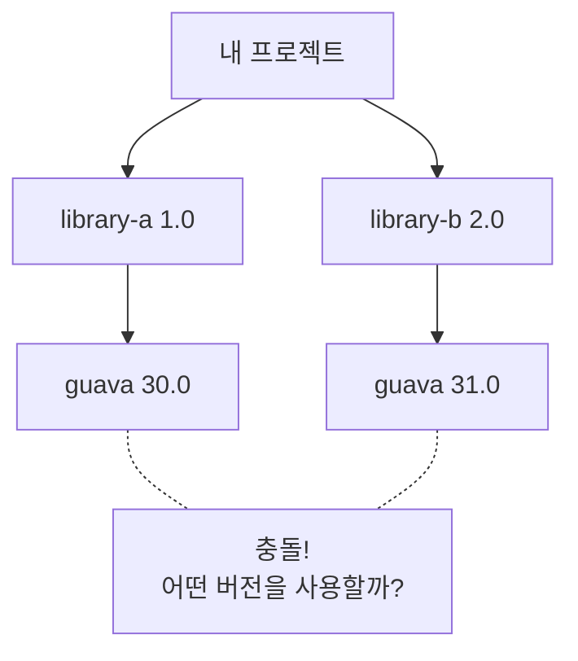
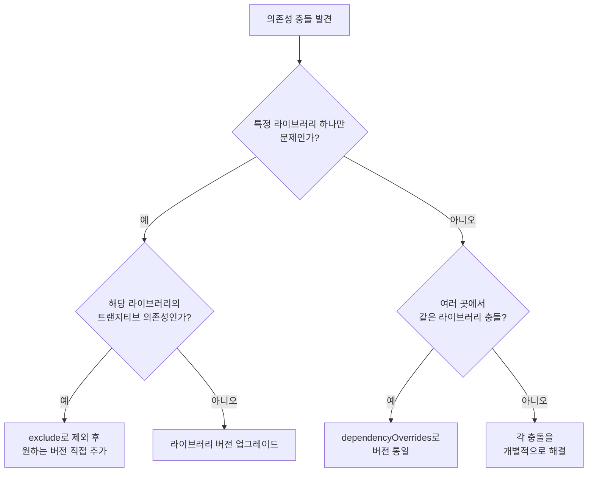

라이브러리 버전 충돌을 진단하고 해결하는 방법을 안내합니다.

**소요 시간**: 약 15-20분


- **증상**: 컴파일은 성공하지만 런타임에 `NoSuchMethodError`, `ClassNotFoundException` 발생
- **진단**: `sbt dependencyTree`로 충돌 라이브러리 확인
- **해결**: `exclude`, `dependencyOverrides`, `force()` 활용
- **예방**: eviction 경고를 무시하지 말 것


---

## 이 가이드가 해결하는 문제

다음 상황에서 이 가이드를 사용하세요:

- 컴파일은 성공하지만 런타임에 `NoSuchMethodError`가 발생하는 경우
- `ClassNotFoundException`이 발생하지만 라이브러리가 분명히 있는 경우
- sbt 빌드 시 eviction 경고가 출력되는 경우
- 여러 라이브러리가 같은 의존성의 다른 버전을 요구하는 경우

### 증상

```bash
# 컴파일은 성공하지만 실행 시 에러
$ sbt run
java.lang.NoSuchMethodError: 'void com.google.common.collect.ImmutableMap.forEach()'
```

```bash
# 또는 클래스를 찾지 못함
$ sbt run
java.lang.ClassNotFoundException: org.apache.commons.lang3.StringUtils
```

### 이 가이드가 다루지 않는 것

- **sbt 기본 사용법**: sbt 공식 문서를 참조하세요
- **Maven/Gradle 의존성 관리**: 해당 빌드 도구 문서를 참조하세요
- **Scala 바이너리 호환성**: Scala 버전 간 호환성 문제는 별도 주제입니다

---

## 시작하기 전에

다음 환경이 준비되어 있는지 확인하세요:

| 항목 | 요구 사항 | 확인 방법 |
|------|----------|----------|
| sbt 버전 | 1.x | `sbt --version` |
| sbt-dependency-graph | sbt 1.4+ 내장 | `sbt dependencyTree` |

```bash
# sbt 버전 확인
sbt --version
# 출력 예: sbt version in this project: 1.9.7

# 의존성 트리 확인 (sbt 1.4+ 내장)
sbt dependencyTree
```


sbt 1.4 이전 버전을 사용한다면 `sbt-dependency-graph` 플러그인을 별도로 추가해야 합니다:
```scala
// project/plugins.sbt
addSbtPlugin("net.virtual-void" % "sbt-dependency-graph" % "0.10.0-RC1")
```


---

## 1단계: 의존성 충돌 이해

### 1.1 트랜지티브 의존성이란

직접 선언하지 않았지만 라이브러리가 내부적으로 사용하는 의존성입니다:



### 1.2 sbt의 기본 해결 전략

sbt는 기본적으로 **최신 버전 우선(latest wins)** 전략을 사용합니다:

```
[warn] Found version conflict(s) in library dependencies; some are suspected to be binary incompatible:
[warn]   * com.google.guava:guava:31.0 is selected over 30.0
[warn]     +- library-b:library-b_2.13:2.0 (depends on 31.0)
[warn]     +- library-a:library-a_2.13:1.0 (depends on 30.0)
```


최신 버전이 항상 호환되는 것은 아닙니다. Major 버전이 다르면 API가 변경되었을 수 있습니다.


---

## 2단계: 충돌 진단

### 2.1 dependencyTree로 전체 트리 확인

```bash
# 전체 의존성 트리 출력
sbt dependencyTree

# 특정 라이브러리 검색 (출력이 길 때)
sbt "dependencyTree" | grep guava
```

출력 예시:

```
[info] my-project:my-project_2.13:0.1.0 [S]
[info]   +-library-a:library-a_2.13:1.0 [S]
[info]   | +-com.google.guava:guava:30.0
[info]   |
[info]   +-library-b:library-b_2.13:2.0 [S]
[info]     +-com.google.guava:guava:31.0 (evicted)
```

### 2.2 eviction 경고 해석

eviction은 sbt가 충돌을 자동 해결한 것을 의미합니다:

| 경고 수준 | 의미 | 조치 |
|----------|------|------|
| `(evicted)` | 이전 버전이 제외됨 | 호환성 확인 필요 |
| `binary incompatible` | 바이너리 호환 불가 의심 | **즉시 해결 필요** |
| `semver` 위반 | 의미적 버전 규칙 위반 | 해결 권장 |

### 2.3 evictionCheck 명령

sbt 1.5+에서는 eviction을 엄격하게 검사할 수 있습니다:

```scala
// build.sbt
ThisBuild / evictionErrorLevel := Level.Error  // eviction을 에러로 처리
```

```bash
sbt evicted
# 모든 eviction 목록 출력
```

---

## 3단계: 충돌 해결 방법

### 3.1 exclude - 특정 트랜지티브 의존성 제외

라이브러리가 가져오는 특정 의존성을 제외합니다:

```scala
// build.sbt
libraryDependencies ++= Seq(
  "library-a" %% "library-a" % "1.0" exclude("com.google.guava", "guava"),
  "library-b" %% "library-b" % "2.0"  // guava 31.0을 사용
)
```

여러 의존성을 제외하려면:

```scala
// build.sbt
libraryDependencies += ("library-a" %% "library-a" % "1.0")
  .exclude("com.google.guava", "guava")
  .exclude("org.slf4j", "slf4j-log4j12")
```

### 3.2 dependencyOverrides - 버전 강제 지정

프로젝트 전체에서 특정 라이브러리의 버전을 강제합니다:

```scala
// build.sbt
dependencyOverrides ++= Seq(
  "com.google.guava" % "guava" % "31.0-jre",
  "org.apache.commons" % "commons-lang3" % "3.14.0"
)
```


`dependencyOverrides`는 강력하지만 위험할 수 있습니다. 강제 지정한 버전이 모든 라이브러리와 호환되는지 확인하세요.


### 3.3 force() - 개별 의존성 강제


`force()`는 sbt 1.x에서 deprecated되었습니다. `dependencyOverrides` 사용을 권장합니다.


```scala
// build.sbt (레거시 방식)
libraryDependencies += "com.google.guava" % "guava" % "31.0-jre" force()
```

### 3.4 해결 방법 선택 가이드



---

## 4단계: 트랜지티브 의존성 관리 전략

### 4.1 BOM(Bill of Materials) 활용

일부 라이브러리 생태계는 BOM을 제공하여 버전을 일괄 관리합니다:

```scala
// build.sbt - AWS SDK BOM 예시
dependencyOverrides ++= Seq(
  "software.amazon.awssdk" % "bom" % "2.21.0"
)
```

### 4.2 의존성 잠금(Lock)

재현 가능한 빌드를 위해 의존성 버전을 고정합니다:

```scala
// project/plugins.sbt
addSbtPlugin("ch.epfl.scala" % "sbt-dependency-lock" % "0.1.0")
```

```bash
# 의존성 잠금 파일 생성
sbt dependencyLockWrite

# 잠금 파일과 현재 상태 비교
sbt dependencyLockCheck
```

### 4.3 정기적인 의존성 업데이트

```scala
// project/plugins.sbt
addSbtPlugin("com.timushev.sbt" % "sbt-updates" % "0.6.4")
```

```bash
# 업데이트 가능한 의존성 확인
sbt dependencyUpdates
```

출력 예시:

```
[info] Found 3 dependency updates for my-project
[info]   com.google.guava:guava                : 30.0-jre -> 31.0-jre -> 32.1.3-jre
[info]   org.apache.commons:commons-lang3      : 3.12.0   -> 3.14.0
[info]   io.circe:circe-core                   : 0.14.5   -> 0.14.7
```

---

## 5단계: 흔한 실수와 해결

### 5.1 Scala 바이너리 버전 충돌

```
[error] Modules were resolved with conflicting cross-version suffixes in ...
[error]   org.typelevel:cats-core _2.12, _2.13
```

**원인**: Scala 2.12용 라이브러리와 2.13용 라이브러리가 섞여 있습니다.

**해결**: 모든 라이브러리의 Scala 버전을 통일하세요:

```scala
// build.sbt
scalaVersion := "2.13.12"

// %% 연산자를 사용하면 자동으로 올바른 Scala 버전이 선택됨
libraryDependencies += "org.typelevel" %% "cats-core" % "2.10.0"
```

### 5.2 런타임 클래스패스 문제

컴파일 시점과 런타임 시점의 클래스패스가 다를 수 있습니다:

```bash
# 런타임 클래스패스 확인
sbt "show runtime:fullClasspath"

# 특정 클래스가 어떤 JAR에 있는지 확인
sbt "show runtime:fullClasspath" | xargs -I{} jar tf {} | grep StringUtils
```

### 5.3 SLF4J 바인딩 충돌

로깅 프레임워크 충돌은 가장 흔한 문제 중 하나입니다:

```
SLF4J: Class path contains multiple SLF4J bindings.
SLF4J: Found binding in [jar:file:logback-classic-1.4.11.jar]
SLF4J: Found binding in [jar:file:slf4j-log4j12-1.7.36.jar]
```

**해결**: 하나의 바인딩만 남기고 나머지를 exclude합니다:

```scala
// build.sbt - logback을 사용하고 싶은 경우
libraryDependencies ++= Seq(
  "ch.qos.logback" % "logback-classic" % "1.4.11",
  "some-library" %% "some-library" % "1.0" exclude("org.slf4j", "slf4j-log4j12")
)

// 모든 라이브러리에서 특정 의존성을 제외하려면
excludeDependencies += ExclusionRule("org.slf4j", "slf4j-log4j12")
```

---

## 체크리스트

의존성 충돌 해결 시 확인사항:

- [ ] **`sbt dependencyTree`로 충돌을 확인했는가?** - 충돌 라이브러리와 경로 파악
- [ ] **eviction 경고를 확인했는가?** - `sbt evicted`
- [ ] **바이너리 호환성을 확인했는가?** - Major 버전 차이에 주의
- [ ] **해결 후 런타임 테스트를 했는가?** - 컴파일 성공이 런타임 성공을 보장하지 않음
- [ ] **SLF4J 바인딩이 하나만 있는가?** - 로깅 충돌 확인

**모든 항목을 확인했는데도 문제가 해결되지 않으면**, `sbt "show runtime:fullClasspath"`로 실제 런타임 클래스패스를 확인하세요.

---

## 관련 문서

- [타입 에러 디버깅](type-error-debugging/) - 컴파일 타임 에러 해결
- [Implicit/Given 디버깅](implicit-debugging/) - 암시적 값 관련 에러 해결
- [Future 에러 처리](future-error-handling/) - 비동기 코드의 에러 처리
