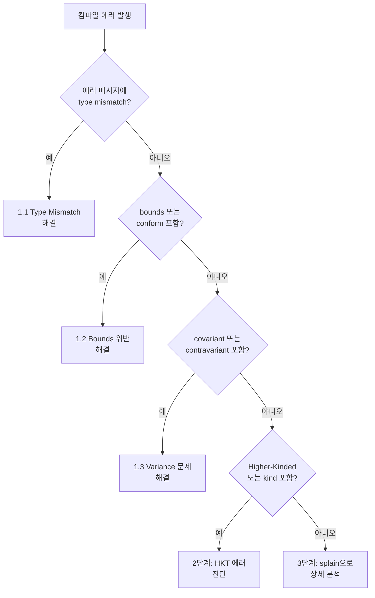

복잡한 타입 에러 메시지를 해독하고 해결하는 방법을 안내합니다.

**소요 시간**: 약 15-20분


- **Type Mismatch**: 기대 타입과 실제 타입을 비교하여 어디서 불일치가 발생했는지 확인
- **Bounds 위반**: 타입 파라미터의 상한/하한 제약 조건 확인
- **Variance 문제**: 공변/반공변 위치에 올바른 타입이 있는지 확인
- **splain 플러그인**: 복잡한 타입 에러를 읽기 쉬운 형태로 변환


---

## 이 가이드가 해결하는 문제

다음과 같은 컴파일 에러가 발생할 때 이 가이드를 사용하세요:

```
type mismatch;
 found   : List[String]
 required: List[Int]
```

```
type arguments [Dog] do not conform to method process's
type parameter bounds [A <: Animal with Serializable]
```

```
covariant type A occurs in contravariant position in type A => Unit
```

### 이 가이드가 다루지 않는 것

- **타입 시스템의 기초 개념**: [타입 시스템 개념 문서](../concepts/type-system-advanced/)를 참조하세요
- **암시적 값 관련 에러**: [Implicit/Given 디버깅](implicit-debugging/)을 참조하세요
- **매크로/리플렉션 관련 에러**: 해당 라이브러리 문서를 참조하세요

---

## 시작하기 전에

다음 환경이 준비되어 있는지 확인하세요:

| 항목 | 요구 사항 | 확인 방법 |
|------|----------|----------|
| Scala 버전 | 2.13.x 또는 3.x | `scala -version` |
| 빌드 도구 | sbt 1.x | `sbt --version` |
| IDE (선택) | IntelliJ IDEA + Scala 플러그인 또는 VS Code + Metals | - |

---

## 1단계: 타입 에러 진단 플로우

다음 플로우차트에 따라 에러 유형을 먼저 파악하세요:



---

## 2단계: 일반적인 타입 에러 패턴

### 2.1 Type Mismatch

가장 흔한 타입 에러입니다. 컴파일러가 기대하는 타입과 실제 타입이 다를 때 발생합니다:

```scala
// 에러: type mismatch; found: String, required: Int
def add(a: Int, b: Int): Int = a + b
add(1, "2")  // String을 Int 자리에 전달
```

**에러 메시지 해독법**:

| 키워드 | 의미 |
|--------|------|
| `found` | 실제로 전달된 (또는 추론된) 타입 |
| `required` | 컴파일러가 기대하는 타입 |

복잡한 제네릭 타입에서는 차이를 찾기 어렵습니다:

```scala
// 에러: type mismatch
//   found   : Map[String, List[Option[Int]]]
//   required: Map[String, List[Option[String]]]
def process(data: Map[String, List[Option[String]]]): Unit = {}

val input: Map[String, List[Option[Int]]] = Map("key" -> List(Some(1)))
process(input)  // 깊이 중첩된 타입 파라미터 불일치
```

**해결**: `found`와 `required`를 한 단계씩 비교하면서 차이점을 찾으세요. 위 예시에서는 `Option[Int]` vs `Option[String]`이 불일치 지점입니다.

### 2.2 Bounds 위반

타입 파라미터에 상한(`<:`) 또는 하한(`>:`) 제약이 있을 때 발생합니다:



```scala
trait Animal
trait Serializable
class Dog extends Animal  // Serializable을 구현하지 않음

def process[A <: Animal with Serializable](animal: A): Unit = {}

process(new Dog)
// 에러: type arguments [Dog] do not conform to
// method process's type parameter bounds [A <: Animal with Serializable]
```

**해결**: 타입 제약을 충족하도록 클래스를 수정합니다:

```scala
class Dog extends Animal with Serializable  // 두 트레이트 모두 구현
process(new Dog)  // 정상 동작
```


```scala
trait Animal
trait Serializable
class Dog extends Animal  // Serializable을 구현하지 않음

def process[A <: Animal & Serializable](animal: A): Unit = {}

process(Dog())
// 에러: Type argument Dog does not conform to upper bound Animal & Serializable

// 해결: 두 트레이트 모두 구현
class Dog extends Animal, Serializable
process(Dog())  // 정상 동작
```



### 2.3 Variance 문제

공변(`+A`)/반공변(`-A`) 위치에 타입 파라미터를 잘못 사용할 때 발생합니다:

```scala
// 에러: covariant type A occurs in contravariant position
class Container[+A] {
  def add(item: A): Unit = {}  // A가 메서드 파라미터(반공변 위치)에 사용됨
}
```

**해결**: 하한 바운드를 사용하여 우회합니다:

```scala
class Container[+A] {
  def add[B >: A](item: B): Container[B] = {
    // B는 A의 슈퍼타입
    new Container[B]
  }
}

val dogs: Container[Dog] = new Container[Dog]
val animals: Container[Animal] = dogs  // 공변이므로 가능
```

---

## 3단계: 컴파일러 메시지 상세 분석

### 3.1 splain 플러그인 (Scala 2)

복잡한 타입 에러를 읽기 쉬운 형태로 변환해줍니다:

```scala
// build.sbt (Scala 2.13)
addCompilerPlugin("io.tryp" % "splain" % "1.1.0" cross CrossVersion.full)
```

splain이 없을 때:

```
found   : shapeless.::[Int, shapeless.::[String, shapeless.HNil]]
required: shapeless.::[String, shapeless.::[Int, shapeless.HNil]]
```

splain이 있을 때:

```
found   : Int :: String :: HNil
required: String :: Int :: HNil
          ^^^      ^^^
```

### 3.2 Scala 3의 향상된 에러 메시지

Scala 3는 기본적으로 더 상세한 진단을 제공합니다:

```
-- [E007] Type Mismatch Error: example.scala:10:15 ---
10 |  process(input)
   |          ^^^^^
   |  Found:    Map[String, List[Option[Int]]]
   |  Required: Map[String, List[Option[String]]]
   |
   |  Note: the type parameter difference is at:
   |    Option[Int] vs Option[String]
```

### 3.3 -Xprint:typer 플래그

컴파일러가 추론한 타입을 확인하려면 다음 플래그를 사용하세요:

```scala
// build.sbt
scalacOptions += "-Xprint:typer"
```

출력이 매우 길어지므로, 문제가 되는 파일만 대상으로 사용하는 것을 권장합니다:

```bash
# 특정 파일만 컴파일하며 타입 확인
sbt "compile:doc"
# 또는 REPL에서
scala -Xprint:typer -e "val x = List(1, 2, 3).map(_ + 1)"
```

---

## 4단계: 고차 타입(Higher-Kinded Types) 에러 진단

### 4.1 Kind 불일치

```scala
// F는 타입 생성자 (예: List, Option)
trait Functor[F[_]] {
  def map[A, B](fa: F[A])(f: A => B): F[B]
}

// 에러: Map takes two type parameters, expected: one
// Map[String, *]은 F[_]에 맞지 않음
// implicit val mapFunctor: Functor[Map] = ???  // 컴파일 안 됨
```

**해결**: 타입 별칭으로 Kind를 맞춰줍니다:



```scala
// 타입 람다 사용 (kind-projector 플러그인)
// addCompilerPlugin("org.typelevel" % "kind-projector" % "0.13.3" cross CrossVersion.full)

implicit val mapFunctor: Functor[Map[String, *]] = new Functor[Map[String, *]] {
  def map[A, B](fa: Map[String, A])(f: A => B): Map[String, B] = fa.view.mapValues(f).toMap
}

// 또는 타입 별칭 사용
type StringMap[A] = Map[String, A]
implicit val mapFunctor: Functor[StringMap] = new Functor[StringMap] {
  def map[A, B](fa: StringMap[A])(f: A => B): StringMap[B] = fa.view.mapValues(f).toMap
}
```


```scala
// Scala 3 네이티브 타입 람다
given Functor[[A] =>> Map[String, A]] with
  def map[A, B](fa: Map[String, A])(f: A => B): Map[String, B] =
    fa.view.mapValues(f).toMap
```



### 4.2 타입 추론 실패

컴파일러가 타입을 추론하지 못할 때 명시적 타입 어노테이션을 추가합니다:

```scala
// 에러: missing parameter type
val result = List(1, 2, 3).foldLeft(Map.empty)((acc, x) => acc + (x.toString -> x))

// 해결: 초기값의 타입을 명시
val result = List(1, 2, 3).foldLeft(Map.empty[String, Int])((acc, x) =>
  acc + (x.toString -> x)
)
```

일반적인 타입 어노테이션 전략:

| 상황 | 전략 |
|------|------|
| `foldLeft`/`foldRight` 초기값 | 초기값에 타입 명시 |
| 빈 컬렉션 | `List.empty[Type]` 사용 |
| 메서드 체이닝 중 추론 실패 | 중간 결과에 타입 어노테이션 |
| 람다 파라미터 | `(x: Type) => ...` 명시 |
| 제네릭 메서드 호출 | `method[Type](...)` 타입 인자 명시 |

```scala
// 컴파일러가 추론에 실패하는 경우
def transform[A, B](list: List[A])(f: A => B): List[B] = list.map(f)

// 에러: missing parameter type for expanded function
// transform(List(1, 2, 3))(x => x.toString)

// 해결 방법 1: 람다 파라미터에 타입 명시
transform(List(1, 2, 3))((x: Int) => x.toString)

// 해결 방법 2: 타입 인자 명시
transform[Int, String](List(1, 2, 3))(x => x.toString)
```

---

## 5단계: 흔한 실수와 해결

### 5.1 Nothing 타입 추론

```scala
// 잘못된 예: 빈 컬렉션에서 Nothing 추론
val map = Map.empty  // Map[Nothing, Nothing]으로 추론됨
map + ("key" -> 1)   // 에러: type mismatch

// 올바른 예: 타입 명시
val map = Map.empty[String, Int]
map + ("key" -> 1)   // 정상 동작
```

### 5.2 Path-Dependent Type 혼동

```scala
class Outer {
  class Inner
  def process(inner: Inner): Unit = {}
}

val a = new Outer
val b = new Outer
val innerA = new a.Inner

// 에러: type mismatch; found: a.Inner, required: b.Inner
// b.process(innerA)

// 해결: 같은 인스턴스의 Inner를 사용하거나, 타입 프로젝션 사용
def processAny(inner: Outer#Inner): Unit = {}
processAny(innerA)  // 정상 동작
```

### 5.3 타입 소거(Type Erasure)

```scala
// 경고: non-variable type argument String in type pattern
// List[String] is unchecked since it is eliminated by erasure
def process(list: Any): Unit = list match {
  case l: List[String] => println("String list")  // 런타임에 확인 불가
  case _ => println("Other")
}

// 해결: TypeTag 또는 ClassTag 사용
import scala.reflect.ClassTag

def process[A: ClassTag](list: List[A]): Unit = {
  val clazz = implicitly[ClassTag[A]].runtimeClass
  println(s"List of ${clazz.getSimpleName}")
}
```

---

## 체크리스트

타입 에러를 만났을 때 다음을 확인하세요:

- [ ] **found와 required를 한 단계씩 비교했는가?** - 중첩 타입에서 차이점 찾기
- [ ] **타입 파라미터의 bounds를 충족하는가?** - 상한/하한 제약 확인
- [ ] **공변/반공변 위치가 올바른가?** - 메서드 파라미터 vs 반환 타입
- [ ] **타입 추론이 실패한 곳에 명시적 어노테이션을 추가했는가?** - `foldLeft`, 빈 컬렉션 등
- [ ] **splain 플러그인을 사용해봤는가?** - 복잡한 에러 메시지 해독 (Scala 2)

**모든 항목을 확인했는데도 해결되지 않으면**, 최소 재현 코드를 Scastie(https://scastie.scala-lang.org)에서 공유하세요.

---

## 관련 문서

- [타입 시스템](../concepts/type-system-advanced/) - Scala 타입 시스템의 기초
- [Implicit/Given 디버깅](implicit-debugging/) - 암시적 값 관련 에러 해결
- [Future 에러 처리](future-error-handling/) - 비동기 코드의 에러 처리
