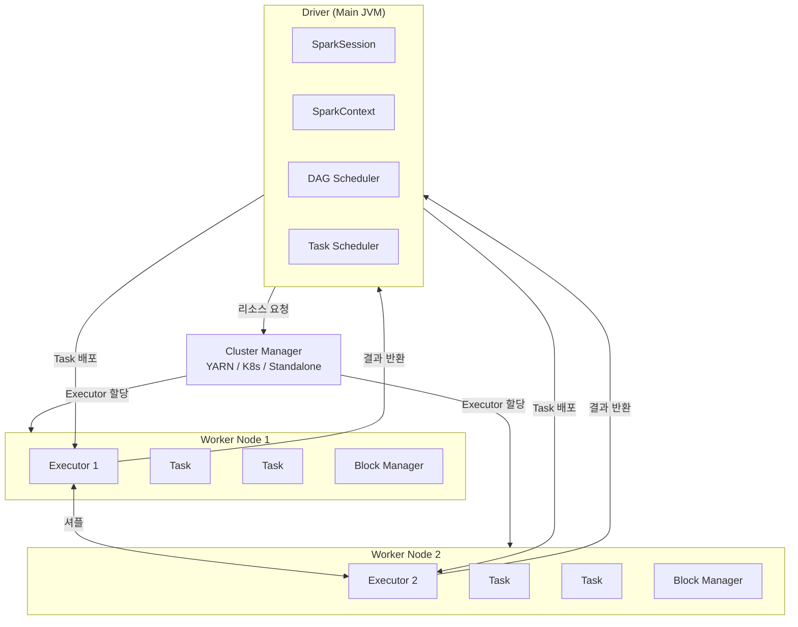
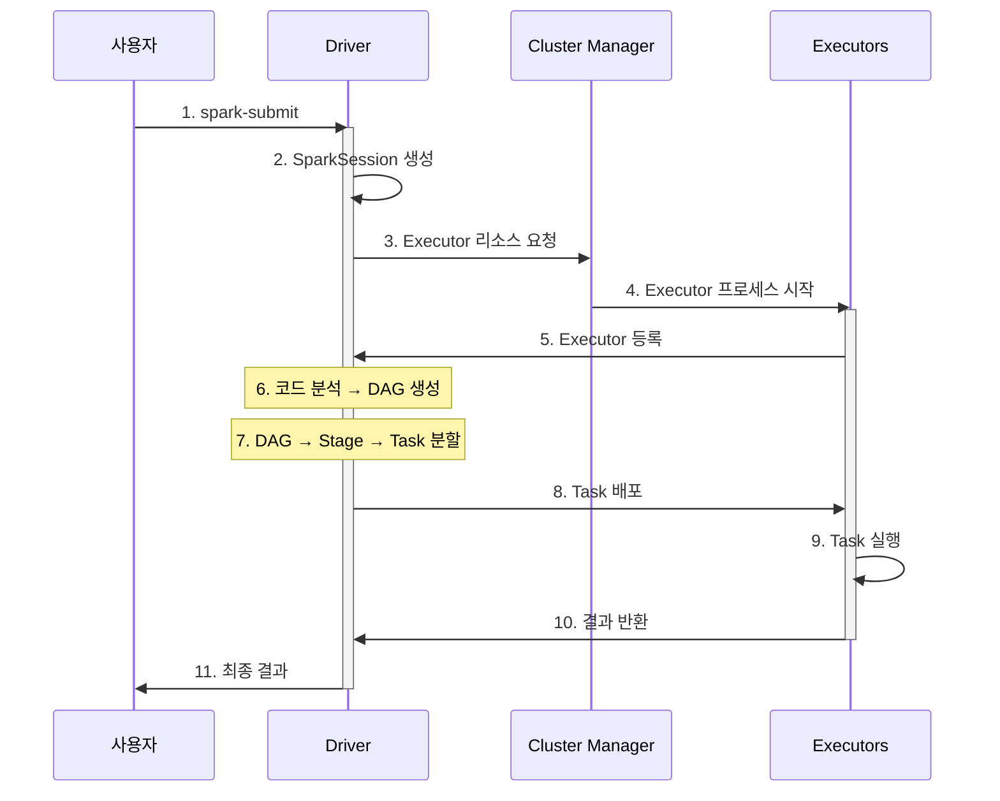
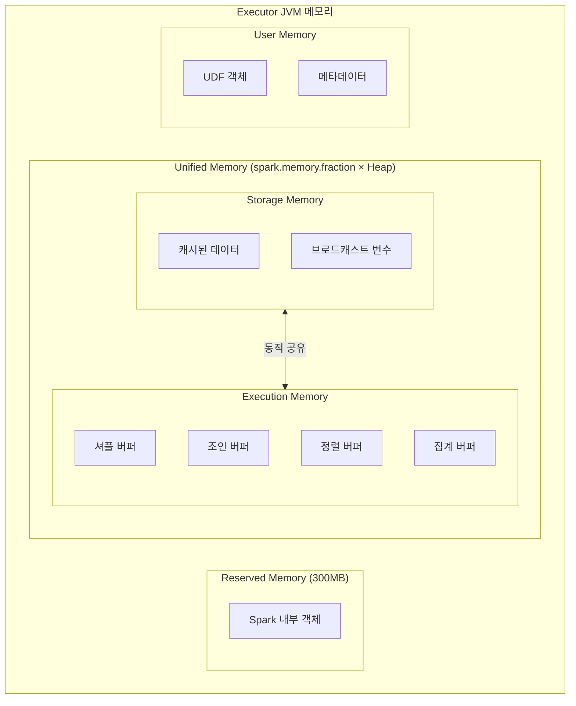


- Spark는 Driver(조율자) + Executor(작업자) + Cluster Manager(리소스 관리)로 구성
- 모든 Transformation은 DAG로 표현되고, Action 호출 시 Job → Stage → Task로 분할되어 실행
- 메모리는 Execution(연산)과 Storage(캐시)가 동적으로 공유하는 Unified Memory 모델 사용
- Java/Spring 개발자에게 SparkSession은 Spring Container, Executor는 Thread Pool Worker와 유사


**대상 독자**: Java/Spring 기반 백엔드 개발 경험이 있는 개발자

**선수 지식**:
- Java 기본 문법 및 JVM 메모리 구조 이해
- 멀티스레딩 기초 개념 (Thread, ExecutorService)
- 분산 시스템의 기본 개념 (선택 사항)

**소요 시간**: 약 25-30분

---

Spark 애플리케이션이 어떻게 분산 환경에서 실행되는지 이해합니다. Java/Spring 개발자에게 익숙한 개념과 비교하며 설명합니다.

## 비유로 이해하는 아키텍처

복잡한 분산 시스템도 일상적인 비유로 이해하면 직관적으로 파악할 수 있습니다.

| 구성요소 | 비유 | 핵심 아이디어 |
|----------|------|---------------|
| **Driver** | 건설 현장 소장 | 설계도(DAG)를 보고 작업을 지시하지만, 직접 벽돌을 쌓지 않음 |
| **Executor** | 건설 노동자 | 현장 소장의 지시에 따라 실제 작업 수행. 각자 담당 구역에서 독립적으로 작업 |
| **Cluster Manager** | 인력 파견 회사 | 현장 소장의 요청에 따라 적절한 인력(리소스) 배정 |
| **Task** | 작업 지시서 | "3층 A구역 창문 설치" 같은 구체적인 단일 작업 |
| **Stage** | 공정 단계 | "기초공사 → 골조공사 → 마감공사" 처럼 순서가 있는 작업 단위 |
| **Shuffle** | 자재 재배치 | 1층에 있던 자재를 2층으로 옮기는 것처럼, 데이터 이동이 필요한 시점 |
| **Unified Memory** | 공유 창고 | 자재 보관(Storage)과 작업 공간(Execution)을 상황에 따라 유연하게 활용 |

> **Tip**: 이 비유들은 아래 각 섹션에서 기술적 구현과 함께 상세히 설명됩니다.

## 왜 이런 구조인가? (설계 철학)

**질문: 왜 Spark는 Driver와 Executor를 분리했을까요?**

이 질문에 답하려면 분산 시스템이 해결해야 할 근본적인 문제들을 이해해야 합니다.

**1. 조율과 실행의 분리 (관심사 분리)**

건설 현장에서 소장이 직접 벽돌을 쌓는다면 어떨까요? 전체 공정을 조율할 사람이 없어집니다. Spark도 마찬가지로:
- **Driver**: "무엇을, 어떤 순서로" 할지 결정 (계획 수립)
- **Executor**: "실제 처리" 담당 (계획 실행)

이 분리 덕분에 Driver는 실행 계획 최적화에 집중하고, Executor는 데이터 처리에만 집중할 수 있습니다.

**2. 확장성 (Scale-out)**

단일 머신의 한계를 넘어서려면 여러 머신에 작업을 분배해야 합니다:
- Driver 1개가 Executor 수십~수백 개를 조율
- Executor 추가만으로 처리 능력 확장 (수평 확장)
- 각 Executor는 독립 JVM으로 격리되어 장애 전파 방지

**3. 내결함성 (Fault Tolerance)**

수천 대 서버 클러스터에서는 일부 노드 장애가 일상입니다:
- DAG(실행 계획)가 있으므로 장애 시 해당 부분만 재계산
- Driver가 Executor 상태를 추적하여 실패 Task 재시도
- 데이터(RDD)가 아닌 **계산 방법(Lineage — 데이터의 변환 이력을 추적하는 계보 정보)**을 저장하여 복구

**왜 Unified Memory인가?**

| 이전 모델 (정적 분리) | 현재 모델 (동적 공유) |
|-----------------------|-----------------------|
| Storage 50%, Execution 50% 고정 | 필요에 따라 유연하게 조절 |
| 캐시는 넉넉한데 연산 메모리 부족 → 비효율 | 실행 중 메모리 부족 시 캐시 공간 차용 |
| 설정 튜닝에 전문 지식 필요 | 자동 조절로 운영 부담 감소 |

Unified Memory는 "워크로드 특성을 예측할 수 없다"는 현실을 인정한 설계입니다.

## 핵심 구성요소

Spark 클러스터는 세 가지 주요 컴포넌트로 구성됩니다:



*그림: Spark 클러스터 아키텍처 - Driver가 SparkSession과 Scheduler를 포함하고, Cluster Manager를 통해 Worker 노드의 Executor에 Task를 배포하며, Executor 간에는 셔플을 통해 데이터를 교환합니다.*

아래에서 각 구성요소의 역할과 상호작용을 자세히 살펴봅니다.

**1. Driver**

**Driver**는 Spark 애플리케이션의 중앙 조율자입니다. `main()` 메서드가 실행되는 JVM 프로세스입니다.

```java
// 이 코드가 실행되는 곳이 Driver
public static void main(String[] args) {
    SparkSession spark = SparkSession.builder()
            .appName("MyApp")
            .master("local[*]")
            .getOrCreate();

    // SparkSession 생성 시점에 Driver가 시작됨
    Dataset<Row> df = spark.read().csv("data.csv");
    df.show();  // Action 호출 시 Executor에 작업 분배
}
```

**Driver의 역할:**
- `SparkSession`/`SparkContext` 생성 및 관리
- 사용자 코드의 Transformation을 분석하여 실행 계획(DAG) 생성
- 실행 계획을 Stage와 Task로 분할
- Cluster Manager에 리소스 요청
- Executor에 Task 배포 및 진행 상황 모니터링
- 결과 수집 및 사용자에게 반환

**Java 개발자 관점:**
Driver는 Spring 애플리케이션의 메인 컨텍스트와 유사합니다. 모든 설정과 조율이 여기서 이루어지고, 실제 작업은 Executor(워커)가 수행합니다.

**2. Executor**

**Executor**는 클러스터의 워커 노드에서 실행되는 JVM 프로세스입니다. 실제 데이터 처리를 담당합니다.

**Executor의 역할:**
- Driver가 할당한 Task 실행
- 데이터를 메모리나 디스크에 저장 (캐싱)
- 처리 결과를 Driver에게 반환
- 애플리케이션 수명 동안 유지됨

**특징:**
- 하나의 애플리케이션에 여러 Executor 할당 가능
- 각 Executor는 독립적인 JVM으로 격리
- 코어 수에 따라 병렬로 여러 Task 실행
- Executor 간 데이터 이동은 셔플을 통해 발생

```
┌─────────────────────────────────────────────────────┐
│                    Executor JVM                      │
│  ┌──────────┐ ┌──────────┐ ┌──────────┐            │
│  │  Task 1  │ │  Task 2  │ │  Task 3  │  ...       │
│  └──────────┘ └──────────┘ └──────────┘            │
│                                                      │
│  ┌─────────────────────────────────────────────┐   │
│  │              Block Manager                   │   │
│  │         (캐시된 데이터 저장)                   │   │
│  └─────────────────────────────────────────────┘   │
└─────────────────────────────────────────────────────┘
```

**3. Cluster Manager**

**Cluster Manager**는 클러스터 전체의 리소스를 관리합니다. Driver의 요청에 따라 Executor를 할당합니다.

**지원하는 Cluster Manager:**

| 종류 | 특징 | 사용 시점 |
|------|------|----------|
| **Standalone** | Spark에 내장, 설정 간단 | 소규모 클러스터, 학습용 |
| **YARN** | Hadoop 생태계 통합 | 기존 Hadoop 클러스터 활용 시 |
| **Kubernetes** | 컨테이너 기반, 유연한 확장 | 클라우드 네이티브 환경 |
| **Mesos** | 범용 리소스 관리 | 다양한 워크로드 혼합 시 |
| **Local** | 단일 JVM | 개발/테스트 환경 |

각 Cluster Manager는 사용 환경과 요구사항에 따라 선택합니다. 개발 환경에서는 Local이나 Standalone을, 프로덕션 환경에서는 YARN이나 Kubernetes를 주로 사용합니다.

**로컬 모드 vs 클러스터 모드:**

```java
// 로컬 모드 - 개발/테스트용
.master("local[*]")      // Driver와 Executor가 같은 JVM

// 클러스터 모드 - 프로덕션용
.master("spark://host:7077")  // Standalone
.master("yarn")               // YARN
.master("k8s://https://...")  // Kubernetes
```


- **Driver**: main() 실행, DAG 생성, Task 스케줄링 담당
- **Executor**: 실제 데이터 처리 수행, 독립 JVM으로 격리
- **Cluster Manager**: 리소스 할당 (Local, Standalone, YARN, K8s)
- 개발 시 `local[*]`, 프로덕션 시 YARN/K8s 사용


## 애플리케이션 실행 흐름

Spark 애플리케이션이 제출되면 다음 순서로 실행됩니다:



*그림: Spark 애플리케이션 실행 순서 - spark-submit 후 SparkSession 생성, Executor 할당, DAG 분석, Task 배포, 결과 반환까지의 전체 흐름을 보여줍니다.*


- spark-submit으로 애플리케이션 제출 시 Driver가 먼저 시작
- Driver가 Cluster Manager에 Executor 리소스 요청
- Transformation 코드를 분석하여 DAG → Stage → Task로 분할
- Task가 Executor에서 병렬 실행되고 결과가 Driver로 반환


## Job, Stage, Task

Action이 호출되면 Spark는 내부적으로 Job → Stage → Task 계층으로 작업을 분할합니다. 각 계층의 역할을 이해하면 Spark의 실행 모델을 파악할 수 있습니다.

**Job**

**Job**은 하나의 Action에 대응하는 전체 계산 단위입니다.

```java
// 각 Action마다 하나의 Job 생성
df.count();         // Job 1
df.collect();       // Job 2
df.write().csv();   // Job 3
```

**Stage**

**Stage**는 셔플 경계로 나뉜 Task의 집합입니다.

- **Narrow Transformation** (map, filter): 같은 Stage 내에서 파이프라이닝
- **Wide Transformation** (groupBy, join): 셔플 발생 → 새 Stage 생성

```java
df.filter(col("age").gt(30))     // Narrow - Stage 1에 포함
  .groupBy("department")          // Wide - 여기서 Stage 분리
  .count()                        // Stage 2
  .show();                        // Action → Job 실행
```

**Task**

**Task**는 단일 파티션에서 실행되는 최소 작업 단위입니다.

- 파티션 수 = Task 수
- 각 Task는 독립적으로 Executor에서 실행
- Task는 직렬화되어 Executor로 전송됨

```
예: 4개 파티션, 2개 Stage

Stage 1: [Task 1-1] [Task 1-2] [Task 1-3] [Task 1-4]
              ↓          ↓          ↓          ↓
         (셔플 - 데이터 재분배)
              ↓          ↓          ↓          ↓
Stage 2: [Task 2-1] [Task 2-2] [Task 2-3] [Task 2-4]
```


- **Job**: 하나의 Action에 대응하는 전체 계산 단위
- **Stage**: 셔플 경계로 구분된 Task 집합 (Narrow → 같은 Stage, Wide → 새 Stage)
- **Task**: 단일 파티션에서 실행되는 최소 작업 단위 (파티션 수 = Task 수)
- Wide Transformation(groupBy, join)이 Stage 경계를 만듦


## DAG (Directed Acyclic Graph)

Spark는 Transformation을 **DAG**로 표현합니다. 이는 연산의 의존 관계를 나타내는 방향성 비순환 그래프입니다.

```java
Dataset<Row> df1 = spark.read().csv("file1.csv");
Dataset<Row> df2 = spark.read().csv("file2.csv");

Dataset<Row> filtered = df1.filter(col("status").equalTo("ACTIVE"));
Dataset<Row> joined = filtered.join(df2, "id");
Dataset<Row> result = joined.groupBy("category").count();

result.show();  // Action → DAG 실행
```

**DAG 구조:**
```
[df1 읽기] → [filter] ─┐
                       ├→ [join] → [groupBy] → [count] → [show]
[df2 읽기] ────────────┘
```

**DAG의 장점:**

1. **지연 평가**: Action 전까지 실행하지 않음
2. **최적화**: Catalyst Optimizer가 DAG를 분석하여 실행 계획 최적화
3. **장애 복구**: 파티션 손실 시 DAG를 따라 재계산 가능


- DAG는 Transformation의 의존 관계를 표현하는 방향성 비순환 그래프
- Action 호출 전까지 실제 실행 없음 (지연 평가)
- Catalyst Optimizer가 DAG를 분석하여 최적화
- 장애 발생 시 DAG를 따라 손실된 파티션만 재계산


## Java 개발자 관점에서 이해하기

Java 개발자가 Spark를 이해하기 위해 익숙한 개념과 비교해봅니다.

**Spring과의 비교**

아래 표는 Spring 애플리케이션의 구성요소와 Spark의 대응 관계를 보여줍니다:

| Spring 애플리케이션 | Spark 애플리케이션 |
|-------------------|-------------------|
| Spring Container | SparkSession |
| Main Thread | Driver |
| Thread Pool Worker | Executor |
| ExecutorService | Cluster Manager |
| Runnable/Callable | Task |
| CompletableFuture | Job/Stage |

**분산 처리 관점**

동일한 데이터 처리 로직을 Java Stream과 Spark로 비교하면 분산 처리의 차이점을 이해할 수 있습니다:

```java
// 일반 Java 코드 (단일 JVM)
List<Employee> employees = loadAll();
List<Employee> highPaid = employees.stream()
    .filter(e -> e.getSalary() > 100000)
    .collect(Collectors.toList());

// Spark 코드 (분산 처리)
Dataset<Row> employees = spark.read().parquet("employees");
Dataset<Row> highPaid = employees
    .filter(col("salary").gt(100000));
```

두 코드의 차이점:
1. **데이터 위치**: Java는 메모리에 전체 로드, Spark는 분산 저장소에 존재
2. **실행 위치**: Java는 단일 JVM, Spark는 여러 Executor에 분산
3. **장애 처리**: Java는 예외 발생 시 실패, Spark는 자동 재시도


- SparkSession ≈ Spring Container (설정과 조율 담당)
- Executor ≈ Thread Pool Worker (실제 작업 수행)
- Java Stream은 단일 JVM, Spark는 클러스터 분산 처리
- Spark는 장애 발생 시 자동 재시도로 내결함성 제공


## 메모리 모델 (Unified Memory Management)

Spark 1.6부터 도입된 **통합 메모리 관리(Unified Memory Management)**는 실행과 저장 메모리를 동적으로 공유합니다. 이 모델을 이해하면 메모리 관련 문제를 효과적으로 해결할 수 있습니다.

**Executor 메모리 구조**

아래 다이어그램은 Executor JVM의 메모리 영역 구성을 보여줍니다:



*그림: Executor JVM 메모리 구조 - Reserved(300MB 고정), Unified Memory(Storage + Execution, 동적 공유), User Memory로 구분됩니다.*

**메모리 영역별 역할**

각 메모리 영역의 용도와 기본 비율을 정리한 표입니다:

| 영역 | 비율 (기본값) | 용도 |
|------|--------------|------|
| **Reserved** | 300MB 고정 | Spark 내부 객체, OOM 방지 버퍼 |
| **Unified Memory** | Heap × 0.6 | 실행과 저장 공유 |
| ├─ Storage | 동적 (초기 50%) | 캐시, 브로드캐스트, 언롤링 |
| └─ Execution | 동적 (초기 50%) | 셔플, 조인, 정렬, 집계 |
| **User Memory** | Heap × 0.4 | 사용자 코드, UDF, RDD 메타데이터 |

**동적 메모리 공유**

**핵심 원리**: Execution 메모리가 부족하면 Storage 메모리를 빌려 사용하고, 그 반대도 가능합니다.

```java
// 메모리 설정 예시
SparkSession spark = SparkSession.builder()
    .config("spark.memory.fraction", "0.6")           // Unified Memory 비율
    .config("spark.memory.storageFraction", "0.5")    // Storage 초기 비율
    .getOrCreate();
```

**동작 방식:**

1. **Execution → Storage 차용**: 셔플 중 메모리 부족 시 캐시 공간 사용
2. **Storage → Execution 차용**: 캐시 중 메모리 부족 시 실행 공간 사용
3. **우선순위**: Execution이 우선 - 필요 시 캐시 데이터 삭제(eviction)

**메모리 계산 예시**

8GB Executor의 메모리 배분 예시입니다:

```
Executor 메모리: 8GB
├── Reserved: 300MB
├── Unified Memory: (8GB - 300MB) × 0.6 = 4.6GB
│   ├── Storage (초기): 4.6GB × 0.5 = 2.3GB
│   └── Execution (초기): 4.6GB × 0.5 = 2.3GB
└── User Memory: (8GB - 300MB) × 0.4 = 3.1GB
```


이 섹션은 고급 주제입니다. 처음 읽을 때는 건너뛰고, 성능 튜닝이 필요할 때 돌아오세요.


**Off-Heap 메모리**

GC 영향을 줄이기 위해 JVM 힙 외부 메모리 사용:

```java
SparkSession spark = SparkSession.builder()
    .config("spark.memory.offHeap.enabled", "true")
    .config("spark.memory.offHeap.size", "2g")
    .getOrCreate();
```

**Off-Heap 장점:**
- GC 대상에서 제외되어 Stop-the-World 감소
- 대용량 캐시에 효과적
- Tungsten(Spark 내부의 메모리/CPU 최적화 엔진) 메모리 관리와 통합

**메모리 관련 트러블슈팅**

자주 발생하는 메모리 문제와 해결 방법입니다:

| 증상 | 원인 | 해결 |
|------|------|------|
| OOM in Executor | 데이터 파티션이 너무 큼 | 파티션 수 증가 (`repartition`) |
| OOM in Driver | `collect()` 결과가 너무 큼 | `take(n)` 또는 파일로 저장 |
| GC overhead exceeded | 메모리 부족 | `spark.executor.memory` 증가 |
| 캐시 삭제 빈번 | Storage Memory 부족 | `storageFraction` 증가 또는 DISK 사용 |


- Unified Memory: Execution과 Storage가 필요에 따라 동적으로 메모리 공유
- 기본 비율: Reserved(300MB) + Unified(60%) + User(40%)
- Execution이 우선: 메모리 부족 시 캐시 데이터 먼저 삭제
- Off-Heap 사용으로 GC 영향 최소화 가능


## 배포 모드

Spark 애플리케이션은 Client Mode와 Cluster Mode 두 가지 방식으로 배포할 수 있습니다.

**Client Mode**

Driver가 클라이언트(spark-submit 실행 위치)에서 실행됩니다.

```bash
spark-submit --deploy-mode client myapp.jar
```

- Driver가 로컬에서 실행되어 디버깅 용이
- 클라이언트와 클러스터 간 네트워크 지연 발생 가능
- 클라이언트 종료 시 애플리케이션도 종료
- 개발/테스트 환경에 적합

**Cluster Mode**

Driver가 클러스터 내부에서 실행됩니다.

```bash
spark-submit --deploy-mode cluster myapp.jar
```

- Driver가 클러스터 내에서 실행되어 네트워크 지연 최소화
- 클라이언트 종료해도 애플리케이션 계속 실행
- 로그 확인이 상대적으로 불편
- 프로덕션 환경에 적합


- **Client Mode**: Driver가 로컬에서 실행, 개발/디버깅에 적합
- **Cluster Mode**: Driver가 클러스터 내에서 실행, 프로덕션에 적합
- Client Mode는 클라이언트 종료 시 Job도 종료
- Cluster Mode는 네트워크 지연 최소화


## 주요 설정

Spark 애플리케이션의 성능을 조절하는 주요 설정 항목들입니다.

**Driver 설정**

```properties
# Driver 메모리
spark.driver.memory=4g

# Driver CPU 코어
spark.driver.cores=2

# Driver와 Executor 간 최대 결과 크기
spark.driver.maxResultSize=1g
```

**Executor 설정**

```properties
# Executor 수
spark.executor.instances=10

# Executor당 메모리
spark.executor.memory=8g

# Executor당 CPU 코어
spark.executor.cores=4
```

**실행 시 설정 예시**

spark-submit 명령어나 코드에서 설정을 지정하는 방법입니다:

```bash
spark-submit \
  --master yarn \
  --deploy-mode cluster \
  --driver-memory 4g \
  --executor-memory 8g \
  --executor-cores 4 \
  --num-executors 10 \
  myapp.jar
```

또는 Java 코드에서:

```java
SparkSession spark = SparkSession.builder()
    .appName("MyApp")
    .config("spark.executor.memory", "8g")
    .config("spark.executor.cores", "4")
    .getOrCreate();
```


- Driver: 4~8GB 메모리로 시작, collect() 결과 크기 고려
- Executor: 코어당 5GB 권장, 4~5코어가 최적
- spark-submit 또는 코드에서 설정 가능
- 프로덕션에서는 --conf 파라미터로 외부화 권장


## 실무 인사이트

**Java/Spring 환경에서의 실제 적용 경험**

1. **Driver 메모리 산정**
   - `collect()` 결과 크기 + 브로드캐스트 변수 크기의 2~3배
   - 일반적으로 4~8GB로 시작, OOM 발생 시 증가
   - 과도한 Driver 메모리는 GC 부담 증가

2. **Executor 구성 전략**
   - 코어당 5GB 메모리가 안정적 (예: 4코어 = 20GB)
   - 코어 수는 4~5개가 최적 (과도한 코어는 GC 병목)
   - YARN 환경에서는 컨테이너 오버헤드 10% 고려

3. **흔한 실수와 해결책**

   | 실수 | 증상 | 해결 |
   |------|------|------|
   | 클로저에서 외부 객체 참조 | NotSerializableException | 파티션 내에서 객체 생성 |
   | Driver에서 대용량 collect() | Driver OOM | limit() 또는 파일 저장 |
   | 작은 파티션 수 | 일부 Executor만 바쁨 | repartition()으로 재분배 |
   | 브로드캐스트 없이 작은 테이블 조인 | 과도한 셔플 | broadcast() 사용 |

4. **Spring Boot와의 통합 시 주의점**
   - SparkSession은 애플리케이션 생명주기와 별도 관리
   - 요청당 SparkSession 생성은 비효율적 (싱글톤 권장)
   - 종료 시 `spark.stop()` 명시적 호출 필수

5. **디버깅 팁**
   - Spark UI (4040 포트)는 가장 중요한 디버깅 도구
   - Stage 탭에서 Task 분포 불균형 확인
   - GC 시간이 10% 이상이면 메모리 증가 필요


- 코어당 5GB 메모리, 4~5코어가 안정적인 Executor 구성
- 외부 객체 참조 시 직렬화 오류 주의
- SparkSession은 싱글톤으로 관리하고 종료 시 stop() 호출
- Spark UI(4040)에서 Task 분포와 GC 시간 모니터링


## 다음 단계

아키텍처를 이해했다면, 다음으로 데이터 추상화에 대해 학습하세요:

- [RDD 기초](rdd/) - Spark의 기본 데이터 추상화
- [DataFrame과 Dataset](dataframe-dataset/) - 현대적인 고수준 API
