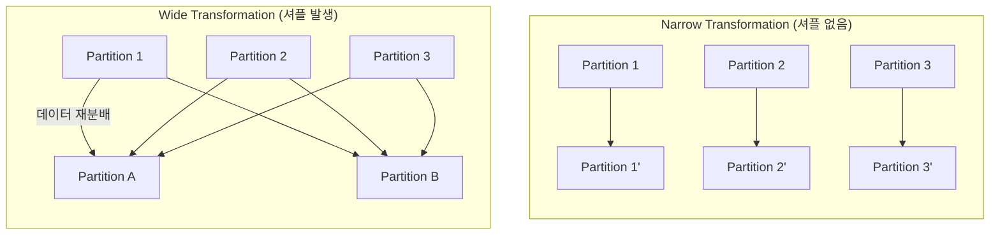


- RDD(Resilient Distributed Dataset)는 분산 불변 데이터 컬렉션으로 Spark의 기본 데이터 추상화
- Transformation(지연 평가)과 Action(즉시 실행)으로 데이터 처리
- Lineage를 통해 장애 발생 시 자동 복구 가능
- 현재는 DataFrame/Dataset을 권장하지만, 저수준 제어가 필요할 때 RDD 사용


**대상 독자**: Java/Spring 개발자, Spark 기본 개념을 학습하려는 초급자

**선수 지식**:
- Java 컬렉션 API (List, Map 등)
- 람다 표현식 및 함수형 프로그래밍 기초
- [아키텍처](architecture/) 문서 이해

---

RDD는 Spark의 가장 기본적인 데이터 추상화입니다. DataFrame과 Dataset의 기반이 되는 저수준 API로, Spark의 동작 원리를 이해하는 데 필수적입니다.

## 비유로 이해하는 RDD

| 개념 | 비유 | 핵심 아이디어 |
|------|------|---------------|
| **RDD** | 레고 블록 조립 설명서 | 완성품이 아니라 **만드는 방법**을 저장. 무너져도 설명서대로 재조립 가능 |
| **Partition** | 레고 블록 봉지 | 전체 세트를 여러 봉지로 나눠 여러 사람이 동시에 조립 |
| **Transformation** | 조립 단계 | "1단계: 바닥판 연결" 같은 지시. 아직 손 안 댐 |
| **Action** | "시작!" 신호 | 실제로 레고를 조립하기 시작. 완성품이 나옴 |
| **Lineage** | 조립 순서도 | A블록 → B블록 → C블록 순서 기록. 중간에 실수해도 순서도 보고 재조립 |
| **Narrow 변환** | 내 블록만 손질 | 옆 사람 블록 안 건드림 |
| **Wide 변환** | 블록 색깔별 재분류 | 모든 사람의 블록을 펼쳐놓고 색깔별로 다시 나눔 |

> **핵심 원리**: RDD는 "데이터 자체"가 아니라 "데이터를 만드는 레시피"입니다. 이 설계 덕분에 일부가 손실되어도 레시피대로 재생성할 수 있습니다.

## 왜 RDD는 이렇게 설계되었나? (설계 철학)

**질문: 왜 데이터 자체가 아니라 "만드는 방법"을 저장하나요?**

**1. 내결함성(Fault Tolerance)**

기존 분산 시스템은 데이터를 복제해서 장애에 대비했습니다:
- Hadoop HDFS: 3중 복제 → 저장 공간 3배 필요
- 데이터베이스: 복제 + 로그 → 쓰기 오버헤드

RDD의 접근법:
```
원본 → filter → map → groupBy → 결과
```
중간 결과를 저장하지 않고 **계산 방법(Lineage)**만 기억합니다. 장애 시 해당 파티션만 Lineage를 따라 재계산합니다.

**2. 불변성(Immutability)의 힘**

| 가변 데이터 | 불변 데이터 (RDD) |
|------------|-------------------|
| 수정 시 락(lock) 필요 | 락 불필요 (읽기 전용) |
| 동시 접근 시 충돌 | 안전한 병렬 처리 |
| 복구 어려움 | Lineage로 복구 |

**3. 지연 평가(Lazy Evaluation)**

즉시 실행했다면:
```java
rdd.map(...);      // 실행 → 중간 결과 저장
rdd.filter(...);   // 실행 → 중간 결과 저장
rdd.groupBy(...);  // 실행 → 중간 결과 저장
```

지연 평가 덕분에:
```java
rdd.map(...).filter(...).groupBy(...).count();
// 전체 DAG를 보고 최적화 후 한 번에 실행
```

## RDD란?

**RDD(Resilient Distributed Dataset)**는 여러 노드에 분산된 불변 데이터 컬렉션입니다.

- **Resilient (복원력)**: 파티션 손실 시 lineage를 통해 자동 재계산
- **Distributed (분산)**: 클러스터의 여러 노드에 파티션으로 분산 저장
- **Dataset (데이터셋)**: 구조화되지 않은 데이터도 처리 가능한 범용 컬렉션

**RDD의 특성**

| 특성 | 설명 |
|------|------|
| **불변성(Immutable)** | 생성 후 변경 불가, 변환 시 새 RDD 생성 |
| **분산(Distributed)** | 데이터가 여러 파티션으로 나뉘어 여러 노드에 저장 |
| **지연 평가(Lazy)** | Transformation은 즉시 실행되지 않음 |
| **타입 안전(Type-safe)** | 제네릭으로 타입 지정 가능 |
| **장애 복구(Fault-tolerant)** | Lineage로 손실 데이터 재계산 |


- RDD는 불변, 분산, 지연 평가되는 데이터 컬렉션
- Lineage(혈통)를 통해 장애 시 자동 복구
- 타입 안전한 API 제공 (제네릭 지원)
- DataFrame/Dataset의 기반 기술


## RDD 생성

**1. 컬렉션에서 생성 (parallelize)**

```java
import org.apache.spark.api.java.JavaRDD;
import org.apache.spark.api.java.JavaSparkContext;
import org.apache.spark.SparkConf;

import java.util.Arrays;
import java.util.List;

public class RddExample {
    public static void main(String[] args) {
        SparkConf conf = new SparkConf()
                .setAppName("RDD Example")
                .setMaster("local[*]");

        JavaSparkContext sc = new JavaSparkContext(conf);

        // List에서 RDD 생성
        List<Integer> numbers = Arrays.asList(1, 2, 3, 4, 5, 6, 7, 8, 9, 10);
        JavaRDD<Integer> numbersRDD = sc.parallelize(numbers);

        // 파티션 수 지정
        JavaRDD<Integer> numbersRDD4 = sc.parallelize(numbers, 4);

        System.out.println("파티션 수: " + numbersRDD4.getNumPartitions());
        // 출력: 파티션 수: 4

        sc.close();
    }
}
```

**Java 개발자 참고:**
- `JavaSparkContext`는 RDD API를 위한 진입점입니다
- SparkSession에서도 `sparkSession.sparkContext()` 또는 `new JavaSparkContext(spark.sparkContext())`로 접근 가능
- `parallelize`는 로컬 컬렉션을 분산 RDD로 변환

**2. 외부 데이터에서 생성**

```java
// 텍스트 파일에서 생성 (한 줄 = 하나의 요소)
JavaRDD<String> lines = sc.textFile("path/to/file.txt");

// 여러 파일 또는 디렉토리
JavaRDD<String> allLines = sc.textFile("path/to/directory/*.txt");

// HDFS
JavaRDD<String> hdfsLines = sc.textFile("hdfs://namenode:8020/data/file.txt");

// S3
JavaRDD<String> s3Lines = sc.textFile("s3a://bucket/path/file.txt");

// 전체 파일 내용을 하나의 요소로 (파일명, 내용) 쌍
JavaPairRDD<String, String> wholeFiles = sc.wholeTextFiles("path/to/directory");
```

**3. 다른 RDD에서 생성 (Transformation)**

```java
JavaRDD<Integer> numbers = sc.parallelize(Arrays.asList(1, 2, 3, 4, 5));

// map: 각 요소 변환
JavaRDD<Integer> doubled = numbers.map(n -> n * 2);

// filter: 조건에 맞는 요소만 선택
JavaRDD<Integer> evens = numbers.filter(n -> n % 2 == 0);
```


- `parallelize()`: 로컬 컬렉션을 분산 RDD로 변환
- `textFile()`: 파일에서 RDD 생성 (HDFS, S3 지원)
- `map()`, `filter()`: 기존 RDD에서 새 RDD 생성 (Transformation)
- 파티션 수는 병렬성에 직접적 영향


## Transformation

Transformation은 기존 RDD에서 새 RDD를 생성하는 연산입니다. **지연 평가**되어 즉시 실행되지 않습니다.

**Narrow vs Wide Transformation**



*그림: Narrow vs Wide Transformation - Narrow는 파티션 간 데이터 이동 없이 1:1 변환, Wide는 여러 파티션의 데이터가 재분배(셔플)되어 새 파티션으로 이동합니다.*

| 유형 | 예시 | 특징 |
|------|------|------|
| **Narrow** | map, filter, flatMap | 1:1 파티션 매핑, 빠름 |
| **Wide** | groupByKey, reduceByKey, join | 셔플 발생, 네트워크 비용 |

**기본 Transformation**

```java
JavaRDD<String> lines = sc.parallelize(Arrays.asList(
    "Hello World",
    "Hello Spark",
    "Spark is fast"
));

// map: 각 요소에 함수 적용
JavaRDD<Integer> lengths = lines.map(String::length);
// [11, 11, 13]

// flatMap: 각 요소를 여러 요소로 확장
JavaRDD<String> words = lines.flatMap(
    line -> Arrays.asList(line.split(" ")).iterator()
);
// ["Hello", "World", "Hello", "Spark", "Spark", "is", "fast"]

// filter: 조건에 맞는 요소 선택
JavaRDD<String> sparks = lines.filter(line -> line.contains("Spark"));
// ["Hello Spark", "Spark is fast"]

// distinct: 중복 제거
JavaRDD<String> uniqueWords = words.distinct();
// ["Hello", "World", "Spark", "is", "fast"]
```

**Pair RDD Transformation**

키-값 쌍을 다루는 RDD는 추가적인 연산을 제공합니다.

```java
import org.apache.spark.api.java.JavaPairRDD;
import scala.Tuple2;

// 단어 빈도 계산 예제
JavaRDD<String> words = lines.flatMap(
    line -> Arrays.asList(line.split(" ")).iterator()
);

// 각 단어를 (단어, 1) 쌍으로 변환
JavaPairRDD<String, Integer> wordPairs = words.mapToPair(
    word -> new Tuple2<>(word, 1)
);

// 같은 키의 값 합산
JavaPairRDD<String, Integer> wordCounts = wordPairs.reduceByKey(Integer::sum);

// 결과 확인
wordCounts.collect().forEach(System.out::println);
// (Hello,2)
// (World,1)
// (Spark,2)
// (is,1)
// (fast,1)
```

**주요 Pair RDD 연산**

```java
JavaPairRDD<String, Integer> scores = sc.parallelizePairs(Arrays.asList(
    new Tuple2<>("Alice", 85),
    new Tuple2<>("Bob", 90),
    new Tuple2<>("Alice", 95),
    new Tuple2<>("Bob", 80)
));

// reduceByKey: 같은 키의 값 합산
JavaPairRDD<String, Integer> totalScores = scores.reduceByKey(Integer::sum);
// (Alice,180), (Bob,170)

// groupByKey: 같은 키의 값을 그룹화 (주의: 메모리 사용 많음)
JavaPairRDD<String, Iterable<Integer>> grouped = scores.groupByKey();
// (Alice,[85,95]), (Bob,[90,80])

// mapValues: 값만 변환
JavaPairRDD<String, Integer> doubledScores = scores.mapValues(v -> v * 2);
// (Alice,170), (Bob,180), (Alice,190), (Bob,160)

// keys, values: 키/값만 추출
JavaRDD<String> names = scores.keys();
JavaRDD<Integer> values = scores.values();

// sortByKey: 키로 정렬
JavaPairRDD<String, Integer> sorted = totalScores.sortByKey();
```

**Join 연산**

```java
JavaPairRDD<String, Integer> ages = sc.parallelizePairs(Arrays.asList(
    new Tuple2<>("Alice", 30),
    new Tuple2<>("Bob", 25)
));

JavaPairRDD<String, String> cities = sc.parallelizePairs(Arrays.asList(
    new Tuple2<>("Alice", "Seoul"),
    new Tuple2<>("Charlie", "Busan")
));

// join: 내부 조인 (양쪽에 있는 키만)
JavaPairRDD<String, Tuple2<Integer, String>> joined = ages.join(cities);
// (Alice, (30, Seoul))

// leftOuterJoin: 왼쪽 기준
JavaPairRDD<String, Tuple2<Integer, Optional<String>>> leftJoined =
    ages.leftOuterJoin(cities);
// (Alice, (30, Optional[Seoul])), (Bob, (25, Optional.empty))

// rightOuterJoin: 오른쪽 기준
// fullOuterJoin: 양쪽 모두
```


- **Narrow**: map, filter, flatMap - 셔플 없이 파이프라이닝 가능
- **Wide**: groupByKey, reduceByKey, join - 셔플 발생으로 비용 높음
- `groupByKey`보다 `reduceByKey` 권장 (메모리 효율적)
- Pair RDD로 키-값 기반 집계와 조인 가능


## Action

Action은 RDD를 실제로 계산하고 결과를 반환하는 연산입니다.

```java
JavaRDD<Integer> numbers = sc.parallelize(Arrays.asList(1, 2, 3, 4, 5));

// collect: 모든 요소를 Driver로 가져옴 (주의: 대용량 데이터 시 OOM)
List<Integer> all = numbers.collect();

// count: 요소 개수
long count = numbers.count();  // 5

// first: 첫 번째 요소
Integer first = numbers.first();  // 1

// take: 처음 n개 요소
List<Integer> firstThree = numbers.take(3);  // [1, 2, 3]

// takeSample: 랜덤 샘플
List<Integer> sample = numbers.takeSample(false, 2);  // 예: [3, 1]

// reduce: 모든 요소를 하나로 집계
Integer sum = numbers.reduce(Integer::sum);  // 15

// fold: 초기값과 함께 집계
Integer sumWithInit = numbers.fold(10, Integer::sum);  // 25

// aggregate: 타입이 다른 집계 (복잡한 집계에 사용)
// 평균 계산 예제: (합계, 개수) 쌍으로 집계
Tuple2<Integer, Integer> sumAndCount = numbers.aggregate(
    new Tuple2<>(0, 0),  // 초기값
    (acc, n) -> new Tuple2<>(acc._1 + n, acc._2 + 1),  // seqOp
    (acc1, acc2) -> new Tuple2<>(acc1._1 + acc2._1, acc1._2 + acc2._2)  // combOp
);
double average = (double) sumAndCount._1 / sumAndCount._2;

// foreach: 각 요소에 대해 함수 실행 (Executor에서 실행됨)
numbers.foreach(n -> System.out.println(n));  // Executor의 로그에 출력

// countByValue: 각 값의 빈도
Map<Integer, Long> valueCounts = numbers.countByValue();

// saveAsTextFile: 파일로 저장
numbers.saveAsTextFile("output/numbers");
```


- Action 호출 시 실제 계산 시작 (지연 평가 트리거)
- `collect()`는 대용량 데이터에서 OOM 위험 - `take(n)` 권장
- `reduce()`, `fold()`, `aggregate()`로 분산 집계
- `foreach()`는 Executor에서 실행됨 (Driver 변수 수정 불가)


## Lineage (혈통)

RDD는 자신이 어떻게 생성되었는지에 대한 정보(lineage)를 유지합니다. 이를 통해:

1. **지연 평가**: 실제 계산이 필요할 때까지 실행을 지연
2. **최적화**: 여러 연산을 파이프라이닝하여 최적화
3. **장애 복구**: 파티션 손실 시 lineage를 따라 재계산

```java
JavaRDD<String> lines = sc.textFile("data.txt");      // 1단계
JavaRDD<String> words = lines.flatMap(...);           // 2단계
JavaRDD<String> filtered = words.filter(...);         // 3단계
long count = filtered.count();                         // Action!

// Executor 하나가 실패해도 해당 파티션만 재계산
// 전체 lineage: textFile → flatMap → filter → count
```

**Lineage 확인**

```java
System.out.println(filtered.toDebugString());
```

출력:
```
(2) MapPartitionsRDD[2] at filter at RddExample.java:15 []
 |  MapPartitionsRDD[1] at flatMap at RddExample.java:14 []
 |  data.txt MapPartitionsRDD[0] at textFile at RddExample.java:13 []
```


- Lineage는 RDD가 어떻게 만들어졌는지의 계보 정보
- 장애 발생 시 손실된 파티션만 Lineage를 따라 재계산
- `toDebugString()`으로 Lineage 확인 가능
- 지연 평가와 최적화의 기반


## Narrow vs Wide Dependencies

Transformation은 의존성 유형에 따라 성능이 크게 달라집니다.

**Narrow Dependency**

각 부모 파티션이 최대 하나의 자식 파티션에만 사용됩니다.

```java
// Narrow Transformation - 셔플 없음
JavaRDD<Integer> mapped = numbers.map(n -> n * 2);
JavaRDD<Integer> filtered = numbers.filter(n -> n > 5);
```

- 같은 파티션 내에서 처리 완료
- 파이프라이닝 가능
- 매우 효율적

**Wide Dependency**

하나의 부모 파티션이 여러 자식 파티션에 사용됩니다.

```java
// Wide Transformation - 셔플 발생
JavaPairRDD<String, Integer> grouped = wordPairs.reduceByKey(Integer::sum);
JavaPairRDD<String, Tuple2<Integer, String>> joined = rdd1.join(rdd2);
```

- 데이터 재분배(셔플) 필요
- 네트워크 I/O, 디스크 I/O 발생
- Stage 경계가 됨
- 성능에 큰 영향


- **Narrow**: 부모 파티션 1개 → 자식 파티션 1개 (파이프라이닝)
- **Wide**: 부모 파티션 여러 개 → 자식 파티션 여러 개 (셔플)
- Wide Dependency는 Stage 경계가 되어 성능에 큰 영향
- 셔플 최소화가 Spark 튜닝의 핵심


## 영속성 (Persistence)

자주 사용되는 RDD는 메모리에 캐시하여 재계산을 방지할 수 있습니다.

```java
import org.apache.spark.storage.StorageLevel;

JavaRDD<String> lines = sc.textFile("large-file.txt");
JavaRDD<String> words = lines.flatMap(...);
JavaRDD<String> filtered = words.filter(...);

// 메모리에 캐시 (기본)
filtered.cache();  // persist(StorageLevel.MEMORY_ONLY)와 동일

// 또는 저장 수준 지정
filtered.persist(StorageLevel.MEMORY_AND_DISK());

// 캐시된 RDD 사용
long count1 = filtered.count();   // 첫 계산, 캐시됨
long count2 = filtered.count();   // 캐시에서 읽음 (빠름)

// 캐시 해제
filtered.unpersist();
```

**Storage Level**

| 레벨 | 메모리 | 디스크 | 직렬화 | 복제 |
|------|--------|--------|--------|------|
| MEMORY_ONLY | O | X | X | 1 |
| MEMORY_AND_DISK | O | O | X | 1 |
| MEMORY_ONLY_SER | O | X | O | 1 |
| MEMORY_AND_DISK_SER | O | O | O | 1 |
| DISK_ONLY | X | O | X | 1 |
| *_2 | - | - | - | 2 |


- `cache()` = `persist(MEMORY_ONLY)`
- 여러 Action에서 사용할 RDD는 반드시 캐시
- 메모리 부족 시 `MEMORY_AND_DISK` 사용
- 사용 후 `unpersist()`로 메모리 해제 권장


## RDD vs DataFrame/Dataset

현재 Spark에서는 DataFrame/Dataset API를 권장하지만, RDD가 필요한 경우가 있습니다:

**RDD를 사용해야 하는 경우**

1. **저수준 제어 필요**: 파티션, 셔플 세밀 제어
2. **비구조화 데이터**: 스키마가 없는 데이터
3. **기존 RDD 코드 유지보수**
4. **특수 직렬화 로직 필요**

**DataFrame/Dataset을 사용해야 하는 경우**

1. **구조화된 데이터 처리**
2. **SQL 사용**
3. **성능 최적화 (Catalyst Optimizer)**
4. **다양한 데이터 소스 연동**

**상호 변환**

```java
import org.apache.spark.sql.SparkSession;
import org.apache.spark.sql.Dataset;
import org.apache.spark.sql.Row;
import org.apache.spark.sql.Encoders;

SparkSession spark = SparkSession.builder()
        .appName("Conversion")
        .master("local[*]")
        .getOrCreate();

// DataFrame → RDD
Dataset<Row> df = spark.read().json("data.json");
JavaRDD<Row> rdd = df.javaRDD();

// RDD → DataFrame (스키마 추론)
JavaRDD<String> jsonRdd = sc.parallelize(Arrays.asList(
    "{\"name\":\"Alice\",\"age\":30}",
    "{\"name\":\"Bob\",\"age\":25}"
));
Dataset<Row> df2 = spark.read().json(jsonRdd);

// RDD<T> → Dataset<T>
JavaRDD<Integer> numberRdd = sc.parallelize(Arrays.asList(1, 2, 3));
Dataset<Integer> ds = spark.createDataset(numberRdd.rdd(), Encoders.INT());
```


- **RDD 권장**: 저수준 제어, 비구조화 데이터, 특수 직렬화
- **DataFrame/Dataset 권장**: 구조화 데이터, SQL, 성능 최적화
- `df.javaRDD()`로 DataFrame → RDD 변환
- `spark.createDataset()`으로 RDD → Dataset 변환


## 실전 예제: 로그 분석

웹 서버 로그에서 에러를 분석하는 예제:

```java
public class LogAnalysis {
    public static void main(String[] args) {
        SparkConf conf = new SparkConf()
                .setAppName("Log Analysis")
                .setMaster("local[*]");

        JavaSparkContext sc = new JavaSparkContext(conf);

        // 로그 파일 로드
        JavaRDD<String> logs = sc.textFile("access.log");

        // ERROR 로그 필터링
        JavaRDD<String> errors = logs.filter(line -> line.contains("ERROR"));

        // 캐시 (여러 번 사용할 예정)
        errors.cache();

        // 에러 수 집계
        System.out.println("총 에러 수: " + errors.count());

        // 에러 유형별 집계
        JavaPairRDD<String, Integer> errorTypes = errors
                .mapToPair(line -> {
                    // "ERROR [에러타입]: 메시지" 형식 가정
                    String type = extractErrorType(line);
                    return new Tuple2<>(type, 1);
                })
                .reduceByKey(Integer::sum);

        // 결과 출력
        System.out.println("에러 유형별 집계:");
        errorTypes.collect().forEach(t ->
            System.out.println(t._1 + ": " + t._2)
        );

        // 가장 많은 에러 유형
        Tuple2<String, Integer> topError = errorTypes
                .mapToPair(Tuple2::swap)  // (count, type)으로 변환
                .sortByKey(false)          // 내림차순 정렬
                .first();

        System.out.println("가장 많은 에러: " + topError._2 + " (" + topError._1 + "건)");

        errors.unpersist();
        sc.close();
    }

    private static String extractErrorType(String line) {
        // 실제 구현은 로그 형식에 따라 다름
        int start = line.indexOf("[") + 1;
        int end = line.indexOf("]");
        return start > 0 && end > start ? line.substring(start, end) : "UNKNOWN";
    }
}
```

## 다음 단계

RDD의 기본을 이해했다면, 더 효율적인 API를 학습하세요:

- [DataFrame과 Dataset](dataframe-dataset/) - 고수준 API와 Catalyst 최적화
- [Transformation과 Action](transformations-actions/) - 지연 평가 심화
