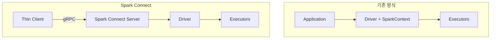


- Spark Connect는 gRPC 기반 클라이언트-서버 분리 아키텍처 (Spark 3.4+)
- 경량 클라이언트(~10MB)로 원격 Spark 클러스터 접근
- `SparkSession.builder().remote("sc://host:port")` 로 연결
- DataFrame API 완전 지원, RDD API/Streaming은 제한적


**대상 독자**: 마이크로서비스 환경에서 Spark를 사용하려는 개발자

**선수 지식**:
- [아키텍처](architecture/) 문서의 Driver/Executor 개념
- gRPC 기본 개념 (선택 사항)
- [DataFrame과 Dataset](dataframe-dataset/) API

---

Spark Connect는 Spark 3.4에서 도입된 새로운 클라이언트-서버 아키텍처입니다. 씬 클라이언트(Thin Client)로 원격 Spark 클러스터에 연결할 수 있습니다.

## 비유로 이해하는 Spark Connect

| 개념 | 비유 | 핵심 아이디어 |
|------|------|---------------|
| **기존 방식** | 자가용 직접 운전 | 내 차(Driver)에 모든 장비 실어서 직접 운전. 차가 고장나면 여행 중단 |
| **Spark Connect** | 택시 호출 | 스마트폰(Thin Client)으로 택시(서버) 호출. 기사(Driver)가 목적지까지 데려다줌 |
| **gRPC** | 무전기 통신 | 표준화된 통신 규약으로 어떤 택시든 같은 방식으로 호출 |
| **Thin Client** | 가벼운 스마트폰 앱 | 목적지만 입력하면 됨. 내비게이션은 택시 기사가 알아서 |
| **서버 업그레이드** | 택시 회사 차량 교체 | 앱 업데이트 없이 새 차량(Spark 버전) 이용 가능 |

> **핵심 원리**: Spark Connect는 "무거운 연산 로직"을 클라이언트에서 서버로 분리합니다. 클라이언트는 "무엇을 원하는지"만 전달하고, 서버가 "어떻게 할지"를 결정합니다.

## 왜 Spark Connect가 필요한가? (설계 철학)

**질문: 기존 방식이 잘 동작하는데 왜 새 아키텍처가 필요하죠?**

**1. 마이크로서비스 시대의 문제**

| 기존 방식 문제 | Spark Connect 해결책 |
|---------------|---------------------|
| 서비스마다 200MB+ Spark 의존성 | 10MB 클라이언트로 경량화 |
| 각 서비스가 Driver 메모리 소비 | 중앙 서버에서 리소스 관리 |
| 버전 업그레이드 = 모든 서비스 재배포 | 서버만 업그레이드 |
| 클라이언트 장애 = 작업 중단 | 서버는 독립적으로 계속 실행 |

**2. 언어 다양성**

기존에는 JVM 언어에서만 Spark를 완전히 사용할 수 있었습니다. Spark Connect는 gRPC 프로토콜을 사용해 어떤 언어에서든 동일한 기능에 접근할 수 있습니다.

**3. 트레이드오프**

| 특성 | 기존 방식 | Spark Connect |
|------|----------|---------------|
| 네트워크 지연 | 없음 | gRPC 호출당 1-5ms |
| 기능 범위 | 모든 API | DataFrame 중심 (RDD 미지원) |
| 디버깅 | 로컬 로그 | 서버 로그 확인 필요 |

## 기존 방식 vs Spark Connect



*그림: 기존 방식 vs Spark Connect - 기존에는 Application이 Driver를 직접 포함했지만, Spark Connect에서는 Thin Client가 gRPC로 서버에 연결하고 서버가 Driver와 Executor를 관리합니다.*

**주요 차이점**

| 구분 | 기존 방식 | Spark Connect |
|------|----------|---------------|
| **아키텍처** | 모놀리식 (Driver 내장) | 클라이언트-서버 분리 |
| **클라이언트 크기** | 수백 MB (Spark 전체) | 수 MB (gRPC 클라이언트) |
| **언어 지원** | JVM 필수 | 언어 독립적 (gRPC) |
| **리소스 격리** | 클라이언트에 Driver 리소스 필요 | 서버에서만 리소스 사용 |
| **업그레이드** | 클라이언트 재배포 필요 | 서버만 업그레이드 |
| **안정성** | 클라이언트 충돌 시 작업 중단 | 서버 독립적으로 안정 |


- 기존: 애플리케이션에 Driver 내장 (모놀리식)
- Spark Connect: 클라이언트-서버 분리, gRPC 통신
- 클라이언트 크기: ~200MB → ~10MB로 경량화
- 서버만 업그레이드하면 모든 클라이언트에 적용


## Spark Connect 장점

**1. 가벼운 클라이언트**

```xml
<!-- 기존 방식: spark-core + spark-sql (~200MB) -->
<dependency>
    <groupId>org.apache.spark</groupId>
    <artifactId>spark-sql_2.13</artifactId>
    <version>3.5.1</version>
</dependency>

<!-- Spark Connect: 경량 클라이언트 (~10MB) -->
<dependency>
    <groupId>org.apache.spark</groupId>
    <artifactId>spark-connect-client-jvm_2.13</artifactId>
    <version>3.5.1</version>
</dependency>
```

**2. 격리된 실행 환경**

- 클라이언트 메모리 부족이 Spark 작업에 영향 없음
- 여러 클라이언트가 동일 클러스터 공유 가능
- 클라이언트 장애 시 서버 작업 계속 진행

**3. 언어 독립성**

- gRPC 기반으로 다양한 언어에서 연결 가능
- Python, Scala, Java, Go 등 지원
- 향후 더 많은 언어 지원 예정

## 서버 설정

**Spark Connect 서버 시작**

```bash
# 독립 실행형 서버 시작
./sbin/start-connect-server.sh \
    --packages org.apache.spark:spark-connect_2.13:3.5.1 \
    --conf spark.connect.grpc.binding.port=15002

# 또는 spark-submit으로 시작
spark-submit \
    --class org.apache.spark.sql.connect.service.SparkConnectServer \
    --packages org.apache.spark:spark-connect_2.13:3.5.1 \
    --conf spark.connect.grpc.binding.port=15002 \
    local:///dev/null
```

**Docker로 서버 실행**

```yaml
# docker-compose.yml
version: '3.8'
services:
  spark-connect:
    image: apache/spark:3.5.1
    command: >
      /opt/spark/sbin/start-connect-server.sh
      --packages org.apache.spark:spark-connect_2.13:3.5.1
    ports:
      - "15002:15002"  # gRPC 포트
      - "4040:4040"    # Spark UI
    environment:
      - SPARK_CONNECT_GRPC_BINDING_PORT=15002
    volumes:
      - ./data:/opt/spark/data
```

**서버 설정 옵션**

```properties
# spark-defaults.conf
spark.connect.grpc.binding.port=15002
spark.connect.grpc.arrow.maxBatchSize=4194304
spark.connect.grpc.maxInboundMessageSize=134217728
spark.connect.extensions.relation.classes=
spark.connect.extensions.expression.classes=
spark.connect.extensions.command.classes=
```

## Java 클라이언트 사용

**의존성 설정**

```kotlin
// build.gradle.kts
dependencies {
    // Spark Connect 클라이언트 (경량)
    implementation("org.apache.spark:spark-connect-client-jvm_2.13:3.5.1")
}
```

**연결 및 사용**

```java
import org.apache.spark.sql.SparkSession;
import org.apache.spark.sql.Dataset;
import org.apache.spark.sql.Row;
import static org.apache.spark.sql.functions.*;

public class SparkConnectExample {
    public static void main(String[] args) {
        // Spark Connect 서버에 연결
        SparkSession spark = SparkSession.builder()
                .remote("sc://localhost:15002")  // Spark Connect URL
                .build();

        try {
            // 기존 DataFrame API 동일하게 사용
            Dataset<Row> df = spark.read()
                    .option("header", "true")
                    .option("inferSchema", "true")
                    .csv("data/sales.csv");

            Dataset<Row> result = df
                    .filter(col("amount").gt(100))
                    .groupBy("category")
                    .agg(
                        sum("amount").alias("total"),
                        count("*").alias("count")
                    )
                    .orderBy(col("total").desc());

            result.show();

            // 결과 수집
            List<Row> rows = result.collectAsList();
            for (Row row : rows) {
                System.out.println(row.getString(0) + ": " + row.getDouble(1));
            }

        } finally {
            spark.stop();
        }
    }
}
```

**연결 URL 형식**

```java
// 기본 연결
SparkSession.builder().remote("sc://hostname:port")

// 토큰 인증
SparkSession.builder().remote("sc://hostname:port;token=<auth_token>")

// 사용자 ID 지정
SparkSession.builder().remote("sc://hostname:port;user_id=my_user")

// SSL/TLS
SparkSession.builder().remote("sc://hostname:port;use_ssl=true")
```

## 지원되는 기능

**완전 지원**

| 기능 | 상태 | 비고 |
|------|------|------|
| DataFrame API | ✅ 지원 | select, filter, groupBy 등 |
| SQL 쿼리 | ✅ 지원 | spark.sql() |
| UDF (사용자 함수) | ✅ 지원 | 서버에 등록 필요 |
| 파일 읽기/쓰기 | ✅ 지원 | CSV, JSON, Parquet |
| 집계 함수 | ✅ 지원 | sum, avg, count 등 |
| Window 함수 | ✅ 지원 | rank, row_number 등 |
| 조인 | ✅ 지원 | inner, left, right 등 |

**제한 사항**

| 기능 | 상태 | 대안 |
|------|------|------|
| RDD API | ❌ 미지원 | DataFrame API 사용 |
| Streaming | ⚠️ 부분 지원 | 서버 측에서 실행 |
| MLlib | ⚠️ 부분 지원 | 기본 기능만 |
| GraphX | ❌ 미지원 | GraphFrame 사용 |
| 로컬 파일 접근 | ❌ 미지원 | 서버 경로 또는 클라우드 스토리지 |

## Spring Boot 통합

```java
package com.example.config;

import org.apache.spark.sql.SparkSession;
import org.springframework.beans.factory.annotation.Value;
import org.springframework.context.annotation.Bean;
import org.springframework.context.annotation.Configuration;
import org.springframework.context.annotation.Profile;
import jakarta.annotation.PreDestroy;

@Configuration
public class SparkConnectConfig {

    @Value("${spark.connect.url:sc://localhost:15002}")
    private String sparkConnectUrl;

    private SparkSession spark;

    @Bean
    @Profile("!local")  // 로컬이 아닌 환경에서 사용
    public SparkSession sparkSession() {
        this.spark = SparkSession.builder()
                .remote(sparkConnectUrl)
                .build();
        return spark;
    }

    @Bean
    @Profile("local")  // 로컬 개발 시
    public SparkSession localSparkSession() {
        this.spark = SparkSession.builder()
                .appName("local-dev")
                .master("local[*]")
                .getOrCreate();
        return spark;
    }

    @PreDestroy
    public void cleanup() {
        if (spark != null) {
            spark.stop();
        }
    }
}
```

```yaml
# application.yml
spring:
  profiles:
    active: local

---
spring:
  config:
    activate:
      on-profile: production

spark:
  connect:
    url: sc://spark-connect.internal:15002;token=${SPARK_TOKEN}
```

## 모범 사례

**1. 연결 풀링**

```java
@Component
public class SparkConnectionPool {
    private final SparkSession spark;

    public SparkConnectionPool(SparkSession spark) {
        this.spark = spark;
    }

    // SparkSession은 스레드 안전하므로 공유 가능
    public SparkSession getSession() {
        return spark;
    }
}
```

**2. 대용량 결과 처리**

```java
// ❌ 전체 수집 - 메모리 위험
List<Row> allRows = df.collectAsList();

// ✅ 제한된 결과만 수집
List<Row> topRows = df.limit(1000).collectAsList();

// ✅ 서버에서 파일로 저장 후 다운로드
df.write().parquet("s3://bucket/results/");
```

**3. 에러 처리**

```java
import io.grpc.StatusRuntimeException;

try {
    Dataset<Row> result = spark.sql("SELECT * FROM table");
    result.show();
} catch (StatusRuntimeException e) {
    if (e.getStatus().getCode() == Status.Code.UNAVAILABLE) {
        logger.error("Spark Connect 서버 연결 실패");
        // 재연결 로직
    } else {
        throw e;
    }
} catch (AnalysisException e) {
    logger.error("SQL 분석 오류: {}", e.getMessage());
}
```

## 마이그레이션 가이드

**기존 코드에서 Spark Connect로 전환**

```java
// Before: 기존 방식
SparkSession spark = SparkSession.builder()
        .appName("MyApp")
        .master("spark://master:7077")
        .config("spark.executor.memory", "4g")
        .getOrCreate();

// After: Spark Connect
SparkSession spark = SparkSession.builder()
        .remote("sc://spark-connect:15002")
        .build();

// DataFrame API는 동일하게 사용
Dataset<Row> df = spark.read().parquet("data.parquet");
```

**주의사항**

1. **로컬 파일 접근 불가**: 클라이언트의 로컬 파일 대신 클라우드 스토리지 사용
2. **RDD API 미지원**: DataFrame/Dataset API로 변환 필요
3. **UDF 서버 등록**: 사용자 정의 함수는 서버에 미리 등록
4. **네트워크 지연**: 원격 연결로 인한 약간의 오버헤드 존재

## 언제 Spark Connect를 선택해야 할까

**Spark Connect 권장 상황**

| 상황 | 이유 |
|------|------|
| **마이크로서비스 아키텍처** | 각 서비스에서 무거운 Spark 의존성 없이 데이터 처리 |
| **다중 팀 공유 클러스터** | 중앙 집중식 서버로 리소스 효율성 향상 |
| **컨테이너 환경(K8s)** | 경량 클라이언트로 Pod 시작 시간 단축 |
| **언어 다양성** | Python, Java, Go 등 다양한 언어에서 동일 클러스터 접근 |
| **보안 요구사항** | 클러스터 직접 접근 대신 gRPC 엔드포인트만 노출 |

**기존 방식 유지 권장 상황**

| 상황 | 이유 |
|------|------|
| **RDD API 필수** | Spark Connect는 DataFrame API만 지원 |
| **Streaming 중심 워크로드** | 아직 완전한 스트리밍 지원 부족 |
| **네트워크 지연 민감** | 직접 연결 대비 gRPC 오버헤드 존재 |
| **레거시 시스템 통합** | 기존 코드 대규모 마이그레이션 필요 |

## 실무 인사이트

**Java/Spring 환경에서의 현실적 고려사항**

1. **의존성 크기 비교**
   - 기존 spark-sql: 약 200MB (전이적 의존성 포함)
   - spark-connect-client-jvm: 약 15MB
   - Docker 이미지 크기와 시작 시간에 상당한 영향

2. **Spring Boot 통합 시 주의점**
   - SparkSession은 스레드 안전하므로 싱글톤 Bean으로 관리
   - 연결 끊김 시 자동 재연결 로직 구현 필요
   - 트랜잭션과 Spark 작업을 분리 (Spark는 트랜잭션 비인식)

3. **성능 트레이드오프**
   ```
   gRPC 오버헤드: 요청당 1-5ms 추가
   데이터 직렬화: Arrow 포맷으로 효율적
   대용량 결과: 서버 메모리에서 처리 후 스트리밍 전송
   ```

4. **모니터링**
   - 서버 측 Spark UI (포트 4040)
   - gRPC 메트릭 수집 가능
   - 클라이언트 측에서는 제한적인 정보만 확인 가능

**Spark 3.5 업데이트 사항**

- Arrow 기반 데이터 전송 성능 개선
- Python UDF 지원 확대
- 에러 메시지 개선으로 디버깅 용이
- 연결 안정성 향상

## 관련 문서

- [아키텍처](architecture/) - Spark 클러스터 구조
- [Spring Boot 통합](../examples/spring-boot/) - Spring 연동
- [배포](deployment/) - 클러스터 배포 방법
