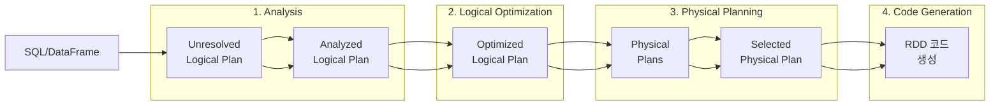


- Spark SQL은 SQL 문법으로 DataFrame을 쿼리할 수 있는 모듈
- Catalyst Optimizer가 4단계(Analysis → Optimization → Planning → CodeGen)로 쿼리 최적화
- AQE(Adaptive Query Execution)로 런타임 최적화 (Spark 3.0+)
- DataFrame API와 SQL은 동일한 실행 엔진 사용, 성능 차이 없음


**대상 독자**: SQL에 익숙한 데이터 엔지니어 및 분석가

**선수 지식**:
- 표준 SQL 문법 (SELECT, JOIN, GROUP BY, Window 함수)
- [DataFrame과 Dataset]() 기본 이해

**소요 시간**: 약 25-30분

---

Spark SQL은 구조화된 데이터 처리를 위한 Spark 모듈입니다. SQL 쿼리와 DataFrame API를 모두 지원하며, 동일한 실행 엔진(Catalyst Optimizer)을 사용합니다.

## 비유로 이해하는 Spark SQL

| 개념 | 비유 | 핵심 아이디어 |
|------|------|---------------|
| **Spark SQL** | 다국어 통역사 | SQL이든 DataFrame이든 같은 의미로 이해하고 실행 |
| **Catalyst Optimizer** | 내비게이션 경로 최적화 | "서울→부산" 목적지만 알려주면 가장 빠른 길 자동 계산 |
| **Predicate Pushdown** | 필요한 책만 서가에서 꺼내기 | 전체 도서관을 뒤지지 않고 해당 섹션만 검색 |
| **Column Pruning** | 주문한 반찬만 담기 | 뷔페 전체를 접시에 담지 않고 먹을 것만 선택 |
| **AQE** | 운전 중 실시간 경로 변경 | 정체 상황 보고 더 빠른 길로 우회 |
| **Temporary View** | 가상 테이블 별명 | DataFrame에 이름표 붙여서 SQL에서 테이블처럼 사용 |

> **핵심 원리**: Spark SQL은 **"What"(무엇을 원하는가)**만 표현하면 **"How"(어떻게 할 것인가)**는 Catalyst가 최적화합니다. SQL과 DataFrame은 동일한 실행 엔진을 사용하므로 성능 차이가 없습니다.

## 왜 Catalyst Optimizer가 중요한가? (설계 철학)

**질문: 사용자가 쓴 코드를 그대로 실행하면 안 되나요?**

**비효율적인 코드도 빠르게 만들기 위해서입니다.**

```java
// 사용자가 작성한 (비효율적인) 코드
df.join(other, "id")                    // 1. 먼저 조인
  .filter(col("status").equalTo("A"))   // 2. 그 다음 필터
  .select("name", "value");             // 3. 마지막에 컬럼 선택

// Catalyst가 변환한 (효율적인) 코드
df.select("id", "name", "value", "status")  // 1. 필요한 컬럼만 먼저
  .filter(col("status").equalTo("A"))        // 2. 필터를 조인 전으로
  .join(other.select("id"), "id");           // 3. 줄어든 데이터로 조인
```

**최적화 단계별 역할**

| 단계 | 역할 | 비유 |
|------|------|------|
| Analysis | 컬럼/테이블 존재 확인 | "서울역이 실제로 있는지 확인" |
| Logical Optimization | 불필요한 연산 제거 | "지름길 발견" |
| Physical Planning | 실행 방법 선택 | "KTX vs 비행기 vs 자동차 선택" |
| Code Generation | 최적화된 바이트코드 생성 | "실제 이동 시작" |

## Spark SQL의 장점

1. **익숙한 SQL 문법**: 기존 SQL 지식 그대로 활용
2. **최적화**: Catalyst Optimizer가 쿼리 자동 최적화
3. **다양한 데이터 소스**: JDBC, Parquet, JSON, Hive 등 통합
4. **DataFrame과 상호 운용**: SQL 결과가 DataFrame으로 반환


- SQL과 DataFrame API는 동일한 Catalyst Optimizer 사용
- SQL 결과는 항상 DataFrame으로 반환
- 임시 뷰로 DataFrame을 SQL에서 테이블처럼 쿼리
- Hive 메타스토어 통합으로 영구 테이블 관리 가능


## Catalyst Optimizer 심층 이해

Catalyst는 Spark SQL의 쿼리 최적화 엔진입니다. 사용자가 작성한 쿼리를 분석하고 최적화하여 효율적인 실행 계획을 생성합니다.

**쿼리 처리 단계**



*그림: Catalyst Optimizer 쿼리 처리 단계 - SQL/DataFrame이 Unresolved Plan → Analyzed Plan → Optimized Plan → Physical Plans → Selected Plan → RDD 코드 생성 순으로 변환됩니다.*

**각 단계 상세**

## 1단계: Analysis (분석)

테이블과 컬럼 이름을 실제 스키마와 매핑합니다.

```java
// 사용자 코드
df.filter(col("salary").gt(5000));

// Unresolved Plan: "salary"가 어떤 타입인지 모름
// Analyzed Plan: salary는 IntegerType, df의 3번째 컬럼
```

## 2단계: Logical Optimization (논리 최적화)

규칙 기반으로 쿼리를 최적화합니다.

| 최적화 규칙 | 설명 | 예시 |
|------------|------|------|
| **Predicate Pushdown** | 필터를 데이터 소스에 푸시 | WHERE 절을 Parquet 파일 읽기 단계로 이동 |
| **Column Pruning** | 필요한 컬럼만 읽기 | SELECT에 없는 컬럼 스킵 |
| **Constant Folding** | 상수 표현식 미리 계산 | `1 + 2` → `3` |
| **Boolean Simplification** | 불리언 조건 단순화 | `true AND x` → `x` |
| **Filter Pushdown** | 조인 전 필터링 | 조인 전에 각 테이블 필터 |

```java
// 최적화 전
df.join(other, "id")
  .filter(col("status").equalTo("ACTIVE"))
  .select("name");

// 최적화 후 (Catalyst가 자동 변환)
// 1. filter가 join 전으로 이동 (Predicate Pushdown)
// 2. "name"만 읽기 (Column Pruning)
```

## 3단계: Physical Planning (물리 계획)

여러 실행 전략 중 최적의 방법을 선택합니다.

```java
// 조인 전략 선택 예시
// Catalyst가 테이블 크기를 분석하여 결정:
// - 작은 테이블: Broadcast Hash Join
// - 큰 테이블: Sort Merge Join
// - 스트리밍: Shuffle Hash Join
```

## 4단계: Code Generation (코드 생성 - Tungsten)

최적화된 Java 바이트코드를 런타임에 생성합니다.

```java
// Whole-Stage Code Generation
// 여러 연산자를 하나의 함수로 융합 (fusion)
// 가상 함수 호출 오버헤드 제거
spark.conf().set("spark.sql.codegen.wholeStage", "true");  // 기본값
```

**실행 계획 확인하기**

```java
Dataset<Row> result = df
    .filter(col("age").gt(30))
    .groupBy("department")
    .agg(avg("salary").alias("avg_salary"));

// 논리 계획
result.explain(true);

// 출력 예시:
// == Parsed Logical Plan ==
// 'Aggregate ['department], ['department, avg('salary) AS avg_salary]
// +- 'Filter ('age > 30)
//    +- 'UnresolvedRelation [employees]
//
// == Analyzed Logical Plan ==
// department: string, avg_salary: double
// Aggregate [department], [department, avg(salary) AS avg_salary]
// +- Filter (age > 30)
//    +- Relation[id,name,age,department,salary] parquet
//
// == Optimized Logical Plan ==
// Aggregate [department], [department, avg(salary) AS avg_salary]
// +- Project [department, salary]        ← Column Pruning
//    +- Filter (age > 30)
//       +- Relation[id,name,age,department,salary] parquet
//
// == Physical Plan ==
// *(2) HashAggregate(keys=[department], functions=[avg(salary)])
// +- Exchange hashpartitioning(department, 200)   ← 셔플
//    +- *(1) HashAggregate(keys=[department], functions=[partial_avg(salary)])
//       +- *(1) Project [department, salary]
//          +- *(1) Filter (age > 30)
//             +- *(1) ColumnarToRow
//                +- FileScan parquet [age,department,salary]  ← 필요한 컬럼만
```

**AQE (Adaptive Query Execution)**

Spark 3.0+에서 도입된 **런타임 최적화**입니다. 실행 중 통계를 수집하여 계획을 동적으로 조정합니다.

```java
// AQE 활성화 (Spark 3.2+ 기본 활성화)
spark.conf().set("spark.sql.adaptive.enabled", "true");

// 주요 기능:
// 1. 동적 파티션 병합 (Coalescing)
spark.conf().set("spark.sql.adaptive.coalescePartitions.enabled", "true");

// 2. 스큐 조인 최적화
spark.conf().set("spark.sql.adaptive.skewJoin.enabled", "true");

// 3. 브로드캐스트 조인 동적 전환
spark.conf().set("spark.sql.adaptive.autoBroadcastJoinThreshold", "10MB");
```

**AQE 동작 예시:**

```
정적 계획: 200개 파티션으로 셔플
    ↓
실행 중: 실제 데이터가 적어 대부분 파티션이 거의 비어있음
    ↓
AQE: 런타임에 5개 파티션으로 병합
    ↓
결과: 태스크 수 감소, 오버헤드 절감
```

## 기본 사용법

**임시 뷰 생성**

```java
SparkSession spark = SparkSession.builder()
        .appName("Spark SQL")
        .master("local[*]")
        .getOrCreate();

// DataFrame 생성
Dataset<Row> employees = spark.read()
        .option("header", "true")
        .option("inferSchema", "true")
        .csv("employees.csv");

// 임시 뷰 등록
employees.createOrReplaceTempView("employees");

// SQL 쿼리 실행
Dataset<Row> result = spark.sql("""
    SELECT department, COUNT(*) as count, AVG(salary) as avg_salary
    FROM employees
    WHERE age > 25
    GROUP BY department
    ORDER BY avg_salary DESC
    """);

result.show();
```

**뷰 유형**

```java
// 세션 범위 임시 뷰 (기본)
df.createOrReplaceTempView("my_view");
// 동일 SparkSession 내에서만 접근 가능

// 전역 임시 뷰
df.createOrReplaceGlobalTempView("global_view");
// 모든 SparkSession에서 접근 가능 (global_temp 데이터베이스)
spark.sql("SELECT * FROM global_temp.global_view");

// 뷰 삭제
spark.catalog().dropTempView("my_view");
spark.catalog().dropGlobalTempView("global_view");
```

## SQL 문법

**SELECT**

```sql
-- 기본 SELECT
SELECT name, age, salary FROM employees;

-- 별칭
SELECT name AS employee_name, salary * 12 AS annual_salary FROM employees;

-- DISTINCT
SELECT DISTINCT department FROM employees;

-- LIMIT
SELECT * FROM employees LIMIT 10;
```

**WHERE**

```sql
-- 비교 연산
SELECT * FROM employees WHERE age > 30;
SELECT * FROM employees WHERE department = 'Engineering';

-- 논리 연산
SELECT * FROM employees WHERE age > 25 AND salary > 50000;
SELECT * FROM employees WHERE department = 'Engineering' OR department = 'Marketing';

-- IN
SELECT * FROM employees WHERE department IN ('Engineering', 'Marketing');

-- BETWEEN
SELECT * FROM employees WHERE age BETWEEN 25 AND 35;

-- LIKE
SELECT * FROM employees WHERE name LIKE 'Kim%';
SELECT * FROM employees WHERE name LIKE '%su';
SELECT * FROM employees WHERE name LIKE '%min%';

-- NULL 체크
SELECT * FROM employees WHERE manager_id IS NULL;
SELECT * FROM employees WHERE manager_id IS NOT NULL;
```

**GROUP BY와 집계**

```sql
-- 기본 집계
SELECT
    department,
    COUNT(*) as employee_count,
    AVG(salary) as avg_salary,
    MAX(salary) as max_salary,
    MIN(salary) as min_salary,
    SUM(salary) as total_salary
FROM employees
GROUP BY department;

-- HAVING (그룹 필터링)
SELECT department, COUNT(*) as count
FROM employees
GROUP BY department
HAVING count > 5;

-- 여러 컬럼 그룹화
SELECT department, level, AVG(salary) as avg_salary
FROM employees
GROUP BY department, level;
```

**ORDER BY**

```sql
-- 오름차순 (기본)
SELECT * FROM employees ORDER BY salary;
SELECT * FROM employees ORDER BY salary ASC;

-- 내림차순
SELECT * FROM employees ORDER BY salary DESC;

-- 다중 정렬
SELECT * FROM employees ORDER BY department ASC, salary DESC;

-- NULL 처리
SELECT * FROM employees ORDER BY salary NULLS FIRST;
SELECT * FROM employees ORDER BY salary DESC NULLS LAST;
```

**JOIN**

```sql
-- INNER JOIN
SELECT e.name, e.salary, d.department_name
FROM employees e
INNER JOIN departments d ON e.department_id = d.id;

-- LEFT JOIN
SELECT e.name, d.department_name
FROM employees e
LEFT JOIN departments d ON e.department_id = d.id;

-- RIGHT JOIN
SELECT e.name, d.department_name
FROM employees e
RIGHT JOIN departments d ON e.department_id = d.id;

-- FULL OUTER JOIN
SELECT e.name, d.department_name
FROM employees e
FULL OUTER JOIN departments d ON e.department_id = d.id;

-- CROSS JOIN
SELECT e.name, p.project_name
FROM employees e
CROSS JOIN projects p;

-- 셀프 조인
SELECT e1.name as employee, e2.name as manager
FROM employees e1
LEFT JOIN employees e2 ON e1.manager_id = e2.id;
```

**서브쿼리**

```sql
-- WHERE절 서브쿼리
SELECT * FROM employees
WHERE salary > (SELECT AVG(salary) FROM employees);

-- IN 서브쿼리
SELECT * FROM employees
WHERE department_id IN (
    SELECT id FROM departments WHERE location = 'Seoul'
);

-- EXISTS
SELECT * FROM employees e
WHERE EXISTS (
    SELECT 1 FROM projects p WHERE p.manager_id = e.id
);

-- FROM절 서브쿼리 (인라인 뷰)
SELECT department, avg_salary
FROM (
    SELECT department, AVG(salary) as avg_salary
    FROM employees
    GROUP BY department
) dept_stats
WHERE avg_salary > 50000;
```

**집합 연산**

```sql
-- UNION (중복 제거)
SELECT name FROM employees_seoul
UNION
SELECT name FROM employees_busan;

-- UNION ALL (중복 포함)
SELECT name FROM employees_seoul
UNION ALL
SELECT name FROM employees_busan;

-- INTERSECT (교집합)
SELECT name FROM employees_seoul
INTERSECT
SELECT name FROM employees_busan;

-- EXCEPT (차집합)
SELECT name FROM employees_seoul
EXCEPT
SELECT name FROM employees_busan;
```

## 내장 함수

**문자열 함수**

```sql
-- 대소문자 변환
SELECT UPPER(name), LOWER(name) FROM employees;

-- 문자열 길이
SELECT LENGTH(name) FROM employees;

-- 부분 문자열
SELECT SUBSTRING(name, 1, 3) FROM employees;

-- 연결
SELECT CONCAT(first_name, ' ', last_name) as full_name FROM employees;
SELECT first_name || ' ' || last_name as full_name FROM employees;

-- 공백 제거
SELECT TRIM(name), LTRIM(name), RTRIM(name) FROM employees;

-- 치환
SELECT REPLACE(phone, '-', '') FROM employees;

-- 분할
SELECT SPLIT(tags, ',') FROM products;
```

**숫자 함수**

```sql
-- 반올림
SELECT ROUND(salary, -3) FROM employees;  -- 천원 단위 반올림
SELECT CEIL(score), FLOOR(score) FROM tests;

-- 절대값, 부호
SELECT ABS(difference), SIGN(difference) FROM results;

-- 거듭제곱
SELECT POWER(base, exponent), SQRT(value) FROM calculations;
```

**날짜/시간 함수**

```sql
-- 현재 날짜/시간
SELECT CURRENT_DATE(), CURRENT_TIMESTAMP();

-- 날짜 추출
SELECT
    YEAR(hire_date),
    MONTH(hire_date),
    DAY(hire_date),
    HOUR(created_at),
    MINUTE(created_at)
FROM employees;

-- 날짜 형식 변환
SELECT DATE_FORMAT(hire_date, 'yyyy-MM-dd') FROM employees;
SELECT DATE_FORMAT(created_at, 'yyyy년 MM월 dd일') FROM orders;

-- 날짜 연산
SELECT DATE_ADD(hire_date, 30) FROM employees;  -- 30일 후
SELECT DATE_SUB(end_date, 7) FROM projects;     -- 7일 전
SELECT DATEDIFF(end_date, start_date) as duration FROM projects;
SELECT MONTHS_BETWEEN(end_date, start_date) FROM projects;

-- 날짜 잘라내기
SELECT TRUNC(created_at, 'MONTH') FROM orders;  -- 월 시작일
SELECT TRUNC(created_at, 'YEAR') FROM orders;   -- 연 시작일
```

**조건 함수**

```sql
-- CASE WHEN
SELECT
    name,
    salary,
    CASE
        WHEN salary >= 80000 THEN 'High'
        WHEN salary >= 50000 THEN 'Medium'
        ELSE 'Low'
    END as salary_level
FROM employees;

-- IF
SELECT name, IF(age >= 30, 'Senior', 'Junior') as level FROM employees;

-- COALESCE (첫 번째 non-null 값)
SELECT COALESCE(nickname, name, 'Unknown') as display_name FROM users;

-- NULLIF (같으면 null)
SELECT NULLIF(value1, value2) FROM data;

-- NVL (null 대체)
SELECT NVL(commission, 0) as commission FROM employees;
```

**집계 함수**

```sql
-- 기본 집계
SELECT
    COUNT(*),                    -- 행 수
    COUNT(DISTINCT department),  -- 고유값 수
    SUM(salary),
    AVG(salary),
    MAX(salary),
    MIN(salary),
    STDDEV(salary),              -- 표준편차
    VARIANCE(salary)             -- 분산
FROM employees;

-- 배열 집계
SELECT
    department,
    COLLECT_LIST(name) as names,      -- 리스트 (중복 포함)
    COLLECT_SET(level) as levels      -- 집합 (중복 제거)
FROM employees
GROUP BY department;

-- 조건부 집계
SELECT
    SUM(CASE WHEN department = 'Engineering' THEN salary ELSE 0 END) as eng_total,
    COUNT(CASE WHEN age > 30 THEN 1 END) as senior_count
FROM employees;
```

**Window 함수**

```sql
-- 순위 함수
SELECT
    name,
    department,
    salary,
    ROW_NUMBER() OVER (PARTITION BY department ORDER BY salary DESC) as row_num,
    RANK() OVER (PARTITION BY department ORDER BY salary DESC) as rank,
    DENSE_RANK() OVER (PARTITION BY department ORDER BY salary DESC) as dense_rank,
    NTILE(4) OVER (ORDER BY salary) as quartile
FROM employees;

-- 집계 Window
SELECT
    name,
    department,
    salary,
    AVG(salary) OVER (PARTITION BY department) as dept_avg,
    salary - AVG(salary) OVER (PARTITION BY department) as diff_from_avg,
    SUM(salary) OVER (PARTITION BY department ORDER BY hire_date) as running_total
FROM employees;

-- LAG/LEAD
SELECT
    name,
    salary,
    LAG(salary, 1) OVER (ORDER BY hire_date) as prev_salary,
    LEAD(salary, 1) OVER (ORDER BY hire_date) as next_salary
FROM employees;

-- FIRST/LAST
SELECT
    department,
    FIRST_VALUE(name) OVER (PARTITION BY department ORDER BY salary DESC) as top_earner,
    LAST_VALUE(name) OVER (
        PARTITION BY department
        ORDER BY salary DESC
        ROWS BETWEEN UNBOUNDED PRECEDING AND UNBOUNDED FOLLOWING
    ) as lowest_earner
FROM employees;
```

## Catalog API

Spark SQL의 메타데이터를 프로그래밍 방식으로 관리합니다.

```java
import org.apache.spark.sql.catalog.Catalog;

Catalog catalog = spark.catalog();

// 현재 데이터베이스
String currentDb = catalog.currentDatabase();

// 데이터베이스 목록
catalog.listDatabases().show();

// 테이블 목록
catalog.listTables().show();
catalog.listTables("my_database").show();

// 테이블 존재 확인
boolean exists = catalog.tableExists("employees");
boolean existsInDb = catalog.tableExists("my_database", "employees");

// 컬럼 목록
catalog.listColumns("employees").show();

// 캐시 관리
catalog.cacheTable("employees");
catalog.isCached("employees");
catalog.uncacheTable("employees");
catalog.clearCache();

// 테이블 새로고침 (외부 변경 반영)
catalog.refreshTable("employees");
```

## Hive 통합

Spark SQL은 Hive 메타스토어와 통합하여 영구 테이블을 관리할 수 있습니다.

```java
// Hive 지원 SparkSession
SparkSession spark = SparkSession.builder()
        .appName("Hive Integration")
        .config("spark.sql.warehouse.dir", "/user/hive/warehouse")
        .enableHiveSupport()
        .getOrCreate();

// 데이터베이스 생성
spark.sql("CREATE DATABASE IF NOT EXISTS my_database");
spark.sql("USE my_database");

// 테이블 생성
spark.sql("""
    CREATE TABLE IF NOT EXISTS employees (
        id INT,
        name STRING,
        department STRING,
        salary DOUBLE
    )
    USING PARQUET
    PARTITIONED BY (department)
    """);

// 데이터 삽입
spark.sql("""
    INSERT INTO employees
    VALUES (1, 'Alice', 'Engineering', 75000)
    """);

// 또는 DataFrame에서 저장
df.write()
    .mode("append")
    .partitionBy("department")
    .saveAsTable("employees");

// 테이블 조회
spark.sql("SELECT * FROM employees").show();

// 테이블 삭제
spark.sql("DROP TABLE IF EXISTS employees");
```

## 성능 최적화

**Explain Plan**

```java
// 실행 계획 확인
Dataset<Row> result = spark.sql("""
    SELECT department, AVG(salary)
    FROM employees
    WHERE age > 30
    GROUP BY department
    """);

// 간단한 계획
result.explain();

// 상세 계획
result.explain(true);

// 확장 계획 (Spark 3.0+)
result.explain("extended");    // 논리/물리 계획
result.explain("codegen");     // 생성된 코드
result.explain("cost");        // 비용 추정
result.explain("formatted");   // 보기 좋게 정렬
```

**힌트**

```sql
-- Broadcast 힌트
SELECT /*+ BROADCAST(d) */ e.name, d.department_name
FROM employees e
JOIN departments d ON e.department_id = d.id;

-- Shuffle 힌트
SELECT /*+ SHUFFLE_HASH(e) */ e.name, d.department_name
FROM employees e
JOIN departments d ON e.department_id = d.id;

-- Coalesce 힌트
SELECT /*+ COALESCE(4) */ * FROM employees;

-- Repartition 힌트
SELECT /*+ REPARTITION(8, department) */ * FROM employees;
```

**주요 설정**

```java
// 셔플 파티션 수
spark.conf().set("spark.sql.shuffle.partitions", "200");

// Broadcast 조인 임계값
spark.conf().set("spark.sql.autoBroadcastJoinThreshold", "10485760");  // 10MB

// Adaptive Query Execution (Spark 3.0+)
spark.conf().set("spark.sql.adaptive.enabled", "true");
spark.conf().set("spark.sql.adaptive.coalescePartitions.enabled", "true");

// 코드 생성
spark.conf().set("spark.sql.codegen.wholeStage", "true");
```

## 실전 예제: 복잡한 분석 쿼리

```java
public class ComplexAnalysis {
    public static void main(String[] args) {
        SparkSession spark = SparkSession.builder()
                .appName("Complex Analysis")
                .master("local[*]")
                .getOrCreate();

        // 데이터 로드 및 뷰 생성
        spark.read().parquet("orders.parquet")
            .createOrReplaceTempView("orders");
        spark.read().parquet("customers.parquet")
            .createOrReplaceTempView("customers");
        spark.read().parquet("products.parquet")
            .createOrReplaceTempView("products");

        // 복잡한 분석: 고객별 구매 패턴 분석
        Dataset<Row> analysis = spark.sql("""
            WITH customer_orders AS (
                SELECT
                    c.customer_id,
                    c.name as customer_name,
                    c.segment,
                    o.order_id,
                    o.order_date,
                    o.total_amount,
                    ROW_NUMBER() OVER (
                        PARTITION BY c.customer_id
                        ORDER BY o.order_date
                    ) as order_sequence
                FROM customers c
                JOIN orders o ON c.customer_id = o.customer_id
                WHERE o.order_date >= DATE_SUB(CURRENT_DATE(), 365)
            ),
            customer_stats AS (
                SELECT
                    customer_id,
                    customer_name,
                    segment,
                    COUNT(*) as order_count,
                    SUM(total_amount) as total_spent,
                    AVG(total_amount) as avg_order_value,
                    MAX(order_date) as last_order_date,
                    DATEDIFF(CURRENT_DATE(), MAX(order_date)) as days_since_last_order
                FROM customer_orders
                GROUP BY customer_id, customer_name, segment
            ),
            segment_stats AS (
                SELECT
                    segment,
                    AVG(total_spent) as segment_avg_spent
                FROM customer_stats
                GROUP BY segment
            )
            SELECT
                cs.*,
                ss.segment_avg_spent,
                CASE
                    WHEN cs.total_spent > ss.segment_avg_spent * 1.5 THEN 'VIP'
                    WHEN cs.total_spent > ss.segment_avg_spent THEN 'Regular'
                    ELSE 'Low'
                END as customer_tier,
                PERCENT_RANK() OVER (ORDER BY cs.total_spent) as spending_percentile
            FROM customer_stats cs
            JOIN segment_stats ss ON cs.segment = ss.segment
            ORDER BY cs.total_spent DESC
            """);

        analysis.show(20);

        // 결과 저장
        analysis.write()
            .mode("overwrite")
            .parquet("output/customer_analysis");

        spark.stop();
    }
}
```

## 다음 단계

- [Transformation과 Action]() - 연산의 지연 평가 이해
- [파티셔닝과 셔플]() - 분산 처리 최적화
