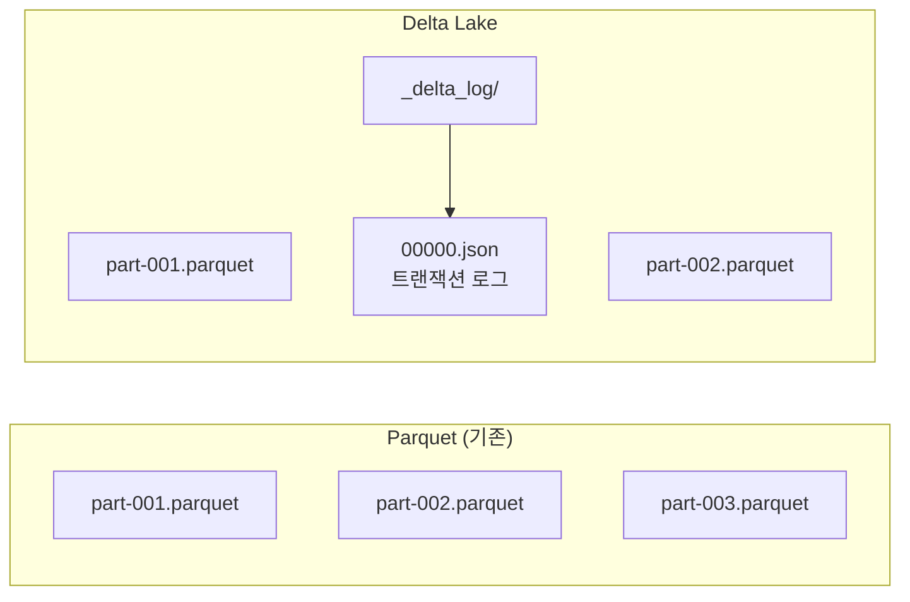

{}
- **ACID 트랜잭션**: 동시 쓰기 시에도 데이터 일관성 보장
- **시간 여행**: 과거 버전 조회/복원으로 데이터 복구 가능
- **스키마 진화**: `mergeSchema` 옵션으로 컬럼 추가 안전하게 처리
- **최적화**: OPTIMIZE(파일 병합), Z-ORDER(쿼리 최적화), VACUUM(정리)
{}

## 대상 독자 및 선수 지식

| 구분 | 내용 |
|------|------|
| **대상 독자** | 데이터 레이크 아키텍처를 개선하려는 데이터 엔지니어 |
| **선수 지식** | Spark DataFrame API, Parquet 포맷 이해, [기본 예제](../basic/) 완료 |
| **학습 목표** | Delta Lake로 신뢰성 있는 데이터 레이크를 구축할 수 있다 |
| **예상 소요 시간** | 약 50분 |

---

Delta Lake를 활용하여 데이터 레이크에 ACID 트랜잭션, 스키마 관리, 시간 여행 기능을 추가합니다.

#### Delta Lake란?

**기존 데이터 레이크의 문제**

| 문제 | 설명 |
|------|------|
| **ACID 미지원** | 동시 쓰기 시 데이터 손상 가능 |
| **스키마 불일치** | 파일마다 다른 스키마 |
| **소규모 파일** | 성능 저하 |
| **롤백 불가** | 잘못된 데이터 복구 어려움 |

**Delta Lake 해결책**



*다이어그램 설명: 기존 Parquet은 파일들만 존재하지만, Delta Lake는 동일한 Parquet 파일들과 함께 _delta_log/ 디렉토리에 트랜잭션 로그(JSON)를 저장하여 ACID와 버전 관리를 지원*

| 기능 | 설명 |
|------|------|
| **ACID 트랜잭션** | 원자적 쓰기, 동시성 제어 |
| **스키마 진화** | 컬럼 추가/변경 안전하게 |
| **시간 여행** | 과거 버전 조회/복원 |
| **Compaction** | 작은 파일 자동 병합 |
| **Z-Order** | 쿼리 최적화 클러스터링 |

---

#### 환경 설정

**build.sbt**

```scala
ThisBuild / scalaVersion := "2.13.12"

lazy val root = (project in file("."))
  .settings(
    name := "spark-delta-example",
    libraryDependencies ++= Seq(
      "org.apache.spark" %% "spark-core" % "3.5.1",
      "org.apache.spark" %% "spark-sql"  % "3.5.1",
      "io.delta" %% "delta-spark" % "3.1.0"
    )
  )
```

**SparkSession 설정**

```scala
import org.apache.spark.sql.SparkSession
import io.delta.sql.DeltaSparkSessionExtension

val spark = SparkSession.builder()
  .appName("Delta Lake Example")
  .master("local[*]")
  .config("spark.sql.extensions", "io.delta.sql.DeltaSparkSessionExtension")
  .config("spark.sql.catalog.spark_catalog", "org.apache.spark.sql.delta.catalog.DeltaCatalog")
  .getOrCreate()
```

{}
- **spark-sql-extensions**: Delta Lake SQL 명령어 활성화
- **spark_catalog**: Delta 테이블을 기본 카탈로그로 등록
- **버전 호환성**: Spark 3.5.x와 Delta 3.1.x 조합 권장
- **Scala 버전**: Spark와 동일한 Scala 버전(2.13) 사용 필수
{}

---

#### 기본 CRUD 연산

**Create: Delta 테이블 생성**

```scala
import io.delta.tables._
import org.apache.spark.sql.functions._

case class Order(
  orderId: String,
  customerId: String,
  product: String,
  quantity: Int,
  price: Double,
  orderDate: String
)

val orders = Seq(
  Order("O001", "C1", "Laptop", 1, 1200.0, "2024-01-15"),
  Order("O002", "C2", "Phone", 2, 800.0, "2024-01-15"),
  Order("O003", "C1", "Tablet", 1, 500.0, "2024-01-16")
).toDF()

// Delta 테이블로 저장
orders.write
  .format("delta")
  .mode("overwrite")
  .save("/data/orders")

// SQL로 테이블 생성
spark.sql("""
  CREATE TABLE IF NOT EXISTS orders (
    orderId STRING,
    customerId STRING,
    product STRING,
    quantity INT,
    price DOUBLE,
    orderDate DATE
  )
  USING DELTA
  LOCATION '/data/orders'
  PARTITIONED BY (orderDate)
""")
```

**Read: 데이터 조회**

```scala
// DataFrame API
val df = spark.read.format("delta").load("/data/orders")
df.show()

// SQL
spark.sql("SELECT * FROM delta.`/data/orders`").show()

// 테이블로 등록 후 조회
spark.sql("SELECT * FROM orders WHERE quantity > 1").show()
```

**Update: 데이터 수정**

```scala
import io.delta.tables.DeltaTable

val deltaTable = DeltaTable.forPath(spark, "/data/orders")

// 조건부 업데이트
deltaTable.update(
  condition = expr("orderId = 'O002'"),
  set = Map(
    "quantity" -> lit(3),
    "price" -> lit(750.0)
  )
)

// SQL로 업데이트
spark.sql("""
  UPDATE orders
  SET quantity = 3, price = 750.0
  WHERE orderId = 'O002'
""")
```

**Delete: 데이터 삭제**

```scala
// 조건부 삭제
deltaTable.delete(expr("customerId = 'C2'"))

// SQL로 삭제
spark.sql("DELETE FROM orders WHERE customerId = 'C2'")
```

**Merge (Upsert): 병합**

```scala
val newOrders = Seq(
  Order("O002", "C2", "Phone", 5, 700.0, "2024-01-17"),  // 기존 주문 업데이트
  Order("O004", "C3", "Monitor", 2, 300.0, "2024-01-17") // 새 주문 삽입
).toDF()

deltaTable.as("target")
  .merge(
    newOrders.as("source"),
    "target.orderId = source.orderId"
  )
  .whenMatched
  .updateAll()
  .whenNotMatched
  .insertAll()
  .execute()
```

{}
- **MERGE (Upsert)**: 단일 트랜잭션으로 Insert + Update 처리
- **조건부 Update/Delete**: `expr()` 또는 SQL WHERE 조건 사용
- **DataFrame/SQL 혼용**: 동일한 테이블에 두 방식 모두 적용 가능
- **트랜잭션 보장**: 실패 시 자동 롤백, 부분 쓰기 방지
{}

---

#### 시간 여행 (Time Travel)

**버전별 조회**

```scala
// 특정 버전 조회
val version0 = spark.read
  .format("delta")
  .option("versionAsOf", 0)
  .load("/data/orders")

// 특정 시점 조회
val asOf = spark.read
  .format("delta")
  .option("timestampAsOf", "2024-01-16 10:00:00")
  .load("/data/orders")

// SQL로 조회
spark.sql("""
  SELECT * FROM orders VERSION AS OF 0
""").show()

spark.sql("""
  SELECT * FROM orders TIMESTAMP AS OF '2024-01-16 10:00:00'
""").show()
```

**버전 히스토리 조회**

```scala
val history = deltaTable.history()
history.select("version", "timestamp", "operation", "operationParameters").show(false)

// 결과:
// +-------+--------------------+---------+---------------------------+
// |version|timestamp           |operation|operationParameters        |
// +-------+--------------------+---------+---------------------------+
// |3      |2024-01-17 15:30:00|MERGE    |{predicate -> ...}         |
// |2      |2024-01-17 14:00:00|UPDATE   |{predicate -> orderId = ...}|
// |1      |2024-01-16 10:00:00|WRITE    |{mode -> Append}           |
// |0      |2024-01-15 09:00:00|WRITE    |{mode -> Overwrite}        |
// +-------+--------------------+---------+---------------------------+
```

**버전 복원**

```scala
// 이전 버전으로 복원
deltaTable.restoreToVersion(1)

// 특정 시점으로 복원
deltaTable.restoreToTimestamp("2024-01-16 10:00:00")

// SQL로 복원
spark.sql("RESTORE orders TO VERSION AS OF 1")
```

{}
- **버전 조회**: `versionAsOf` 또는 `timestampAsOf` 옵션 사용
- **히스토리 확인**: `deltaTable.history()`로 모든 변경 기록 조회
- **버전 복원**: `restoreToVersion()` 또는 `restoreToTimestamp()`
- **VACUUM 주의**: 정리된 버전은 시간 여행 불가 (기본 7일 보존)
{}

---

#### 스키마 진화 (Schema Evolution)

**컬럼 추가**

```scala
// 새 컬럼이 있는 데이터
val ordersWithStatus = Seq(
  ("O005", "C4", "Keyboard", 1, 100.0, "2024-01-18", "CONFIRMED")
).toDF("orderId", "customerId", "product", "quantity", "price", "orderDate", "status")

// 스키마 자동 병합
ordersWithStatus.write
  .format("delta")
  .mode("append")
  .option("mergeSchema", "true")
  .save("/data/orders")
```

**스키마 덮어쓰기**

```scala
// 스키마 완전히 변경
newSchema.write
  .format("delta")
  .mode("overwrite")
  .option("overwriteSchema", "true")
  .save("/data/orders")
```

{}
- **mergeSchema**: 새 컬럼 자동 추가 (기존 데이터는 null)
- **overwriteSchema**: 스키마 완전 교체 (타입 변경 시 필요)
- **자동 검증**: 호환되지 않는 변경은 자동 거부
- **호환 가능 변경**: 컬럼 추가, nullable 변경 등
{}

---

#### 최적화 (Optimization)

**Compaction (파일 병합)**

```scala
// 작은 파일 병합
deltaTable.optimize().executeCompaction()

// 특정 파티션만 최적화
deltaTable.optimize()
  .where("orderDate = '2024-01-15'")
  .executeCompaction()

// SQL
spark.sql("OPTIMIZE orders")
spark.sql("OPTIMIZE orders WHERE orderDate = '2024-01-15'")
```

**Z-Order (데이터 클러스터링)**

```scala
// 자주 필터링하는 컬럼 기준 클러스터링
deltaTable.optimize()
  .executeZOrderBy("customerId", "product")

// SQL
spark.sql("OPTIMIZE orders ZORDER BY (customerId, product)")
```

**Vacuum (오래된 파일 정리)**

```scala
// 7일 이상 지난 버전 삭제
deltaTable.vacuum(168)  // 168시간 = 7일

// SQL
spark.sql("VACUUM orders RETAIN 168 HOURS")

// 주의: retention 기간 이전 버전은 시간 여행 불가
```

{}
- **OPTIMIZE**: 작은 파일을 큰 파일로 병합 (읽기 성능 향상)
- **Z-ORDER**: 자주 필터링하는 컬럼 기준 데이터 재배치
- **VACUUM**: 오래된 버전 파일 삭제로 스토리지 절약
- **파티션 지정**: 특정 파티션만 최적화하여 비용 절감
{}

---

#### Change Data Feed (CDC)

**CDC 활성화**

```scala
// 테이블 생성 시 활성화
spark.sql("""
  CREATE TABLE orders_cdc (
    orderId STRING,
    customerId STRING,
    product STRING,
    quantity INT,
    price DOUBLE
  )
  USING DELTA
  TBLPROPERTIES (delta.enableChangeDataFeed = true)
""")

// 기존 테이블에 활성화
spark.sql("""
  ALTER TABLE orders
  SET TBLPROPERTIES (delta.enableChangeDataFeed = true)
""")
```

**변경 사항 조회**

```scala
// 버전 범위로 변경 조회
val changes = spark.read
  .format("delta")
  .option("readChangeFeed", "true")
  .option("startingVersion", 2)
  .option("endingVersion", 5)
  .table("orders")

changes.show()
// +-------+----------+-------+--------+-----+------------------+---------------+
// |orderId|customerId|product|quantity|price|_change_type      |_commit_version|
// +-------+----------+-------+--------+-----+------------------+---------------+
// |O002   |C2        |Phone  |5       |700.0|update_postimage  |3              |
// |O002   |C2        |Phone  |3       |750.0|update_preimage   |3              |
// |O004   |C3        |Monitor|2       |300.0|insert            |3              |
// +-------+----------+-------+--------+-----+------------------+---------------+

// Streaming으로 변경 사항 수신
val changesStream = spark.readStream
  .format("delta")
  .option("readChangeFeed", "true")
  .option("startingVersion", 0)
  .table("orders")

changesStream.writeStream
  .format("console")
  .start()
```

{}
- **활성화 필요**: `delta.enableChangeDataFeed = true` 테이블 속성
- **변경 타입**: insert, update_preimage, update_postimage, delete
- **버전 범위**: startingVersion ~ endingVersion으로 범위 지정
- **Streaming 지원**: `readStream`으로 실시간 변경 사항 수신
{}

---

#### 실전 예제: ETL 파이프라인

**Bronze → Silver → Gold 아키텍처**

```scala
object DeltaLakePipeline extends App {
  val spark = SparkSession.builder()
    .appName("Delta Lake Pipeline")
    .config("spark.sql.extensions", "io.delta.sql.DeltaSparkSessionExtension")
    .config("spark.sql.catalog.spark_catalog", "org.apache.spark.sql.delta.catalog.DeltaCatalog")
    .getOrCreate()

  import spark.implicits._

  // Bronze: 원본 데이터 그대로 저장
  def ingestToBronze(): Unit = {
    val rawData = spark.read
      .option("header", "true")
      .csv("/data/raw/orders/*.csv")

    rawData.write
      .format("delta")
      .mode("append")
      .option("mergeSchema", "true")
      .save("/data/bronze/orders")

    println("Bronze 레이어 적재 완료")
  }

  // Silver: 정제 및 검증
  def transformToSilver(): Unit = {
    val bronze = spark.read.format("delta").load("/data/bronze/orders")

    val silver = bronze
      // 데이터 정제
      .filter($"orderId".isNotNull && $"price" > 0)
      // 타입 변환
      .withColumn("price", $"price".cast("double"))
      .withColumn("quantity", $"quantity".cast("int"))
      .withColumn("orderDate", to_date($"orderDate"))
      // 중복 제거
      .dropDuplicates("orderId")
      // 파생 컬럼
      .withColumn("totalAmount", $"price" * $"quantity")
      .withColumn("processedAt", current_timestamp())

    // Merge로 증분 처리
    val silverTable = DeltaTable.forPath(spark, "/data/silver/orders")

    silverTable.as("target")
      .merge(silver.as("source"), "target.orderId = source.orderId")
      .whenMatched.updateAll()
      .whenNotMatched.insertAll()
      .execute()

    println("Silver 레이어 변환 완료")
  }

  // Gold: 비즈니스 집계
  def aggregateToGold(): Unit = {
    val silver = spark.read.format("delta").load("/data/silver/orders")

    // 일별 매출 집계
    val dailySales = silver
      .groupBy($"orderDate")
      .agg(
        count("*").as("orderCount"),
        sum("totalAmount").as("totalRevenue"),
        avg("totalAmount").as("avgOrderValue"),
        countDistinct("customerId").as("uniqueCustomers")
      )
      .withColumn("updatedAt", current_timestamp())

    dailySales.write
      .format("delta")
      .mode("overwrite")
      .save("/data/gold/daily_sales")

    // 고객별 집계
    val customerMetrics = silver
      .groupBy($"customerId")
      .agg(
        count("*").as("totalOrders"),
        sum("totalAmount").as("lifetimeValue"),
        min("orderDate").as("firstOrderDate"),
        max("orderDate").as("lastOrderDate")
      )
      .withColumn("updatedAt", current_timestamp())

    customerMetrics.write
      .format("delta")
      .mode("overwrite")
      .save("/data/gold/customer_metrics")

    println("Gold 레이어 집계 완료")
  }

  // 파이프라인 실행
  def runPipeline(): Unit = {
    ingestToBronze()
    transformToSilver()
    aggregateToGold()

    // 최적화
    DeltaTable.forPath(spark, "/data/silver/orders").optimize().executeCompaction()
    DeltaTable.forPath(spark, "/data/silver/orders").vacuum(168)

    println("파이프라인 완료")
  }

  runPipeline()
  spark.stop()
}
```

{}
- **Bronze**: 원본 그대로 저장 (스키마 유연, 품질 무관)
- **Silver**: 정제/검증 완료 데이터 (중복 제거, 타입 변환)
- **Gold**: 비즈니스 집계 테이블 (리포팅, 대시보드용)
- **MERGE 활용**: Silver 레이어에서 증분 Upsert 처리
{}

---

#### Spark Streaming과 연동

**Streaming 쓰기**

```scala
val stream = spark.readStream
  .format("kafka")
  .option("kafka.bootstrap.servers", "localhost:9092")
  .option("subscribe", "orders")
  .load()

val orders = stream
  .selectExpr("CAST(value AS STRING) as json")
  .select(from_json($"json", orderSchema).as("data"))
  .select("data.*")

orders.writeStream
  .format("delta")
  .outputMode("append")
  .option("checkpointLocation", "/data/checkpoints/orders")
  .start("/data/bronze/orders")
```

**Streaming 읽기**

```scala
val deltaStream = spark.readStream
  .format("delta")
  .load("/data/silver/orders")

deltaStream
  .groupBy(window($"orderDate", "1 day"), $"product")
  .agg(sum("totalAmount").as("dailyRevenue"))
  .writeStream
  .format("console")
  .outputMode("complete")
  .start()
```

{}
- **checkpointLocation**: 장애 복구를 위한 체크포인트 필수 설정
- **append 모드**: Delta 테이블에 스트리밍 데이터 추가
- **exactly-once**: 트랜잭션 로그로 중복 없는 처리 보장
- **Delta as Source**: Delta 테이블을 스트리밍 소스로도 활용 가능
{}

---

#### 주의 사항

| 항목 | 주의점 |
|------|--------|
| **Vacuum** | retention 기간 이전 버전은 시간 여행 불가 |
| **동시 쓰기** | 같은 파티션에 동시 쓰기 시 충돌 가능 |
| **스키마 변경** | 타입 변경은 overwriteSchema 필요 |
| **파일 크기** | target 파일 크기 설정 권장 (128MB~1GB) |

---

#### 다음 단계

- [Structured Streaming](../concepts/structured-streaming/) - 실시간 처리
- [성능 튜닝](../concepts/tuning/) - Spark 최적화
- [Kafka 연동]() - 스트림 소스
