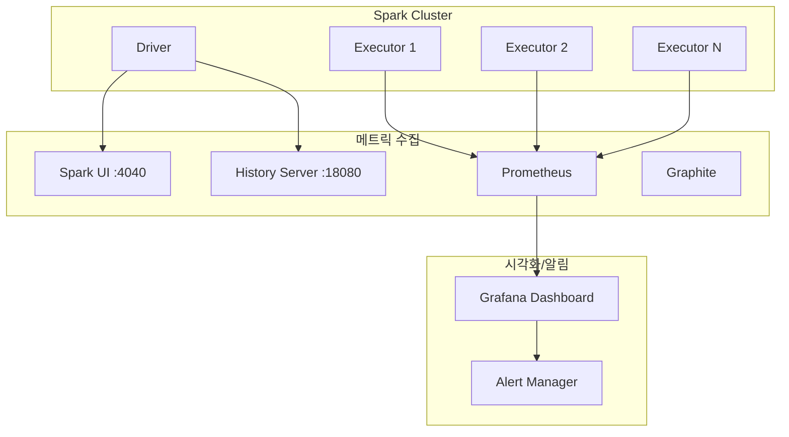


- **Spark UI**: 실시간 작업 상태, 실행 계획, 메모리 사용량 확인 (:4040)
- **History Server**: 종료된 애플리케이션 로그 분석 (:18080)
- **Prometheus + Grafana**: 메트릭 수집 및 시각화, 알림 설정
- **커스텀 메트릭**: 비즈니스 KPI (처리량, 실패율, 처리 시간) 추적


## 대상 독자 및 선수 지식

| 구분 | 내용 |
|------|------|
| **대상 독자** | Spark 애플리케이션을 운영하는 DevOps/데이터 엔지니어 |
| **선수 지식** | Spark 기본 동작, [기본 예제](basic/) 완료, Prometheus/Grafana 경험 (선택) |
| **학습 목표** | Spark 애플리케이션의 상태를 모니터링하고 문제를 진단할 수 있다 |
| **예상 소요 시간** | 약 35분 |

---

프로덕션 환경에서 Spark 애플리케이션을 안정적으로 운영하기 위한 모니터링 설정 가이드입니다.

## 모니터링 아키텍처



*다이어그램 설명: Spark Cluster(Driver, Executor)에서 Spark UI(:4040), History Server(:18080), Prometheus로 메트릭을 전송하고, Prometheus가 Grafana Dashboard로 데이터를 제공하여 Alert Manager가 알림을 발송하는 모니터링 흐름*

## Spark UI 설정

**기본 Spark UI 활성화**

```java
SparkSession spark = SparkSession.builder()
        .appName("Monitored Application")
        // Spark UI 설정
        .config("spark.ui.enabled", "true")
        .config("spark.ui.port", "4040")
        .config("spark.ui.retainedJobs", "1000")
        .config("spark.ui.retainedStages", "1000")
        .config("spark.ui.retainedTasks", "10000")
        // 셔플/스토리지 메트릭 보존
        .config("spark.sql.ui.retainedExecutions", "200")
        .getOrCreate();
```

**History Server 설정**

애플리케이션 종료 후에도 로그를 확인할 수 있습니다.

```bash
# spark-defaults.conf
spark.eventLog.enabled=true
spark.eventLog.dir=hdfs:///spark-logs
spark.eventLog.compress=true
spark.history.fs.logDirectory=hdfs:///spark-logs
spark.history.ui.port=18080
spark.history.retainedApplications=50
```

```java
// 코드에서 설정
SparkSession spark = SparkSession.builder()
        .appName("Production App")
        .config("spark.eventLog.enabled", "true")
        .config("spark.eventLog.dir", "/var/log/spark/events")
        .config("spark.eventLog.compress", "true")
        .getOrCreate();
```


- **실시간 UI**: :4040 포트로 현재 실행 중인 작업 모니터링
- **History Server**: 종료된 작업도 분석 가능 (:18080)
- **이벤트 로그**: `eventLog.enabled=true`로 작업 기록 보존
- **보존 설정**: `retainedJobs`, `retainedStages`로 UI에 표시할 기록 수 조정


## Prometheus + Grafana 연동

**1. Prometheus 메트릭 설정**

`metrics.properties` 파일을 생성합니다:

```properties
# metrics.properties
*.sink.prometheusServlet.class=org.apache.spark.metrics.sink.PrometheusServlet
*.sink.prometheusServlet.path=/metrics/prometheus
master.sink.prometheusServlet.path=/metrics/master/prometheus
applications.sink.prometheusServlet.path=/metrics/applications/prometheus
```

**2. Spark 설정**

```java
SparkSession spark = SparkSession.builder()
        .appName("Prometheus Monitored App")
        // 메트릭 설정
        .config("spark.metrics.conf", "/path/to/metrics.properties")
        .config("spark.metrics.namespace", "my_spark_app")
        // Executor 메트릭
        .config("spark.executor.processTreeMetrics.enabled", "true")
        // Dropwizard 메트릭
        .config("spark.metrics.staticSources.enabled", "true")
        .config("spark.metrics.appStatusSource.enabled", "true")
        .getOrCreate();
```

**3. Prometheus 설정**

```yaml
# prometheus.yml
scrape_configs:
  - job_name: 'spark'
    scrape_interval: 15s
    static_configs:
      - targets: ['spark-master:4040']
    metrics_path: /metrics/prometheus

  - job_name: 'spark-executors'
    scrape_interval: 15s
    static_configs:
      - targets: ['executor1:4040', 'executor2:4040']
```

**4. Grafana 대시보드 쿼리 예시**

```promql
# 활성 Executor 수
spark_executor_count{app_name="$app"}

# Executor 메모리 사용률
spark_executor_memoryUsed_MB{app_name="$app"} / spark_executor_maxMemory_MB{app_name="$app"} * 100

# 처리된 레코드 수/초
rate(spark_executor_inputRecords_total{app_name="$app"}[5m])

# Shuffle 읽기/쓰기
rate(spark_executor_shuffleRead_bytes_total{app_name="$app"}[5m])
rate(spark_executor_shuffleWrite_bytes_total{app_name="$app"}[5m])

# GC 시간
rate(spark_executor_gcTime_ms_total{app_name="$app"}[5m])

# Task 실패율
rate(spark_executor_failedTasks_total{app_name="$app"}[5m]) /
rate(spark_executor_completedTasks_total{app_name="$app"}[5m]) * 100
```


- **PrometheusServlet**: 내장 Sink로 /metrics/prometheus 엔드포인트 제공
- **scrape_interval**: 15초 권장 (너무 짧으면 오버헤드 증가)
- **주요 메트릭**: 메모리 사용률, GC 시간, Shuffle 바이트, Task 실패율
- **PromQL**: rate(), increase() 함수로 시계열 분석


## 커스텀 메트릭 구현

**애플리케이션 레벨 메트릭**

```java
import org.apache.spark.sql.SparkSession;
import com.codahale.metrics.*;
import org.apache.spark.metrics.source.Source;
import org.slf4j.Logger;
import org.slf4j.LoggerFactory;

/**
 * 커스텀 비즈니스 메트릭 수집기
 */
public class CustomMetricsCollector implements Source {
    private static final Logger logger = LoggerFactory.getLogger(CustomMetricsCollector.class);

    private final MetricRegistry metricRegistry = new MetricRegistry();
    private final Counter processedRecords;
    private final Counter failedRecords;
    private final Histogram processingTime;
    private final Meter throughput;

    public CustomMetricsCollector(String appName) {
        // 처리된 레코드 수
        this.processedRecords = metricRegistry.counter(
            MetricRegistry.name(appName, "records", "processed")
        );

        // 실패한 레코드 수
        this.failedRecords = metricRegistry.counter(
            MetricRegistry.name(appName, "records", "failed")
        );

        // 처리 시간 분포
        this.processingTime = metricRegistry.histogram(
            MetricRegistry.name(appName, "processing", "time_ms")
        );

        // 처리량 (레코드/초)
        this.throughput = metricRegistry.meter(
            MetricRegistry.name(appName, "throughput", "records_per_sec")
        );
    }

    @Override
    public String sourceName() {
        return "CustomMetrics";
    }

    @Override
    public MetricRegistry metricRegistry() {
        return metricRegistry;
    }

    public void recordProcessed(int count) {
        processedRecords.inc(count);
        throughput.mark(count);
    }

    public void recordFailed(int count) {
        failedRecords.inc(count);
    }

    public void recordProcessingTime(long timeMs) {
        processingTime.update(timeMs);
    }

    public void logStats() {
        logger.info("=== 처리 통계 ===");
        logger.info("처리된 레코드: {}", processedRecords.getCount());
        logger.info("실패한 레코드: {}", failedRecords.getCount());
        logger.info("평균 처리 시간: {}ms", processingTime.getSnapshot().getMean());
        logger.info("처리량: {} records/sec", throughput.getOneMinuteRate());
    }
}
```

**메트릭 적용 예제**

```java
public class MonitoredETLJob {
    private static final Logger logger = LoggerFactory.getLogger(MonitoredETLJob.class);

    public static void main(String[] args) {
        SparkSession spark = SparkSession.builder()
                .appName("Monitored ETL")
                .config("spark.metrics.conf", "metrics.properties")
                .getOrCreate();

        CustomMetricsCollector metrics = new CustomMetricsCollector("etl_job");

        // Spark 메트릭 시스템에 등록
        spark.sparkContext().env().metricsSystem().registerSource(metrics);

        try {
            long startTime = System.currentTimeMillis();

            Dataset<Row> source = spark.read()
                    .parquet("input/data.parquet");

            // 데이터 처리
            Dataset<Row> processed = source
                    .filter(col("valid").equalTo(true))
                    .withColumn("processed_at", current_timestamp());

            // 배치별 메트릭 수집
            long count = processed.count();
            metrics.recordProcessed((int) count);

            // 저장
            processed.write()
                    .mode("overwrite")
                    .parquet("output/processed");

            long duration = System.currentTimeMillis() - startTime;
            metrics.recordProcessingTime(duration);
            metrics.logStats();

        } catch (Exception e) {
            metrics.recordFailed(1);
            logger.error("ETL 작업 실패: {}", e.getMessage(), e);
            throw e;
        } finally {
            spark.stop();
        }
    }
}
```


- **Dropwizard Metrics**: Counter, Histogram, Meter 등 다양한 메트릭 타입
- **metricsSystem 등록**: Spark 내장 메트릭 시스템에 커스텀 Source 추가
- **비즈니스 KPI**: 처리된 레코드 수, 실패율, 처리 시간 분포 추적
- **실시간 로깅**: `logStats()` 메서드로 현재 상태 출력


## 로깅 설정

**Log4j2 설정 (권장)**

```xml
<!-- log4j2.xml -->
<?xml version="1.0" encoding="UTF-8"?>
<Configuration status="WARN">
    <Properties>
        <Property name="LOG_PATTERN">
            %d{yyyy-MM-dd HH:mm:ss.SSS} [%t] %-5level %logger{36} - %msg%n
        </Property>
        <Property name="LOG_DIR">/var/log/spark</Property>
    </Properties>

    <Appenders>
        <!-- 콘솔 출력 -->
        <Console name="Console" target="SYSTEM_OUT">
            <PatternLayout pattern="${LOG_PATTERN}"/>
        </Console>

        <!-- 파일 출력 (롤링) -->
        <RollingFile name="RollingFile"
                     fileName="${LOG_DIR}/app.log"
                     filePattern="${LOG_DIR}/app-%d{yyyy-MM-dd}-%i.log.gz">
            <PatternLayout pattern="${LOG_PATTERN}"/>
            <Policies>
                <TimeBasedTriggeringPolicy interval="1"/>
                <SizeBasedTriggeringPolicy size="100MB"/>
            </Policies>
            <DefaultRolloverStrategy max="30"/>
        </RollingFile>

        <!-- JSON 포맷 (ELK 연동용) -->
        <RollingFile name="JsonFile"
                     fileName="${LOG_DIR}/app-json.log"
                     filePattern="${LOG_DIR}/app-json-%d{yyyy-MM-dd}.log.gz">
            <JsonLayout compact="true" eventEol="true">
                <KeyValuePair key="app_name" value="${sys:spark.app.name}"/>
            </JsonLayout>
            <Policies>
                <TimeBasedTriggeringPolicy interval="1"/>
            </Policies>
        </RollingFile>
    </Appenders>

    <Loggers>
        <!-- Spark 내부 로그 레벨 조정 -->
        <Logger name="org.apache.spark" level="WARN"/>
        <Logger name="org.apache.hadoop" level="WARN"/>
        <Logger name="org.apache.parquet" level="ERROR"/>

        <!-- 애플리케이션 로그 -->
        <Logger name="com.mycompany" level="INFO" additivity="false">
            <AppenderRef ref="Console"/>
            <AppenderRef ref="RollingFile"/>
            <AppenderRef ref="JsonFile"/>
        </Logger>

        <Root level="INFO">
            <AppenderRef ref="Console"/>
            <AppenderRef ref="RollingFile"/>
        </Root>
    </Loggers>
</Configuration>
```

**구조화된 로깅**

```java
import org.slf4j.Logger;
import org.slf4j.LoggerFactory;
import org.slf4j.MDC;

public class StructuredLoggingExample {
    private static final Logger logger = LoggerFactory.getLogger(StructuredLoggingExample.class);

    public void processPartition(String partitionId, Dataset<Row> data) {
        // MDC로 컨텍스트 추가 (JSON 로그에 포함됨)
        MDC.put("partition_id", partitionId);
        MDC.put("job_id", UUID.randomUUID().toString());

        try {
            long startTime = System.currentTimeMillis();

            // 처리 로직
            long count = data.count();

            long duration = System.currentTimeMillis() - startTime;

            // 구조화된 로그
            logger.info("파티션 처리 완료: records={}, duration_ms={}", count, duration);

        } catch (Exception e) {
            logger.error("파티션 처리 실패: error={}", e.getMessage(), e);
            throw e;
        } finally {
            MDC.clear();
        }
    }
}
```


- **Log4j2 권장**: Spark 3.x 기본 로깅 프레임워크
- **로그 레벨 조정**: org.apache.spark는 WARN, 애플리케이션은 INFO
- **JSON 포맷**: ELK 스택 연동 시 JsonLayout 사용
- **MDC 활용**: 파티션 ID, 작업 ID 등 컨텍스트 정보 추가


## 알림 설정

**Grafana Alert Rules (YAML)**

```yaml
# grafana-alerts.yml
apiVersion: 1
groups:
  - orgId: 1
    name: spark_alerts
    folder: Spark
    interval: 1m
    rules:
      - uid: spark-executor-failure
        title: Executor 실패 감지
        condition: C
        data:
          - refId: A
            queryType: prometheus
            expr: increase(spark_executor_failedTasks_total[5m]) > 10
        for: 5m
        annotations:
          summary: "Spark Executor에서 다수의 Task 실패 발생"

      - uid: spark-memory-pressure
        title: 메모리 압박 경고
        condition: C
        data:
          - refId: A
            queryType: prometheus
            expr: >
              spark_executor_memoryUsed_MB / spark_executor_maxMemory_MB > 0.9
        for: 10m
        annotations:
          summary: "Executor 메모리 사용률 90% 초과"

      - uid: spark-shuffle-spill
        title: Shuffle Spill 경고
        condition: C
        data:
          - refId: A
            queryType: prometheus
            expr: spark_executor_diskBytesSpilled_total > 1073741824
        for: 5m
        annotations:
          summary: "디스크 Spill 1GB 초과 - 메모리 증설 필요"
```


- **Task 실패 알림**: 5분간 10건 이상 실패 시 즉시 알림
- **메모리 압박 알림**: 90% 초과 10분 지속 시 알림
- **Shuffle Spill 알림**: 디스크 스필 1GB 초과 시 메모리 증설 권고
- **for 조건**: 일시적 스파이크가 아닌 지속적 문제만 알림


## 모니터링 체크리스트

**일일 점검 항목**

| 메트릭 | 정상 범위 | 주의 | 위험 |
|--------|-----------|------|------|
| **Executor 메모리** | < 70% | 70-85% | > 85% |
| **GC 시간 비율** | < 5% | 5-10% | > 10% |
| **Task 실패율** | < 0.1% | 0.1-1% | > 1% |
| **Shuffle Spill** | 0 | < 100MB | > 1GB |
| **처리 지연** | < 예상 시간 | 1.5x | > 2x |

**주간 점검 항목**

```java
// 주간 성능 리포트 생성
public class WeeklyReportGenerator {
    public void generateReport(SparkSession spark, String startDate, String endDate) {
        // History Server API에서 데이터 수집
        Dataset<Row> jobHistory = spark.read()
                .json("/var/log/spark/events/*.json");

        // 주간 통계 집계
        Dataset<Row> weeklyStats = jobHistory
            .filter(col("timestamp").between(startDate, endDate))
            .groupBy("app_name")
            .agg(
                count("*").alias("total_jobs"),
                avg("duration").alias("avg_duration_sec"),
                max("duration").alias("max_duration_sec"),
                sum(when(col("status").equalTo("FAILED"), 1).otherwise(0))
                    .alias("failed_jobs"),
                avg("executor_memory_used").alias("avg_memory_used_mb"),
                sum("shuffle_bytes_written").alias("total_shuffle_bytes")
            );

        weeklyStats.show();

        // 리포트 저장
        weeklyStats.coalesce(1)
            .write()
            .mode("overwrite")
            .option("header", "true")
            .csv("reports/weekly/" + startDate);
    }
}
```

## 관련 문서

- [성능 튜닝](../concepts/tuning/) - 모니터링 결과를 기반으로 최적화
- [FAQ - 디버깅 가이드](../appendix/faq/#spark-ui-활용-디버깅-가이드) - 문제 해결
- [아키텍처](../concepts/architecture/) - 메모리 모델 이해
