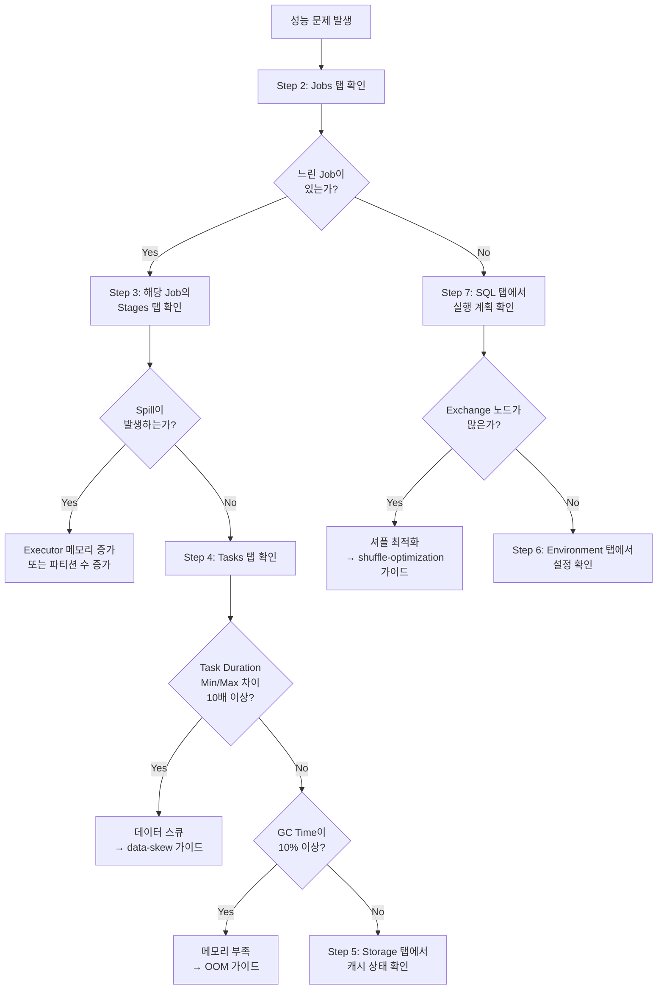


**예상 소요 시간**: 약 20분



- **Jobs 탭**에서 느린 Job을 찾고, **Stages 탭**에서 병목 Stage를 확인하세요
- **Tasks 탭**에서 Duration Min/Max 차이가 10배 이상이면 데이터 스큐입니다
- **SQL 탭**에서 Exchange 노드가 많으면 셔플을 줄여야 합니다


## 문제 정의

Spark UI에 접속했지만 탭이 여러 개 있고, 각 탭에서 무엇을 봐야 하는지 모르겠습니다. 이 가이드를 따르면 **Jobs → Stages → Tasks** 순서로 성능 병목을 찾을 수 있습니다.

**이 가이드가 다루는 것:**
- Spark UI 각 탭의 핵심 메트릭 읽는 법
- 병목 원인을 좁혀가는 순서

**이 가이드가 다루지 않는 것:**
- Prometheus/Grafana 기반 모니터링 설정 → [모니터링 설정](../examples/monitoring/)
- OOM 오류 해결 → [OutOfMemoryError 해결하기](oom-troubleshooting/)

---

## 전제 조건

| 항목 | 요구 사항 | 확인 방법 |
|------|----------|----------|
| **Spark 버전** | 2.4 이상 (3.x 권장) | `spark-submit --version` |
| **Java 버전** | 8, 11, 또는 17 | `java -version` |
| **Spark UI** | 접근 가능 | 브라우저에서 `http://localhost:4040` 열기 |

### 환경 확인

```bash
# Spark 버전 확인
spark-submit --version

# Spark UI 접근 확인 (애플리케이션 실행 중일 때)
curl -s http://localhost:4040/api/v1/applications | head -1
```

예상 출력:

```json
[{"id":"local-1234567890","name":"MyApp",...}]
```

출력이 없으면 [트러블슈팅](#트러블슈팅) 섹션을 확인하세요.

---

## Step 1/7: Spark UI 접속하기

환경에 따라 접속 URL이 다릅니다.

| 환경 | URL | 비고 |
|------|-----|------|
| **로컬 / Standalone** | `http://localhost:4040` | 앱 실행 중에만 접근 가능 |
| **YARN** | YARN ResourceManager → Application → **ApplicationMaster** 링크 | `yarn application -list`로 앱 ID 확인 |
| **Kubernetes** | `kubectl port-forward <driver-pod> 4040:4040` 후 `localhost:4040` | `kubectl get pods`로 Driver Pod 확인 |
| **History Server** | `http://localhost:18080` | 앱 종료 후에도 확인 가능 |

### 접속 확인

```bash
# 로컬 환경
curl -s -o /dev/null -w "%{http_code}" http://localhost:4040

# YARN 환경 — 앱 목록 확인
yarn application -list 2>/dev/null | grep RUNNING

# Kubernetes 환경 — Driver Pod 포트 포워딩
kubectl port-forward svc/spark-driver 4040:4040
```

HTTP 응답이 `200`이면 정상입니다. 다음 단계로 진행하세요.

---

## Step 2/7: Jobs 탭 — 전체 그림 파악

**Jobs** 탭을 클릭하세요. 여기서 전체 작업 목록을 확인합니다.

### 무엇을 봐야 하는가

| 항목 | 의미 | 확인 포인트 |
|------|------|------------|
| **Duration** | Job 소요 시간 | 다른 Job보다 비정상적으로 긴 Job을 찾으세요 |
| **Stages** | Job 내 Stage 수 | Succeeded/Failed 비율을 확인하세요 |
| **Status** | 완료/실패/진행 중 | Failed 상태가 있으면 해당 Job을 클릭하세요 |


**Job = Action 하나**입니다. `count()`, `collect()`, `save()` 같은 Action 호출마다 Job이 하나 생성됩니다.


### 판단 기준

- 특정 Job의 Duration이 다른 Job보다 **3배 이상** 길다면 해당 Job을 클릭하세요
- Stages 열에서 **Failed** 숫자가 0이 아니라면 즉시 확인하세요

느린 Job을 찾았다면 해당 Job을 클릭하여 Stage 목록으로 이동하세요.

---

## Step 3/7: Stages 탭 — 병목 구간 찾기

**Stages** 탭을 클릭하세요. 또는 Step 2에서 느린 Job을 클릭하면 해당 Job의 Stage 목록이 나타납니다.

### 핵심 메트릭

| 메트릭 | 의미 | 문제 신호 |
|--------|------|----------|
| **Duration** | Stage 소요 시간 | 전체 Job 시간의 80% 이상을 차지하는 Stage |
| **Shuffle Read** | 이전 Stage에서 읽은 데이터 크기 | 수 GB 이상이면 셔플 최적화 필요 |
| **Shuffle Write** | 다음 Stage로 보내는 데이터 크기 | Read와 함께 확인하세요 |
| **Spill (Memory)** | 메모리 → 디스크 스필 | 0이 아니면 메모리 부족 |
| **Spill (Disk)** | 디스크 스필 총량 | 0이 아니면 심각한 메모리 부족 |


**Spill이 발생하면** 디스크 I/O로 인해 성능이 급격히 저하됩니다. Executor 메모리를 증가시키거나 파티션 수를 늘리세요.


### 판단 기준

느린 Stage를 찾았다면 해당 Stage를 클릭하여 Task 상세 정보를 확인하세요.

---

## Step 4/7: Tasks 탭 — 개별 작업 분석

Stage를 클릭하면 **Task** 목록과 통계가 나타납니다. 여기서 병목의 근본 원인을 찾습니다.

### 핵심 메트릭

| 메트릭 | 정상 범위 | 문제 신호 | 원인 |
|--------|-----------|----------|------|
| **Duration (Min/Max)** | 비슷함 (2배 이내) | 10배 이상 차이 | 데이터 스큐 |
| **GC Time** | 전체의 5% 미만 | 10% 이상 | 메모리 부족 |
| **Shuffle Read Size (Min/Max)** | 균등 분포 | 일부 Task만 큼 | 데이터 스큐 |
| **Locality Level** | PROCESS_LOCAL | ANY | 데이터 지역성 문제 |

### 데이터 스큐 진단

Task Duration의 Min과 Max 차이가 **10배 이상**이면 데이터 스큐입니다.

```java
import static org.apache.spark.sql.functions.*;

// 파티션별 데이터 분포 확인
df.groupBy(spark_partition_id().alias("partition"))
  .count()
  .orderBy(col("count").desc())
  .show(10);
```

예상 출력 (스큐가 있는 경우):

```
+---------+-------+
|partition| count |
+---------+-------+
|        5|1000000|  <-- 비정상적으로 큼
|        3|   5000|
|        1|   4800|
+---------+-------+
```

데이터 스큐를 발견했다면 → [데이터 스큐 해결하기](data-skew/)를 참조하세요.

### GC 문제 진단

GC Time이 전체 Task Duration의 **10% 이상**이면 메모리 부족입니다.

```bash
# <app-id>는 Jobs 탭 상단 또는 다음 명령어로 확인:
# curl -s http://localhost:4040/api/v1/applications | python3 -m json.tool

# REST API로 Stage 메트릭 확인
curl -s http://localhost:4040/api/v1/applications/<app-id>/stages \
  | python3 -m json.tool | grep -E "gcTime|executorRunTime"
```

GC 문제를 발견했다면 → [OutOfMemoryError 해결하기](oom-troubleshooting/)를 참조하세요.

---

## Step 5/7: Storage 탭 — 캐시 확인

**Storage** 탭을 클릭하세요. `cache()` 또는 `persist()`로 캐시한 RDD/DataFrame 목록이 나타납니다.

### 확인 항목

| 항목 | 의미 | 확인 포인트 |
|------|------|------------|
| **RDD Name** | 캐시된 데이터 이름 | 의도한 데이터가 캐시되었는지 확인하세요 |
| **Storage Level** | 저장 위치 (메모리/디스크) | `MEMORY_ONLY`가 기본입니다 |
| **Cached Partitions** | 캐시된 파티션 수 | 전체 파티션 수와 비교하세요 |
| **Fraction Cached** | 캐시 비율 | 100%가 아니면 메모리 부족입니다 |
| **Size in Memory** | 메모리 사용량 | Executor 메모리 대비 적정한지 확인하세요 |


**Fraction Cached가 100% 미만**이면 메모리가 부족하여 일부 파티션이 캐시에서 제거된 것입니다. `MEMORY_AND_DISK`로 Storage Level을 변경하세요.


---

## Step 6/7: Environment 탭 — 설정 확인

**Environment** 탭을 클릭하세요. 현재 적용된 모든 Spark 설정을 확인할 수 있습니다.

### 확인할 주요 설정

| 설정 | 기본값 | 확인 포인트 |
|------|--------|------------|
| `spark.executor.memory` | 1g | 워크로드에 비해 너무 작지 않은지 확인하세요 |
| `spark.executor.cores` | 1 | 코어당 약 5GB 메모리를 할당하는지 확인하세요 (GC 오버헤드와 병렬성의 균형점) |
| `spark.sql.shuffle.partitions` | 200 | 데이터 크기에 맞게 조정했는지 확인하세요 |
| `spark.sql.adaptive.enabled` | true (3.x) | AQE가 활성화되었는지 확인하세요 |
| `spark.serializer` | JavaSerializer | KryoSerializer를 사용하는지 확인하세요 |

```bash
# <app-id> 확인: curl -s http://localhost:4040/api/v1/applications | python3 -c "import sys,json;print(json.load(sys.stdin)[0]['id'])"

# REST API로 설정 확인
curl -s http://localhost:4040/api/v1/applications/<app-id>/environment \
  | python3 -m json.tool | grep -E "executor.memory|shuffle.partitions"
```


**의도한 설정이 반영되지 않았다면** spark-submit 옵션, spark-defaults.conf, 코드 내 설정의 우선순위를 확인하세요. 코드 내 `.config()` 설정이 가장 높은 우선순위를 가집니다.


---

## Step 7/7: SQL 탭 — 실행 계획 분석

**SQL** 탭을 클릭하세요. Spark SQL 또는 DataFrame API로 실행한 쿼리의 실행 계획(DAG)이 나타납니다.

### 핵심 확인 항목

| 노드 | 의미 | 문제 신호 |
|------|------|----------|
| **Exchange** | 셔플 발생 | Exchange가 많으면 셔플 최적화가 필요합니다 |
| **BroadcastHashJoin** | 브로드캐스트 조인 | 작은 테이블에 이것이 아니면 설정을 확인하세요 |
| **SortMergeJoin** | 셔플 기반 조인 | 작은 테이블이면 브로드캐스트 조인으로 변경하세요 |
| **Scan** | 데이터 읽기 | 전체 스캔이면 파티션 프루닝이 실패한 것입니다 |
| **Filter** | 필터 조건 | Scan 바로 위에 있어야 pushdown이 된 것입니다 |

### 파티션 프루닝 확인

```java
// 실행 계획 확인
df.explain(true);
```

출력에서 `PartitionFilters`가 비어있으면 파티션 프루닝이 실패한 것입니다.

```
// 파티션 프루닝 성공
+- FileScan parquet [...] PartitionFilters: [date >= 2026-01-01]

// 파티션 프루닝 실패
+- FileScan parquet [...] PartitionFilters: []
```

셔플이 과도하다면 → [셔플 최적화하기](shuffle-optimization/)를 참조하세요.

---

## History Server 설정 (선택)

앱 종료 후에도 Spark UI를 확인하려면 History Server를 설정하세요.

### 1. 이벤트 로그 활성화

```java
SparkSession spark = SparkSession.builder()
    .appName("My App")
    .config("spark.eventLog.enabled", "true")
    .config("spark.eventLog.dir", "/var/log/spark/events")
    .config("spark.eventLog.compress", "true")
    .getOrCreate();
```

### 2. History Server 시작

```bash
# 이벤트 로그 디렉토리 생성
mkdir -p /var/log/spark/events

# spark-defaults.conf에 추가
# spark.history.fs.logDirectory=/var/log/spark/events
# spark.history.ui.port=18080

# History Server 시작
$SPARK_HOME/sbin/start-history-server.sh
```

### 3. 접속 확인

```bash
curl -s -o /dev/null -w "%{http_code}" http://localhost:18080
```

`200`이 출력되면 정상입니다. 브라우저에서 `http://localhost:18080`에 접속하세요.

---

## 트러블슈팅

| 증상 | 원인 | 해결 방법 |
|------|------|----------|
| UI가 안 열린다 (`Connection refused`) | Spark 앱이 실행 중이 아님 | `spark-submit`으로 앱이 실행 중인지 확인하세요 |
| UI가 안 열린다 (포트 충돌) | 4040 포트를 다른 앱이 사용 중 | `spark.ui.port`를 4041 등으로 변경하세요 |
| UI가 안 열린다 (방화벽) | 원격 서버에서 포트가 차단됨 | `ssh -L 4040:localhost:4040 <server>`로 터널링하세요 |
| UI가 비활성화됨 | `spark.ui.enabled=false` 설정 | **Environment** 탭에서 설정을 확인하거나 코드에서 `true`로 변경하세요 |
| History Server에 이전 Job이 안 보인다 | 이벤트 로그 미설정 | `spark.eventLog.enabled=true`를 설정하세요 |
| History Server에 이전 Job이 안 보인다 | 로그 경로 불일치 | `spark.eventLog.dir`과 `spark.history.fs.logDirectory`가 같은지 확인하세요 |
| YARN에서 UI 접근 불가 | ApplicationMaster URL 필요 | YARN ResourceManager에서 앱을 클릭하고 **ApplicationMaster** 링크를 사용하세요 |

---

## 의사결정 트리

성능 문제 발생 시 아래 순서로 진단하세요.



*다이어그램 요약: 성능 문제 → Jobs 탭에서 느린 Job 확인 → Stages 탭에서 Spill 여부 확인 → Tasks 탭에서 스큐(Duration 차이)와 GC 확인 → 원인별 가이드로 분기. Exchange가 많으면 셔플 최적화 필요.*

---

## 검증

이 가이드를 완료하면 다음을 달성합니다.

| 항목 | 성공 기준 |
|------|----------|
| **병목 위치 파악** | 어떤 Job의 어떤 Stage가 느린지 식별 완료 |
| **원인 진단** | 스큐/GC/셔플/스필 중 원인을 특정 완료 |
| **다음 행동** | 원인별 해결 가이드로 이동 가능 |

---


- **분석 순서**: Jobs → Stages → Tasks → 원인별 분기
- **데이터 스큐**: Task Duration Min/Max 차이 10배 이상
- **메모리 부족**: GC Time 10% 이상 또는 Spill 발생
- **셔플 과다**: SQL 탭에서 Exchange 노드 다수
- **설정 미반영**: Environment 탭에서 의도한 값 확인


## 다음 단계

- [OutOfMemoryError 해결하기](oom-troubleshooting/) - GC/메모리 문제 해결
- [데이터 스큐 해결하기](data-skew/) - Task 불균등 문제 해결
- [셔플 최적화하기](shuffle-optimization/) - 네트워크 I/O 줄이기
- [성능 튜닝](../concepts/tuning/) - 종합 성능 최적화
