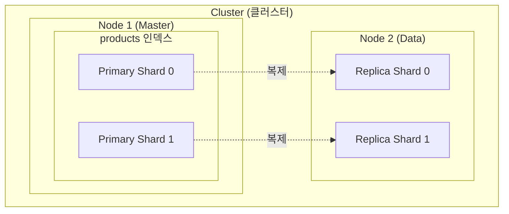
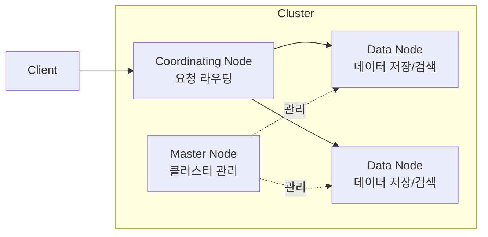
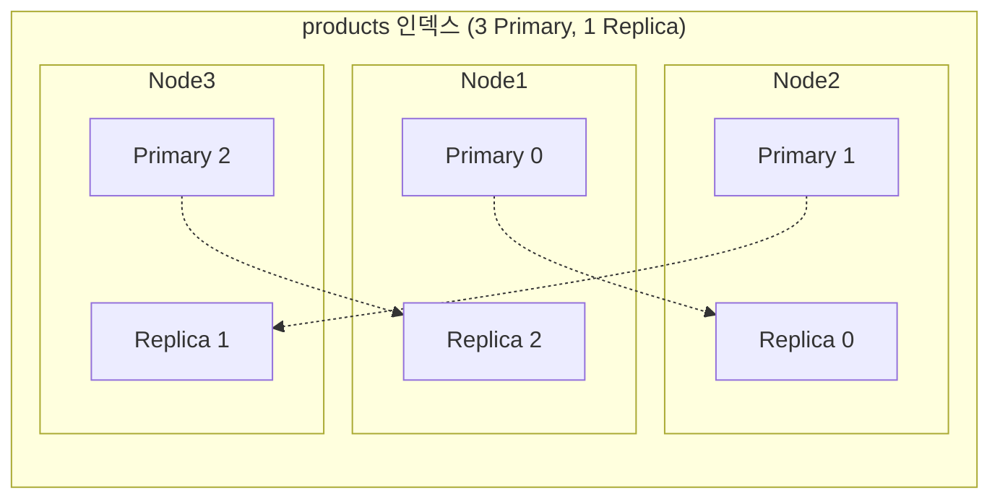
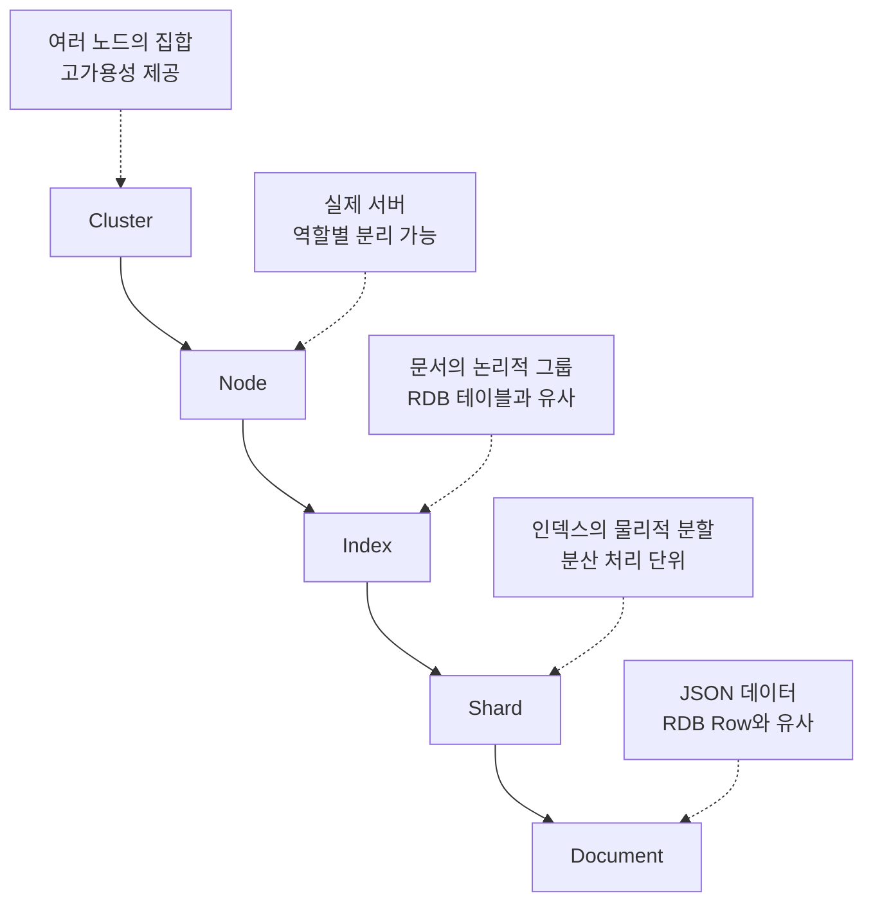

Elasticsearch의 핵심 구성요소인 Cluster, Node, Index, Document, Shard의 역할과 관계를 이해합니다.

## 전체 구조



## Cluster (클러스터)

**클러스터**는 하나 이상의 노드로 구성된 Elasticsearch 서버 그룹입니다.

### 주요 특징

- 고유한 이름으로 식별 (기본값: `elasticsearch`)
- 같은 클러스터 이름을 가진 노드들이 자동으로 연결
- 데이터와 부하를 여러 노드에 분산

### 클러스터 상태

| 상태 | 의미 | 조치 |
|------|------|------|
| 🟢 Green | 모든 샤드 정상 | 정상 운영 |
| 🟡 Yellow | Primary는 정상, Replica 일부 미할당 | 노드 추가 검토 |
| 🔴 Red | 일부 Primary 샤드 미할당 | 즉시 조치 필요 |

```bash
# 클러스터 상태 확인
GET /_cluster/health
```

```json
{
  "cluster_name": "my-cluster",
  "status": "green",
  "number_of_nodes": 3,
  "active_primary_shards": 10,
  "active_shards": 20
}
```

---

## Node (노드)

**노드**는 클러스터를 구성하는 단일 Elasticsearch 서버입니다.

### 노드 역할



| 역할 | 설명 | 설정 |
|------|------|------|
| **Master** | 클러스터 상태 관리, 인덱스 생성/삭제 | `node.roles: [master]` |
| **Data** | 데이터 저장, 검색/집계 수행 | `node.roles: [data]` |
| **Coordinating** | 검색 요청 라우팅, 결과 병합 | `node.roles: []` |
| **Ingest** | 인덱싱 전 데이터 전처리 | `node.roles: [ingest]` |

> **소규모 클러스터**에서는 한 노드가 여러 역할을 수행합니다.

### 노드 정보 확인

```bash
GET /_nodes
```

---

## Index (인덱스)

**인덱스**는 비슷한 특성을 가진 문서들의 모음입니다. RDB의 테이블과 유사합니다.

### RDB vs Elasticsearch

| RDB | Elasticsearch |
|-----|---------------|
| Database | Cluster |
| Table | Index |
| Row | Document |
| Column | Field |
| Schema | Mapping |

### 인덱스 생성

```json
PUT /products
{
  "settings": {
    "number_of_shards": 3,
    "number_of_replicas": 1
  },
  "mappings": {
    "properties": {
      "name": { "type": "text" },
      "price": { "type": "integer" },
      "category": { "type": "keyword" }
    }
  }
}
```

### 인덱스 설정

| 설정 | 기본값 | 설명 |
|------|--------|------|
| `number_of_shards` | 1 | Primary 샤드 수 (생성 후 변경 불가) |
| `number_of_replicas` | 1 | Replica 샤드 수 (동적 변경 가능) |
| `refresh_interval` | 1s | 검색 가능해지는 주기 |

### 인덱스 관리

```bash
# 인덱스 목록
GET /_cat/indices?v

# 인덱스 정보
GET /products

# 인덱스 삭제
DELETE /products
```

---

## Document (문서)

**문서**는 인덱스에 저장되는 JSON 형태의 데이터 단위입니다. RDB의 Row와 유사합니다.

### 문서 구조

```json
{
  "_index": "products",      // 소속 인덱스
  "_id": "1",                // 문서 고유 ID
  "_version": 1,             // 버전 (수정 시 증가)
  "_source": {               // 실제 데이터
    "name": "맥북 프로",
    "price": 2390000,
    "category": "노트북"
  }
}
```

### 문서 CRUD

```bash
# 생성 (ID 지정)
PUT /products/_doc/1
{
  "name": "맥북 프로",
  "price": 2390000
}

# 생성 (ID 자동 생성)
POST /products/_doc
{
  "name": "아이패드"
}

# 조회
GET /products/_doc/1

# 수정
POST /products/_update/1
{
  "doc": {
    "price": 2290000
  }
}

# 삭제
DELETE /products/_doc/1
```

---

## Shard (샤드)

**샤드**는 인덱스를 수평 분할한 조각입니다. 분산 저장과 병렬 처리를 가능하게 합니다.

### Primary Shard vs Replica Shard



| 유형 | 역할 | 특징 |
|------|------|------|
| **Primary** | 원본 데이터 저장 | 인덱스 생성 시 개수 고정 |
| **Replica** | Primary의 복제본 | 읽기 성능 향상, 장애 대비 |

### 샤드의 동작

**쓰기 (Write):**
1. 문서 ID로 해시 계산
2. 담당 Primary 샤드 결정: `shard = hash(id) % number_of_shards`
3. Primary에 쓰기 후 Replica에 복제

**읽기 (Read):**
1. Coordinating 노드가 요청 수신
2. 모든 관련 샤드(Primary 또는 Replica)에 병렬 요청
3. 결과 병합 후 반환

### 샤드 수 결정 가이드

| 데이터 규모 | 권장 Primary 샤드 수 |
|-------------|---------------------|
| 수 GB | 1 |
| 수십 GB | 2-5 |
| 수백 GB | 5-10 |
| TB 이상 | 10+ (노드 수 고려) |

> **Rule of Thumb:** 샤드 하나당 20-40GB가 적정합니다.

### 샤드 정보 확인

```bash
# 샤드 할당 상태
GET /_cat/shards/products?v

# 출력 예시
index    shard prirep state   docs store node
products 0     p      STARTED 100  50mb  node-1
products 0     r      STARTED 100  50mb  node-2
products 1     p      STARTED 120  55mb  node-2
products 1     r      STARTED 120  55mb  node-1
```

---

## 역색인 (Inverted Index)

Elasticsearch가 빠른 검색을 제공하는 핵심 원리입니다.

### 일반 색인 vs 역색인

**일반 색인 (Forward Index):**
```
문서1 → [맥북, 프로, 14인치]
문서2 → [맥북, 에어, 13인치]
```

**역색인 (Inverted Index):**
```
맥북   → [문서1, 문서2]
프로   → [문서1]
에어   → [문서2]
14인치 → [문서1]
13인치 → [문서2]
```

### 검색 과정

"맥북 프로" 검색 시:
1. "맥북" → [문서1, 문서2]
2. "프로" → [문서1]
3. 교집합: 문서1

> **핵심:** 모든 문서를 스캔하지 않고, 역색인에서 바로 찾습니다.

---

## 정리



---

## 다음 단계

| 목표 | 추천 문서 |
|------|----------|
| 스키마 설계 | [데이터 모델링](../data-modeling/) |
| 검색 쿼리 작성 | [Query DSL](../query-dsl/) |
| 실습 | [기본 예제](../../examples/basic/) |
