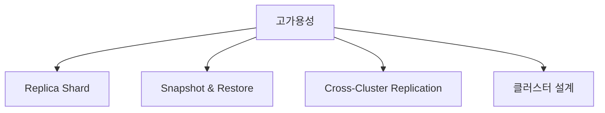
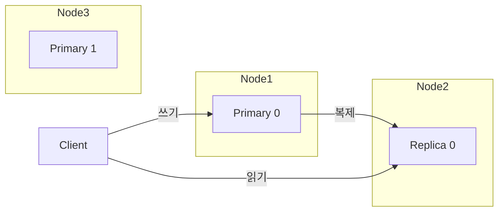
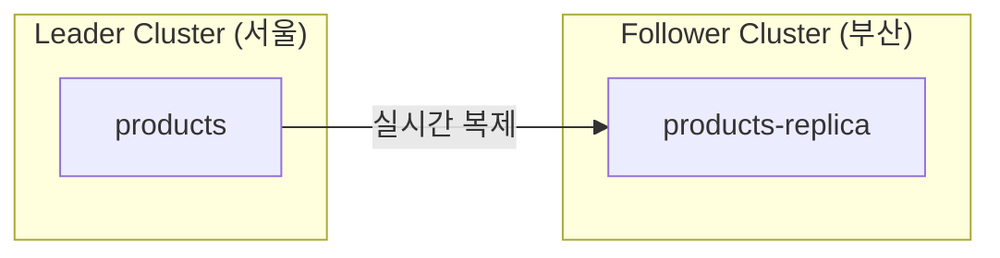
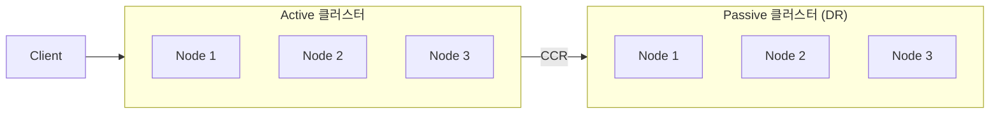
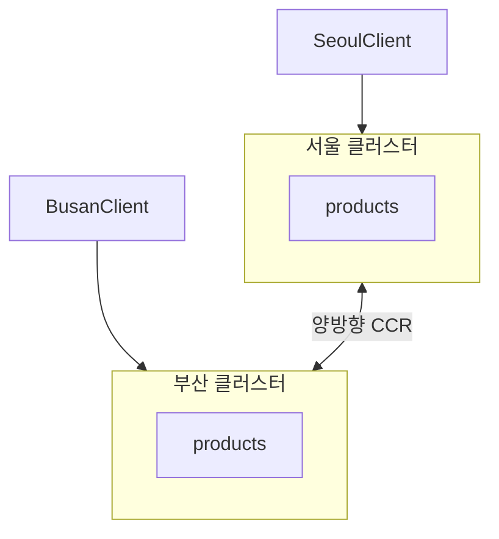

Elasticsearch 클러스터의 Replica, Snapshot, 장애 대응 전략을 배웁니다.

## 고가용성 개념

### HA(High Availability) 목표

| 지표 | 설명 | 목표 |
|------|------|------|
| **가용성** | 서비스 정상 운영 시간 | 99.9% (연간 8.76시간 다운타임) |
| **내구성** | 데이터 유실 방지 | 99.999999% (9-nines) |
| **복구 시간** | 장애 발생 → 복구 완료 | < 30분 |

### HA 구성 요소



---

## Replica Shard

### 역할



1. **데이터 이중화**: Primary 장애 시 Replica가 승격
2. **읽기 성능 향상**: 검색 요청 분산

### Replica 설정

```json
PUT /products
{
  "settings": {
    "number_of_shards": 3,
    "number_of_replicas": 1
  }
}
```

### 동적 변경

```json
PUT /products/_settings
{
  "number_of_replicas": 2
}
```

### 권장 설정

| 환경 | number_of_replicas |
|------|-------------------|
| 개발 | 0 |
| 소규모 프로덕션 | 1 |
| 대규모/중요 데이터 | 2 |

### Auto-Expand Replicas

노드 수에 따라 자동 조정:

```json
PUT /products/_settings
{
  "index.auto_expand_replicas": "0-2"  // 최소 0, 최대 2
}
```

---

## Snapshot & Restore

### 스냅샷이란?

특정 시점의 인덱스 상태를 저장하는 백업입니다.

### Repository 설정

**S3 Repository:**

```json
PUT /_snapshot/my_s3_backup
{
  "type": "s3",
  "settings": {
    "bucket": "my-elasticsearch-backups",
    "region": "ap-northeast-2",
    "base_path": "snapshots"
  }
}
```

**파일 시스템:**

```json
PUT /_snapshot/my_fs_backup
{
  "type": "fs",
  "settings": {
    "location": "/mount/backups",
    "compress": true
  }
}
```

> `elasticsearch.yml`에 `path.repo` 설정 필요

### 스냅샷 생성

```json
// 전체 클러스터
PUT /_snapshot/my_backup/snapshot_2024_01_15
{
  "indices": "*",
  "include_global_state": true
}

// 특정 인덱스만
PUT /_snapshot/my_backup/products_backup
{
  "indices": "products,orders",
  "include_global_state": false
}
```

### 스냅샷 상태 확인

```json
GET /_snapshot/my_backup/snapshot_2024_01_15/_status
```

### 스냅샷 목록

```json
GET /_snapshot/my_backup/_all
```

### 복원

```json
// 전체 복원
POST /_snapshot/my_backup/snapshot_2024_01_15/_restore

// 특정 인덱스만 다른 이름으로
POST /_snapshot/my_backup/snapshot_2024_01_15/_restore
{
  "indices": "products",
  "rename_pattern": "(.+)",
  "rename_replacement": "restored_$1"
}
```

### SLM (Snapshot Lifecycle Management)

자동 백업 정책:

```json
PUT /_slm/policy/daily_backup
{
  "schedule": "0 30 2 * * ?",     // 매일 02:30
  "name": "<daily-snap-{now/d}>",
  "repository": "my_backup",
  "config": {
    "indices": "*",
    "include_global_state": true
  },
  "retention": {
    "expire_after": "30d",
    "min_count": 5,
    "max_count": 50
  }
}
```

---

## Cross-Cluster Replication (CCR)

### 개념

원격 클러스터로 데이터를 실시간 복제합니다.



### 사용 사례

- **재해 복구(DR)**: 다른 리전에 복제본 유지
- **지역별 읽기**: 지연 시간 단축
- **데이터 집중화**: 여러 클러스터 → 중앙 집계

### 설정 방법

**1. 원격 클러스터 연결:**

```json
PUT /_cluster/settings
{
  "persistent": {
    "cluster": {
      "remote": {
        "leader_cluster": {
          "seeds": ["leader-node:9300"]
        }
      }
    }
  }
}
```

**2. Follower 인덱스 생성:**

```json
PUT /products-replica/_ccr/follow
{
  "remote_cluster": "leader_cluster",
  "leader_index": "products"
}
```

---

## 장애 시나리오와 대응

### 시나리오 1: 단일 노드 장애

**상황:** Data Node 1대 다운

**자동 대응:**
1. Replica가 Primary로 승격 (즉시)
2. 새 Replica 할당 (다른 노드에)
3. 클러스터 상태: Green 유지 (Replica 있는 경우)

**확인:**
```json
GET /_cluster/health
GET /_cat/shards?v
```

### 시나리오 2: Master 노드 장애

**상황:** Master Node 다운

**자동 대응:**
1. Master 선출 (다른 Master-eligible 노드)
2. 새 Master가 클러스터 상태 관리

**권장:** Master-eligible 노드 최소 3대 (과반수 유지)

### 시나리오 3: 디스크 장애

**상황:** 데이터 디스크 손상

**대응:**
```json
// 1. 해당 노드 제외
PUT /_cluster/settings
{
  "transient": {
    "cluster.routing.allocation.exclude._name": "damaged-node"
  }
}

// 2. 디스크 교체 후 노드 재시작

// 3. 제외 해제
PUT /_cluster/settings
{
  "transient": {
    "cluster.routing.allocation.exclude._name": null
  }
}
```

### 시나리오 4: 전체 클러스터 장애

**상황:** 데이터센터 장애

**대응:**
1. DR 클러스터 활성화 (CCR 사용 시)
2. 또는 스냅샷에서 복원

```json
POST /_snapshot/my_backup/latest/_restore
{
  "indices": "*",
  "include_global_state": true
}
```

---

## 클러스터 설계 패턴

### 패턴 1: Active-Passive



- Active에서 읽기/쓰기
- Passive는 대기 (장애 시 활성화)

### 패턴 2: Active-Active



- 각 리전에서 읽기/쓰기
- 양방향 동기화 (충돌 관리 필요)

### 패턴 3: 다중 데이터센터

```json
// Zone Awareness 설정
PUT /_cluster/settings
{
  "persistent": {
    "cluster.routing.allocation.awareness.attributes": "zone",
    "cluster.routing.allocation.awareness.force.zone.values": "zone1,zone2"
  }
}
```

```yaml
# elasticsearch.yml (각 노드)
node.attr.zone: zone1  # 또는 zone2
```

→ Primary와 Replica가 다른 Zone에 배치됨

---

## 모니터링 알림 설정

### 핵심 알림 조건

| 조건 | 심각도 | 조치 |
|------|--------|------|
| 클러스터 상태 Yellow | Warning | 노드 확인 |
| 클러스터 상태 Red | Critical | 즉시 대응 |
| 노드 다운 | Critical | 노드 복구 |
| 디스크 > 80% | Warning | 공간 확보 |
| 디스크 > 90% | Critical | 긴급 확장 |
| JVM Heap > 85% | Warning | 메모리 확인 |

### Watcher 알림 (Basic License+)

```json
PUT /_watcher/watch/cluster_health_watch
{
  "trigger": {
    "schedule": { "interval": "1m" }
  },
  "input": {
    "http": {
      "request": {
        "host": "localhost",
        "port": 9200,
        "path": "/_cluster/health"
      }
    }
  },
  "condition": {
    "compare": {
      "ctx.payload.status": { "eq": "red" }
    }
  },
  "actions": {
    "send_email": {
      "email": {
        "to": "admin@example.com",
        "subject": "Elasticsearch 클러스터 RED 상태!",
        "body": "클러스터 상태가 RED입니다. 즉시 확인하세요."
      }
    }
  }
}
```

---

## 체크리스트

### 일일 점검

- [ ] 클러스터 상태 확인 (`/_cluster/health`)
- [ ] 노드 상태 확인 (`/_cat/nodes`)
- [ ] 디스크 사용량 확인 (`/_cat/allocation`)

### 주간 점검

- [ ] 스냅샷 정상 생성 확인
- [ ] JVM 메모리 트렌드 확인
- [ ] 느린 쿼리 로그 검토

### 분기 점검

- [ ] 스냅샷 복원 테스트
- [ ] DR 전환 훈련
- [ ] 용량 계획 검토

---

## 다음 단계

| 목표 | 추천 문서 |
|------|----------|
| 클러스터 구성 | [클러스터 관리](../cluster-management/) |
| 성능 최적화 | [성능 튜닝](../performance-tuning/) |
| 실전 구현 | [상품 검색 시스템](../../examples/product-search/) |
