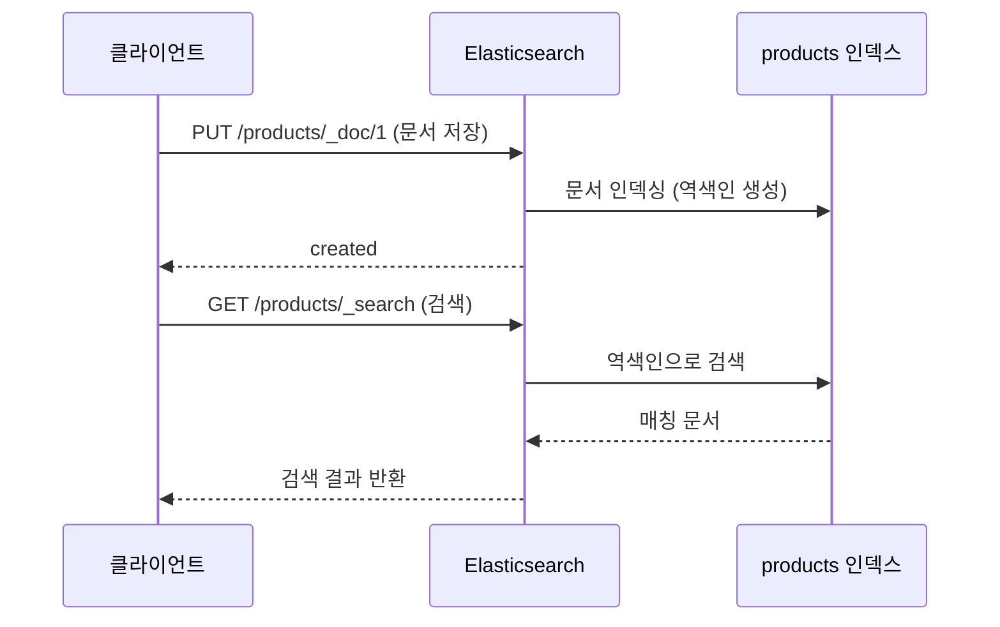

# Quick Start

5분 만에 Elasticsearch에 데이터를 저장하고 검색해보세요.

## 전체 흐름


## 준비물

- **Docker Desktop** 또는 Docker Engine
- **curl** 또는 웹 브라우저

## Step 1: Elasticsearch 시작

Docker Compose로 Elasticsearch와 Kibana를 실행합니다.

```bash
# 저장소 루트의 docker/elasticsearch 디렉토리로 이동
cd docker/elasticsearch
docker-compose up -d
```

> **docker-compose.yml이 없다면?**
> [환경 구성 가이드](../examples/setup/)에서 파일 내용을 확인하세요.

정상 실행 확인:

```bash
docker-compose ps
```

예상 결과:
```
NAME            STATUS
elasticsearch   Up (healthy)
kibana          Up
```

> **참고:** Elasticsearch가 완전히 시작되기까지 30-60초 정도 걸릴 수 있습니다.

클러스터 상태 확인:

```bash
curl -s http://localhost:9200/_cluster/health | jq
```

```json
{
  "cluster_name": "docker-cluster",
  "status": "green",
  "number_of_nodes": 1
}
```

## Step 2: Kibana Dev Tools 접속

브라우저에서 Kibana에 접속합니다:

```
http://localhost:5601
```

왼쪽 메뉴에서 **Management → Dev Tools**를 선택합니다.

> **Dev Tools**: Elasticsearch API를 직접 실행할 수 있는 콘솔입니다.

## Step 3: 첫 번째 문서 저장

Dev Tools 콘솔에서 상품 데이터를 저장합니다:

```json
PUT /products/_doc/1
{
  "name": "맥북 프로 14인치",
  "category": "노트북",
  "price": 2390000,
  "description": "M3 Pro 칩, 18GB 메모리, 스페이스 블랙"
}
```

응답:
```json
{
  "_index": "products",
  "_id": "1",
  "result": "created"
}
```

몇 개 더 추가해봅시다:

```json
PUT /products/_doc/2
{
  "name": "맥북 에어 13인치",
  "category": "노트북",
  "price": 1390000,
  "description": "M3 칩, 8GB 메모리, 미드나이트"
}

PUT /products/_doc/3
{
  "name": "아이패드 프로 11인치",
  "category": "태블릿",
  "price": 1499000,
  "description": "M4 칩, 256GB, 스페이스 블랙"
}

PUT /products/_doc/4
{
  "name": "갤럭시북4 프로",
  "category": "노트북",
  "price": 1890000,
  "description": "인텔 코어 울트라, 16GB 메모리"
}
```

## Step 4: 검색하기

### 전체 검색

모든 상품을 조회합니다:

```json
GET /products/_search
{
  "query": {
    "match_all": {}
  }
}
```

### 키워드 검색

"맥북"이 포함된 상품을 검색합니다:

```json
GET /products/_search
{
  "query": {
    "match": {
      "name": "맥북"
    }
  }
}
```

응답:
```json
{
  "hits": {
    "total": { "value": 2 },
    "hits": [
      { "_source": { "name": "맥북 프로 14인치", ... } },
      { "_source": { "name": "맥북 에어 13인치", ... } }
    ]
  }
}
```

### 조건 검색

노트북 카테고리에서 150만원 이하 상품:

```json
GET /products/_search
{
  "query": {
    "bool": {
      "must": [
        { "match": { "category": "노트북" } }
      ],
      "filter": [
        { "range": { "price": { "lte": 1500000 } } }
      ]
    }
  }
}
```

**축하합니다!** Elasticsearch의 기본 동작을 확인했습니다.

## 종료

```bash
# docker/elasticsearch 디렉토리에서
docker-compose down
```

데이터를 유지하려면:
```bash
docker-compose stop  # 컨테이너만 중지, 볼륨 유지
```

---

## 무엇이 일어났나요?



1. **문서 저장**: JSON 형태의 문서를 인덱스에 저장했습니다
2. **인덱싱**: Elasticsearch가 자동으로 역색인(Inverted Index)을 생성했습니다
3. **검색**: 역색인을 통해 밀리초 만에 결과를 찾았습니다

> **역색인이란?**
> 책의 색인(Index)처럼, 단어 → 문서 위치를 매핑한 구조입니다.
> "맥북" → [문서1, 문서2] 형태로 저장되어 빠른 검색이 가능합니다.

---

## 주요 API 정리

| 작업 | HTTP 메서드 | 엔드포인트 | 설명 |
|------|------------|------------|------|
| 문서 생성/수정 | PUT | `/인덱스/_doc/ID` | ID 지정하여 저장 |
| 문서 생성 | POST | `/인덱스/_doc` | ID 자동 생성 |
| 문서 조회 | GET | `/인덱스/_doc/ID` | 특정 문서 조회 |
| 문서 삭제 | DELETE | `/인덱스/_doc/ID` | 특정 문서 삭제 |
| 검색 | GET/POST | `/인덱스/_search` | 쿼리로 검색 |
| 인덱스 삭제 | DELETE | `/인덱스` | 인덱스 전체 삭제 |

---

## 트러블슈팅

### Elasticsearch 연결 실패

```
curl: (7) Failed to connect to localhost port 9200
```

**해결방법:**
1. Docker가 실행 중인지 확인: `docker ps`
2. 컨테이너 상태 확인: `docker-compose ps`
3. 로그 확인: `docker-compose logs elasticsearch`
4. Elasticsearch가 완전히 시작될 때까지 대기 (최대 60초)

### 클러스터 상태가 Yellow

단일 노드 환경에서는 Replica를 할당할 수 없어 Yellow가 정상입니다.

**프로덕션에서는:** 최소 2개 이상의 노드를 구성하세요.

### Kibana 접속 불가

```
Kibana server is not ready yet
```

**해결방법:**
1. Elasticsearch가 먼저 정상 실행되어야 합니다
2. 잠시 기다린 후 다시 접속 (최대 2분)

### 메모리 부족

```
bootstrap check failure: max virtual memory areas too low
```

**Linux에서 해결:**
```bash
sudo sysctl -w vm.max_map_count=262144
```

---

## 다음 단계

Quick Start를 완료했다면, 다음 단계로 진행하세요:

| 목표 | 추천 문서 |
|------|----------|
| Elasticsearch 구조 이해 | [핵심 구성요소](../concepts/core-components/) |
| 스키마 설계 배우기 | [데이터 모델링](../concepts/data-modeling/) |
| Spring Boot 연동 | [환경 설정](../examples/setup/) |
