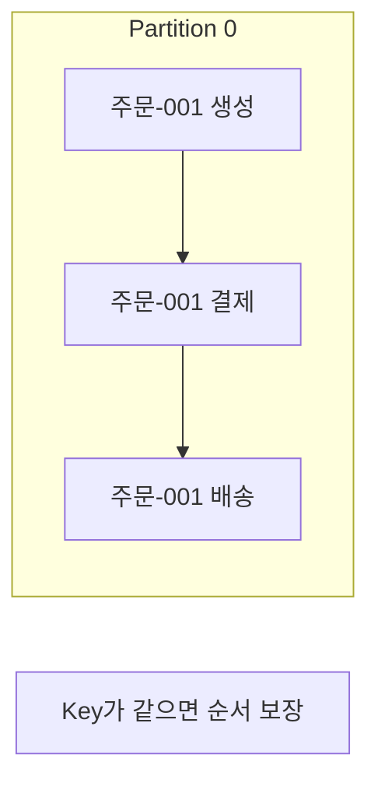
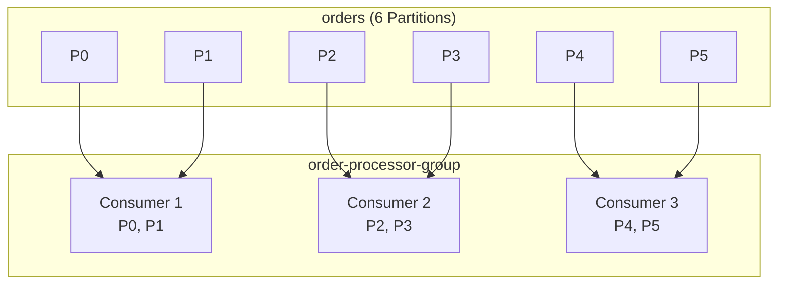
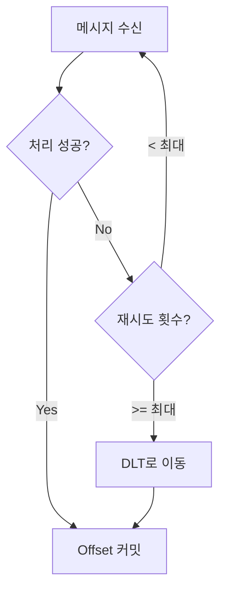
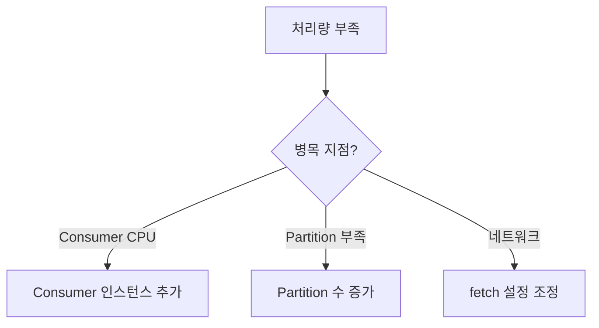
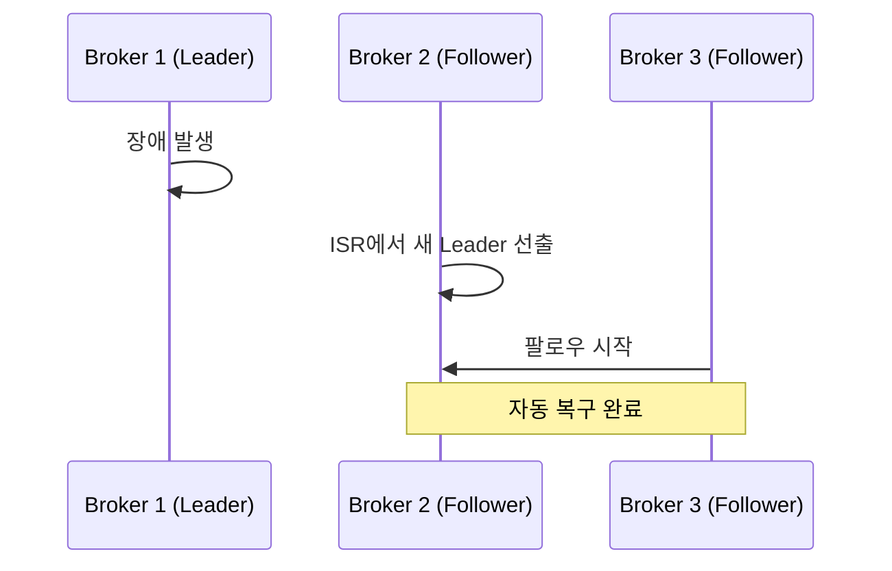

# Kafka 자주 묻는 질문 (FAQ)

Kafka를 사용할 때 자주 받는 질문과 답변입니다.

## 기본 개념

### Q: Kafka는 메시지 큐인가요?

**A:** 아닙니다. Kafka는 **분산 이벤트 스트리밍 플랫폼**입니다.

| 특성 | 메시지 큐 (RabbitMQ) | Kafka |
|------|---------------------|-------|
| **메시지 보관** | 소비 후 삭제 | 보존 기간까지 유지 |
| **재처리** | 불가 | 가능 (offset 이동) |
| **순서 보장** | 큐 단위 | Partition 단위 |
| **확장성** | 수직 확장 | 수평 확장 |

**Kafka가 적합한 경우:**
- 이벤트 소싱, CQRS
- 실시간 스트림 처리
- 로그 집계
- 메시지 재처리 필요

---

### Q: Partition 수는 몇 개가 적당한가요?

**A:** **처리량과 Consumer 수**를 고려하여 결정합니다.

```
Partition 수 = max(처리량 요구 / 단일 Partition 처리량, Consumer 수)
```

**일반적인 가이드라인:**

| 규모 | 권장 Partition 수 |
|------|-------------------|
| 소규모 (개발/테스트) | 3~6개 |
| 중규모 (일반 프로덕션) | 6~12개 |
| 대규모 (고처리량) | 12~50개 |

**주의사항:**
- Partition은 늘릴 수 있지만 **줄일 수 없음**
- Partition이 많으면 리더 선출 시간 증가
- Consumer 수보다 적으면 유휴 Consumer 발생

---

### Q: 메시지 순서는 어떻게 보장하나요?

**A:** **같은 Partition 내에서만** 순서가 보장됩니다.

```java
// 특정 키의 메시지는 항상 같은 Partition으로
kafkaTemplate.send("orders", orderId, orderEvent);
//                          ↑ Key
```



**Key 선택 기준:**
- 주문 시스템: `orderId`
- 사용자 활동: `userId`
- IoT 데이터: `deviceId`

---

### Q: Consumer Group은 왜 필요한가요?

**A:** **병렬 처리와 장애 복구**를 위해 필요합니다.



**장점:**
- 같은 그룹 내 Consumer들이 Partition을 나눠 처리
- Consumer 장애 시 자동으로 리밸런싱
- 독립적인 그룹은 같은 메시지를 각자 처리

---

## 설정 관련

### Q: acks 설정은 어떻게 해야 하나요?

**A:** **데이터 중요도**에 따라 선택합니다.

| acks | 동작 | 처리량 | 내구성 | 사용 사례 |
|------|------|--------|--------|----------|
| `0` | 전송 후 확인 안함 | 최고 | 낮음 | 로그, 메트릭 |
| `1` | Leader만 확인 | 높음 | 중간 | 일반 이벤트 |
| `all` | 모든 ISR 확인 | 낮음 | 높음 | 금융, 주문 |

```yaml
# application.yml
spring:
  kafka:
    producer:
      acks: all                    # 권장
      properties:
        min.insync.replicas: 2     # 최소 2개 복제본 확인
```

---

### Q: auto.offset.reset은 어떤 값을 사용하나요?

**A:** **earliest** 또는 **latest** 중 비즈니스 요구사항에 맞게 선택합니다.

| 값 | 동작 | 사용 사례 |
|----|------|----------|
| `earliest` | 처음부터 읽기 | 데이터 유실 방지 필요 |
| `latest` | 최신부터 읽기 | 실시간 처리만 필요 |
| `none` | 예외 발생 | 엄격한 offset 관리 |

```yaml
spring:
  kafka:
    consumer:
      auto-offset-reset: earliest  # 권장
```

**주의:** 새 Consumer Group일 때만 적용됩니다. 기존 그룹은 저장된 offset 사용.

---

### Q: enable.auto.commit은 켜야 하나요?

**A:** **false로 설정하고 수동 커밋을 권장**합니다.

```java
// ❌ 자동 커밋: 처리 전 커밋될 수 있음
@KafkaListener(topics = "orders")
public void listen(String message) {
    processOrder(message);  // 실패해도 offset 이미 커밋됨
}

// ✅ 수동 커밋: 처리 성공 후 커밋
@KafkaListener(topics = "orders")
public void listen(String message, Acknowledgment ack) {
    processOrder(message);
    ack.acknowledge();  // 처리 성공 후 명시적 커밋
}
```

```yaml
spring:
  kafka:
    consumer:
      enable-auto-commit: false
    listener:
      ack-mode: manual
```

---

## 에러 처리

### Q: Consumer에서 예외가 발생하면 어떻게 되나요?

**A:** 기본적으로 **무한 재시도** 후 애플리케이션이 중단됩니다.



**권장 설정:**

```java
@RetryableTopic(
    attempts = "3",
    backoff = @Backoff(delay = 1000, multiplier = 2),
    dltTopicSuffix = "-dlt"
)
@KafkaListener(topics = "orders")
public void listen(OrderEvent event) {
    processOrder(event);
}
```

---

### Q: Dead Letter Topic(DLT)은 어떻게 처리하나요?

**A:** **별도의 Consumer로 모니터링하고 수동 처리**합니다.

```java
// DLT 메시지 처리
@DltHandler
public void handleDlt(OrderEvent event,
                      @Header(KafkaHeaders.ORIGINAL_TOPIC) String topic,
                      @Header(KafkaHeaders.EXCEPTION_MESSAGE) String error) {
    log.error("DLT 수신 - Topic: {}, Error: {}", topic, error);
    alertService.sendAlert(event, error);
    // 수동 검토 후 재처리 또는 폐기
}
```

**DLT 운영 전략:**
1. 알림 설정 (Slack, Email)
2. 주기적으로 DLT 메시지 검토
3. 문제 해결 후 재처리하거나 폐기

---

### Q: 멱등성(Idempotent)은 왜 중요한가요?

**A:** 네트워크 장애로 **중복 메시지**가 발생할 수 있기 때문입니다.

```
시나리오:
1. Producer가 메시지 전송
2. Broker가 저장 후 ack 전송
3. 네트워크 오류로 ack 유실
4. Producer가 재전송 → 중복 발생!
```

**해결 방법:**

```yaml
# Producer 멱등성 활성화
spring:
  kafka:
    producer:
      properties:
        enable.idempotence: true
```

```java
// Consumer 측 멱등성 처리
@KafkaListener(topics = "orders")
public void listen(OrderEvent event) {
    if (processedIds.contains(event.orderId())) {
        return;  // 이미 처리됨
    }
    processOrder(event);
    processedIds.add(event.orderId());
}
```

---

## 성능 튜닝

### Q: Producer 처리량을 높이려면?

**A:** **배치와 압축**을 활성화합니다.

```yaml
spring:
  kafka:
    producer:
      batch-size: 32768         # 32KB 배치
      properties:
        linger.ms: 20           # 20ms 대기 후 전송
        compression.type: lz4   # 압축
        buffer.memory: 67108864 # 64MB 버퍼
```

| 설정 | 기본값 | 권장값 | 효과 |
|------|--------|--------|------|
| `batch.size` | 16KB | 32KB+ | 배치 크기 증가 |
| `linger.ms` | 0 | 5~100 | 배치 대기 시간 |
| `compression.type` | none | lz4 | 네트워크 부하 감소 |

---

### Q: Consumer 처리량을 높이려면?

**A:** **Consumer 수 증가**와 **fetch 설정 조정**을 합니다.

```yaml
spring:
  kafka:
    consumer:
      properties:
        fetch.min.bytes: 50000      # 최소 50KB
        fetch.max.wait.ms: 500      # 최대 500ms 대기
        max.poll.records: 500       # poll당 최대 500개
```

**확장 전략:**



---

### Q: Consumer Lag이 계속 증가해요

**A:** **처리 속도가 메시지 유입 속도보다 느린 것**입니다.

**확인 방법:**

```bash
kafka-consumer-groups.sh --bootstrap-server localhost:9092 \
  --group order-processor-group --describe
```

**해결 방법:**

| 원인 | 해결책 |
|------|--------|
| Consumer 수 부족 | 인스턴스 추가 |
| 느린 외부 API 호출 | 비동기 처리, 타임아웃 설정 |
| DB 병목 | 배치 처리, 인덱스 최적화 |
| 비효율적 로직 | 프로파일링 후 최적화 |

---

## 운영 관련

### Q: Kafka를 모니터링하려면?

**A:** **JMX 메트릭**을 수집하고 주요 지표를 모니터링합니다.

**핵심 모니터링 지표:**

| 지표 | 설명 | 임계값 |
|------|------|--------|
| Consumer Lag | 처리 지연 | > 1000 경고 |
| Under-replicated Partitions | 복제 지연 | > 0 경고 |
| Request Latency | 요청 지연 | > 100ms 경고 |
| Disk Usage | 디스크 사용량 | > 80% 경고 |

**알림 설정 예시:**

```yaml
# Prometheus AlertManager
- alert: KafkaConsumerLagHigh
  expr: kafka_consumer_lag > 10000
  for: 5m
  labels:
    severity: warning
```

---

### Q: Broker가 다운되면 어떻게 되나요?

**A:** **Replication 설정에 따라** 자동 복구됩니다.



**복구 조건:**
- `replication.factor >= 2`
- `min.insync.replicas >= 2`
- ISR에 살아있는 Broker 존재

---

### Q: 메시지 보존 기간은 어떻게 설정하나요?

**A:** **Topic별로 retention** 설정을 합니다.

```bash
# 7일 보존
kafka-configs.sh --bootstrap-server localhost:9092 \
  --alter --entity-type topics --entity-name orders \
  --add-config retention.ms=604800000
```

| 설정 | 설명 | 예시 |
|------|------|------|
| `retention.ms` | 시간 기반 | 7일 = 604800000 |
| `retention.bytes` | 크기 기반 | 1GB = 1073741824 |

**권장:**
- 일반 이벤트: 7일
- 감사 로그: 90일 이상
- 디버깅용: 1~3일

---

## Spring Kafka 관련

### Q: KafkaTemplate vs KafkaProducer 차이는?

**A:** `KafkaTemplate`은 Spring 추상화로 **더 편리**합니다.

```java
// ✅ KafkaTemplate (Spring 추상화)
@Autowired
private KafkaTemplate<String, OrderEvent> template;

public void send(OrderEvent event) {
    template.send("orders", event.orderId(), event);
}

// ❌ KafkaProducer (저수준 API) - Spring에서는 비권장
Producer<String, OrderEvent> producer = new KafkaProducer<>(props);
producer.send(new ProducerRecord<>("orders", event));
```

**KafkaTemplate 장점:**
- 자동 설정 통합
- 트랜잭션 지원
- 콜백 처리 간소화

---

### Q: @KafkaListener는 몇 개의 스레드로 동작하나요?

**A:** 기본적으로 **Partition 수만큼** 스레드가 생성됩니다.

```yaml
spring:
  kafka:
    listener:
      concurrency: 3  # 최대 3개 스레드
```

```
규칙:
- concurrency <= Partition 수 → concurrency만큼 스레드
- concurrency > Partition 수 → Partition 수만큼 스레드 (나머지 유휴)
```

---

## 다음 단계

- [용어 사전](../glossary/) - Kafka 용어 정리
- [참고 자료](../references/) - 학습 자료
