# 심화 개념

acks, Message Key, Retention 정책을 이해합니다.

> **Kafka 버전**: 이 문서는 **Kafka 3.6.x** 기준으로 작성되었습니다.

| 검증 환경 | 버전 |
|----------|------|
| Kafka | 3.6.1 (KRaft) |
| Spring Boot | 3.2.x |
| Spring Kafka | 3.1.x |
| Java | 17 |

> 이 문서의 코드 예제는 위 환경에서 컴파일 및 동작이 확인되었습니다.

## 선행 지식

- [메시지 흐름](../message-flow/) - Topic, Partition, Broker 개념
- [Replication](../replication/) - ISR, Leader, Follower 개념

## acks (Acknowledgment)

Producer가 메시지 전송 성공을 어떻게 확인할지 결정합니다.

### acks 옵션

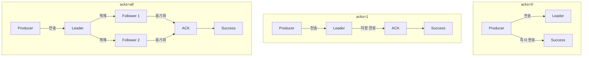

### 옵션별 비교

| acks | 동작 | 속도 | 안전성 | 사용 사례 |
|------|------|------|--------|----------|
| **0** | 응답 대기 안함 | 최고 | 최저 | 로그, 메트릭 |
| **1** | Leader 저장 확인 | 중간 | 중간 | 일반 이벤트 |
| **all** | ISR 전체 복제 확인 | 최저 | 최고 | 결제, 주문 |

### ⚠️ 중요: acks=all의 함정

> **`acks=all`만으로는 데이터 안전성이 보장되지 않습니다!**

`acks=all`은 "ISR에 있는 모든 복제본"에 복제를 확인합니다. 하지만 ISR에 Leader만 남아있다면?

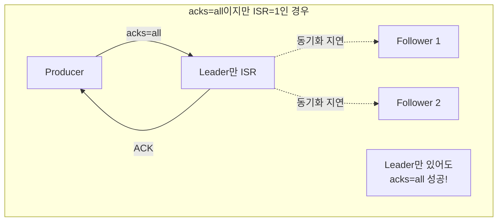

**해결책: `min.insync.replicas`와 함께 사용**

```yaml
# Topic 설정 (권장)
min.insync.replicas: 2  # 최소 2개 복제본 필요

# Producer 설정
acks: all
```

| 설정 조합 | ISR=3 | ISR=2 | ISR=1 |
|----------|-------|-------|-------|
| `acks=all` only | ✅ 성공 | ✅ 성공 | ✅ 성공 (위험!) |
| `acks=all` + `min.insync.replicas=2` | ✅ 성공 | ✅ 성공 | ❌ 실패 (안전) |

### Spring Kafka 설정

```yaml
spring:
  kafka:
    producer:
      acks: all  # 권장
      retries: 3
```

### Trade-off 다이어그램

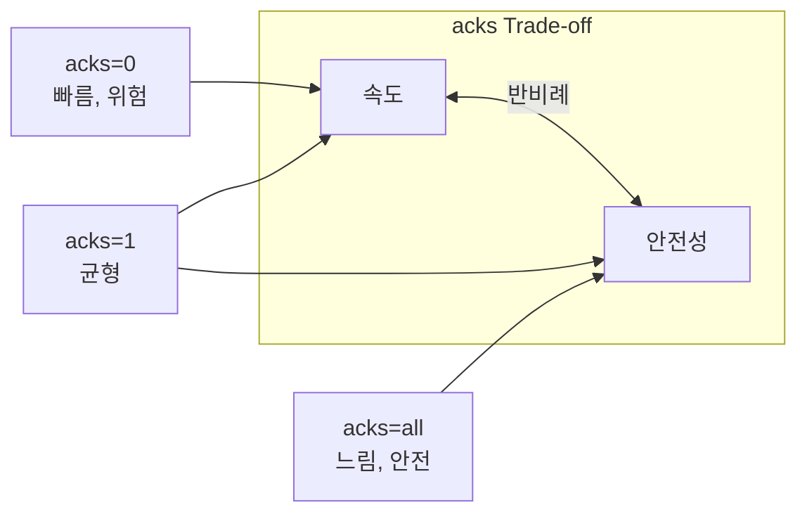

## Message Key

메시지를 특정 Partition으로 라우팅하는 데 사용됩니다.

### Key의 역할

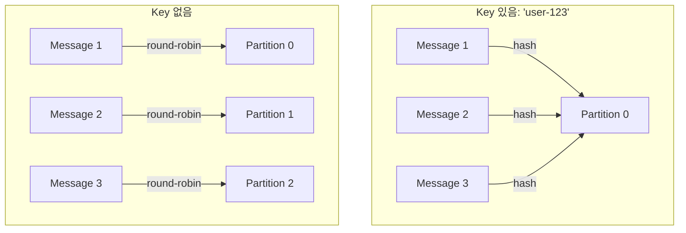

### 순서 보장

> **동일 Key = 동일 Partition = 순서 보장**

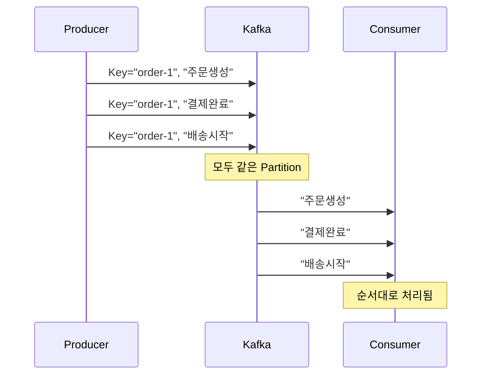

### 사용 사례

| Key 선택 | 효과 | 예시 |
|---------|------|------|
| **사용자 ID** | 사용자별 이벤트 순서 보장 | `user-123` |
| **주문 ID** | 주문별 상태 변경 순서 보장 | `order-456` |
| **기기 ID** | IoT 디바이스별 데이터 그룹화 | `device-789` |

### Spring Kafka 코드

```java
import org.springframework.kafka.core.KafkaTemplate;
import org.springframework.stereotype.Service;

@Service
public class OrderProducer {

    private final KafkaTemplate<String, String> kafkaTemplate;

    public OrderProducer(KafkaTemplate<String, String> kafkaTemplate) {
        this.kafkaTemplate = kafkaTemplate;
    }

    // Key 지정 - 같은 orderId는 항상 같은 Partition으로
    public void sendOrder(String orderId, String orderJson) {
        kafkaTemplate.send("orders", orderId, orderJson);
        //                  Topic    Key      Value
    }

    // Key 없이 (Sticky Partitioner, Kafka 2.4+에서 기본)
    public void sendLog(String logMessage) {
        kafkaTemplate.send("logs", null, logMessage);
    }
}
```

### 주의사항

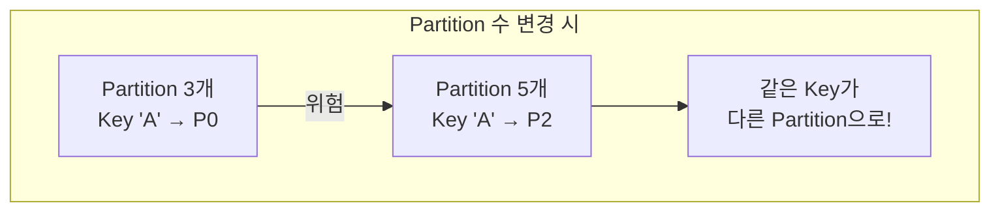

> **경고:** Partition 수를 변경하면 Key 해시가 달라져 기존 메시지와 새 메시지가 다른 Partition에 저장될 수 있습니다.

## Retention (보관 정책)

메시지를 얼마나 오래 보관할지 결정합니다.

### 정책 종류

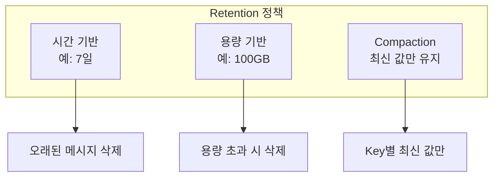

### 시간 기반 (기본)

```yaml
# Topic 설정
retention.ms: 604800000  # 7일 (기본값)
```

```
Day 1    Day 2    Day 3    ...    Day 7    Day 8
[msg1]   [msg2]   [msg3]          [msg7]   [삭제됨]
```

### 용량 기반

```yaml
retention.bytes: 107374182400  # 100GB
```

용량 초과 시 오래된 세그먼트부터 삭제

### Log Compaction

**Key별 마지막 값만 유지**하는 정책입니다.

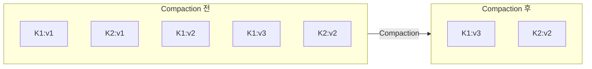

### 사용 사례별 권장 설정

| 사용 사례 | 정책 | 설정 예시 |
|----------|------|----------|
| **이벤트 로그** | 시간 기반 | 7일 보관 |
| **감사 로그** | 시간 기반 | 1년 보관 |
| **사용자 상태** | Compaction | 최신 상태만 |
| **세션 데이터** | 시간 기반 | 24시간 |

### Compaction 설정

```yaml
# Topic 설정
cleanup.policy: compact
min.cleanable.dirty.ratio: 0.5
```

### Log Compaction 내부 동작 원리

Log Compaction은 **백그라운드 스레드**에서 비동기로 실행됩니다:

```
Log Segment 구조:
├── Segment 1 (Closed) ← Compaction 대상
├── Segment 2 (Closed) ← Compaction 대상
├── Segment 3 (Closed) ← Compaction 대상
└── Segment 4 (Active)  ← Compaction 제외 (쓰기 중)
```

**Compaction 실행 조건:**

```yaml
# Dirty Ratio가 이 값을 초과하면 Compaction 시작
min.cleanable.dirty.ratio: 0.5  # 50% (기본값)

# Compaction 대상이 되기까지 최소 대기 시간
min.compaction.lag.ms: 0  # 즉시 대상 (기본값)

# 삭제 표시(Tombstone) 보관 시간
delete.retention.ms: 86400000  # 24시간 (기본값)
```

### Tombstone 메시지 (삭제 처리)

Log Compaction 환경에서 Key를 **삭제**하려면 **Tombstone 메시지**를 보냅니다:

```java
import org.springframework.kafka.core.KafkaTemplate;
import org.springframework.stereotype.Service;

@Service
public class UserProfileService {

    private final KafkaTemplate<String, String> kafkaTemplate;

    public UserProfileService(KafkaTemplate<String, String> kafkaTemplate) {
        this.kafkaTemplate = kafkaTemplate;
    }

    // 사용자 프로필 삭제 (Tombstone 전송)
    public void deleteUserProfile(String userId) {
        // value가 null이면 Tombstone 메시지
        kafkaTemplate.send("user-profiles", userId, null);
        // delete.retention.ms(기본 24시간) 후 Key 완전 삭제
    }

    // 사용자 프로필 업데이트
    public void updateUserProfile(String userId, String profileJson) {
        kafkaTemplate.send("user-profiles", userId, profileJson);
    }
}
```

**Consumer에서 Tombstone 처리:**

```java
@KafkaListener(topics = "user-profiles", groupId = "profile-service")
public void consume(ConsumerRecord<String, String> record) {
    if (record.value() == null) {
        // Tombstone 메시지 - 삭제 처리
        log.info("User deleted: {}", record.key());
        userRepository.deleteById(record.key());
    } else {
        // 일반 업데이트
        userRepository.save(parseProfile(record.value()));
    }
}
```

```
Compaction + Tombstone 타임라인:
├── T0: [user-123: {"name": "Alice"}]
├── T1: [user-123: {"name": "Bob"}]  ← 값 업데이트
├── T2: [user-123: null]              ← Tombstone (삭제 요청)
├── T3: Compaction 실행
│   └── 결과: [user-123: null] 만 남음
├── T4: delete.retention.ms(24시간) 경과
├── T5: 다음 Compaction 실행
│   └── 결과: user-123 Key 완전 삭제
```

> **주의:** Tombstone이 삭제되기 전에 Consumer가 읽으면 `null` 값을 받습니다. 애플리케이션에서 `null` 처리가 필요합니다.

### Compaction 성능 영향

| 설정 | 값 | 효과 |
|------|-----|------|
| `min.cleanable.dirty.ratio` | 낮음 (0.1) | 자주 Compaction, CPU 부하 증가 |
| `min.cleanable.dirty.ratio` | 높음 (0.9) | 가끔 Compaction, 디스크 사용량 증가 |
| `log.cleaner.threads` | 증가 | Compaction 속도 향상, CPU 부하 증가 |

**프로덕션 권장 설정:**

```yaml
# Broker 설정
log.cleaner.threads: 2
log.cleaner.dedupe.buffer.size: 134217728  # 128MB

# Topic 설정
cleanup.policy: compact
min.cleanable.dirty.ratio: 0.5
delete.retention.ms: 86400000  # 24시간
segment.ms: 604800000  # 7일마다 새 Segment
```

### Log Compaction vs 시간 기반 삭제 비교

| 특성 | 시간 기반 (delete) | Log Compaction (compact) |
|------|-------------------|-------------------------|
| **삭제 기준** | 시간 경과 | Key 중복 |
| **보관 데이터** | 최근 N일 | Key별 최신 값 |
| **용도** | 이벤트 로그 | 상태 저장소 |
| **Key 필수** | 아니오 | 예 |
| **Null 값 의미** | 일반 값 | 삭제 (Tombstone) |

**혼합 정책도 가능:**

```yaml
# 시간 기반 삭제 + Compaction 동시 적용
cleanup.policy: compact,delete
retention.ms: 604800000  # 7일
```

이 설정은 "7일 이내의 데이터 중 Key별 최신 값만 유지"를 의미합니다.

## Idempotent Producer (멱등성 프로듀서)

네트워크 오류로 재전송 시 **중복 메시지 방지**를 보장합니다.

### 문제 상황

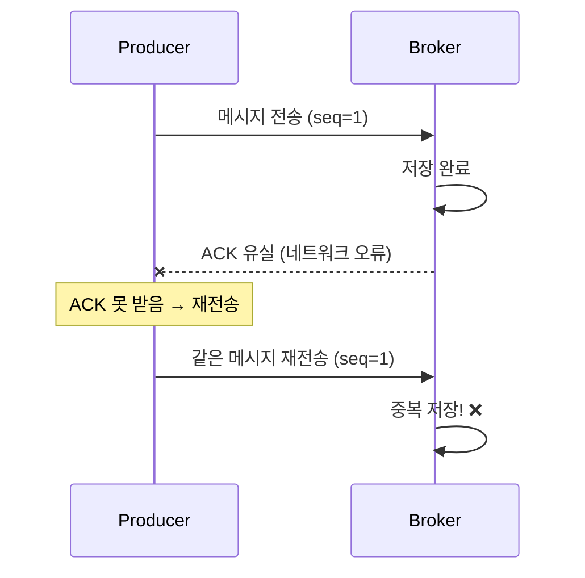

### 해결: Idempotent Producer

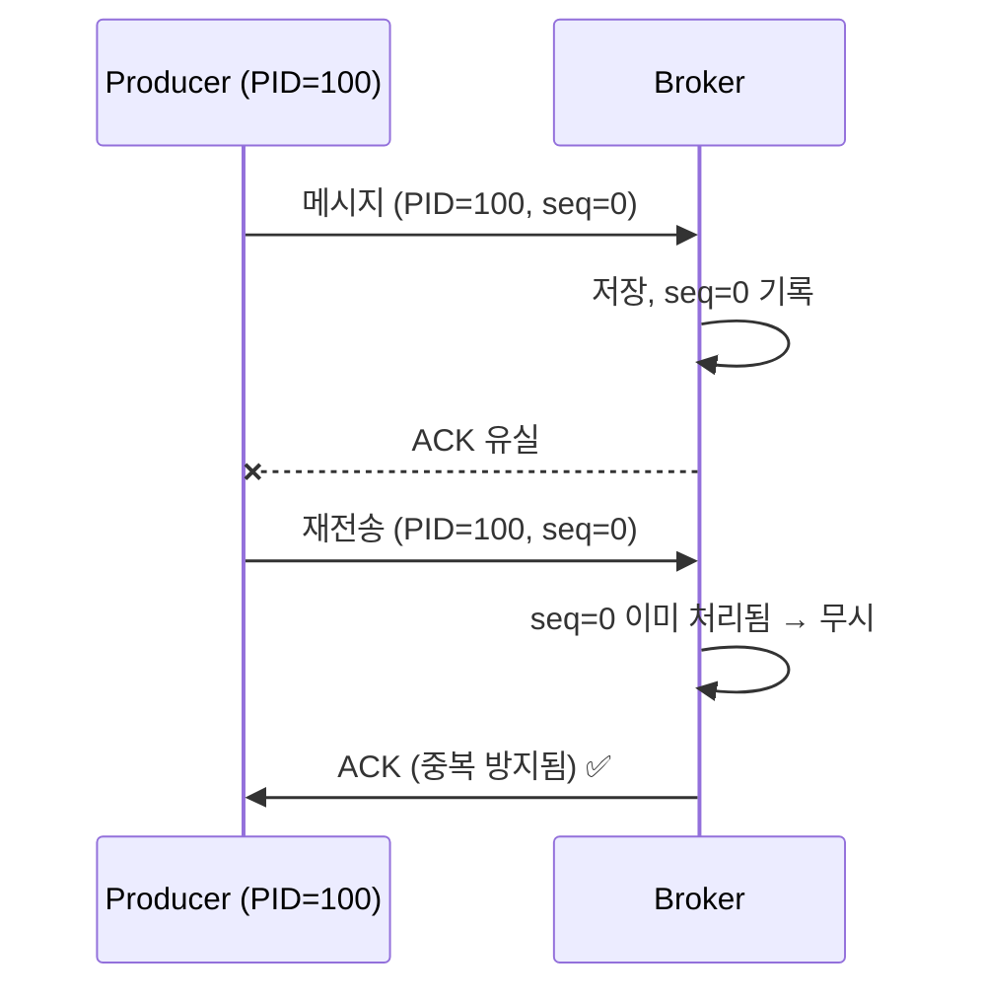

### 동작 원리

| 개념 | 설명 |
|------|------|
| **Producer ID (PID)** | Producer 식별자, 브로커가 할당 |
| **Sequence Number** | 각 Partition별 메시지 순번 |
| **중복 감지** | 동일 PID + seq는 무시 |

### 설정

```yaml
spring:
  kafka:
    producer:
      properties:
        enable.idempotence: true  # 기본값: true (Kafka 3.0+)
```

### 주의사항

```java
// Idempotent Producer 활성화 시 자동 설정됨
acks = all                              // 필수
retries = Integer.MAX_VALUE             // 무한 재시도
max.in.flight.requests.per.connection = 5  // 최대 5
```

> **참고:** Kafka 3.0부터 `enable.idempotence=true`가 기본값입니다.

## 설정 예시 종합

### 고신뢰성 프로덕션 환경

```yaml
# Producer
spring:
  kafka:
    producer:
      acks: all
      retries: 3
      properties:
        enable.idempotence: true  # Kafka 3.0+ 기본값
        max.in.flight.requests.per.connection: 5

# Topic 생성 시
kafka-topics.sh --create \
  --topic orders \
  --partitions 6 \
  --replication-factor 3 \
  --config min.insync.replicas=2 \
  --config retention.ms=604800000
```

### 고성능 로깅 환경

```yaml
# Producer
spring:
  kafka:
    producer:
      acks: 0
      batch-size: 65536
      linger-ms: 10

# Topic
retention.ms: 86400000  # 1일
```

## 정리

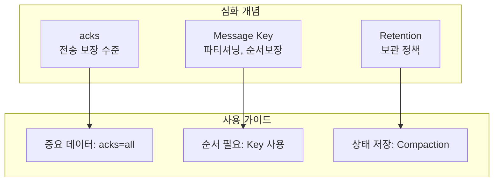

| 개념 | 핵심 질문 | 권장 |
|------|----------|------|
| **acks** | 얼마나 안전하게? | 프로덕션: `all` |
| **Message Key** | 순서가 중요한가? | 순서 필요 시 Key 사용 |
| **Retention** | 얼마나 보관? | 요구사항에 따라 |

## FAQ

**Q: acks=all이면 성능이 많이 떨어지나요?**
> A: 환경에 따라 다릅니다. 일반적으로 acks=1 대비 10~30% 레이턴시 증가가 예상됩니다. 처리량(throughput)은 배치 설정으로 보완 가능합니다.

**Q: Message Key 없이 순서를 보장할 수 있나요?**
> A: Partition이 1개면 가능하지만 병렬성을 포기해야 합니다. 실무에서는 Key를 사용하는 것이 권장됩니다.

**Q: Log Compaction과 시간 기반 삭제를 함께 쓰면?**
> A: `cleanup.policy=compact,delete` 설정 시 "N일 이내 데이터 중 Key별 최신 값만" 유지됩니다. 두 정책이 AND 조건으로 적용됩니다.

**Q: Idempotent Producer는 무조건 켜야 하나요?**
> A: Kafka 3.0+에서는 기본값이 `true`입니다. 특별한 이유가 없다면 끄지 마세요. 성능 영향은 미미합니다.

**Q: min.insync.replicas=2인데 Broker가 2대뿐이면?**
> A: 1대라도 장애 나면 쓰기 불가(NotEnoughReplicasException). 최소 3대 Broker + RF=3 + min.insync.replicas=2 권장.

## 참고 자료

- [Kafka Producer Configs - Apache Kafka Documentation](https://kafka.apache.org/documentation/#producerconfigs)
- [Log Compaction - Confluent Documentation](https://docs.confluent.io/platform/current/kafka/design.html#log-compaction)
- [KIP-98: Exactly Once Delivery and Transactional Messaging](https://cwiki.apache.org/confluence/display/KAFKA/KIP-98)
- [Idempotent Producer - Confluent Blog](https://www.confluent.io/blog/exactly-once-semantics-are-possible-heres-how-apache-kafka-does-it/)

## 다음 단계

- [트랜잭션과 Exactly-Once](../transactions/) - 메시지 전달 보장과 트랜잭션 API
- [Producer 튜닝](../producer-tuning/) - Producer 성능 최적화
