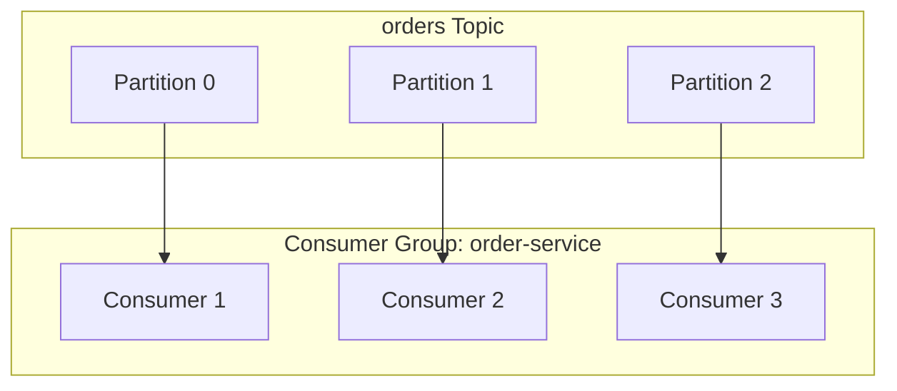
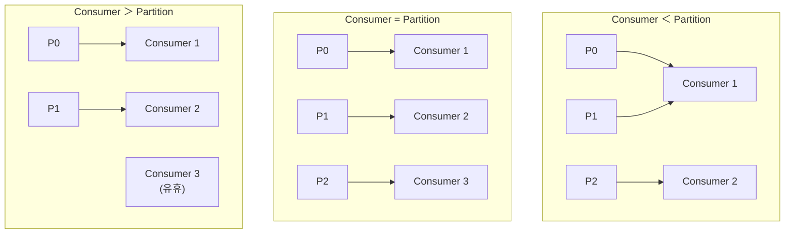
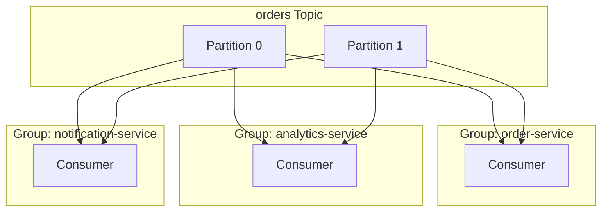
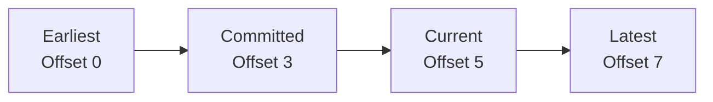
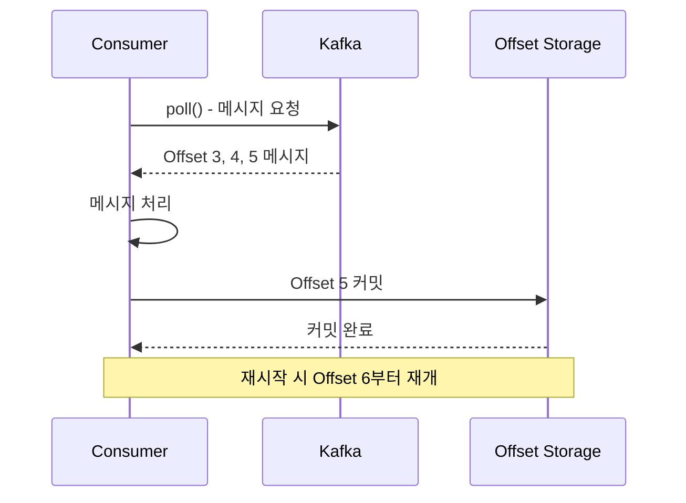
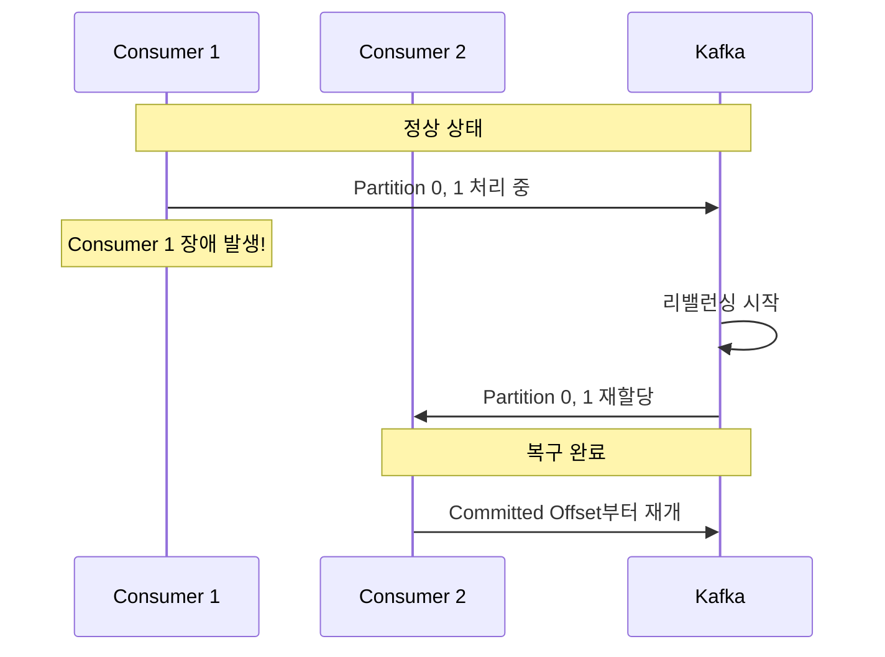
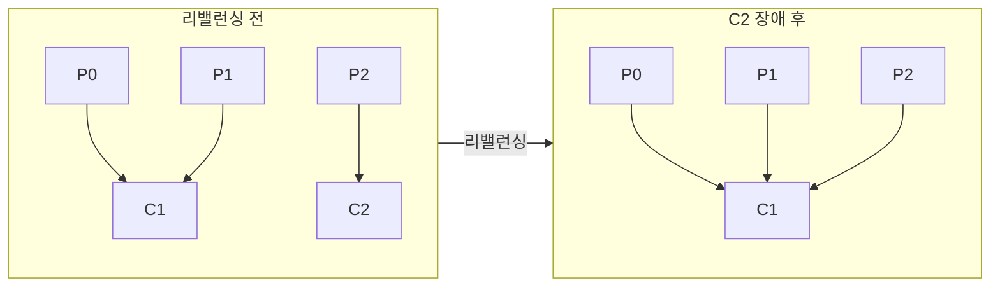
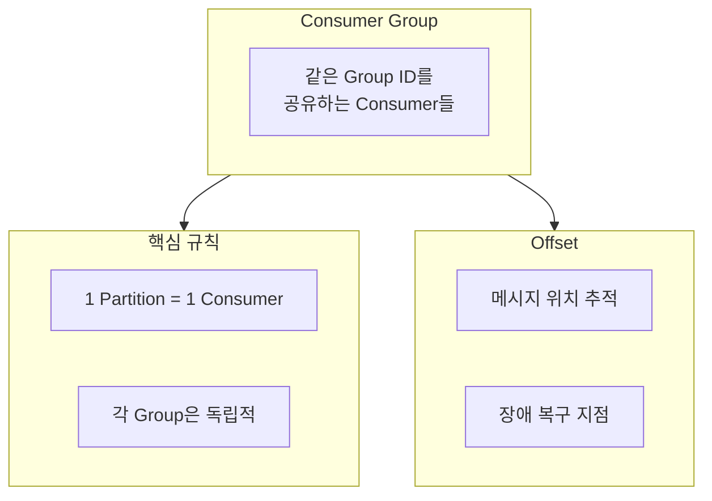

# Consumer Group & Offset

병렬 처리와 진행 상태 관리의 핵심 개념을 이해합니다.

## Consumer Group이란?

**Consumer Group**은 동일한 목적을 가진 Consumer들의 논리적 그룹입니다.



### 핵심 규칙

> **하나의 Partition은 Consumer Group 내에서 하나의 Consumer만 읽을 수 있다**

이 규칙이 중요한 이유:
- **순서 보장**: 같은 Partition의 메시지는 순서대로 처리
- **중복 방지**: 같은 메시지를 여러 Consumer가 동시에 처리하지 않음

## Consumer 수와 Partition 수



| 상황 | 결과 |
|------|------|
| Consumer < Partition | 일부 Consumer가 여러 Partition 담당 |
| Consumer = Partition | 최적 (1:1 매핑) |
| Consumer > Partition | 일부 Consumer 유휴 상태 |

## 여러 Consumer Group

서로 다른 Consumer Group은 **독립적으로** 메시지를 소비합니다.



각 그룹은:
- 모든 메시지를 독립적으로 수신
- 별도의 Offset 관리
- 서로 영향 없이 병렬 처리

## Offset이란?

**Offset**은 Partition 내 메시지의 순차적 위치 번호입니다.

```
Partition 0:
┌─────┬─────┬─────┬─────┬─────┬─────┬─────┐
│  0  │  1  │  2  │  3  │  4  │  5  │  6  │
└─────┴─────┴─────┴─────┴─────┴─────┴─────┘
                    ↑           ↑
            Current Offset    Latest Offset
              (읽은 위치)      (최신 메시지)
```

### Offset 종류



| Offset 종류 | 설명 |
|------------|------|
| **Earliest** | 가장 오래된 메시지 위치 |
| **Committed** | 마지막으로 커밋된 위치 |
| **Current** | 현재 Consumer가 읽고 있는 위치 |
| **Latest** | 가장 최신 메시지 위치 |

## Offset 커밋

Consumer가 메시지를 성공적으로 처리했음을 Kafka에 알리는 과정입니다.



### 자동 커밋 vs 수동 커밋

```yaml
# application.yml
spring:
  kafka:
    consumer:
      enable-auto-commit: true   # 자동 커밋 (기본값)
      auto-commit-interval: 5000 # 5초마다 커밋
```

| 방식 | 장점 | 단점 |
|------|------|------|
| **자동 커밋** | 구현 간단 | 처리 실패 시 데이터 유실 가능 |
| **수동 커밋** | 정확한 제어 | 구현 복잡 |

### 수동 커밋 예시

```java
@KafkaListener(topics = "orders")
public void consume(ConsumerRecord<String, String> record,
                    Acknowledgment ack) {
    try {
        processOrder(record.value());
        ack.acknowledge();  // 성공 시 커밋
    } catch (Exception e) {
        // 커밋하지 않음 - 재처리됨
        log.error("처리 실패", e);
    }
}
```

## 장애 복구 시나리오

### Consumer 장애 시



### 리밸런싱 (Rebalancing)

Consumer Group 내 Partition 재분배 과정:

**트리거 조건:**
- Consumer 추가/제거
- Consumer 장애
- Partition 수 변경



## auto.offset.reset 설정

Consumer Group이 처음 시작하거나 Offset 정보가 없을 때의 동작:

```yaml
spring:
  kafka:
    consumer:
      auto-offset-reset: earliest  # 또는 latest
```

| 설정 | 동작 |
|------|------|
| **earliest** | 가장 오래된 메시지부터 읽기 |
| **latest** | 새로운 메시지만 읽기 |
| **none** | Offset 없으면 에러 발생 |

### ⚠️ 흔한 실수: Offset Reset이 작동하지 않는 경우

`auto.offset.reset`은 **Offset이 존재하지 않을 때만** 적용됩니다:

```bash
# Offset이 이미 커밋된 Consumer Group
$ kafka-consumer-groups.sh --describe --group order-service \
    --bootstrap-server localhost:9092

GROUP           TOPIC      PARTITION  CURRENT-OFFSET  LOG-END-OFFSET  LAG
order-service   orders     0          1523            1523            0
order-service   orders     1          892             892             0
# ↑ CURRENT-OFFSET이 있으면 auto.offset.reset 무시됨!
```

**해결책: Offset 수동 리셋**

```bash
# 1. 가장 처음부터 다시 읽기
kafka-consumer-groups.sh --reset-offsets \
    --group order-service \
    --topic orders \
    --to-earliest \
    --execute \
    --bootstrap-server localhost:9092

# 2. 특정 시간 이후부터 읽기 (예: 장애 발생 시점)
kafka-consumer-groups.sh --reset-offsets \
    --group order-service \
    --topic orders \
    --to-datetime 2024-01-15T10:00:00.000 \
    --execute \
    --bootstrap-server localhost:9092

# 3. 특정 Offset으로 이동
kafka-consumer-groups.sh --reset-offsets \
    --group order-service \
    --topic orders:0:1500 \
    --execute \
    --bootstrap-server localhost:9092
```

> **주의:** Offset 리셋은 Consumer가 **중지된 상태**에서만 가능합니다.

## Consumer Group 핵심 설정

리밸런싱과 장애 감지에 영향을 주는 핵심 설정들입니다:

### Session과 Heartbeat 설정

```yaml
spring:
  kafka:
    consumer:
      properties:
        session.timeout.ms: 45000      # Broker가 Consumer 장애로 판단하는 시간
        heartbeat.interval.ms: 15000   # Heartbeat 전송 주기
        max.poll.interval.ms: 300000   # poll() 호출 사이 최대 간격
```

| 설정 | 기본값 | 역할 | 권장 비율 |
|------|--------|------|----------|
| `session.timeout.ms` | 45초 | Consumer 생존 판단 기준 | - |
| `heartbeat.interval.ms` | 3초 | Heartbeat 전송 주기 | session.timeout / 3 |
| `max.poll.interval.ms` | 5분 | 처리 시간 한계 | 메시지 처리 시간 × 2 |

### 실제 운영 사례: max.poll.interval.ms 문제

```java
// 문제 상황: 외부 API 호출이 오래 걸리는 경우
@KafkaListener(topics = "orders")
public void processOrder(String order) {
    // 외부 결제 API 호출 - 최대 3분 소요 가능
    PaymentResult result = paymentApi.process(order);  // ⚠️ 위험!
    // max.poll.interval.ms(5분) 초과 시 리밸런싱 발생
}

// 해결책 1: 비동기 처리
@KafkaListener(topics = "orders")
public void processOrder(String order) {
    CompletableFuture.runAsync(() -> paymentApi.process(order));
    // poll()은 빠르게 반환
}

// 해결책 2: max.poll.records 축소
spring.kafka.consumer.max-poll-records=10  # 기본값 500에서 축소
```

## 리밸런싱 심층 분석

### 리밸런싱이 성능에 미치는 영향

리밸런싱 중에는 **모든 Consumer가 일시 정지**됩니다:

```
리밸런싱 타임라인 (Eager Protocol):
├── 0ms: Consumer 3 장애 감지
├── 0ms: 모든 Consumer Partition 해제 (Stop-the-World)
├── 100ms: Group Coordinator가 새 할당 계산
├── 200ms: 각 Consumer에게 새 Partition 할당
├── 500ms: 각 Consumer가 마지막 Offset부터 재개
└── 총 소요: ~500ms~2초 (Consumer 수에 비례)
```

LinkedIn 측정 데이터에 따르면:
- 10개 Consumer: 평균 1.5초 리밸런싱
- 100개 Consumer: 평균 15초 리밸런싱
- 1000개 Consumer: 평균 3분 이상 리밸런싱

### 리밸런싱 최소화 전략

**1. Cooperative Sticky Assignor (Kafka 2.4+)**

기존 Eager Protocol과 달리 필요한 Partition만 재할당:

```yaml
spring:
  kafka:
    consumer:
      properties:
        partition.assignment.strategy: org.apache.kafka.clients.consumer.CooperativeStickyAssignor
```

```
Cooperative 리밸런싱 (Consumer 3 장애):
├── 기존: P0→C1, P1→C1, P2→C2
├── 장애 후: P0→C1, P1→C1, P2→??? (C2만 영향)
├── C1은 계속 처리 중! (Stop-the-World 없음)
└── C2만 P2 재할당 받음
```

**2. Static Group Membership (Kafka 2.3+)**

Consumer 재시작 시 리밸런싱 방지:

```yaml
spring:
  kafka:
    consumer:
      properties:
        group.instance.id: consumer-instance-1  # 고정 ID 부여
        session.timeout.ms: 300000  # 5분 (재시작 시간 확보)
```

| 전략 | 리밸런싱 시간 | 적합한 경우 |
|------|--------------|------------|
| Eager (기본) | 느림 | 소규모 Consumer Group |
| Cooperative Sticky | 빠름 | 대규모 Consumer Group |
| Static Membership | 최소화 | K8s Rolling Update |

### 리밸런싱 모니터링

```java
// ConsumerRebalanceListener 구현
public class RebalanceLogger implements ConsumerRebalanceListener {
    private static final Logger log = LoggerFactory.getLogger(RebalanceLogger.class);
    private Instant rebalanceStart;

    @Override
    public void onPartitionsRevoked(Collection<TopicPartition> partitions) {
        rebalanceStart = Instant.now();
        log.warn("파티션 해제됨: {}. 처리 중 메시지 커밋 필요!", partitions);
        // 중요: 해제 전 현재까지 처리된 Offset 커밋
    }

    @Override
    public void onPartitionsAssigned(Collection<TopicPartition> partitions) {
        Duration duration = Duration.between(rebalanceStart, Instant.now());
        log.info("파티션 할당됨: {}. 리밸런싱 소요시간: {}ms",
                 partitions, duration.toMillis());
        // 메트릭 기록
        Metrics.timer("kafka.rebalance.duration").record(duration);
    }
}

## Consumer Lag 모니터링

Consumer Lag은 Producer가 보낸 메시지 수와 Consumer가 처리한 메시지 수의 차이입니다. **시스템 건강 상태의 핵심 지표**입니다.

### Lag 확인 명령어

```bash
# 전체 Consumer Group 목록
kafka-consumer-groups.sh --list --bootstrap-server localhost:9092

# 특정 Consumer Group 상세 정보
kafka-consumer-groups.sh --describe --group order-service \
    --bootstrap-server localhost:9092

# 출력 예시:
GROUP           TOPIC      PARTITION  CURRENT-OFFSET  LOG-END-OFFSET  LAG      CONSUMER-ID
order-service   orders     0          15234           15300           66       consumer-1-xxx
order-service   orders     1          14892           15100           208      consumer-2-xxx
order-service   orders     2          15001           15001           0        consumer-3-xxx
```

### Lag 해석 가이드

| LAG 수치 | 상태 | 조치 |
|----------|------|------|
| 0~100 | 정상 | 모니터링 유지 |
| 100~1,000 | 주의 | 처리 속도 확인 |
| 1,000~10,000 | 경고 | Consumer 증설 검토 |
| 10,000+ | 위험 | 즉시 대응 필요 |

> **주의:** LAG 수치보다 **LAG 증가 추세**가 더 중요합니다. LAG 1000이 유지되면 문제없지만, LAG 100이 계속 증가하면 조치가 필요합니다.

### Prometheus + Grafana 모니터링

```yaml
# docker-compose.yml에 kafka-exporter 추가
services:
  kafka-exporter:
    image: danielqsj/kafka-exporter:latest
    command:
      - --kafka.server=kafka:9092
    ports:
      - "9308:9308"
```

**핵심 메트릭:**

```promql
# Consumer Group Lag
kafka_consumergroup_lag{consumergroup="order-service"}

# Lag 증가율 (5분간)
rate(kafka_consumergroup_lag{consumergroup="order-service"}[5m])

# Lag이 10000 이상인 파티션 수
count(kafka_consumergroup_lag > 10000)
```

**Alerting Rules:**

```yaml
groups:
  - name: kafka-consumer-alerts
    rules:
      - alert: HighConsumerLag
        expr: kafka_consumergroup_lag > 10000
        for: 5m
        labels:
          severity: warning
        annotations:
          summary: "Consumer Lag이 10,000 초과"
          description: "{{ $labels.consumergroup }}의 LAG: {{ $value }}"

      - alert: ConsumerLagIncreasing
        expr: rate(kafka_consumergroup_lag[5m]) > 100
        for: 10m
        labels:
          severity: critical
        annotations:
          summary: "Consumer Lag이 지속적으로 증가 중"
```

### Lag 급증 시 트러블슈팅 체크리스트

```bash
# 1. Consumer가 살아있는지 확인
kafka-consumer-groups.sh --describe --group order-service \
    --bootstrap-server localhost:9092 --members

# CONSUMER-ID가 비어있으면 Consumer 장애!

# 2. Consumer 처리 속도 확인
# - GC 로그 확인 (Full GC로 멈춤?)
# - 외부 API 응답 시간 확인
# - DB 쿼리 성능 확인

# 3. Producer 급증 확인
kafka-run-class.sh kafka.tools.GetOffsetShell \
    --broker-list localhost:9092 \
    --topic orders \
    --time -1  # 최신 offset

# 4. 파티션 불균형 확인
kafka-consumer-groups.sh --describe --group order-service \
    --bootstrap-server localhost:9092
# 특정 파티션의 LAG만 높으면 Hot Partition 문제
```

### 실제 운영 사례: Lag 급증 해결

**사례: 금요일 저녁 주문 폭주로 Lag 50,000 발생**

```
문제 분석:
├── 평소: 초당 1,000 메시지, Consumer 3개로 처리
├── 폭주: 초당 5,000 메시지 (5배 증가)
├── Consumer 처리량: 초당 1,500 (최대)
└── 결과: 초당 3,500 메시지 적체

해결 과정:
1. Consumer 인스턴스 3개 → 9개 증설 (K8s HPA)
2. max.poll.records: 500 → 100 (응답성 향상)
3. 처리 로직에서 불필요한 DB 조회 제거
4. 30분 후 Lag 해소, 평상시 Consumer 5개로 안정화
```

## 정리



| 개념 | 역할 |
|------|------|
| **Consumer Group** | 병렬 처리, 부하 분산 |
| **Offset** | 진행 상태 관리, 장애 복구 |
| **Rebalancing** | 자동 장애 복구 |
| **Consumer Lag** | 시스템 건강 상태 지표 |

## 다음 단계

- [Replication](../replication/) - 데이터 복제와 고가용성
