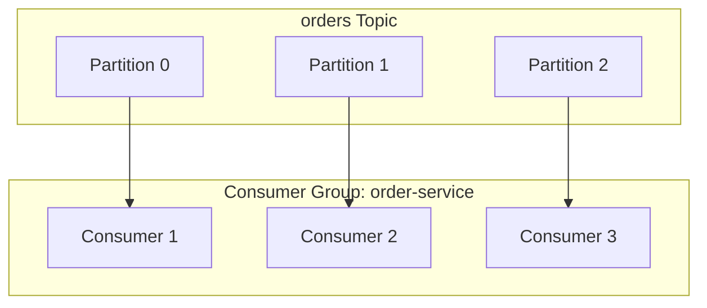
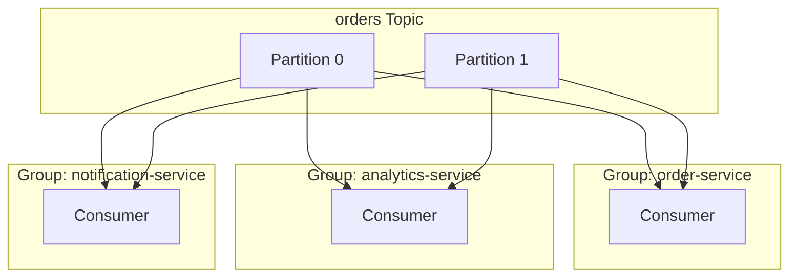
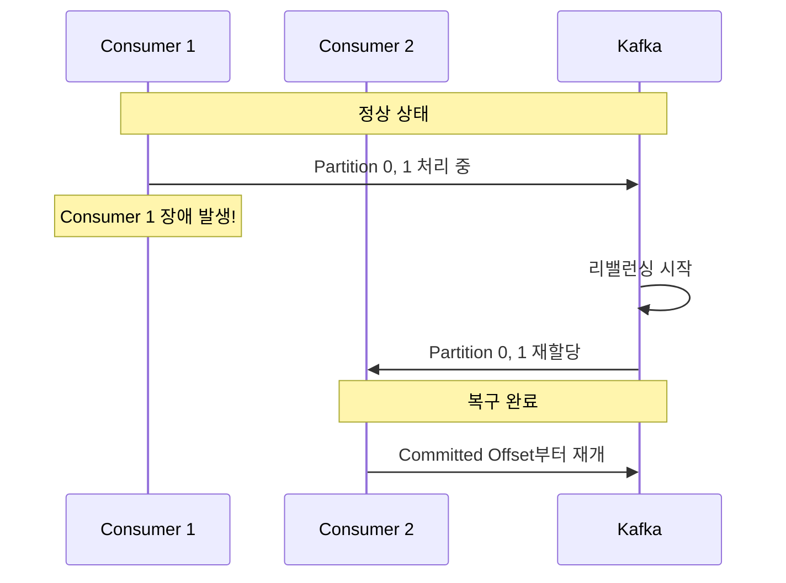

# Consumer Group & Offset

병렬 처리와 진행 상태 관리의 핵심 개념을 이해합니다.

> **Kafka 버전**: 이 문서는 **Kafka 3.6.x** 기준으로 작성되었습니다. 버전에 따라 기본값이 다를 수 있습니다.

| 검증 환경 | 버전 |
|----------|------|
| Kafka | 3.6.1 (KRaft) |
| Spring Boot | 3.2.x |
| Spring Kafka | 3.1.x |
| Java | 17 |

> 이 문서의 코드 예제는 위 환경에서 컴파일 및 동작이 확인되었습니다.

## 선행 지식

이 문서를 읽기 전에 다음 개념을 이해하고 있어야 합니다:
- [메시지 흐름](../message-flow/) - Topic, Partition 개념
- [Replication](../replication/) - Leader, Follower 개념

## Consumer Group이란?

**Consumer Group**은 동일한 목적을 가진 Consumer들의 논리적 그룹입니다.



### 핵심 규칙

> **하나의 Partition은 Consumer Group 내에서 하나의 Consumer만 읽을 수 있다**

이 규칙이 중요한 이유:
- **순서 보장**: 같은 Partition의 메시지는 순서대로 처리
- **중복 방지**: 같은 메시지를 여러 Consumer가 동시에 처리하지 않음

### 왜 이런 설계인가?

Kafka 창시자 Jay Kreps가 이 규칙을 선택한 이유:
1. **단순성**: Partition 내 순서만 보장하면 되므로 분산 락 불필요
2. **성능**: Consumer 간 조율 오버헤드 제거
3. **확장성**: Partition 수 = 최대 병렬성, 명확한 스케일링 모델

## Consumer 수와 Partition 수

| 상황 | 결과 | 권장 |
|------|------|------|
| Consumer < Partition | 일부 Consumer가 여러 Partition 담당 | 정상 |
| Consumer = Partition | 최적 (1:1 매핑) | **권장** |
| Consumer > Partition | 일부 Consumer 유휴 상태 | 비효율 |

```java
// 권장: Partition 수에 맞춰 Consumer 인스턴스 수 결정
// orders 토픽이 6개 Partition이면 최대 6개 Consumer 인스턴스
@KafkaListener(topics = "orders", groupId = "order-service")
public void consume(String message) {
    // Consumer 인스턴스 수는 Kubernetes Deployment replicas로 조절
}
```

## 여러 Consumer Group

서로 다른 Consumer Group은 **독립적으로** 메시지를 소비합니다.



각 그룹은:
- 모든 메시지를 독립적으로 수신
- 별도의 Offset 관리 (`__consumer_offsets` 토픽에 저장)
- 서로 영향 없이 병렬 처리

## Offset이란?

**Offset**은 Partition 내 메시지의 순차적 위치 번호입니다.

```
Partition 0:
┌─────┬─────┬─────┬─────┬─────┬─────┬─────┐
│  0  │  1  │  2  │  3  │  4  │  5  │  6  │
└─────┴─────┴─────┴─────┴─────┴─────┴─────┘
                    ↑           ↑
            Committed Offset  Log End Offset
              (커밋된 위치)    (최신 메시지)
```

### Offset 종류

| Offset 종류 | 설명 | Kafka 내부 용어 |
|------------|------|----------------|
| **Earliest** | 가장 오래된 메시지 위치 | Log Start Offset |
| **Committed** | 마지막으로 커밋된 위치 | Committed Offset |
| **Current** | 현재 Consumer가 읽고 있는 위치 | Position |
| **Latest** | 가장 최신 메시지 위치 | Log End Offset (LEO) |

### Offset 저장 위치

Offset은 `__consumer_offsets`라는 **내부 토픽**에 저장됩니다:

```bash
# Offset 저장소 확인 (Kafka 3.6+)
kafka-topics.sh --describe --topic __consumer_offsets \
    --bootstrap-server localhost:9092

# 기본 설정: 50개 Partition, RF=3
```

**왜 Zookeeper가 아닌 Kafka 토픽에 저장하는가?**

Kafka 0.9 이전에는 Offset을 Zookeeper에 저장했습니다. 그러나 두 가지 문제가 있었습니다:

1. **쓰기 병목**: Zookeeper는 합의 프로토콜(ZAB)을 사용하여 매 쓰기마다 과반수 동의 필요
2. **확장성 한계**: Consumer 수 증가 시 Zookeeper 부하 급증

Kafka 토픽 저장 방식의 장점:
- Kafka 자체의 복제/내구성 활용
- Log Compaction으로 최신 Offset만 유지 → 저장 공간 효율
- 수평 확장 가능 (Partition 수로 처리량 조절)

**__consumer_offsets 내부 구조:**

```
Key: [Group ID + Topic + Partition]
Value: [Offset + Metadata + Commit Timestamp]

예시:
Key:   "order-service" + "orders" + 0
Value: { offset: 15234, metadata: "", timestamp: 1704931200000 }
```

```bash
# 내부 메시지 확인 (디버깅용)
kafka-console-consumer.sh \
    --topic __consumer_offsets \
    --bootstrap-server localhost:9092 \
    --formatter "kafka.coordinator.group.GroupMetadataManager\$OffsetsMessageFormatter" \
    --from-beginning
```

> **참고**: `__consumer_offsets`는 Compacted 토픽으로, Key별 최신 값만 유지됩니다.

## Offset 커밋

Consumer가 메시지를 성공적으로 처리했음을 Kafka에 알리는 과정입니다.

### 자동 커밋 vs 수동 커밋

```yaml
# application.yml - Kafka 3.6 기본값 기준
spring:
  kafka:
    consumer:
      enable-auto-commit: true   # 자동 커밋 (기본값: false in Spring Kafka 3.x)
      auto-commit-interval: 5000 # 5초마다 커밋 (Kafka 기본값)
```

| 방식 | 장점 | 단점 | 사용 사례 |
|------|------|------|----------|
| **자동 커밋** | 구현 간단 | 처리 실패 시 데이터 유실 가능 | 로그, 메트릭 |
| **수동 커밋** | 정확한 제어 | 구현 복잡 | 결제, 주문 |

### 수동 커밋 예시 (완전한 코드)

```java
import org.springframework.kafka.annotation.KafkaListener;
import org.springframework.kafka.support.Acknowledgment;
import org.apache.kafka.clients.consumer.ConsumerRecord;
import org.slf4j.Logger;
import org.slf4j.LoggerFactory;
import org.springframework.stereotype.Component;

@Component
public class OrderConsumer {

    private static final Logger log = LoggerFactory.getLogger(OrderConsumer.class);

    @KafkaListener(
        topics = "orders",
        groupId = "order-service",
        containerFactory = "kafkaListenerContainerFactory"  // 수동 커밋용 팩토리
    )
    public void consume(ConsumerRecord<String, String> record,
                        Acknowledgment ack) {
        try {
            log.info("Received: partition={}, offset={}, value={}",
                     record.partition(), record.offset(), record.value());

            processOrder(record.value());

            ack.acknowledge();  // 성공 시에만 커밋
            log.debug("Committed offset: {}", record.offset());

        } catch (Exception e) {
            // 커밋하지 않음 - 다음 poll()에서 재처리됨
            log.error("처리 실패. offset={}. 재처리 예정.", record.offset(), e);
            // 필요시 DLQ(Dead Letter Queue)로 전송
        }
    }

    private void processOrder(String orderJson) {
        // 주문 처리 로직
    }
}
```

**수동 커밋용 설정:**

```java
import org.springframework.context.annotation.Bean;
import org.springframework.context.annotation.Configuration;
import org.springframework.kafka.config.ConcurrentKafkaListenerContainerFactory;
import org.springframework.kafka.core.ConsumerFactory;
import org.springframework.kafka.listener.ContainerProperties.AckMode;

@Configuration
public class KafkaConfig {

    @Bean
    public ConcurrentKafkaListenerContainerFactory<String, String>
            kafkaListenerContainerFactory(ConsumerFactory<String, String> consumerFactory) {

        ConcurrentKafkaListenerContainerFactory<String, String> factory =
                new ConcurrentKafkaListenerContainerFactory<>();
        factory.setConsumerFactory(consumerFactory);
        factory.getContainerProperties().setAckMode(AckMode.MANUAL);
        return factory;
    }
}
```

## auto.offset.reset 설정

Consumer Group이 처음 시작하거나 Offset 정보가 없을 때의 동작:

```yaml
spring:
  kafka:
    consumer:
      auto-offset-reset: earliest  # 또는 latest, none
```

| 설정 | 동작 | 사용 사례 |
|------|------|----------|
| **earliest** | 가장 오래된 메시지부터 읽기 | 데이터 유실 방지 필요 시 |
| **latest** | 새로운 메시지만 읽기 | 실시간 처리만 필요 시 |
| **none** | Offset 없으면 에러 발생 | 명시적 Offset 관리 시 |

### 흔한 실수: auto.offset.reset이 작동하지 않는 경우

`auto.offset.reset`은 **Offset이 존재하지 않을 때만** 적용됩니다:

```bash
# Offset이 이미 커밋된 Consumer Group 확인
kafka-consumer-groups.sh --describe --group order-service \
    --bootstrap-server localhost:9092

# 출력 예시:
# GROUP           TOPIC    PARTITION  CURRENT-OFFSET  LOG-END-OFFSET  LAG
# order-service   orders   0          1523            1523            0
# ↑ CURRENT-OFFSET이 있으면 auto.offset.reset 무시됨!
```

**해결책:** [Consumer 심화 운영](../consumer-advanced/)에서 Offset 수동 리셋 방법을 확인하세요.

## 장애 복구 시나리오

### Consumer 장애 시



리밸런싱(Rebalancing)의 심층 분석과 성능 최적화는 [Consumer 심화 운영](../consumer-advanced/)에서 다룹니다.

## 다른 시스템과의 비교

| 특성 | Kafka | RabbitMQ | Apache Pulsar |
|------|-------|----------|---------------|
| **Consumer 모델** | Pull (Consumer가 가져감) | Push (Broker가 전달) | Pull + Push 혼합 |
| **메시지 보관** | 영구 (설정에 따라) | 소비 후 삭제 | 영구 (Tiered Storage) |
| **순서 보장** | Partition 내 보장 | Queue 내 보장 | Partition 내 보장 |
| **Consumer Group** | 1 Partition = 1 Consumer | 경쟁 Consumer | 1 Partition = 1 Consumer |
| **리밸런싱** | Client 측 (CooperativeSticky) | 없음 (자동 분배) | Broker 측 |
| **재처리** | Offset 리셋으로 가능 | 별도 메커니즘 필요 | Offset 리셋으로 가능 |

**Kafka Consumer Group이 적합한 경우:**
- 대용량 스트리밍 처리 (초당 수십만 메시지)
- 메시지 재처리가 필요한 경우
- 순서 보장이 중요한 이벤트 처리

**RabbitMQ가 적합한 경우:**
- 복잡한 라우팅 로직 필요
- 낮은 레이턴시 요구 (Push 방식)
- 메시지 단위 ACK 필요

> **참고**: [Confluent - Kafka vs RabbitMQ](https://www.confluent.io/learn/kafka-vs-rabbitmq/)

## 정리

| 개념 | 역할 | 핵심 포인트 |
|------|------|------------|
| **Consumer Group** | 병렬 처리, 부하 분산 | 1 Partition = 1 Consumer (그룹 내) |
| **Offset** | 진행 상태 관리 | `__consumer_offsets` 토픽에 저장 |
| **Commit** | 처리 완료 기록 | 수동 커밋으로 정확성 확보 |

## FAQ

**Q: Consumer Group ID는 어떻게 정해야 하나요?**
> A: `{서비스명}-{용도}` 패턴을 권장합니다. 예: `order-service-processor`, `analytics-aggregator`

**Q: 같은 메시지를 여러 서비스에서 처리하려면?**
> A: 서비스마다 다른 Consumer Group ID를 사용하세요. 각 그룹이 독립적으로 모든 메시지를 받습니다.

**Q: Consumer가 죽으면 메시지가 유실되나요?**
> A: 아니요. Committed Offset 이후 메시지는 다른 Consumer가 재처리합니다. 단, 자동 커밋 사용 시 처리 중 장애가 나면 유실 가능합니다.

## 코드 실행 방법

이 문서의 예제 코드를 실행하려면:

**1. 사전 조건:**
```bash
# Kafka 실행 (프로젝트 루트에서)
cd docker && docker-compose up -d

# Topic 생성
kafka-topics.sh --create --topic orders \
    --partitions 3 --replication-factor 1 \
    --bootstrap-server localhost:9092
```

**2. 예제 프로젝트 실행:**
```bash
# 예제 디렉토리로 이동
cd examples/quick-start

# 애플리케이션 실행
./gradlew bootRun
```

**3. 메시지 전송 테스트:**
```bash
# REST API로 메시지 전송
curl -X POST "http://localhost:8080/send?message=Hello"

# Consumer 로그에서 수신 확인
# Received: partition=0, offset=0, value=Hello
```

**4. Consumer Group 상태 확인:**
```bash
kafka-consumer-groups.sh --describe --group order-service \
    --bootstrap-server localhost:9092
```

## 참고 자료

- [Kafka 공식 문서: Consumer Groups](https://kafka.apache.org/documentation/#consumerconfigs)
- [Confluent: Kafka Consumer Design](https://docs.confluent.io/platform/current/clients/consumer.html)
- [KIP-429: Consumer Group Protocol](https://cwiki.apache.org/confluence/display/KAFKA/KIP-429)

## 다음 단계

- [Consumer 심화 운영](../consumer-advanced/) - 리밸런싱 최적화, Lag 모니터링
- [Replication](../replication/) - 데이터 복제와 고가용성
