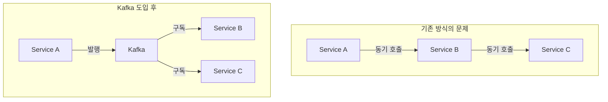
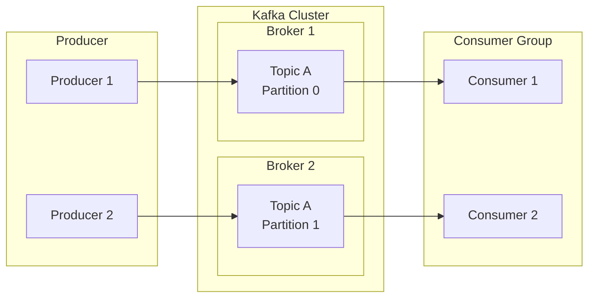
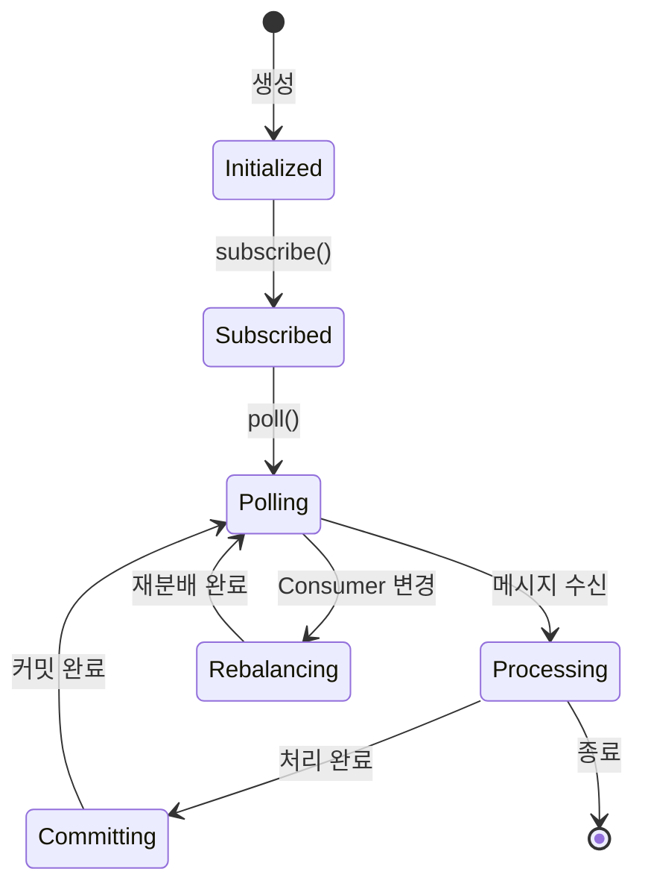
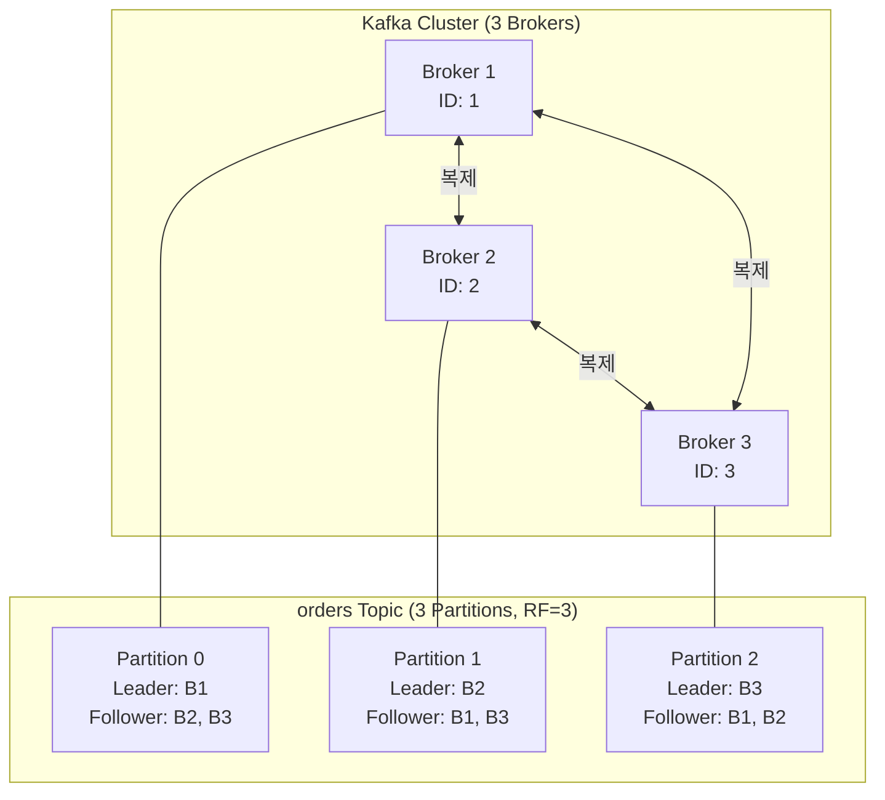
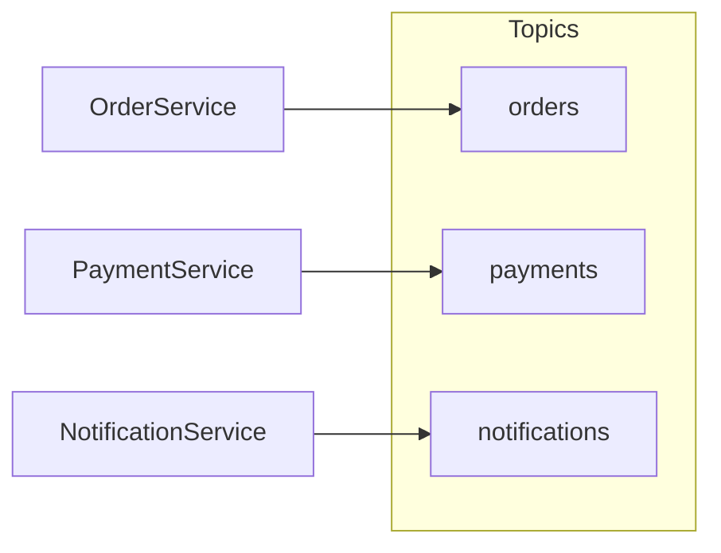
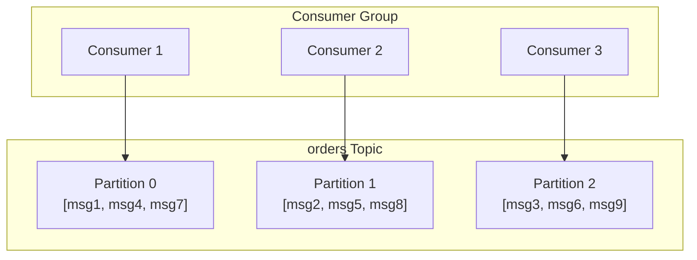
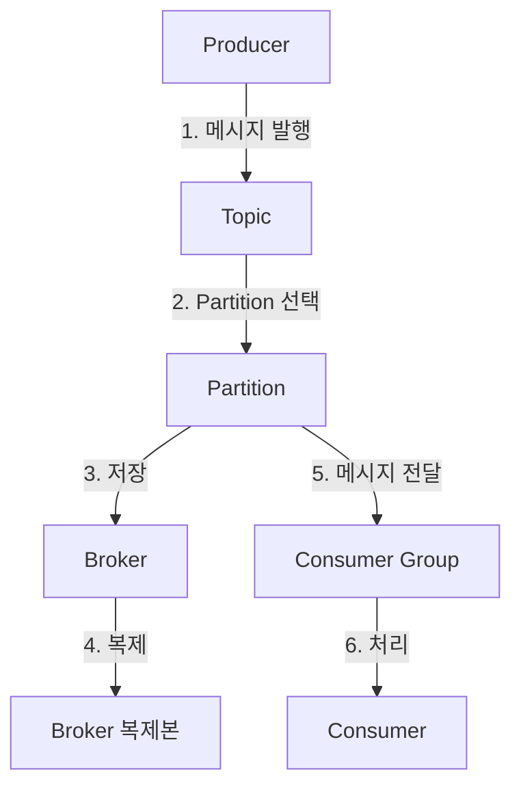

# Kafka 핵심 구성요소

Kafka의 5가지 핵심 구성요소를 이해합니다.

| 검증 환경 | 버전 |
|----------|------|
| Kafka | 3.6.1 (KRaft) |
| Spring Boot | 3.2.x |
| Spring Kafka | 3.1.x |
| Java | 17 |

> 이 문서의 코드 예제는 위 환경에서 컴파일 및 동작이 확인되었습니다.

## 왜 Kafka가 필요한가?

### 기존 방식의 문제

서비스 간 직접 통신은 다음 문제를 야기합니다:

```
시나리오: 주문 서비스 → 결제 서비스 → 배송 서비스

문제 1: 강한 결합
- 결제 서비스 API 변경 시 주문 서비스도 수정 필요
- 배송 서비스 추가 시 주문 서비스 코드 변경

문제 2: 장애 전파
- 결제 서비스 다운 → 주문 서비스도 실패
- 전체 시스템 장애로 확대

문제 3: 성능 병목
- 동기 호출로 응답 시간 누적 (100ms + 200ms + 150ms = 450ms)
- 트래픽 급증 시 전체 시스템 느려짐
```

### Kafka가 해결하는 것

| 문제 | Kafka 해결책 | 효과 |
|------|-------------|------|
| 강한 결합 | 이벤트 기반 비동기 통신 | 서비스 독립적 배포 가능 |
| 장애 전파 | 메시지 영속화 + 재시도 | 일시 장애 시 데이터 유실 없음 |
| 성능 병목 | 병렬 처리 + 버퍼링 | 순간 트래픽 폭증 흡수 |



---

## 전체 구조



---

## 1. Producer (생산자)

**역할:** 메시지를 Kafka에 발행하는 클라이언트

### 왜 Producer가 필요한가?

Producer가 없다면 애플리케이션이 직접 Kafka 내부 프로토콜을 구현해야 합니다. Producer는 이를 추상화하여:
- **직렬화**: 객체를 바이트로 변환
- **파티셔닝**: 메시지를 어떤 Partition에 보낼지 결정
- **배치 처리**: 여러 메시지를 묶어 효율적 전송
- **재시도**: 실패 시 자동 재시도

### 기본 사용법

```java
import org.springframework.kafka.core.KafkaTemplate;
import org.springframework.stereotype.Component;
import lombok.RequiredArgsConstructor;
import lombok.extern.slf4j.Slf4j;

@Slf4j
@Component
@RequiredArgsConstructor
public class OrderProducer {

    private final KafkaTemplate<String, String> kafkaTemplate;

    /**
     * 주문 이벤트 발행
     * @param orderId 주문 ID (Partition Key로 사용)
     * @param orderJson 주문 데이터 (JSON 형태)
     */
    public void sendOrder(String orderId, String orderJson) {
        kafkaTemplate.send("orders", orderId, orderJson)
            .whenComplete((result, ex) -> {
                if (ex == null) {
                    log.info("전송 성공: topic={}, partition={}, offset={}",
                        result.getRecordMetadata().topic(),
                        result.getRecordMetadata().partition(),
                        result.getRecordMetadata().offset());
                } else {
                    log.error("전송 실패: {}", ex.getMessage());
                }
            });
    }
}
```

### Producer 주요 설정

```yaml
# application.yml
spring:
  kafka:
    producer:
      bootstrap-servers: localhost:9092
      key-serializer: org.apache.kafka.common.serialization.StringSerializer
      value-serializer: org.apache.kafka.common.serialization.StringSerializer
      acks: all              # 모든 ISR 복제 완료 후 응답
      retries: 3             # 실패 시 재시도 횟수
      properties:
        enable.idempotence: true  # 중복 전송 방지
        max.in.flight.requests.per.connection: 5
```

| 설정 | 기본값 | 권장값 | 설명 |
|------|-------|--------|------|
| `acks` | 1 | all | 복제 보장 수준 |
| `retries` | 2147483647 | 3~10 | 재시도 횟수 |
| `enable.idempotence` | false | true | 멱등성 활성화 |
| `batch.size` | 16384 | 상황별 | 배치 크기 (바이트) |
| `linger.ms` | 0 | 5~100 | 배치 대기 시간 |

### Producer 흐름

```mermaid
flowchart LR
    APP[Application] -->|1. send()| SER[Serializer]
    SER -->|2. 직렬화| PART[Partitioner]
    PART -->|3. Partition 선택| BATCH[Record Accumulator]
    BATCH -->|4. 배치| SENDER[Sender Thread]
    SENDER -->|5. 전송| BROKER[Broker]
```

---

## 2. Consumer (소비자)

**역할:** Kafka에서 메시지를 읽어가는 클라이언트

### 왜 Consumer가 필요한가?

Consumer는 단순히 메시지를 읽는 것 이상의 역할을 합니다:
- **Offset 관리**: 어디까지 읽었는지 추적
- **Rebalancing**: Consumer 추가/제거 시 Partition 재분배
- **역직렬화**: 바이트를 객체로 변환
- **Poll 기반**: 처리 속도에 맞게 메시지를 가져옴

### 기본 사용법

```java
import org.springframework.kafka.annotation.KafkaListener;
import org.springframework.kafka.support.KafkaHeaders;
import org.springframework.messaging.handler.annotation.Header;
import org.springframework.messaging.handler.annotation.Payload;
import org.springframework.stereotype.Component;
import lombok.extern.slf4j.Slf4j;

@Slf4j
@Component
public class OrderConsumer {

    @KafkaListener(
        topics = "orders",
        groupId = "order-service-group",
        concurrency = "3"  // 3개의 Consumer 스레드
    )
    public void consume(
            @Payload String message,
            @Header(KafkaHeaders.RECEIVED_PARTITION) int partition,
            @Header(KafkaHeaders.OFFSET) long offset) {

        log.info("수신: partition={}, offset={}, message={}",
            partition, offset, message);

        // 비즈니스 로직 처리
        processOrder(message);
    }

    private void processOrder(String message) {
        // 주문 처리 로직
    }
}
```

### Consumer 주요 설정

```yaml
# application.yml
spring:
  kafka:
    consumer:
      bootstrap-servers: localhost:9092
      group-id: order-service-group
      key-deserializer: org.apache.kafka.common.serialization.StringDeserializer
      value-deserializer: org.apache.kafka.common.serialization.StringDeserializer
      auto-offset-reset: earliest  # 처음부터 읽기
      enable-auto-commit: false    # 수동 커밋
      properties:
        max.poll.records: 500
        max.poll.interval.ms: 300000
```

| 설정 | 기본값 | 권장값 | 설명 |
|------|-------|--------|------|
| `auto-offset-reset` | latest | earliest/latest | 초기 읽기 위치 |
| `enable-auto-commit` | true | false | 수동 커밋 권장 |
| `max.poll.records` | 500 | 상황별 | 한 번에 가져올 최대 레코드 |
| `max.poll.interval.ms` | 300000 | 처리시간×2 | poll 간격 제한 |
| `session.timeout.ms` | 45000 | 10000~30000 | 세션 타임아웃 |

### Consumer 상태 흐름



---

## 3. Broker (브로커)

**역할:** 메시지를 저장하고 전달하는 Kafka 서버

### 왜 Broker가 필요한가?

Broker는 Kafka의 핵심 서버로서:
- **영속성**: 메시지를 디스크에 저장 (재시작 후에도 유지)
- **복제**: 다른 Broker에 데이터 복제
- **리더십**: Partition별 Leader/Follower 역할 수행
- **클러스터링**: 여러 Broker가 협력하여 고가용성 제공

### Broker 클러스터 구조



### Broker 주요 설정

```properties
# server.properties
broker.id=1
listeners=PLAINTEXT://:9092
log.dirs=/var/lib/kafka/data
num.partitions=3
default.replication.factor=3
min.insync.replicas=2
log.retention.hours=168
log.segment.bytes=1073741824
```

| 설정 | 기본값 | 프로덕션 권장 | 설명 |
|------|-------|--------------|------|
| `num.partitions` | 1 | 상황별 | 기본 Partition 수 |
| `default.replication.factor` | 1 | 3 | 기본 복제 수 |
| `min.insync.replicas` | 1 | 2 | 최소 동기화 복제본 |
| `log.retention.hours` | 168 | 상황별 | 보관 기간 (시간) |

> **비유:** Broker는 우체국과 같습니다. 편지(메시지)를 받아서 보관하고, 수신자(Consumer)에게 전달합니다. 여러 우체국(Broker)이 협력하여 안정적인 서비스를 제공합니다.

---

## 4. Topic (토픽)

**역할:** 메시지를 분류하는 논리적 채널

### 왜 Topic이 필요한가?

Topic은 메시지를 논리적으로 분류합니다:
- **관심사 분리**: 주문, 결제, 알림 등 도메인별 분리
- **독립적 관리**: Topic별로 보관 정책, 파티션 수 설정
- **구독 제어**: Consumer가 필요한 Topic만 구독

### Topic 설계 원칙

```
좋은 Topic 네이밍:
✅ orders                    - 도메인 명확
✅ payment-completed         - 이벤트 명확
✅ user-activity-logs        - 목적 명확

나쁜 Topic 네이밍:
❌ data                      - 너무 일반적
❌ topic1                    - 의미 불명
❌ temp                      - 임시성
```

### Topic 구조



### Topic 생성 및 관리

```bash
# Topic 생성
kafka-topics.sh --bootstrap-server localhost:9092 \
  --create --topic orders \
  --partitions 6 \
  --replication-factor 3

# Topic 목록 조회
kafka-topics.sh --bootstrap-server localhost:9092 --list

# Topic 상세 정보
kafka-topics.sh --bootstrap-server localhost:9092 \
  --describe --topic orders

# Partition 수 증가 (감소 불가!)
kafka-topics.sh --bootstrap-server localhost:9092 \
  --alter --topic orders --partitions 12
```

| 설정 | 설명 | 고려사항 |
|------|------|---------|
| **partitions** | 병렬 처리 단위 | Consumer 수 이상 권장 |
| **replication-factor** | 복제본 수 | 프로덕션은 3 |
| **retention.ms** | 보관 기간 | 비즈니스 요구사항 |
| **cleanup.policy** | 정리 정책 | delete 또는 compact |

> **비유:** Topic은 TV 채널과 같습니다. 뉴스 채널, 스포츠 채널처럼 주제별로 구분됩니다. 시청자(Consumer)는 원하는 채널만 선택할 수 있습니다.

---

## 5. Partition (파티션)

**역할:** Topic을 분할하여 병렬 처리를 가능하게 함

### 왜 Partition이 필요한가?

Partition이 없다면 하나의 Consumer만 메시지를 처리할 수 있습니다:
- **병렬 처리**: 여러 Consumer가 동시에 처리
- **순서 보장**: 같은 Key는 같은 Partition으로 → 순서 보장
- **확장성**: Partition 추가로 처리량 증가

### Partition 구조



### Partition 할당 전략

| 전략 | 설명 | 사용 시기 |
|------|------|----------|
| **RoundRobin** | 순환 방식 배분 | Key 없는 메시지 |
| **Key 기반** | hash(key) % partitions | 순서 보장 필요 시 |
| **Custom** | 직접 구현 | 특수 라우팅 로직 |

### Partition 수 결정 가이드

```
Partition 수 결정 공식:

최소 Partition 수 = max(처리량/Consumer당_처리량, Consumer_수)

예시:
- 목표 처리량: 100,000 msg/sec
- Consumer당 처리량: 10,000 msg/sec
- 예상 Consumer 수: 5개

→ Partition 수 = max(100,000/10,000, 5) = max(10, 5) = 10개
→ 여유분 고려하여 12개 권장
```

> **비유:** Partition은 마트의 계산대와 같습니다. 계산대가 많을수록 더 많은 고객을 동시에 처리할 수 있습니다. 하지만 너무 많으면 관리 비용이 증가합니다.

---

## 구성요소 간 관계



---

## 트러블슈팅 FAQ

**Q: Producer가 메시지를 보내지 못합니다**
> A: 다음을 확인하세요:
> 1. `bootstrap-servers` 주소 확인
> 2. Topic이 존재하는지 확인
> 3. 네트워크 연결 상태 확인
> ```bash
> kafka-topics.sh --bootstrap-server localhost:9092 --list
> ```

**Q: Consumer가 메시지를 받지 못합니다**
> A: 다음을 확인하세요:
> 1. `group-id`가 올바른지 확인
> 2. `auto-offset-reset` 설정 확인 (earliest/latest)
> 3. Consumer Lag 확인
> ```bash
> kafka-consumer-groups.sh --bootstrap-server localhost:9092 \
>   --describe --group order-service-group
> ```

**Q: 메시지 순서가 보장되지 않습니다**
> A: 순서 보장은 **같은 Partition 내에서만** 됩니다. Message Key를 동일하게 설정하세요.

**Q: Partition 수를 늘려도 처리량이 안 늡니다**
> A: Consumer 수도 함께 늘려야 합니다. Partition 수 ≥ Consumer 수일 때만 병렬 처리됩니다.

---

## 정리

| 구성요소 | 역할 | 비유 | 핵심 설정 |
|---------|------|------|----------|
| **Producer** | 메시지 발행 | 편지 보내는 사람 | acks, retries |
| **Consumer** | 메시지 소비 | 편지 받는 사람 | group-id, auto-offset-reset |
| **Broker** | 메시지 저장/전달 | 우체국 | replication-factor |
| **Topic** | 메시지 분류 | TV 채널 | partitions, retention |
| **Partition** | 병렬 처리 단위 | 계산대 | 수 결정이 중요 |

## 다음 단계

- [메시지 흐름](../message-flow/) - 메시지가 어떻게 전달되는지 자세히 알아보기
- [Consumer Group과 Offset](../consumer-group/) - 병렬 처리와 진행 상태 관리
- [실습 예제](../../examples/basic/) - 직접 코드로 구현해보기
